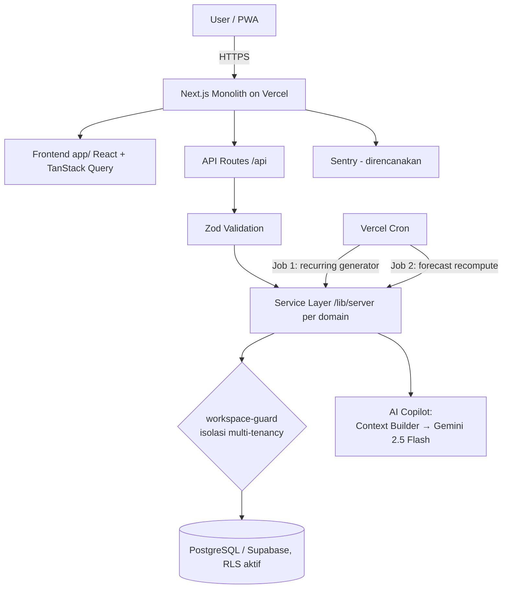

# Nuxio — AI-Powered Financial Planning Workspace

**Nuxio** adalah workspace perencanaan keuangan berbasis web/PWA yang membantu personal user dan pemilik small business merencanakan kondisi keuangan _masa depan_ — bukan sekadar mencatat transaksi yang sudah terjadi. Interaksi utama terjadi di **Financial Planning Calendar**: satu tampilan yang menyatukan transaksi aktual, transaksi terjadwal, tagihan rutin, budget, goal, dan sinyal forecast dalam satu garis waktu.

AI di Nuxio berperan sebagai **Financial Copilot** — lapisan penjelas yang menarasikan angka yang sudah dihitung oleh domain service (Wallet, Budget, Goal, Forecast), bukan mesin hitung finansial itu sendiri.

> **Status: early scaffold** — `app/`, `components/`, `lib/`, `types/`, `__tests__/` masih berisi placeholder (`.gitkeep`) di atas halaman default `create-next-app`. Dokumen di `docs/` adalah **spesifikasi desain yang harus dibangun**, bukan deskripsi kode yang sudah ada.

---

## Daftar Isi

- [Overview](#overview)
- [Tech Stack](#tech-stack)
- [Project Architecture](#project-architecture)
- [Folder Structure](#folder-structure)
- [Prerequisites](#prerequisites)
- [Installation](#installation)
- [Environment Variables](#environment-variables)
- [Available Scripts](#available-scripts)
- [Development Workflow](#development-workflow)
- [Documentation](#documentation)
- [Testing](#testing)
- [Deployment](#deployment)
- [Security](#security)
- [Contributing](#contributing)
- [License](#license)

---

## Overview

- **Masalah:** Aplikasi keuangan kebanyakan bersifat _retrospektif_ — mencatat yang sudah terjadi, tapi lemah menjawab pertanyaan prospektif: _"Apakah uang saya cukup sampai akhir bulan?"_
- **Solusi:** Proyeksi saldo (Forecast) ditempatkan langsung di Calendar harian, dan AI diposisikan sebagai penjelas angka deterministik — bukan penghitung baru.
- **Segmen:** Personal user + Business Workspace (1–3 anggota, role admin/member) dalam satu basis kode.
- **Monetisasi MVP:** hanya skeleton Plan Gating (UI), tanpa payment system.

**Fitur utama (spesifikasi — lihat `docs/04. PRD.md`):**

| Fitur                             | Deskripsi                                                                                                                                                          |
| --------------------------------- | ------------------------------------------------------------------------------------------------------------------------------------------------------------------ |
| **Financial Planning Calendar**   | Landing page setelah login; grid bulan + proyeksi saldo (ForecastOverlay) + `DayDetailPanel` saat tanggal diklik                                                   |
| **Forecast**                      | Proyeksi saldo deterministik (30/60/90 hari) berbasis transaksi terjadwal + rata-rata pengeluaran non-rutin; disimpan sebagai snapshot, bukan dihitung tiap render |
| **Recurring Bill Generator**      | Pre-generate tagihan rutin 60 hari ke depan via cron harian, dengan penanganan edge case tanggal (31 → mundur, 29 Feb → 28)                                        |
| **Wallet, Transaction, Transfer** | Multi-wallet dengan `cached_balance` (derived data, atomik), soft-delete (arsip), transfer antar-wallet                                                            |
| **Budget**                        | Batas pengeluaran bulanan per kategori dengan progress warning (80–99%) / over (100%)                                                                              |
| **Goal**                          | Target finansial; kontribusi direferensikan ke Transaction (tanpa double count)                                                                                    |
| **Workspace (multi-tenancy)**     | Personal/Business; isolasi data di-enforce di service layer (`workspace-guard`), bukan hanya di UI                                                                 |
| **AI Copilot**                    | Chat kontekstual (floating button); menarasikan data yang sudah dihitung; tidak pernah melakukan write action                                                      |
| **PWA**                           | Dapat diinstal dan dipakai seperti aplikasi native                                                                                                                 |

---

## Tech Stack

Keputusan final mengikuti **`docs/03. Architecture Decisions.md`** (ADR) — satu-satunya sumber kebenaran stack. ADR ini menggantikan keputusan awal yang memakai Prisma; akses database final adalah **Supabase Client + RLS tanpa ORM**.

| Layer          | Pilihan                              | Catatan                                                                                                                            |
| -------------- | ------------------------------------ | ---------------------------------------------------------------------------------------------------------------------------------- |
| Framework      | **Next.js 16 (App Router)**          | Monolith: frontend + API routes dalam satu proyek/deployment                                                                       |
| Bahasa         | **TypeScript**                       | Uang direpresentasikan sebagai integer minor unit (branded type)                                                                   |
| Runtime        | **Node.js ≥ 20 < 23**                | Lihat `engines` di package.json dan `.nvmrc` (20)                                                                                  |
| Database       | **PostgreSQL (Supabase)**            | Data finansial sangat relasional; ACID wajib                                                                                       |
| Data access    | **Supabase Client + RLS, tanpa ORM** | Skema dikelola SQL migration via Supabase CLI; RLS sebagai lapisan kontrol akses baris; operasi atomik via Postgres function (RPC) |
| Auth           | **Supabase Auth**                    | Email/password; aplikasi tidak pernah menyimpan password; session JWT divalidasi per request (`@supabase/ssr`)                     |
| AI             | **Gemini 2.5 Flash**                 | Via `@google/genai`; structured output (JSON mode)                                                                                 |
| Validasi       | **Zod**                              | Gerbang wajib semua payload API                                                                                                    |
| State (client) | **TanStack Query**                   | Server state; invalidation pasca-mutasi                                                                                            |
| Logging        | **Pino**                             | Structured JSON log, redaksi field sensitif                                                                                        |
| UI             | **Tailwind CSS v4 + shadcn/ui**      | Komponen di-copy ke repo (bukan dependency), bisa dikustomisasi penuh                                                              |
| Styling        | **Tailwind CSS v4**                  | PostCSS (`@tailwindcss/postcss`)                                                                                                   |
| Testing        | **Jest 30 + ts-jest**                | Unit + integration test; environment Node                                                                                          |
| Deployment     | **Vercel**                           | Preview per PR, Vercel Cron (2 background jobs)                                                                                    |
| CI/CD          | **GitHub Actions**                   | Lint, build, typecheck, unit test                                                                                                  |
| Error tracking | **Sentry** (direncanakan)            | Belum terinstal — lihat `docs/14. DevOps.md`                                                                                       |

---

## Project Architecture

**Modular monolith, satu proses, dua peran** — frontend (`/app`) dan API routes (`/api`) hidup di proyek yang sama. Modularisasi dijaga di level kode (service layer per domain) sehingga migrasi ke microservice pasca-MVP tetap mungkin tanpa menulis ulang logic.



**Aturan arsitektur yang mengikat (ADR):**

- **AI adalah leaf dependency** — tidak ada modul yang bergantung padanya; menghapus folder AI tidak merusak fungsi inti.
- **Calendar tidak pernah menjadi sumber data baru** — hanya _read & compose_ dari modul lain.
- **Forecast tidak dihitung ulang sinkron** saat mutasi — cukup ditandai _stale_, recompute via cron.
- **Setiap query wajib menyertakan filter `workspace_id`** — isolasi bukan sekadar foreign key.
- **Tanpa ORM** — akses database lewat Supabase Client (token user, RLS aktif) dan Postgres function via RPC; service role hanya untuk background job/admin dengan scoping `workspace_id` manual.

**Request flow (setiap route API finansial):**

```
Browser → Auth + Workspace Middleware → API Route → Zod Validation → Domain Service (/lib/server/<domain>) → workspace-guard → Postgres (RLS aktif)
```

---

## Folder Structure

```
CalBudget/
├── app/                        # Next.js App Router (UI + API routes)
│   ├── layout.tsx              # Root layout
│   ├── page.tsx                # Halaman awal (masih default create-next-app)
│   ├── globals.css             # Global styles (Tailwind)
│   └── favicon.ico
├── components/                 # Komponen React, dipisah per domain
│   ├── ui/                     # Komponen dasar shadcn/ui (di-copy ke repo)
│   ├── calendar/               # CalendarGrid, DayCell, DayDetailPanel, ForecastOverlay
│   ├── wallet/ transaction/ budget/ goal/ ai-copilot/ workspace/ shared/
├── lib/                        # Logic aplikasi (bukan React)
│   ├── client/                 # Utility client-side
│   └── server/                 # Service layer per domain (backend)
│       ├── wallet/ transaction/ category/ budget/ goal/ calendar/
│       ├── forecast/ ai-copilot/ notification/ workspace/ shared/
│       └── (workspace-guard.ts, dst.)   # Isolasi multi-tenancy
├── types/                      # Kontrak API: tipe TypeScript bersama FE & BE
├── __tests__/                  # Unit & integration test (Jest, **/*.test.ts)
├── supabase/                   # Konfigurasi Supabase CLI
│   ├── config.toml             # Konfigurasi stack lokal (project_id: nuxio)
│   ├── snippets/               # SQL snippets
│   └── migrations/             # (belum ada — migration pertama belum dibuat)
├── docs/                       # Seluruh dokumentasi proyek (01–16, lihat indeks)
├── .github/
│   ├── workflows/ci.yml        # CI: lint → build → typecheck → unit test
│   ├── CODEOWNERS              # Wajib review pemilik repo
│   └── dependabot.yml          # Dependency updates
├── public/                     # Aset statis
├── next.config.ts              # Security headers + CSP
├── jest.config.mjs             # Konfigurasi Jest (ts-jest, alias @/*)
├── eslint.config.mjs           # ESLint flat config
├── tsconfig.json               # TypeScript config
├── postcss.config.mjs          # Tailwind v4 via PostCSS
├── vercel.json                 # Vercel Cron: generate-recurring & recompute-forecast
├── .nvmrc                      # Versi Node (20)
├── .env.example                # Template environment variables
├── .env                        # Secret lokal — TIDAK di-commit
└── .gitignore
```

Catatan:

- `requirements.txt` hanya untuk kompatibilitas tooling — project ini **tidak** memakai Python.
- `AGENTS.md` berisi panduan untuk AI coding agents (Next.js 16 memiliki breaking changes — baca `node_modules/next/dist/docs/` sebelum menulis kode).

---

## Prerequisites

- **Node.js ≥ 20 < 23** (CI memakai versi `20`; lihat `engines` dan `.nvmrc`)
- **npm** (package manager proyek)
- **Docker** — untuk stack Supabase lokal (Postgres + Auth + Storage)
- **Supabase CLI** — untuk mengelola stack & migration lokal
- **Git**
- Akun **Supabase** (database + auth) — tiga project terpisah: dev, staging, prod
- Akun **Vercel** dan **GitHub** (untuk deployment/CI)
- API key **Gemini** (untuk fitur AI Copilot) — dari Google AI Studio

---

## Installation

```bash
# 1. Clone repository
git clone https://github.com/CodeByAbi/Nuxio.git
cd CalBudget

# 2. Install dependencies
npm install

# 3. Setup environment (lihat bagian Environment Variables)
# Salin .env.example -> .env, lalu isi nilainya.
cp .env.example .env

# 4. Jalankan stack Supabase lokal (Postgres + Auth + Storage via Docker, dikelola Supabase CLI)
supabase start

# 5. Jalankan aplikasi
npm run dev
```

> **Catatan:** `supabase/migrations/` belum ada — migration pertama belum dibuat. Perintah `supabase db reset` / `supabase db push` baru bisa dipakai setelah migration pertama dibuat (`supabase migration new <nama>`).

---

## Environment Variables

Buat file `.env` di root (bukan `.env.local`) dengan mengikuti `.env.example`:

| Variabel                    | Fungsi                                                                                                         |
| --------------------------- | -------------------------------------------------------------------------------------------------------------- |
| `SUPABASE_URL`              | URL project Supabase. Lokal: `http://127.0.0.1:54321`; staging/production: `https://<project-ref>.supabase.co` |
| `SUPABASE_ANON_KEY`         | Public anon key — aman dibawa ke client HANYA karena RLS aktif di semua tabel                                  |
| `SUPABASE_SERVICE_ROLE_KEY` | Service role key (bypass RLS) — **server only**, tidak pernah sampai ke browser                                |
| `GEMINI_API_KEY`            | API key Gemini untuk AI Copilot (Google AI Studio)                                                             |
| `CRON_SECRET`               | Token autentikasi request Vercel Cron; generate kuat: `openssl rand -base64 32`                                |

**Jangan pernah menampilkan atau meng-commit nilai secret.** Detail per environment (staging/production) dan secret management: `docs/14. DevOps.md` §14.4 dan `docs/15. Security.md` §15.6.

---

## Available Scripts

| Script          | Perintah                                   | Fungsi                                                                            |
| --------------- | ------------------------------------------ | --------------------------------------------------------------------------------- |
| Development     | `npm run dev`                              | Dev server (localhost:3000)                                                       |
| Build           | `npm run build`                            | `next build` — tanpa langkah migration (skema di-apply terpisah via Supabase CLI) |
| Production      | `npm run start`                            | Menjalankan build production                                                      |
| Lint            | `npm run lint`                             | ESLint (flat config, `eslint.config.mjs`)                                         |
| Typecheck       | `npm run typecheck`                        | `tsc --noEmit`                                                                    |
| Test            | `npm test`                                 | Unit + integration test (Jest)                                                    |
| Test + coverage | `npm test -- --coverage --passWithNoTests` | Sesuai CI                                                                         |

Menjalankan satu file test: `npm test -- __tests__/path/to/file.test.ts`

**Perintah Supabase CLI (database, tanpa ORM):**

| Perintah                        | Fungsi                                                                      |
| ------------------------------- | --------------------------------------------------------------------------- |
| `supabase start`                | Jalankan stack lokal + buka Studio di `http://127.0.0.1:54323`              |
| `supabase migration new <nama>` | Buat file migrasi SQL kosong                                                |
| `supabase db diff`              | Generate SQL migration dari perubahan skema lokal                           |
| `supabase db push`              | Terapkan migration yang belum berjalan ke target (local/staging/production) |
| `supabase db reset`             | Reset DB lokal + jalankan seluruh migration dari nol                        |
| `supabase gen types typescript` | Regenerate tipe TypeScript dari skema database                              |

---

## Development Workflow

1. **Branch:** kerja di `feature/*` atau `fix/*` (dari `develop`).
2. **PR ke `develop`** — CI otomatis: lint → build → typecheck → unit test. **PR tidak bisa di-merge jika CI gagal** (branch protection).
3. **`develop`** auto-deploy (Vercel preview) setelah CI passing; QA dijalankan di sini sebelum PR terpisah `develop → main`.
4. **Production** hanya melalui manual deploy setelah review (≥1 reviewer) dan QA.
5. **Perubahan schema DB** wajib menyertakan migration SQL Supabase CLI (DDL + RLS policy + trigger dalam migrasi yang sama) dan diverifikasi di staging.
6. **Commit convention:** conventional commits (`feat:`, `fix:`, `refactor:`, `docs:`, `test:`, `chore:`).
7. Setiap perubahan signifikan terdokumentasikan di `docs/` yang relevan.

---

## Documentation

Seluruh dokumentasi proyek ada di `docs/` — satu sumber kebenaran. Baca berurutan untuk konteks lengkap:

| Doc                                                                            | Isi                                                                                      |
| ------------------------------------------------------------------------------ | ---------------------------------------------------------------------------------------- |
| [01. Module Specifications](docs/01.%20Module%20Specifications.md)             | Spesifikasi modul per domain                                                             |
| [02. Non-Functional Requirements](docs/02.%20Non-Functional%20Requirements.md) | Kebutuhan non-fungsional (performansi, skalabilitas, keamanan)                           |
| [03. Architecture Decisions](docs/03.%20Architecture%20Decisions.md)           | **ADR — sumber kebenaran teknis; mengikat & menang atas dokumen lain jika bertentangan** |
| [04. PRD](docs/04.%20PRD.md)                                                   | Product requirements — goals, users, fitur, business rules                               |
| [05. Architecture](docs/05%20Architecture.md)                                  | Dokumen arsitektur produk                                                                |
| [05. User Flow](docs/05.%20User%20Flow.md)                                     | Alur user utama (onboarding → Calendar, interaksi harian)                                |
| [06. Information Architecture](docs/06.%20Information%20Architecture.md)       | Struktur navigasi & hierarki entitas                                                     |
| [07. Database](docs/07.%20Database.md)                                         | Skema tabel lengkap, RLS policies, indexing, aturan migrasi                              |
| [08. System Design](docs/08.%20System%20Design.md)                             | Arsitektur tingkat tinggi & request lifecycle kritis                                     |
| [09. Backend](docs/09.%20Backend.md)                                           | Service layer, business rules, ringkasan endpoint                                        |
| [10. API](docs/10.%20API.md)                                                   | Kontrak API detail (request/response/status code)                                        |
| [11. Frontend](docs/11.%20Frontend.md)                                         | Halaman, komponen, state management                                                      |
| [12. UI Design System](docs/12.%20UI%20Design%20System.md)                     | Warna semantik, tipografi, komponen, aksesibilitas                                       |
| [13. AI](docs/13.%20AI.md)                                                     | Spesifikasi teknis AI Copilot                                                            |
| [14. DevOps](docs/14.%20DevOps.md)                                             | Deployment, CI/CD, background jobs, monitoring                                           |
| [15. Security](docs/15.%20Security.md)                                         | Auth, multi-tenancy, secret management, OWASP                                            |
| [16. Testing](docs/16.%20Testing.md)                                           | Strategi & skenario testing                                                              |

---

## Testing

Strategi proporsional MVP (detail: `docs/16. Testing.md`):

| Lapisan                             | Pendekatan                                                                                     |
| ----------------------------------- | ---------------------------------------------------------------------------------------------- |
| Unit test (Jest)                    | Wajib 100% untuk logika kritikal: recurring bill generator, forecast engine, saldo kalkulasi   |
| Integration test (Jest + Supertest) | Happy path + minimal 1 error case per API route utama (termasuk isolasi workspace lintas user) |
| E2E                                 | Manual QA dengan skenario terdokumentasi (bukan framework E2E penuh untuk MVP)                 |

```bash
npm run lint                    # ESLint
npm run typecheck               # tsc --noEmit
npm test                        # unit + integration test
npm test -- --coverage --passWithNoTests   # dengan coverage (sesuai CI)
npm run build                   # build production (verifikasi sebelum PR)
```

---

## Deployment

Pipeline (detail di `docs/14. DevOps.md`):

```
Local → push → PR → CI (lint + build + typecheck + unit test)
                         ↓ passing
              Deploy DEVELOP (auto, Vercel preview)
                         ↓ manual approve (1 reviewer) + QA
                  Deploy PRODUCTION (manual)
```

- **Tiga environment terpisah:** `main` → production, `develop` → staging, `feature/*` → preview (database dev shared).
- **Database benar-benar terpisah** per environment — jangan pernah pakai DB production untuk testing.
- **CI/CD (GitHub Actions):** `.github/workflows/ci.yml` — trigger pada PR ke `main`/`develop` dan push ke `develop`; urutan: lint → build → typecheck → unit test.
- **Vercel Cron** (`vercel.json`, dilindungi `CRON_SECRET`):
  - `/api/jobs/generate-recurring` — setiap hari pukul 17:05 (UTC)
  - `/api/jobs/recompute-forecast` — setiap hari pukul 17:15 (UTC)
- **Pre-deploy checklist:** CI passing, migration teruji di staging, env vars production terkonfigurasi, API key Gemini valid.
- **Post-deploy:** cek `/api/health` (status `ok`), login + onboarding end-to-end, Vercel Cron logs, tidak ada spike error 15 menit pertama.
- **Error tracking:** Sentry direncanakan (belum terinstal).

---

## Security

Praktik keamanan project (detail: `docs/15. Security.md`):

- **Jangan commit `.env*`** — seluruh secret lewat environment variables; `.gitignore` sudah memblokir file `.env*`.
- **Supabase Auth** — aplikasi tidak pernah menyimpan password; session JWT divalidasi di **setiap** request API.
- **RLS (Row Level Security) aktif** di semua tabel — kontrol akses baris di level database (`auth.uid()`), lapisan isolasi yang tidak bisa dilupakan query.
- **`workspace-guard`** — setiap request yang membawa `workspace_id` wajib melewati verifikasi keanggotaan (`workspace_members`) sebelum menyentuh service layer; gagal → 404/403 (IDOR prevention, tidak mengonfirmasi eksistensi resource lintas workspace).
- **Validasi input** — Zod sebagai gerbang semua payload API; field yang tidak dideklarasikan ditolak (proteksi mass-assignment).
- **Security headers** — CSP, `X-Frame-Options`, `X-Content-Type-Options`, `Referrer-Policy`, `Permissions-Policy` via `next.config.ts`.
- **Principle of least privilege** — `SUPABASE_SERVICE_ROLE_KEY` (bypass RLS) hanya di server untuk background job/admin, dengan scoping `workspace_id` manual.
- **Service role tidak pernah sampai ke browser.**

---

## Contributing

- Baca **`docs/04. PRD.md`** dan **`docs/03. Architecture Decisions.md`** sebelum mengerjakan apa pun — jangan membuat keputusan yang bertentangan dengan dokumen.
- Ikuti struktur modul & business rules di **`docs/09. Backend.md`** — jangan bypass service layer atau `workspace-guard`.
- Setiap logic finansial baru **wajib** unit test (lihat `docs/16. Testing.md`).
- Pastikan **lint, typecheck, test, dan build** berhasil sebelum push.
- Jangan commit `.env*` atau secret apa pun (lihat `docs/15. Security.md`).
- Jangan lakukan perubahan skema manual di database — selalu lewat migration Supabase CLI (DDL + RLS policy + trigger dalam migrasi yang sama).
- Gunakan **conventional commits** (`feat:`, `fix:`, `refactor:`, `docs:`, `test:`, `chore:`).
- Buat Pull Request ke `develop` — PR tidak bisa di-merge jika CI gagal.

---

## License

**Belum ditentukan** — placeholder sampai keputusan lisensi dibuat. Harap diskusikan dengan pemilik repo sebelum distribusi publik.
