# 01. Module Specifications

> **Status:** Active · **Audience:** Backend & Frontend Engineer · **Source of truth:** `04. PRD.md` (fungsional), `03. Architecture Decisions.md` (keputusan arsitektur), `09. Backend.md` (arsitektur layanan), `07. Database.md` (skema), `10. API.md` (kontrak endpoint), `15. Security.md` (kontrol keamanan).

## Tujuan Dokumen

Dokumen ini memetakan **batas, tanggung jawab, dan ketergantungan antar modul** aplikasi CalBudget (modular monolith). Setiap modul diimplementasikan sebagai domain service di lapisan `lib/server`, dipanggil oleh route handler (Server Action / Route Handler) dan background job.

Aturan penulisan dokumen ini:

1. **Tidak menambah business rule baru** — seluruh rule bersumber dari PRD Section 6, 11, dan 12.
2. **Tidak mendeskripsikan skema database** — detail kolom/tabel ada di `07. Database.md`.
3. **Tidak mendeskripsikan kontrak API** — detail endpoint ada di `10. API.md`.
4. Fokus pada **batas kepemilikan data, dependensi, dan invariant antar modul**.
5. Tidak ada dependensi sirkular antar modul (dijaga oleh aturan *owned data*: modul hanya boleh menulis data yang ia miliki).

## Diagram Hubungan Modul

Panah `A → B` berarti **modul A membutuhkan modul B** (memanggil service atau membaca data milik B).

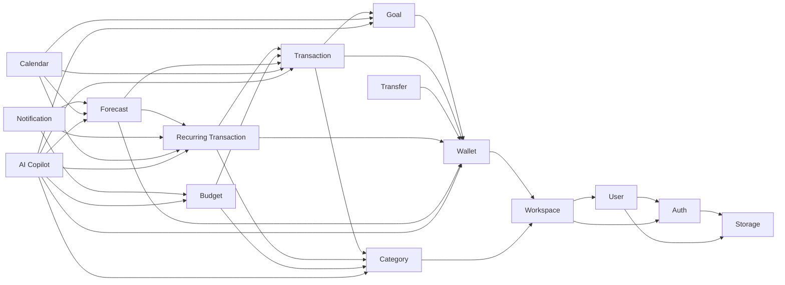

Catatan struktur:

- **Auth** dan **Storage** adalah layanan eksternal (Supabase Auth & Supabase Storage) — tidak ada modul yang bergantung pada Calendar, Notification, atau AI, sehingga tidak terbentuk siklus.
- **Calendar** adalah *projection* murni: hanya membaca, tidak memiliki data sendiri.
- **AI Copilot** adalah *consumer* murni: membaca agregat dari seluruh domain service, tidak pernah menulis.
- **Notification** hanya *menunggu* trigger dari Budget, Forecast, dan Recurring — tidak pernah menjadi dependency bagi modul lain.

---

## 1. Auth

### Overview
Autentikasi pengguna menggunakan **Supabase Auth** (email/password, alur reset password standar). Modul ini adalah fondasi identitas: seluruh request finansial wajib melewati validasi sesi sebelum menyentuh modul lain.

### Scope
- **In scope:** sign up, sign in, sign out, validasi sesi per request, alur reset password.
- **Out of scope:** penyimpanan kredensial (dikelola Supabase), OAuth provider tambahan (di luar MVP), manajemen sesi custom.

### Owned Data
Auth **tidak memiliki tabel sendiri** di aplikasi. Data yang dikelola sepenuhnya oleh Supabase Auth: kredensial, sesi, dan `user id` sebagai sumber identitas tunggal yang dirujuk modul lain.

### Dependencies
| Modul | Sifat |
|---|---|
| — | Tidak bergantung pada modul internal lain (hanya Supabase Auth) |

### Business Rules
- Setiap route/action yang mengakses data finansial wajib memanggil `requireAuth()`; gagal → `401`.
- `userId` dari sesi adalah satu-satunya sumber identitas — tidak pernah mengambil identitas dari body request.
- Auth tidak pernah menyimpan atau menampilkan data domain finansial.

### Public Interface
- `requireAuth()` — helper validasi sesi untuk seluruh route handler.
- Flow sign up / sign in / sign out via Supabase Auth.
- Callback session → menyediakan `userId` ke modul User & Workspace.

### Data Flow
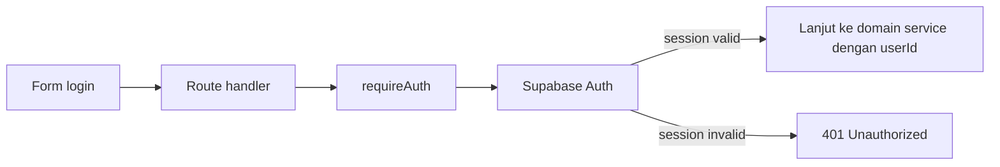

### Permissions
Tidak ada konsep role di level Auth — hanya identitas. Role (admin/member) ditentukan oleh modul Workspace.

### AI Access
**Tidak ada.** AI Copilot tidak pernah menerima kredensial, token sesi, atau data sesi.

### Testing Scope
- Integration (Supertest): request tanpa sesi → `401`; request dengan sesi valid → lolos.
- Manual QA: alur reset password Supabase, sign out menghapus sesi aktif.

---

## 2. User

### Overview
Profil tingkat pengguna (di luar konteks Workspace): nama tampilan, avatar, dan identitas akun. Setiap akun Supabase Auth direpresentasikan oleh satu profil User.

### Scope
- **In scope:** baca/ubah nama tampilan, baca/ubah avatar, tampilan email (read-only dari Auth).
- **Out of scope:** ubah email & password (mengikuti alur Supabase Auth), data finansial.

### Owned Data
| Data | Kepemilikan |
|---|---|
| `user_profile` (displayName, avatarUrl) | User — satu baris per user id Auth |
| Email & kredensial | Auth (hanya dibaca oleh User) |

### Dependencies
| Modul | Sifat |
|---|---|
| Auth | Identitas (user id), email read-only |
| Storage | Objek avatar |

### Business Rules
- Nama tampilan 1–50 karakter; tidak boleh kosong.
- Email tidak dapat diubah dari Profile di MVP (mengikuti akun Supabase Auth).
- Avatar wajib diunggah melalui Storage (validasi tipe/ukuran di sisi Storage); path objek di-scope per user.
- Mengganti avatar menghapus objek avatar lama.
- Perubahan nama tampilan langsung konsisten di seluruh UI yang menampilkannya (header, member list Workspace).

### Public Interface
- `getProfile(userId)`, `updateProfile(userId, { displayName, avatarUrl })`.
- `getEmail(userId)` — delegasi ke Auth untuk kebutuhan tampilan.

### Data Flow
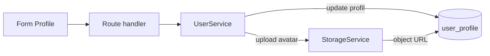

### Permissions
Scoped ke pemilik profil (`userId` dari sesi). Tidak ada keterlibatan Workspace — profil tidak pernah menampilkan data milik user lain.

### AI Access
**Tidak ada.** AI Context Builder tidak menyertakan identitas pribadi (PII) ke dalam prompt.

### Testing Scope
- Unit: validasi displayName (1–50), boundary case nama kosong.
- Integration (Supertest): update profil sendiri berhasil; akses/update profil user lain → `404`.

---

## 3. Workspace

### Overview
Akar multi-tenancy. Semua data finansial hidup di dalam Workspace (personal atau business), dan aksesnya dijamin oleh keanggotaan (`workspace_member`). Modul ini adalah gerbang keamanan paling kritis.

### Scope
- **In scope:** CRUD Workspace, manajemen member (invite/join/remove untuk Business), pengaturan role, pengaturan Workspace (nama, timezone), flag plan.
- **Out of scope:** ubah tipe & currency, manajemen member untuk Workspace personal.

### Owned Data
| Data | Kepemilikan |
|---|---|
| `workspace` (nama, tipe, currency, timezone, plan) | Workspace |
| `workspace_member` (userId, role: admin/member) | Workspace |

### Dependencies
| Modul | Sifat |
|---|---|
| Auth | Identitas pembuat/anggota |
| User | Profil member (nama tampilan di member list) |

### Business Rules
- Satu **Personal Workspace** auto-created saat registrasi; Workspace personal tidak memiliki fitur invite/member.
- Tipe dan currency Workspace **immutable** pasca-pembuatan.
- Nama Workspace 3–50 karakter.
- Business Workspace: admin dapat menambah/mengubah/menghapus member dan role; member non-admin ditolak mengakses pengaturan.
- **Setiap akses data finansial WAJIB melewati verifikasi keanggotaan** (`verifyWorkspaceMembership`) — resource di Workspace lain dikembalikan sebagai `404` (bukan `403`), mencegah IDOR.
- Flag plan default `free`; tidak ada pemblokiran fungsi inti oleh plan di MVP.

### Public Interface
- `getWorkspaces(userId)`, `createWorkspace`, `updateSettings`, `getSettings`.
- `listMembers`, `inviteMember`, `removeMember`, `changeRole`.
- `verifyWorkspaceMembership(userId, workspaceId)` — dipakai seluruh modul finansial.

### Data Flow
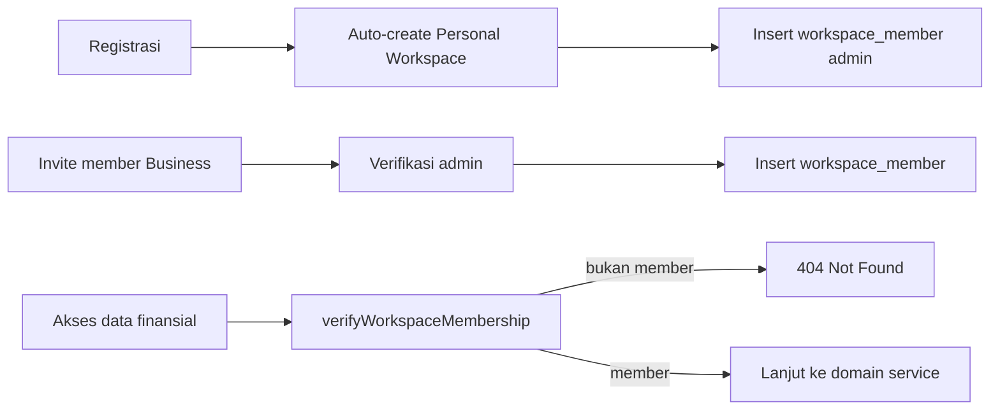

### Permissions
- View data: semua member aktif Workspace.
- Ubah pengaturan & manajemen member: **admin** saja (Business).
- Verifikasi keanggotaan adalah prasyarat mutlak sebelum modul finansial mana pun.

### AI Access
Context Builder menyertakan ringkasan Workspace (currency, timezone) sebagai konteks AI — **tanpa** data member atau PII.

### Testing Scope
- Unit: aturan immutability tipe/currency, validasi nama.
- Integration (Supertest): member Workspace A mengakses resource Workspace B → `404`; non-admin ubah pengaturan → `403`; registrasi → Personal Workspace tercipta otomatis.

---

## 4. Wallet

### Overview
Rekening/simpanan dana di dalam Workspace (Cash, Bank, E-Wallet). Saldo disimpan sebagai `cached_balance` (derived data) yang dijamin konsisten dengan seluruh Transaction `completed`.

### Scope
- **In scope:** CRUD Wallet, arsipkan wallet, baca saldo, movement ledger atomik (dipakai Transaction/Transfer).
- **Out of scope:** mutasi saldo langsung oleh user/UI, wallet multi-currency dalam satu Workspace.

### Owned Data
| Data | Kepemilikan |
|---|---|
| `wallet` (nama, tipe, currency, archived) | Wallet |
| `cached_balance` | Wallet (derived — hanya diubah lewat ledger movement) |

### Dependencies
| Modul | Sifat |
|---|---|
| Workspace | Scope kepemilikan & verifikasi member |

### Business Rules
- Semua Wallet dalam satu Workspace ber-currency sama dengan currency Workspace.
- **Saldo negatif diperbolehkan** (dengan peringatan visual), konsisten di seluruh modul.
- Wallet yang di-archive **menolak transaksi baru** (Transaction/Transfer/Recurring), tetapi histori lama tetap tampil.
- `cached_balance` hanya berubah melalui operasi atomik dari Transaction/Transfer (all-or-nothing) — tidak pernah dihitung ulang tanpa basis transaksi.
- Saldo harus dapat direkonsiliasi terhadap seluruh Transaction `completed` (tidak ada mutasi liar).
- Penghapusan Wallet = soft delete (`archived`).

### Public Interface
- `createWallet`, `updateWallet`, `archiveWallet`, `listWallets`, `getBalance(walletId)`.
- `applyLedgerMovement(walletId, delta)` — internal, hanya dipanggil Transaction & Transfer dalam satu database transaction.

### Data Flow
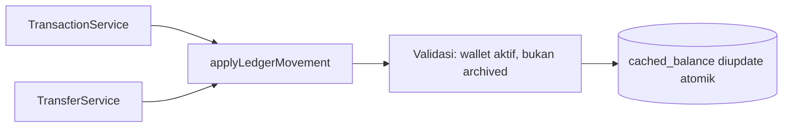

### Permissions
Member aktif Workspace pemilik; wallet milik Workspace lain → `404`. Operasi mutasi hanya via service Transaction/Transfer, bukan dari UI langsung.

### AI Access
Saldo per Wallet + total masuk FinancialContext sebagai `wallets` dan `summary` — nilai agregat, tanpa detail transaksi.

### Testing Scope
- Unit: matematika saldo atomik, rekonsiliasi saldo vs transaksi, boundary saldo negatif.
- Integration: transaksi baru ke wallet archived → ditolak; mutasi dari modul lain tidak pernah mengubah saldo secara parsial.

---

## 5. Category

### Overview
Klasifikasi income/expense. Kategori sistem (default) disediakan aplikasi; user dapat menambah kategori custom per Workspace.

### Scope
- **In scope:** list, buat kategori custom, rename, arsipkan, pilih icon/warna.
- **Out of scope:** hapus permanen kategori default, hard delete kategori yang punya histori transaksi.

### Owned Data
| Data | Kepemilikan |
|---|---|
| `category` (nama, tipe income/expense, isDefault, archived) | Category |

### Dependencies
| Modul | Sifat |
|---|---|
| Workspace | Scope kepemilikan |

### Business Rules
- Kategori default (sistem) tidak dapat dihapus permanen; kategori custom dihapus dengan **soft delete (archive)** agar transaksi lama tidak rusak.
- Satu kategori aktif per kombinasi (nama, tipe) dalam satu Workspace.
- Kategori yang di-archive tidak muncul di pilihan baru, tetapi transaksi lama yang merujuknya tetap valid dan tetap dihitung (Budget, laporan).

### Public Interface
- `listCategories(workspaceId, { includeArchived })`, `createCategory`, `renameCategory`, `archiveCategory`.
- `getCategoryById` — dipakai Transaction/Budget/Recurring dengan verifikasi Workspace.

### Data Flow
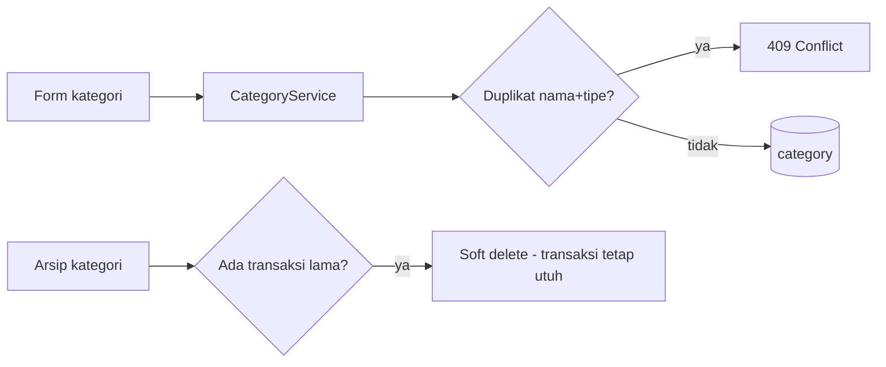

### Permissions
Member aktif Workspace pemilik dapat membuat/rename/arsip kategori; kategori Workspace lain → `404`.

### AI Access
`topCategories` (kategori dengan realisasi terbesar) dikirim ke AI sebagai agregat dari service Budget/Transaction.

### Testing Scope
- Unit: aturan unik (nama, tipe), soft delete tidak menghapus transaksi historis.
- Integration: kategori default tidak bisa dihapus permanen; transaksi kategori terarsip tetap muncul di list.

---

## 6. Transaction

### Overview
Unit ledger terkecil yang menggerakkan seluruh modul: saldo Wallet, realisasi Budget, Calendar, dan Forecast. Mendukung status `planned` dan `completed`.

### Scope
- **In scope:** CRUD Transaction, transisi status `planned` → `completed`, soft delete, agregasi untuk Budget/Forecast/Calendar.
- **Out of scope:** menulis saldo Wallet langsung (via Wallet), transfer antar wallet (via Transfer), kontribusi Goal terpisah dari ledger.

### Owned Data
| Data | Kepemilikan |
|---|---|
| `transaction` (amount, tipe income/expense, status, financialDate, walletId, categoryId?, goalId?, note?) | Transaction |

### Dependencies
| Modul | Sifat |
|---|---|
| Workspace | Scope (via walletId → workspace) |
| Wallet | Target saldo, verifikasi aktif |
| Category | Klasifikasi opsional |
| Goal | Kontribusi opsional (goalId) |

### Business Rules
- `amount > 0`; arah ditentukan field tipe (income/expense), bukan tanda negatif.
- Currency transaksi = currency Workspace.
- Status `completed` **hanya boleh untuk tanggal ≤ hari ini** (timezone Workspace); tanggal masa depan harus `planned`.
- Hanya Transaction `completed` yang memengaruhi `cached_balance` dan realisasi Budget; `planned` adalah asumsi terjadwal untuk Forecast.
- Soft delete; edit/delete transaksi yang memengaruhi Budget/Goal memicu rekalkulasi entitas tersebut.
- Wallet target harus aktif (tidak archived).
- Query by id wajib double-filter (`id` + workspace scope) — anti IDOR.
- Optimistic UI dilarang untuk mutasi finansial; loading state eksplisit.

### Public Interface
- `createTransaction`, `updateTransaction`, `deleteTransaction`, `listByDateRange`, `listByWallet`, `getById`.
- `sumCompletedByCategory(workspaceId, month)` — dipakai Budget.
- `getLedgerForReconcile(walletId)` — dipakai Wallet untuk rekonsiliasi.

### Data Flow
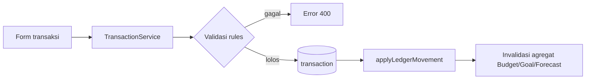

### Permissions
Member aktif Workspace pemilik; transaksi Workspace lain → `404`. Status & tanggal divalidasi di layer domain, bukan hanya UI.

### AI Access
**Data mentah transaksi tidak pernah dikirim ke AI.** AI hanya menerima agregat (summary, topCategories) hasil perhitungan service ini.

### Testing Scope
- Unit: validasi status/tanggal (completed di masa depan ditolak), matematika saldo, rekalkulasi setelah edit/delete.
- Integration (Supertest): isolasi lintas user (`404`), minimal 1 error case per operasi; happy path create → saldo ter-update.

---

## 7. Transfer

### Overview
Perpindahan dana antar dua Wallet dalam Workspace yang sama — dicatat sebagai satu entitas Transfer, bukan dua Transaction yang tampak seperti income/expense.

### Scope
- **In scope:** buat Transfer (operasi atomik dua sisi), list histori per Wallet.
- **Out of scope:** draft/planned Transfer (tidak ada di MVP), transfer lintas currency, transfer antar Workspace.

### Owned Data
| Data | Kepemilikan |
|---|---|
| `transfer` (walletAsalId, walletTujuanId, amount, date, note?) | Transfer |

### Dependencies
| Modul | Sifat |
|---|---|
| Wallet | Wallet asal & tujuan, ledger movement dua sisi |

### Business Rules
- Wallet asal ≠ wallet tujuan; `amount > 0`.
- Kedua sisi dibuat **dalam satu database transaction — all-or-nothing**; kegagalan salah satu sisi me-rollback seluruh operasi (tidak ada transfer sebagian).
- Transfer **tidak pernah** masuk perhitungan income/expense Workspace, realisasi Budget, atau agregat lain selain saldo.
- Saldo asal tidak cukup → warning konfirmasi, bukan blokir (konsisten dengan negative balance policy).
- Muncul sebagai satu entri "Transfer" di histori masing-masing Wallet, bukan dua Transaction terpisah.

### Public Interface
- `createTransfer`, `listTransfersByWallet`, `getById`.

### Data Flow
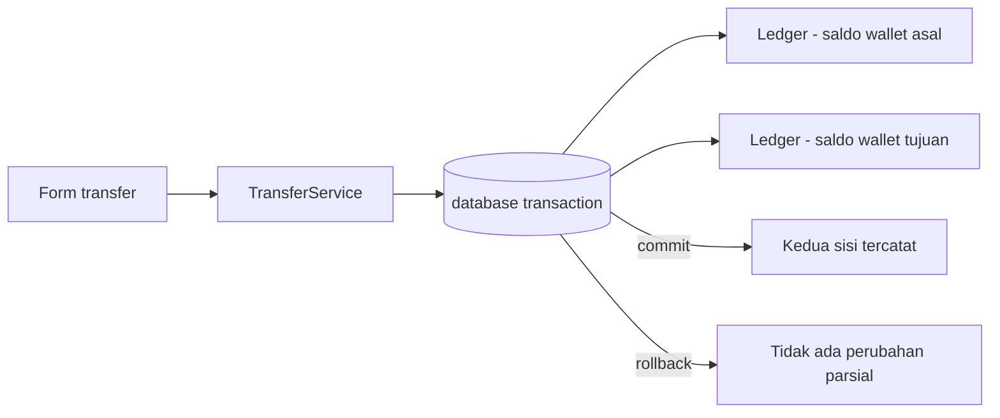

### Permissions
Member aktif Workspace pemilik; salah satu wallet milik Workspace lain → `404`.

### AI Access
Tidak ada data AI khusus — transfer hanya tercermin dalam saldo agregat.

### Testing Scope
- Unit: atomicity — simulasikan kegagalan sisi kedua → rollback total.
- Integration: transfer tidak muncul di laporan income/expense maupun realisasi Budget.

---

## 8. Recurring Transaction

### Overview
Template aturan (Recurring Rule) yang menghasilkan occurrence sebagai Transaction `planned` secara otomatis melalui background job (cron).

### Scope
- **In scope:** CRUD rule (frekuensi bulanan di MVP), generate occurrence horizon masa depan, update occurrence yang belum `completed`, riwayat eksekusi job.
- **Out of scope:** frekuensi selain bulanan, edit occurrence yang sudah `completed`.

### Owned Data
| Data | Kepemilikan |
|---|---|
| `recurring_rule` (amount, categoryId, walletId, frequency, startDate, active) | Recurring |
| Occurrence (Transaction `planned`) | Transaction — setelah dimaterialisasi |

### Dependencies
| Modul | Sifat |
|---|---|
| Wallet | Wallet target (harus aktif) |
| Category | Kategori occurrence |
| Transaction | Penulis occurrence `planned` |

### Business Rules
- Frekuensi bulanan di MVP; jatuh tempo di luar rentang bulan (mis. 31 di Februari) → **fallback ke hari terakhir bulan**.
- Job wajib **idempotent** (idempotency key) — retry tidak boleh menghasilkan occurrence duplikat.
- Perubahan rule hanya memengaruhi occurrence masa depan yang belum `completed`; occurrence `completed` adalah fakta historis yang tidak berubah.
- Penghapusan rule **tidak** menghapus occurrence `completed`.
- Gagal generate → dicatat di execution history, di-retry sesuai kebijakan, tidak silent-fail.
- Horizon generate: 60 hari ke depan (cron).

### Public Interface
- `createRule`, `updateRule`, `deleteRule`, `listRules`.
- `generateOccurrences(horizonDays)` — dipanggil cron; idempotent.
- `getExecutionHistory(ruleId)`.

### Data Flow
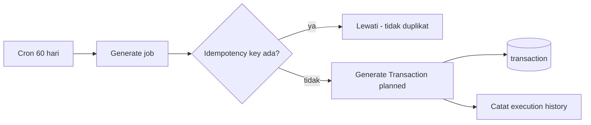

### Permissions
Member aktif mengelola rule; job background memakai service role yang di-scope per Workspace. Occurrence ditulis sebagai Transaction milik Workspace yang sama.

### AI Access
`upcomingBills` (14 hari ke depan dari occurrence) dikirim ke AI sebagai bagian FinancialContext.

### Testing Scope
- Unit: edge case tanggal 28–31, idempotency (job dijalankan dua kali → satu set occurrence).
- Integration: ubah rule tidak menyentuh occurrence `completed`; hapus rule tidak menghapus occurrence `completed`.

---

## 9. Calendar

### Overview
Halaman utama (Dashboard) yang memproyeksikan seluruh aktivitas finansial dalam tampilan bulanan. Calendar adalah **projection**, bukan sumber data.

### Scope
- **In scope:** agregasi tampilan (Transaction, occurrence Recurring, milestone Goal, sinyal Forecast), detail harian, quick-add yang mendelegasikan ke modul pemilik.
- **Out of scope:** menyimpan data apa pun, menulis entitas lain.

### Owned Data
**Tidak ada.** Calendar murni membaca dari modul lain; cache query-layer boleh ada tetapi harus dapat di-invalidate.

### Dependencies
| Modul | Sifat |
|---|---|
| Transaction | Transaksi aktual & planned |
| Recurring | Occurrence terjadwal |
| Goal | Milestone target date |
| Forecast | Sinyal proyeksi (overlay) |

### Business Rules
- Calendar tidak pernah menjadi sumber data baru — setiap entitas selalu berasal dari modul aslinya.
- Tanggal dengan > 10 entri → indikator ringkas "+N lainnya" agar layout tidak rusak.
- Navigasi antar bulan wajib responsif sesuai target performa NFR.

### Public Interface
- `getMonthView(workspaceId, month)` — agregat paralel dari 4 sumber.
- `getDayDetail(workspaceId, date)`.
- `quickAdd(workspaceId, payload)` — routing ke Transaction/Goal sesuai jenis.

### Data Flow
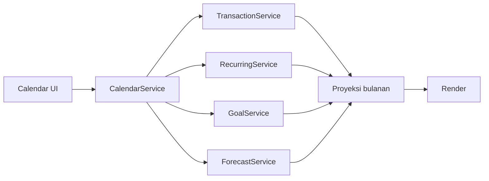

### Permissions
Member aktif Workspace pemilik; tidak ada izin khusus selain yang diwarisi sumber data.

### AI Access
Calendar tidak dikirim ke AI — AI memanggil domain service secara langsung.

### Testing Scope
- Integration: agregasi bulan benar dari keempat sumber; batas "+N" berfungsi.
- Unit: pengelompokan entri per tanggal.

---

## 10. Budget

### Overview
Batas pengeluaran bulanan per kategori dengan realisasi yang dihitung dari Transaction `completed`, serta peringatan threshold.

### Scope
- **In scope:** CRUD Budget, hitung realisasi, evaluasi threshold 80%/100%, indikator progress.
- **Out of scope:** threshold kustom, budget lintas kategori dalam satu entitas.

### Owned Data
| Data | Kepemilikan |
|---|---|
| `budget` (categoryId, amount, month) | Budget |
| Realisasi | Derived — dihitung dari Transaction, tidak disimpan |

### Dependencies
| Modul | Sifat |
|---|---|
| Category | Kategori target (harus ada & aktif) |
| Transaction | Sumber realisasi (sum expense `completed`) |

### Business Rules
- Satu Budget aktif per kombinasi (kategori, bulan); duplikat → `409` dengan opsi edit.
- Realisasi = jumlah Transaction `completed` bertipe expense pada kategori itu **sejak tanggal 1 bulan tersebut** — edit di tengah bulan tetap dihitung sejak tanggal 1.
- Transfer tidak pernah masuk realisasi.
- Threshold peringatan: **80%** (medium) dan **100%** (high); tidak dapat dikustomisasi di MVP.
- Kategori tanpa Budget → tidak ada indikator, bukan error.
- Non-color-only: status threshold selalu disertai teks/ikon.

### Public Interface
- `createBudget`, `updateBudget`, `deleteBudget`, `listBudgets(workspaceId, month)`.
- `getRealization(budgetId)` / `getMonthRealizations(workspaceId, month)`.
- `evaluateThresholds(workspaceId, month)` — dipanggil Notification.

### Data Flow
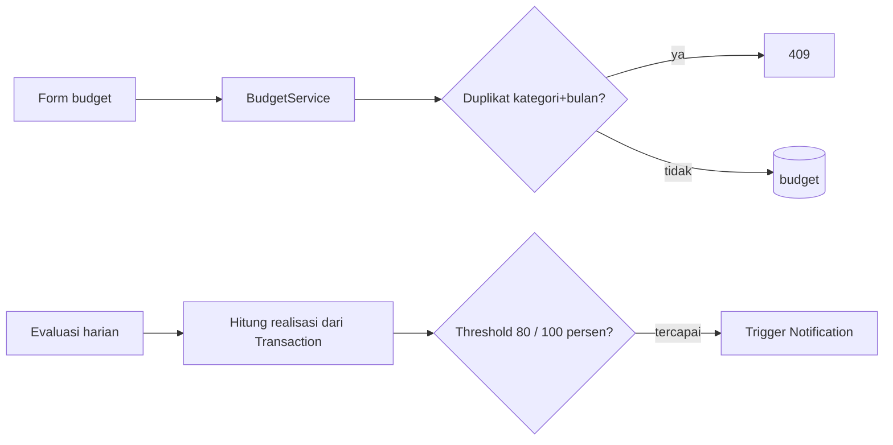

### Permissions
Member aktif Workspace pemilik; Budget Workspace lain → `404`.

### AI Access
`budgets` (batas + realisasi) dan `topCategories` masuk FinancialContext sebagai agregat.

### Testing Scope
- Unit: realisasi tengah bulan sejak tanggal 1; transfer dikecualikan; threshold tepat di 80% dan 100%.
- Integration: duplikat → `409`; peringatan muncul tepat saat threshold terlampaui.

---

## 11. Goal

### Overview
Target finansial jangka menengah/panjang dengan progress yang terhubung ke kontribusi nyata melalui Transaction (`goalId`), bukan angka aspirasional.

### Scope
- **In scope:** CRUD Goal, kontribusi via Transaction, status on-track/late/achieved, milestone di Calendar.
- **Out of scope:** kontribusi di luar ledger, transfer ke Goal.

### Owned Data
| Data | Kepemilikan |
|---|---|
| `goal` (nama, targetAmount, targetDate) | Goal |
| Progress | Derived — total kontribusi Transaction dengan `goalId` |

### Dependencies
| Modul | Sifat |
|---|---|
| Wallet | Sumber kontribusi (wallet transaksi) |
| Transaction | Kontribusi via `goalId` |

### Business Rules
- `targetAmount > 0`; target date harus di masa depan saat dibuat.
- Kontribusi **wajib terhubung ke Transaction** (ledger movement) — tidak boleh ada kontribusi yang double counting terhadap saldo Wallet.
- Kontribusi melebihi saldo Wallet sumber → warning, bukan blokir (konsisten dengan negative balance policy).
- Target date terlewati dengan progress < 100% → status **terlambat** (tetap tampil, tidak hilang).
- Goal tercapai lebih awal → status achieved; milestone muncul di Calendar pada target date.
- Hapus/ubah Transaction berkontribusi memicu rekalkulasi progress.

### Public Interface
- `createGoal`, `updateGoal`, `archiveGoal`, `listGoalsWithStatus(workspaceId)`.
- `getProgress(goalId)`, `getContributions(goalId)`.

### Data Flow
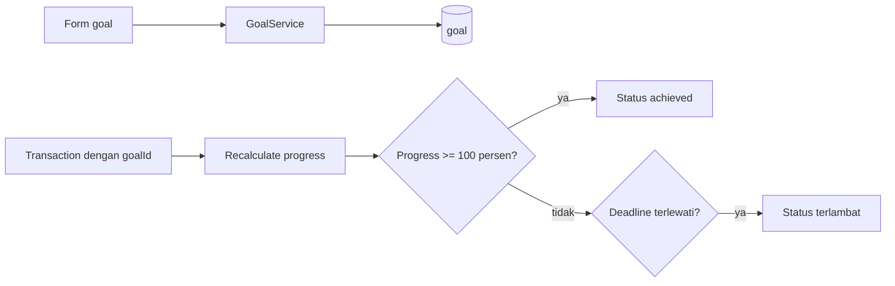

### Permissions
Member aktif Workspace pemilik; Goal Workspace lain → `404`.

### AI Access
`goals` (target, progress, status) masuk FinancialContext sebagai agregat.

### Testing Scope
- Unit: matematika progress, tidak ada double counting, status terlambat/achieved.
- Integration: kontribusi via transaksi memicu rekalkulasi; kontribusi tanpa Transaction ditolak.

---

## 12. Forecast

### Overview
Proyeksi saldo 30–60 hari ke depan berbasis **rule deterministik** (bukan ML), dihitung background job dan disimpan sebagai **snapshot immutable**.

### Scope
- **In scope:** generate snapshot (cron + recompute manual terbatas), baca snapshot, indikasi akurasi (cold start).
- **Out of scope:** machine learning, mutasi data ledger, forecast real-time per request.

### Owned Data
| Data | Kepemilikan |
|---|---|
| `forecast_snapshot` (immutable, traceable ke input) | Forecast |

### Dependencies
| Modul | Sifat |
|---|---|
| Wallet | Saldo awal |
| Transaction | Fakta (completed) & planned |
| Recurring | Asumsi terjadwal |

### Business Rules
- Snapshot **immutable** setelah dibuat; snapshot lama tetap valid untuk audit, snapshot baru dibuat dengan data terbaru.
- Proyeksi = saldo saat ini + income terjadwal − recurring bill terjadwal − **estimasi** pengeluaran non-recurring dari histori ~30 hari.
- Setiap entry membedakan **fakta** (completed), **asumsi** (recurring terjadwal), dan **estimasi** (rata-rata historis).
- Forecast **tidak pernah** mengubah data Transaction/ledger.
- Cold start (tanpa histori): proyeksi hanya dari income + recurring terjadwal dengan indikasi eksplisit "akan makin akurat".
- Recompute manual dibatasi rate limit; job gagal → execution history + status "Forecast belum tersedia" (bukan data usang).
- Entry proyeksi dapat ditelusuri ke input yang menghasilkannya (traceability).

### Public Interface
- `getLatestSnapshot(workspaceId)`, `getSnapshot(snapshotId)`.
- `requestRecompute(workspaceId)` — rate-limited; `invalidate(workspaceId)` — dipanggil modul lain saat data berubah.

### Data Flow
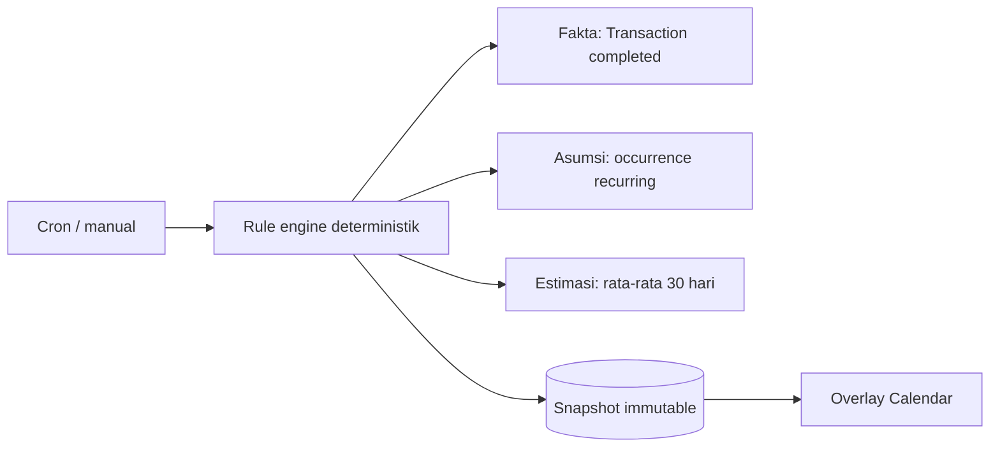

### Permissions
Member aktif dapat membaca snapshot Workspace miliknya; job background memakai service role scoped per Workspace.

### AI Access
Ringkasan forecast (termasuk sinyal saldo negatif) masuk FinancialContext.

### Testing Scope
- Unit: determinisme rule (input sama → output sama), cold start, traceability entry → sumber.
- Integration: data berubah → snapshot baru ter-generate; snapshot lama tidak termutasi.

---

## 13. Notification

### Overview
Notifikasi in-app untuk hal kritikal. Murni informatif — tidak ada email/push di MVP, dan tidak pernah memicu aksi otomatis.

### Scope
- **In scope:** generate dari trigger, list, tandai dibaca, badge unread, dedupe.
- **Out of scope:** email/push notification, aksi otomatis dari notifikasi.

### Owned Data
| Data | Kepemilikan |
|---|---|
| `notification` (tipe, referensi payload, read flag, createdAt) | Notification |

### Dependencies
| Modul | Sifat |
|---|---|
| Budget | Trigger threshold 80%/100% |
| Forecast | Trigger sinyal saldo negatif |
| Recurring | Trigger jatuh tempo occurrence dalam N hari |

### Business Rules
- Trigger: Budget ≥ 80% (medium) / ≥ 100% (high), Forecast saldo negatif, occurrence jatuh tempo dalam N hari.
- **Dedupe wajib** — kondisi yang sama berulang dalam window singkat tidak boleh menghasilkan notifikasi identik (anti-spam).
- Notifikasi informatif: tidak pernah memicu aksi (mis. menahan transaksi).
- Retry job tidak boleh menghasilkan notifikasi palsu atau ganda.
- **AI failure tidak pernah memicu notifikasi palsu.**
- Unread → badge; dibuka → hilang dari unread; riwayat tetap tersimpan.

### Public Interface
- `listNotifications(workspaceId, { unreadOnly })`, `markRead(id)`, `markAllRead()`, `getUnreadCount(workspaceId)`.
- `createFromTrigger(type, workspaceId, payload)` — dipanggil modul trigger.

### Data Flow
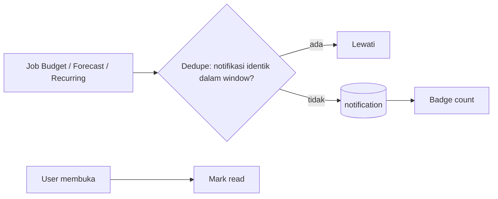

### Permissions
Member aktif hanya melihat notifikasi Workspace miliknya.

### AI Access
**Tidak ada** — AI tidak membaca notifikasi.

### Testing Scope
- Unit: logika dedupe (window, payload identik).
- Integration: setiap trigger memunculkan tepat satu notifikasi; retry tidak menggandakan; AI failure tidak memicu notifikasi.

---

## 14. AI Copilot

### Overview
Antarmuka chat yang menjelaskan data finansial menggunakan **Gemini 2.5 Flash**, dengan konteks dibangun server-side oleh Context Builder dari data yang sudah dihitung domain service. **AI hanya membaca, tidak pernah menulis.**

### Scope
- **In scope:** chat UI, Context Builder (FinancialContext), pemanggilan Gemini 2.5 Flash, quick prompts, validasi respons.
- **Out of scope:** tindakan tulis apa pun, data mentah transaksi dalam prompt, data Workspace lain, histori chat persisten (MVP stateless).

### Owned Data
**Tidak ada data persisten di MVP** (stateless; konteks dibangun on-demand, respons tidak disimpan).

### Dependencies
| Modul | Sifat |
|---|---|
| Workspace | Scope & verifikasi member |
| Wallet | Saldo agregat |
| Transaction | Summary (agregat saja) |
| Category | topCategories |
| Budget | Batas + realisasi |
| Goal | Progress + status |
| Forecast | Proyeksi + sinyal negatif |
| Recurring | upcomingBills (14 hari) |

### Business Rules
- AI **read-only**: tidak pernah membuat/mengubah Transaction, Budget, Goal, atau data lain.
- Konteks dibangun **server-side** (Context Builder) dari hasil domain service yang sama dengan yang dipakai UI — struktur FinancialContext: info Workspace, wallets, summary, topCategories, budgets, goals, upcomingBills (14 hari), dataQuality.
- **Setiap angka dalam respons AI wajib dapat ditelusuri** ke Wallet/Budget/Goal/Forecast service — divalidasi sebelum dirender (anti-halusinasi angka).
- Parameter model: Gemini 2.5 Flash, temperature rendah, max tokens dibatasi.
- Panjang pesan user dibatasi (kontrol biaya token).
- Cold start: AI mengakui keterbatasan data, tidak memaksa jawaban generik.
- Provider gagal/timeout → pesan fallback jelas + opsi retry; rate limit tercapai → pesan spesifik, bukan error generik.
- AI failure tidak memengaruhi fitur finansial inti lainnya.

### Public Interface
- `chat.send(workspaceId, message)` → jawaban terstruktur + referensi data.
- `chat.quickPrompts()` — daftar prompt awal.
- `getDataQuality(workspaceId)` — indikator kelengkapan data untuk AI.

### Data Flow
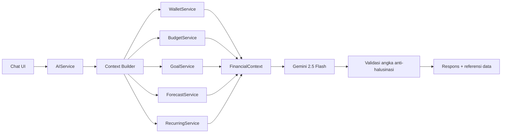

### Permissions
Member aktif Workspace pemilik; akses data Workspace lain → `404`; AI tidak pernah menerima kredensial/sesi.

### AI Access
Modul ini adalah konsumen AI itu sendiri (single integration point) — tidak ada modul lain yang memanggil LLM.

### Testing Scope
- Unit: agregasi Context Builder benar & paralel; validasi angka menolak nilai yang tidak cocok dengan domain service; batas panjang pesan.
- Integration: rate limit tercapai → pesan spesifik; provider error → fallback, fitur lain tetap normal.
- Manual QA: respons AI dapat diverifikasi terhadap data UI (traceability).

---

## 15. Storage

### Overview
Penyimpanan file eksternal (Supabase Storage) untuk aset user — di MVP hanya avatar profil.

### Scope
- **In scope:** upload avatar, hapus avatar, akses via signed URL.
- **Out of scope:** storage umum (bukti pembayaran, lampiran, dll. di luar MVP).

### Owned Data
| Data | Kepemilikan |
|---|---|
| Objek avatar di bucket | Storage |
| Referensi `avatarUrl` | User |

### Dependencies
| Modul | Sifat |
|---|---|
| Auth | Identitas pemilik (path scoped per user) |

### Business Rules
- Hanya avatar di MVP; tipe & ukuran file dibatasi (kebijakan NFR Security).
- **Path objek di-scope per user** (`user/<userId>/avatar`) — objek tidak boleh dapat ditebak atau diakses lintas user.
- Akses file via **signed URL** ber-ekspiry, bukan URL publik permanen.
- Mengganti avatar menghapus objek lama; tipe file tidak dikenal ditolak di service layer.
- Integrasi RLS/security policy di sisi Supabase sebagai defense-in-depth (lihat `02 Non-Functional Requirements.md` dan `15. Security.md`).

### Public Interface
- `uploadAvatar(userId, file)`, `getAvatarUrl(userId)`, `deleteAvatar(userId)`.

### Data Flow
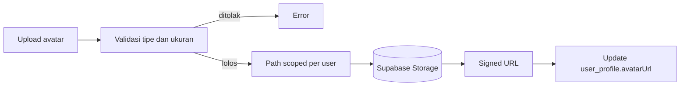

### Permissions
Hanya pemilik profil yang dapat mengunggah/menghapus avatar miliknya; akses lintas user ditolak.

### AI Access
**Tidak ada.**

### Testing Scope
- Integration: tipe/ukuran tidak valid ditolak; user tidak bisa mengakses path user lain; signed URL ber-ekspiry.
- Manual QA: upload → avatar tampil konsisten di header & member list.

---

## Matriks Kepemilikan Data & Dependensi (Ringkasan)

| Modul | Menulis data | Membaca data dari | Ditulis oleh |
|---|---|---|---|
| Auth | (Supabase) | — | — |
| User | `user_profile` | Auth, Storage | User |
| Workspace | `workspace`, `workspace_member` | Auth, User | Workspace |
| Wallet | `wallet`, `cached_balance` | Workspace | Wallet, Transaction, Transfer |
| Category | `category` | Workspace | Category |
| Transaction | `transaction` | Wallet, Category, Goal | Transaction, Recurring |
| Transfer | `transfer`, ledger 2 sisi | Wallet | Transfer |
| Recurring | `recurring_rule`, occurrence | Wallet, Category, Transaction | Recurring |
| Calendar | — (projection) | Transaction, Recurring, Goal, Forecast | — |
| Budget | `budget` | Category, Transaction | Budget |
| Goal | `goal` | Wallet, Transaction | Goal |
| Forecast | `forecast_snapshot` | Wallet, Transaction, Recurring | Forecast |
| Notification | `notification` | Budget, Forecast, Recurring | Notification |
| AI Copilot | — (stateless) | Wallet, Transaction, Category, Budget, Goal, Forecast, Recurring | — |
| Storage | Objek avatar | Auth | Storage, User |
