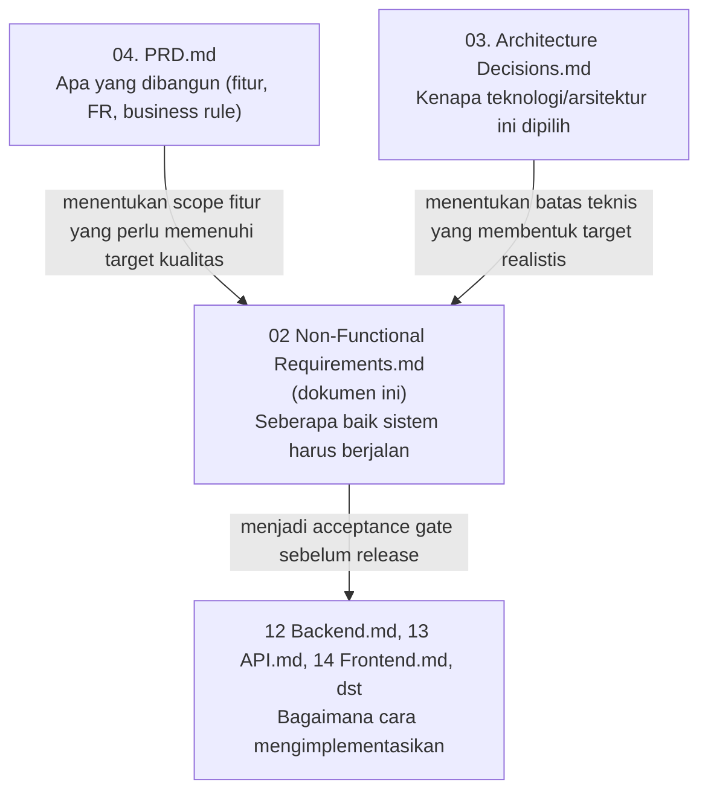

# 02. Non-Functional Requirements

**Document owner:** Engineering (Quality & Architecture)
**Status:** Approved baseline for MVP build
**Rujukan utama:** `04. PRD.md`, `03. Architecture Decisions.md`

> **Catatan penyelarasan tooling.** Stack data access final (brief, `04. PRD.md` Section 16, `05 Architecture.md` Section 5, `03. Architecture Decisions.md` Section 5): PostgreSQL yang dihosting Supabase, **SQL migration via Supabase CLI**, **Supabase Client / Server Client** sebagai jalur akses (session token user → `auth.uid()` terisi → **RLS aktif sebagai kontrol akses baris di level database**), dan **tanpa ORM** (Prisma atau lainnya). RLS adalah lapisan keamanan database (Lapisan 2) yang berjalan bersama membership check di service layer (Lapisan 1) — dua lapisan independen, bukan saling menggantikan (Product Principle #11). Service role hanya untuk background job/admin dengan scoping `workspace_id` manual.

---

# 1. Overview

## Purpose

Dokumen ini menetapkan **standar kualitas sistem (Quality Attributes)** yang wajib dipenuhi Nuxio selama pengembangan MVP. Ia menjawab pertanyaan "seberapa cepat", "seberapa aman", "seberapa andal", dan "seberapa dapat dipelihara" — bukan "fitur apa yang dibangun" (itu domain `04. PRD.md`) atau "kenapa teknologi ini dipilih" (itu domain `03. Architecture Decisions.md`).

Untuk aplikasi financial planning, Non-Functional Requirement bukan aspirasi kualitas belaka — ia adalah bagian dari kontrak kepercayaan yang sama dengan Product Principle #1 (financial correctness) dan #5 (semua operasi finansial atomik) di PRD. Sistem yang benar secara fungsional tapi lambat, tidak konsisten, atau bocor data lintas-Workspace tetap dianggap gagal.

## Scope

Dokumen ini mencakup seluruh dimensi kualitas non-fungsional MVP: performance, scalability, reliability, security, availability, maintainability, observability, accessibility, responsive design, browser support, SEO/PWA, AI quality, backup/recovery, dan testing. Ia **tidak** mencakup spesifikasi fitur (lihat `04. PRD.md`), keputusan arsitektur/teknologi (lihat `03. Architecture Decisions.md`), atau detail implementasi kode.

## Audience

| Peran             | Bagian yang Paling Relevan                                                                                                               |
| ----------------- | ---------------------------------------------------------------------------------------------------------------------------------------- |
| Frontend Engineer | Section 2 (Performance UI), 9 (Accessibility), 10 (Responsive), 11 (Browser Support), 12 (SEO & PWA)                                     |
| Backend Engineer  | Section 2 (API Performance), 3 (Scalability), 4 (Reliability), 5 (Security), 8 (Observability)                                           |
| DevOps Engineer   | Section 4 (Background Job), 6 (Availability), 8 (Observability), 14 (Backup & Recovery)                                                  |
| QA Engineer       | Section 15 (Testing Quality Targets), 16 (Acceptance Criteria) — sekaligus seluruh target terukur di dokumen ini sebagai bahan test plan |
| AI Engineer       | Section 13 (AI Quality Requirements), Section 5 (AI Data Privacy)                                                                        |

## Relationship dengan Dokumen Lain

Target di dokumen ini **tidak boleh bertentangan** dengan Section 17 (Performance Requirements) dan Section 16 (Security Requirements) `04. PRD.md`, maupun dengan trade-off yang sudah dikunci di `03. Architecture Decisions.md` (mis. cron alih-alih message queue, forecast snapshot alih-alih real-time compute). Di mana PRD sudah memberi angka indikatif, dokumen ini mempertajam angka tersebut menjadi target yang dapat diuji QA — tidak menggantinya.

---

# 2. Performance

Seluruh target berikut adalah **p95** (persentil ke-95), bukan rata-rata — konsisten dengan `04. PRD.md` Section 17, dan berlaku untuk Workspace dengan volume data sesuai Data Volume Assumption (Section 3 dokumen ini). Target adalah baseline MVP realistis di atas Vercel + Supabase, dikalibrasi ulang dengan data produksi pasca-launch, bukan komitmen kontraktual.

| Area                                                                          | Target (p95)                | Alasan                                                                                                                                                                                                                               |
| ----------------------------------------------------------------------------- | --------------------------- | ------------------------------------------------------------------------------------------------------------------------------------------------------------------------------------------------------------------------------------ |
| Initial Page Load (halaman terautentikasi)                                    | < 2.5 detik                 | Selaras `04. PRD.md` Section 17. Halaman pertama yang dibuka user (biasanya Calendar) menentukan kesan performa keseluruhan produk.                                                                                                  |
| Time to Interactive (TTI)                                                     | < 3.5 detik                 | TTI diberi jeda lebih longgar dari page load karena boleh melibatkan hydration React setelah render awal — tapi tetap dibatasi agar user tidak menunggu lama sebelum bisa berinteraksi dengan Calendar/form.                         |
| API Response Time (endpoint non-AI, non-agregat berat)                        | < 400 ms                    | Selaras `04. PRD.md` Section 17. Berlaku untuk operasi CRUD sederhana (Wallet, Category, Transaction single-record).                                                                                                                 |
| Dashboard Rendering (Calendar sebagai halaman utama)                          | < 1.5 detik                 | Calendar adalah Dashboard produk (Product Principle #2 PRD) — performa render-nya adalah performa produk secara keseluruhan di mata user.                                                                                            |
| Calendar Rendering (navigasi antar bulan, <100 entitas/bulan)                 | < 1.5 detik                 | Selaras `04. PRD.md` Section 17. Volume di atas 100 entitas/bulan mengaktifkan strategi ringkasan "+N lainnya" (Section 6.8 PRD) agar layout dan performa tetap terjaga.                                                             |
| Forecast Generation (background job per Workspace)                            | < 10 detik                  | Selaras `04. PRD.md` Section 17. Ini adalah proses background asinkron (Section 9 ADR) — target ini bukan latency yang dirasakan user secara langsung, melainkan batas durasi job agar tidak melebihi jendela waktu cron harian.     |
| Forecast Snapshot Read (dari snapshot tersimpan, bukan recompute)             | < 500 ms                    | Selaras `04. PRD.md` Section 17. Ini yang dirasakan user saat membuka overlay Forecast di Calendar — harus terasa instan karena hanya membaca data tersimpan.                                                                        |
| AI Response Time (first response Chat)                                        | < 4 detik                   | Selaras `04. PRD.md` Section 17, tergantung latensi Gemini 2.5 Flash. Lihat Section 13 untuk target detail AI.                                                                                                                       |
| File Upload (avatar profil via Supabase Storage)                              | < 3 detik untuk file ≤ 2 MB | Kebutuhan upload di MVP minor (hanya avatar, Section 6.15 PRD) — target ini cukup untuk UX yang wajar tanpa perlu infrastruktur upload chunked/resumable.                                                                            |
| Search (filter Transaction/Category berdasarkan keyword)                      | < 600 ms                    | Search di MVP beroperasi pada data yang sudah di-scope ke satu Workspace (skala data kecil-menengah, Section 3) — cukup dengan query terindeks tanpa search engine terpisah (Elasticsearch dsb dianggap over-engineering untuk MVP). |
| Pagination (load halaman berikutnya — Transaction list, Notification history) | < 500 ms per halaman        | Selaras strategi pagination di `03. Architecture Decisions.md` Section 12 — setiap halaman data harus terasa instan karena ukuran page dibatasi (lihat Section 3).                                                                   |

**Prinsip pengukuran:** target performa diuji pada kondisi data mengikuti Data Volume Assumption (Section 3), bukan dataset kosong yang tidak representatif maupun dataset ekstrem di luar asumsi MVP.

---

# 3. Scalability

Target berikut adalah **batas desain MVP** — dipakai untuk keputusan indexing, pagination, dan UI (bukan hard block keras yang memunculkan error ke user kecuali dinyatakan eksplisit). Berbasis Data Volume Assumption `04. PRD.md` Section 17, dipertajam menjadi angka konkret yang dapat diuji.

| Dimensi                             | Target Desain MVP                                                       | Asumsi & Catatan                                                                                                                                                                                                                                                                                                                                                                |
| ----------------------------------- | ----------------------------------------------------------------------- | ------------------------------------------------------------------------------------------------------------------------------------------------------------------------------------------------------------------------------------------------------------------------------------------------------------------------------------------------------------------------------- |
| Maximum Workspace per user          | 1 Personal + hingga 10 Business (soft target)                           | Personal Workspace dibatasi keras di 1 (FR-011). Business Workspace tidak dibatasi keras oleh sistem — 10 adalah asumsi desain UI switcher (dropdown tetap nyaman dipakai) dan bukan validasi block; jika terlampaui, switcher beralih ke mode scroll/search, bukan menolak pembuatan Workspace baru.                                                                           |
| Maximum Wallet per Workspace        | Desain untuk 2-10, diuji hingga 20                                      | Data Volume Assumption PRD: 2-5 tipikal. Diberi headroom hingga 20 agar Business Workspace dengan kebutuhan lebih besar tidak langsung terdegradasi performanya. Tidak ada hard limit — melebihi 20 hanya berarti daftar Wallet mulai butuh scroll, bukan ditolak.                                                                                                              |
| Maximum Category per Workspace      | Desain untuk hingga 50 (default + custom)                               | Kategori default (Section 6.4 PRD) + custom user. 50 kategori jauh melebihi kebutuhan realistis personal/small business, dipakai sebagai batas atas untuk validasi UI picker (searchable, bukan dropdown polos, di atas ~20 item).                                                                                                                                              |
| Maximum Transaction per Workspace   | Diuji hingga 10.000 baris kumulatif (≈3 tahun pada 300/bulan)           | Data Volume Assumption PRD: 50-300/bulan. Index composite `(wallet_id, transaction_date)` (`07. Database.md` 7.6) dan pagination (Section 2) dirancang agar performa tidak terdegradasi signifikan hingga volume ini. Tidak ada hard cap — soft delete tetap menyimpan histori penuh (Product Principle terkait audit).                                                         |
| Maximum Goal per Workspace          | Desain untuk hingga 20 aktif                                            | Goal bersifat jangka menengah/panjang (Section 6.10 PRD) — jumlah realistis per Workspace kecil. 20 adalah batas atas desain UI list, bukan validasi block.                                                                                                                                                                                                                     |
| Maximum Budget per Workspace        | Dibatasi natural oleh jumlah Category × 1 per bulan (unique constraint) | Business Rule Section 11 PRD: satu Budget aktif per kombinasi kategori+bulan. Dengan maksimum 50 kategori, batas atas alami adalah 50 Budget aktif per bulan per Workspace.                                                                                                                                                                                                     |
| Maximum Concurrent Session per User | Tidak dibatasi keras; dipantau, bukan diblokir                          | Supabase Auth mendukung multi-device session secara native (mis. user login dari laptop dan HP bersamaan) — ini adalah pola pemakaian wajar, bukan anomali. Pembatasan concurrent session eksplisit (device management, force-logout device lain) adalah fitur enterprise yang tidak dibutuhkan MVP; dicatat sebagai kandidat Future Roadmap jika kebutuhan keamanan meningkat. |

**Batasan yang diterima secara sadar:** angka-angka di atas adalah target _desain_, bukan hasil load testing pada skala ribuan Workspace bersamaan — konsisten dengan `03. Architecture Decisions.md` Section 13 yang eksplisit menunda desain skala 10.000+ user ke System Design v2. Trigger migrasi ke arsitektur skala lebih besar (read replica, job queue) sudah didefinisikan di ADR Section 13, dipantau lewat metrik di Section 8 dokumen ini.

---

# 4. Reliability

## Error Recovery

Setiap error yang terjadi di lapisan API mengikuti taksonomi error `04. PRD.md` Section 14 — klasifikasi jelas (ValidationError, AuthorizationError, DomainRuleError, dst) menentukan apakah operasi _retryable_ dari sisi user. UI wajib membedakan error yang bisa diperbaiki user (retry setelah input diperbaiki) dari error infrastruktur (retry setelah jeda waktu) — pesan generik yang membingungkan user tentang apa yang harus dilakukan berikutnya dianggap cacat kualitas.

## Retry Strategy

| Konteks                                                                  | Strategi Retry                                                                                                                                                                                                                                                                                     |
| ------------------------------------------------------------------------ | -------------------------------------------------------------------------------------------------------------------------------------------------------------------------------------------------------------------------------------------------------------------------------------------------- |
| Background job gagal (recurring generator, forecast recompute)           | Retry otomatis oleh scheduler dengan backoff, dicatat di execution history (Section 8) — kegagalan tidak boleh silent-fail (FR terkait Section 6.7, 6.11 PRD).                                                                                                                                     |
| Mutasi finansial gagal di client (network error saat submit Transaction) | Tidak ada retry otomatis diam-diam untuk mutasi finansial — user diberi opsi retry eksplisit dengan data form tetap terisi (Section 6.5 PRD, Loading State). Retry otomatis diam-diam pada operasi tulis finansial berisiko duplikasi tanpa idempotency key, sehingga sengaja dihindari di client. |
| Panggilan ke Gemini 2.5 Flash timeout/error                              | Satu kali retry otomatis dengan timeout lebih pendek; jika tetap gagal, fallback message ditampilkan (Section 13) — tidak mengulang berkali-kali karena AI bukan operasi kritikal.                                                                                                                 |
| Job generator recurring dijalankan dua kali (retry platform)             | Wajib idempotent lewat unique constraint `(recurringRuleId, dueDate)` di database (`03. Architecture Decisions.md` Section 10) — bukan retry yang dihindari, tapi retry yang aman dijalankan berkali-kali tanpa efek samping duplikasi.                                                            |

## Data Consistency

Operasi yang mengubah lebih dari satu entitas terkait (insert Transaction + update cached balance Wallet; kedua sisi Transfer) **wajib** berada dalam satu database transaction atomik — tidak ada state antara yang terlihat oleh query lain selama proses berlangsung (Product Principle #5 PRD, `03. Architecture Decisions.md` Section 7). Kegagalan di tengah proses membatalkan seluruh operasi, bukan sebagian.

Cached balance Wallet harus dapat direkonsiliasi terhadap ledger Transaction `completed` kapan saja (FR-027) — mekanisme rekonsiliasi mendeteksi dan melaporkan selisih, bukan diam-diam memperbaiki tanpa jejak audit.

## Background Job Reliability

Dua job MVP (recurring generator, forecast recompute) wajib:

- **Idempotent** — dijalankan berkali-kali (karena retry platform) tidak menghasilkan efek ganda.
- **Tercatat di execution history** — setiap eksekusi (sukses/gagal, durasi, jumlah Workspace diproses) dicatat untuk keperluan monitoring (Section 8) dan debugging kegagalan.
- **Terisolasi per Workspace** — kegagalan memproses satu Workspace tidak boleh menggagalkan proses seluruh batch Workspace lain dalam job yang sama.

Target keberhasilan job forecast mengikuti Success Metric `04. PRD.md` Section 3: **≥ 99% forecast job success rate** — kegagalan job berdampak langsung ke kepercayaan user terhadap proyeksi, sehingga metrik ini dipantau ketat, bukan sekadar dicatat.

## Forecast Recompute Reliability

Selaras Product Principle #7 (deterministic): forecast recompute dengan input yang sama harus menghasilkan snapshot yang sama persis — ini adalah properti yang diuji lewat unit test deterministik (Section 15), bukan hanya diasumsikan benar. Snapshot lama tetap immutable meskipun recompute berikutnya gagal — kegagalan recompute tidak pernah menghapus atau merusak snapshot valid sebelumnya (Section 9 ADR); UI menampilkan "Forecast belum tersedia" alih-alih data usang tanpa penjelasan (Section 6.11 PRD).

## Failure Handling

Kegagalan pada satu domain module tidak boleh menyebar ke domain lain yang tidak terkait — khususnya kegagalan AI Module **tidak pernah** memengaruhi fitur finansial inti (Product Principle #3, `03. Architecture Decisions.md` Section 8). Failure di path AI Copilot ditangani sepenuhnya di dalam AI Module dan tidak pernah menggagalkan request lain yang sedang berjalan.

---

# 5. Security

Requirement berikut mengunci ulang `04. PRD.md` Section 16 dan `03. Architecture Decisions.md` Section 11 menjadi target yang dapat diverifikasi QA/security review sebelum release. Tidak ada requirement di sini yang boleh dilonggarkan tanpa evaluasi eksplisit — data finansial tidak punya kategori "bug keamanan minor".

## Authentication

Seluruh siklus hidup kredensial (registrasi, login, reset password) didelegasikan penuh ke **Supabase Auth** — aplikasi tidak pernah menyimpan password dalam bentuk apa pun (Section 16 PRD, Section 5 ADR). Target: 100% endpoint yang butuh identitas user memvalidasi session sebelum memproses request; tidak ada endpoint finansial yang dapat diakses tanpa autentikasi (diuji eksplisit di test suite, Section 15).

## Authorization

Pola wajib di setiap use case: `authenticated user → requested workspace → membership validation → role validation (jika relevan) → domain action` (Section 11 ADR). Target: 100% endpoint yang menerima `workspaceId` memanggil validasi membership sebelum eksekusi domain action — diverifikasi lewat code review checklist dan test otorisasi otomatis, bukan audit manual sesekali.

## Supabase Row Level Security (RLS)

RLS diaktifkan pada seluruh tabel yang memuat data finansial (`wallets`, `transactions`, `categories`, `budgets`, `goals`, `calendar_events`, `forecast_snapshots`, dst) sebagai **kontrol akses baris utama di level database** (Lapisan 2 — `04. PRD.md` Section 16). Policy RLS membatasi baris yang dapat diakses berdasarkan `workspace_id` yang terhubung ke membership user (`auth.uid()` vs helper `auth_workspace_ids()`).

**Kenapa RLS primer, bukan sekadar tambahan:** seluruh request user dijalankan lewat Supabase client ber-token user sehingga RLS aktif di setiap query — isolasi baris dijamin oleh database, tidak bergantung pada disiplin filter manual di kode. Membership check di service layer (Lapisan 1) tetap **wajib** sebagai lapisan aplikasi (verifikasi role, pesan error yang benar, anti-IDOR). Jalur service role (bypass RLS) dibatasi hanya untuk background job dan operasi admin — setiap query di jalur ini **wajib** men-scope `workspace_id` secara eksplisit, karena tidak ada jaring pengaman RLS di jalur tersebut.

## Workspace Isolation

Kontrol keamanan paling kritis di seluruh sistem (Section 21 Risk PRD). Target terukur: **zero temuan kebocoran data lintas-Workspace** pada test isolasi otomatis (akses via manipulasi `workspaceId` di request, akses via ID entity langsung tanpa membership) — ini adalah release blocker, bukan bug yang bisa ditunda ke rilis berikutnya.

## JWT Session

Session token dari Supabase Auth disimpan di **HttpOnly cookie**, bukan localStorage, untuk mengurangi permukaan serangan XSS terhadap token sesi (Section 16 PRD, Section 11 ADR). Target: session tervalidasi di 100% request API yang memerlukan autentikasi; sesi kedaluwarsa memicu redirect otomatis ke login tanpa membocorkan detail teknis ke user (FR-008).

## Input Validation

Empat lapisan berjenjang (Section 13 PRD, Section 11 ADR): frontend (UX cepat) → **Zod schema** (bentuk/tipe payload, gerbang wajib) → domain validation (business rule) → database constraint (jaring pengaman terakhir). Target: 100% API route yang menerima payload body memiliki Zod schema eksplisit — tidak ada endpoint yang memproses `request.json()` tanpa parsing skema terlebih dahulu.

## SQL Injection Prevention

Supabase client (PostgREST) memakai query parameterized secara default di seluruh jalur request user — aplikasi tidak menulis SQL string secara manual di jalur ini. Raw SQL (dipakai terbatas di dalam Postgres function/view untuk agregasi kompleks Forecast dan operasi atomik, dipanggil via RPC) **wajib** menggunakan parameter binding (`$1`, `$2`, dst) — tidak pernah string concatenation/interpolation langsung dari input user. Target: code review menolak PR yang mengandung raw SQL dengan interpolasi string langsung tanpa parameter binding.

## XSS Prevention

Seluruh output yang berasal dari input user (nama kategori custom, catatan Transaksi, nama Wallet) di-escape saat dirender oleh React secara default. Target: tidak ada penggunaan `dangerouslySetInnerHTML` untuk konten yang berasal dari user tanpa sanitasi eksplisit — diverifikasi lewat lint rule/code review, bukan hanya konvensi tim.

## CSRF Protection

Endpoint yang mengubah state (POST/PUT/PATCH/DELETE) memverifikasi origin request dan/atau memakai mekanisme CSRF token standar Next.js. Target: seluruh mutasi finansial diuji menolak request lintas-origin tanpa token/verifikasi origin yang valid.

## Secret Management

Kredensial (Supabase service role key, Gemini API key, cron secret) disimpan sebagai Vercel Environment Variable terenkripsi, tidak pernah hardcoded atau ter-commit ke repository (Section 16 PRD, Section 11 ADR). Target: `.env*` masuk `.gitignore` sejak commit pertama; scanning otomatis (mis. `git-secrets`/`trufflehog`) dijalankan sebelum rilis pertama untuk memastikan tidak ada secret historis yang bocor di riwayat git.

## Rate Limiting

| Endpoint                                               | Limit                         | Alasan                                                                                                                                |
| ------------------------------------------------------ | ----------------------------- | ------------------------------------------------------------------------------------------------------------------------------------- |
| `POST /api/auth/register`                              | 5 request / IP / jam          | Mencegah pembuatan akun massal otomatis.                                                                                              |
| `POST /api/auth/login`                                 | 10 request / IP / 15 menit    | Mencegah brute-force credential guessing.                                                                                             |
| `POST /api/ai/chat`                                    | 20 pesan / user / jam         | Kontrol biaya token Gemini (FR-126) dan mencegah abuse.                                                                               |
| Endpoint mutasi finansial (Transaction, Transfer, dst) | 100 request / workspace / jam | Mencegah abuse skala kecil tanpa mengganggu pemakaian wajar (Data Volume Assumption: 50-300 transaksi/bulan jauh di bawah limit ini). |
| Endpoint GET umum                                      | 200 request / user / menit    | Menjaga beban baca tetap wajar tanpa mengganggu UX normal (polling Calendar, refresh saldo).                                          |

## File Upload Security

Berlaku untuk upload avatar via Supabase Storage (satu-satunya kebutuhan upload MVP, Section 6.15 PRD): validasi tipe file (whitelist MIME image, bukan blacklist), batas ukuran file (maksimum 2 MB), penamaan file di storage tidak boleh memakai nama asli dari client (mencegah path traversal/collision), dan bucket policy Supabase Storage membatasi akses file hanya untuk pemilik/anggota Workspace terkait — bukan bucket publik tanpa kontrol.

## AI Data Privacy

Context yang dikirim ke Gemini 2.5 Flash dibatasi ke data agregat minimum yang diperlukan (Section 16 PRD, Section 8 ADR): angka agregat finansial, label yang dibuat user sendiri (nama kategori/wallet), tanggal dan jumlah — **tidak pernah** email, nama lengkap (kecuali dibutuhkan eksplisit untuk personalisasi), ID internal database, atau kredensial apa pun. Target: audit berkala terhadap payload yang dikirim ke LLM (sample review) memastikan tidak ada field di luar `FinancialContext` yang terdefinisi (Section 8 ADR) yang ikut terkirim.

---

# 6. Availability

MVP tidak menargetkan SLA enterprise formal — target berikut adalah standar operasional realistis untuk startup dengan tim 3 engineer tanpa dedicated SRE.

| Aspek                | Target                                                                                                                                                                                                                                                                                                                                                                                                        |
| -------------------- | ------------------------------------------------------------------------------------------------------------------------------------------------------------------------------------------------------------------------------------------------------------------------------------------------------------------------------------------------------------------------------------------------------------- |
| Uptime               | ≥ 99.5% best-effort (bukan SLA kontraktual) — setara downtime maksimum ±3.6 jam/bulan, tercapai secara alami dari infrastruktur managed (Vercel + Supabase) tanpa arsitektur multi-region khusus.                                                                                                                                                                                                             |
| Maintenance strategy | Deployment zero-downtime by default (Vercel atomic deployment — versi baru live sebelum versi lama dimatikan). Migrasi database yang berpotensi mengunci tabel besar dijadwalkan di luar jam pemakaian puncak dan diuji durasinya di staging terlebih dahulu (Section 14 ADR). Tidak ada maintenance window terjadwal rutin yang mengharuskan aplikasi down sepenuhnya untuk operasi MVP normal.              |
| Graceful degradation | Kegagalan AI Copilot tidak pernah menjatuhkan fitur finansial inti (Product Principle #3) — Chat menampilkan fallback, Wallet/Transaction/Budget/Calendar tetap berfungsi penuh. Forecast yang gagal recompute menampilkan snapshot terakhir yang valid dengan indikasi usia data, bukan mengosongkan seluruh overlay Forecast. Kegagalan job background tidak pernah memblokir operasi CRUD interaktif user. |

---

# 7. Maintainability

## Modular Architecture

Kode diorganisasi per domain module (bukan per jenis teknis) mengikuti keputusan Modular Monolith + Clean Architecture (DDD-lite) di `03. Architecture Decisions.md` Section 4 dan 6. Target: business rule finansial tidak pernah ditemukan di API route handler atau komponen React — selalu di lapisan domain service, diverifikasi lewat code review checklist.

## Documentation

Setiap domain module memiliki dokumentasi setingkat README yang menjelaskan tanggung jawab modul dan kontrak publiknya (bukan dokumentasi API auto-generate yang tidak dibaca siapa pun). Keputusan arsitektur baru yang signifikan wajib menambah entri di `03. Architecture Decisions.md`, bukan hanya didiskusikan lisan/chat internal.

## Code Readability

TypeScript strict mode aktif di seluruh proyek. ESLint + Prettier terpasang di CI (`17. DevOps.md` 17.5) sebagai gate wajib, bukan saran opsional. Prinsip Readability over cleverness (Section 3 ADR) berarti PR yang butuh komentar panjang untuk dijelaskan logikanya dianggap kandidat refactor, bukan kode yang diterima apa adanya.

## Refactoring

Refactoring dilakukan tergabung dengan pekerjaan fitur terkait (boy scout rule) untuk kode yang benar-benar disentuh — bukan refactoring besar terpisah yang tidak terkait scope kerja berjalan, konsisten dengan prinsip MVP First (menghindari pekerjaan yang tidak menambah nilai langsung ke 140 FR yang disepakati).

## Technical Debt

Technical debt yang disengaja (trade-off eksplisit demi kecepatan MVP, mis. cron alih-alih job queue) **wajib dicatat** di `03. Architecture Decisions.md` sebagai keputusan sadar dengan trigger migrasi yang jelas (Section 13 ADR) — bukan dibiarkan sebagai debt implisit yang baru ditemukan saat sudah menyakitkan. Technical debt yang tidak disengaja (jalan pintas darurat, workaround bug) dicatat sebagai TODO dengan referensi issue tracker, bukan komentar kode yang mudah terlupakan.

## Dependency Management

Dependency diperbarui secara terjadwal (bukan reaktif hanya saat ada CVE kritis) lewat automated dependency update (Dependabot/Renovate — sejalan dengan OWASP A06 di `18. Security.md` 18.9 yang mencatat ini sebagai item yang perlu ditambahkan pasca-MVP awal). `npm audit` dijalankan di CI sebagai bagian pipeline wajib (`17. DevOps.md` 17.5). Penambahan dependency baru mempertimbangkan bundle size dan maintenance activity package tersebut — tidak menambah library untuk kebutuhan yang bisa diselesaikan dengan beberapa baris kode sendiri (selaras Simplicity principle, Section 3 ADR).

---

# 8. Observability

## Logging

**Pino** menghasilkan structured JSON log untuk seluruh request API yang menyentuh data finansial (Section 5 ADR). Setiap log wajib melalui redaksi field sensitif (password hash, token, PII yang tidak relevan) sebelum ditulis — kebijakan redaksi didefinisikan sebagai middleware logging global, bukan diserahkan ke tiap developer untuk diingat manual.

## Request ID

Setiap request API diberi correlation ID unik (mis. header `x-request-id`, digenerate jika belum ada dari client) yang disertakan di seluruh log yang dihasilkan selama siklus hidup request tersebut. Target: satu insiden production dapat ditelusuri end-to-end dari satu request ID tanpa harus mencocokkan timestamp secara manual antar log terpisah.

## Error Logging

Seluruh unhandled exception di API route dicatat lengkap (stack trace, context request) ke server log — **tidak pernah** dibocorkan ke response yang dikirim ke client (Section 14 PRD: pesan user-facing selalu generik, detail teknis hanya di log server). Error kelas `UnexpectedError` (500 tanpa kategori jelas) diberi prioritas investigasi tertinggi karena mengindikasikan kondisi yang belum tertangani taksonomi error yang ada.

## AI Logging

Setiap panggilan ke Gemini 2.5 Flash mencatat: token usage (input/output), latency, hasil validasi grounding (`hasHallucinatedNumbers`, `hasActionableWrite`), dan status akhir (dikirim ke user / ditolak validasi). Log ini menjadi basis untuk Section 13 (AI Quality) dan kontrol biaya (Section 5 ADR) — tanpa ini, insiden halusinasi atau lonjakan biaya tidak dapat diinvestigasi setelah kejadian.

## Cron Monitoring

Dua background job MVP (recurring generator, forecast recompute) mencatat execution history: waktu mulai/selesai, jumlah Workspace diproses, jumlah sukses/gagal, dan durasi total. Target: kegagalan job memicu sinyal yang terlihat (log level error minimal) dalam waktu yang memungkinkan investigasi sebelum siklus berikutnya berjalan — bukan diketahui pertama kali dari komplain user soal data yang tidak update.

## Health Check

Endpoint `/api/health` memverifikasi konektivitas database (`SELECT 1`) dan mengembalikan status `ok`/`error`. Dipanggil layanan uptime monitor eksternal secara berkala. Target: endpoint ini adalah sinyal pertama yang dicek saat troubleshooting insiden — harus selalu tersedia bahkan saat bagian lain aplikasi bermasalah.

## Metrics yang Perlu Dipantau

| Metrik                                            | Kenapa Dipantau                                                                     |
| ------------------------------------------------- | ----------------------------------------------------------------------------------- |
| API p95 latency per endpoint                      | Deteksi dini degradasi performa sebelum melanggar target Section 2                  |
| Forecast job success rate                         | Success Metric eksplisit `04. PRD.md` Section 3 (≥ 99%)                             |
| Recurring job success rate                        | Kegagalan langsung berdampak ke akurasi Calendar dan Forecast                       |
| AI request volume & token cost per hari           | Kontrol biaya (Section 5 ADR), deteksi anomali penggunaan                           |
| AI hallucination rejection rate                   | Sinyal kualitas prompt/context builder — lonjakan tiba-tiba mengindikasikan regresi |
| Error rate per kategori (Section 14 PRD taxonomy) | Deteksi dini kelas error yang meningkat tak wajar                                   |
| Database connection pool utilization              | Sinyal dini kebutuhan scaling (trigger Section 13 ADR)                              |

---

# 9. Accessibility

Target: **WCAG 2.1 Level AA** pada elemen interaktif inti (form, navigasi, Calendar) — selaras `04. PRD.md` Section 18, tanpa audit penuh terhadap seluruh permukaan aplikasi di siklus pertama.

| Aspek                    | Requirement                                                                                                                                                                                                                                                                    |
| ------------------------ | ------------------------------------------------------------------------------------------------------------------------------------------------------------------------------------------------------------------------------------------------------------------------------ |
| Keyboard Navigation      | Seluruh elemen interaktif (tombol, form, sel Calendar, item chat) dapat diakses dan dioperasikan tanpa mouse — termasuk navigasi antar bulan Calendar dan pembukaan detail tanggal.                                                                                            |
| Focus Management         | Indikator fokus terlihat jelas pada seluruh elemen interaktif, tidak dihilangkan demi estetika. Modal/panel (mis. `DayDetailPanel`) memindahkan fokus secara terprogram saat dibuka dan mengembalikannya saat ditutup.                                                         |
| Screen Reader            | Seluruh input form memiliki label yang terhubung secara semantik; ikon-only button memiliki `aria-label`. Ringkasan aktivitas per tanggal Calendar tersedia sebagai teks yang dapat dibaca screen reader, bukan hanya indikator visual titik/warna.                            |
| Color Contrast           | Rasio kontras teks memenuhi AA — minimum 4.5:1 untuk teks normal, 3:1 untuk teks besar/ikon.                                                                                                                                                                                   |
| Form Accessibility       | Error validasi terhubung ke field terkait lewat `aria-describedby`, bukan hanya ditampilkan visual di dekat field. Field wajib ditandai secara semantik (`required` / `aria-required`), bukan hanya tanda bintang visual.                                                      |
| Semantic HTML            | Struktur heading logis (`h1`-`h3` berurutan), elemen native (`button`, `nav`, `table`) dipakai sesuai fungsinya alih-alih `div` dengan event handler — memastikan assistive technology dapat menginterpretasi struktur halaman tanpa bergantung sepenuhnya pada ARIA tambahan. |
| Non-color-only Indicator | Status Budget (80%/100%), saldo negatif, dan status Goal terlambat selalu disertai teks/ikon, tidak hanya perbedaan warna (`04. PRD.md` Section 18).                                                                                                                           |

---

# 10. Responsive Design

| Breakpoint | Lebar Viewport          | Target Device                                                                                 |
| ---------- | ----------------------- | --------------------------------------------------------------------------------------------- |
| Mobile     | ≥ 360px hingga < 768px  | Smartphone — breakpoint minimum 360px selaras `04. PRD.md` Section 18 (Responsive behaviour)  |
| Tablet     | ≥ 768px hingga < 1024px | Tablet portrait/landscape kecil, browser window medium                                        |
| Desktop    | ≥ 1024px                | Laptop/desktop standar — layout penuh dengan sidebar/panel tambahan yang tidak muat di mobile |

**Requirement per kelas device:**

- **Mobile:** Calendar beralih ke tampilan agenda/list terkompresi jika grid bulan penuh tidak muat terbaca; navigasi utama beralih ke bottom nav atau hamburger menu; form input (Transaction, Wallet) full-screen alih-alih modal kecil.
- **Tablet:** Grid Calendar bulan penuh tetap ditampilkan; panel detail (`DayDetailPanel`) dapat tampil sebagai side panel alih-alih modal penuh layar.
- **Desktop:** Layout multi-kolom (Calendar + panel detail berdampingan) dimanfaatkan penuh; Chat AI Copilot dapat tampil sebagai panel persisten alih-alih overlay.

Seluruh layar wajib tetap fungsional dan dapat dibaca di seluruh rentang breakpoint di atas — tidak ada fitur inti yang hanya dapat diakses di satu kelas device tertentu, mengingat Nuxio adalah Web + PWA tanpa native app terpisah di MVP (Non-Goal Section 3 PRD).

---

# 11. Browser Support

| Browser | Versi Didukung                         | Catatan                                                                                                           |
| ------- | -------------------------------------- | ----------------------------------------------------------------------------------------------------------------- |
| Chrome  | 2 versi mayor terakhir                 | Baseline pengujian utama — mayoritas trafik web umumnya Chromium-based                                            |
| Edge    | 2 versi mayor terakhir                 | Chromium-based, kompatibilitas mengikuti Chrome secara mekanis                                                    |
| Firefox | 2 versi mayor terakhir                 | Engine berbeda (Gecko) — wajib diuji terpisah untuk CSS Grid/Flexbox Calendar dan Service Worker PWA              |
| Safari  | 2 versi mayor terakhir (desktop & iOS) | Wajib diuji terpisah — Safari punya perilaku berbeda untuk PWA installability dan beberapa API (lihat Section 12) |

Browser di luar daftar ini (termasuk Internet Explorer dalam bentuk apa pun) **tidak didukung** — sejalan dengan prinsip MVP First, dukungan browser legacy menambah biaya polyfill/testing yang tidak sepadan dengan basis user target (Persona 1 & 2, Section 4 PRD, yang menggunakan device modern sehari-hari). Degradasi non-blocking (mis. animasi lebih sederhana) diperbolehkan di browser lawas yang masih menjalankan JavaScript modern, selama fungsi inti tetap dapat dipakai.

---

# 12. SEO & PWA

## Metadata

Halaman publik (landing/marketing, halaman login/register) memiliki metadata `title` dan `description` unik per halaman lewat Next.js Metadata API. Halaman di dalam aplikasi (Calendar, Wallet, dst) yang berada di balik autentikasi **tidak perlu** dioptimasi SEO — hanya butuh title yang jelas untuk tab browser/bookmark.

## Open Graph

Halaman publik (landing page) memiliki tag Open Graph (`og:title`, `og:description`, `og:image`) agar tampil baik saat dibagikan di media sosial/chat. Halaman di balik autentikasi tidak memerlukan Open Graph tags.

## Sitemap & Robots

`sitemap.xml` mencakup halaman publik saja (landing, auth pages) — seluruh route aplikasi di balik autentikasi dikecualikan lewat `robots.txt` (`Disallow`) karena tidak relevan untuk indexing dan berpotensi membocorkan struktur route internal.

## Manifest

`manifest.json` PWA berisi `name`, `short_name`, `theme_color`, `background_color`, `display: standalone`, dan `start_url` yang mengarah ke Calendar (halaman utama pasca-login) — selaras keputusan Platform PWA (`04. PRD.md` Core Decisions).

## Icons

Set ikon PWA lengkap (minimum 192x192 dan 512x512, termasuk varian maskable untuk Android) disediakan agar instalasi PWA tampil rapi di homescreen berbagai platform, bukan hanya satu ukuran generik yang di-scale otomatis oleh browser.

## Offline Fallback

Service worker menyajikan halaman fallback sederhana ("Kamu sedang offline") untuk navigasi saat tidak ada koneksi — **bukan** mode offline penuh dengan sinkronisasi data finansial offline-first (di luar scope MVP; data finansial yang dimodifikasi offline tanpa sinkronisasi terjamin berisiko konflik yang bertentangan dengan Product Principle #5). Cache offline dibatasi ke shell aplikasi (asset statis) dan halaman fallback, bukan data finansial dinamis.

## Installable PWA

Kriteria minimum installability terpenuhi: HTTPS (otomatis dari Vercel), manifest valid dengan icon yang sesuai, dan service worker terdaftar. Target: PWA dapat diinstal dari Chrome/Edge (desktop & Android) dan "Add to Home Screen" dari Safari iOS — dengan catatan eksplisit bahwa dukungan PWA Safari iOS punya keterbatasan platform (mis. tidak ada push notification web di luar scope MVP) yang diterima sebagai batasan platform, bukan bug produk.

---

# 13. AI Quality Requirements

| Requirement              | Target                                                                                                                                | Alasan                                                                                                                                                                                               |
| ------------------------ | ------------------------------------------------------------------------------------------------------------------------------------- | ---------------------------------------------------------------------------------------------------------------------------------------------------------------------------------------------------- |
| Response Time            | < 4 detik p95 (first response)                                                                                                        | Selaras Section 2. Latensi lebih dari ini merusak UX percakapan meski AI bukan fitur kritikal.                                                                                                       |
| Structured Output        | 100% respons melalui format JSON terstruktur (`narrative` + `sourceReferences`) sebelum dirender                                      | Prasyarat mutlak untuk grounding check (Section 8 ADR) — respons teks bebas tanpa struktur tidak dapat diverifikasi otomatis.                                                                        |
| Hallucination Mitigation | 0% respons dengan angka tanpa `sourceReference` valid yang lolos ke client                                                            | Safety check di layer aplikasi menolak respons yang gagal validasi grounding sebelum ditampilkan — bukan mengandalkan prompt semata (Section 8 ADR, `16. AI.md` 16.7).                               |
| Context Accuracy         | 100% angka dalam context yang dikirim ke LLM identik dengan angka yang ditampilkan UI pada request yang sama                          | Context Builder membaca dari domain service yang sama dengan UI (Product Principle #3) — diverifikasi lewat test yang membandingkan output Context Builder dengan response API domain yang setara.   |
| Read Only Access         | 0 jalur teknis bagi AI Module untuk memanggil operasi tulis domain manapun                                                            | Product Principle #8 — diverifikasi lewat code review (tidak ada import method mutasi di folder `ai/`) dan test end-to-end yang memastikan tidak ada state finansial berubah setelah interaksi Chat. |
| Fallback Strategy        | 100% kegagalan provider (timeout, 5xx, rate limit) menghasilkan pesan fallback yang jelas, fitur finansial lain tetap berjalan normal | Product Principle #3 — kegagalan AI adalah kegagalan terisolasi, bukan kegagalan sistemik.                                                                                                           |
| Rate Limit Handling      | Batas 20 pesan/user/jam ditegakkan dengan pesan yang menjelaskan sisa waktu tunggu, bukan error generik                               | FR-126, kontrol biaya (Section 5 ADR) — user harus paham _kenapa_ dan _kapan_ bisa mencoba lagi, bukan sekadar diblokir.                                                                             |

---

# 14. Backup & Recovery

Strategi tingkat tinggi berikut proporsional untuk MVP dengan basis user awal kecil — bukan disaster recovery multi-region enterprise.

## Database Backup

PostgreSQL yang dihosting Supabase menggunakan backup otomatis harian bawaan platform (retensi sesuai tier Supabase project production). Backup tidak dikelola manual oleh tim — mengandalkan mekanisme managed provider selaras filosofi "boring tapi solid" (Section 3 ADR).

## Storage Backup

File di Supabase Storage (avatar profil) mengikuti mekanisme durability bawaan platform. Mengingat sifat file yang non-kritikal (dapat diunggah ulang user tanpa kehilangan data finansial), tidak ada strategi backup terpisah tambahan di luar yang disediakan platform untuk MVP.

## Restore Strategy

Kemampuan restore dari backup **wajib diverifikasi minimal satu kali di environment staging** sebelum go-live pertama (Launch Checklist `04. PRD.md` Section 20) — restore yang belum pernah diuji dianggap tidak dapat diandalkan sampai terbukti berhasil, bukan diasumsikan bekerja karena "seharusnya bekerja".

## Recovery Objective

| Metrik                         | Target MVP | Catatan                                                                                                                                                                                                                                              |
| ------------------------------ | ---------- | ---------------------------------------------------------------------------------------------------------------------------------------------------------------------------------------------------------------------------------------------------- |
| Recovery Point Objective (RPO) | ≤ 24 jam   | Selaras siklus backup harian bawaan Supabase — kehilangan data maksimum yang dapat diterima adalah aktivitas dalam satu hari terakhir sebelum insiden, bukan target near-zero yang membutuhkan infrastruktur replikasi kontinu di luar proporsi MVP. |
| Recovery Time Objective (RTO)  | ≤ 4 jam    | Waktu maksimum yang dianggap wajar untuk memulihkan layanan setelah insiden serius, realistis untuk tim 3 engineer tanpa on-call 24/7 formal di fase MVP.                                                                                            |

Target ini eksplisit **bukan** komitmen SLA kontraktual ke user — ini adalah target operasional internal yang dikalibrasi ulang begitu skala user dan ekspektasi bisnis (mis. tier berbayar dengan SLA) berkembang pasca-validasi MVP.

---

# 15. Testing Quality Targets

| Jenis Testing                      | Target                                                                                                                                                                 | Fokus                                                                                                                                                                                                                                                                                     |
| ---------------------------------- | ---------------------------------------------------------------------------------------------------------------------------------------------------------------------- | ----------------------------------------------------------------------------------------------------------------------------------------------------------------------------------------------------------------------------------------------------------------------------------------- |
| Unit Testing                       | Domain service (Wallet, Transaction, Budget, Goal, Forecast) ≥ 80% coverage                                                                                            | Business rule finansial (atomic balance, deterministic forecast, business rule Budget/Goal) adalah bagian paling kritis untuk diuji terisolasi dari infrastruktur (Definition of Done Section 20 PRD).                                                                                    |
| Integration Testing                | Seluruh API route finansial diuji end-to-end dengan database test nyata (bukan mock)                                                                                   | Selaras feedback eksplisit tim: integration test yang memock database berisiko lolos meski migrasi/query sebenarnya rusak. Wajib mencakup skenario otorisasi (akses lintas-Workspace ditolak) di setiap endpoint.                                                                         |
| End-to-End Testing                 | Minimal mencakup: onboarding → transaksi pertama, create/edit/delete Transaction, Transfer atomik, Budget threshold, Goal contribution, AI Copilot cold-start & normal | Skenario ini adalah jalur kritis yang disebut eksplisit di Definition of Done dan MVP Checklist `04. PRD.md` Section 20 — kegagalan di salah satunya adalah release blocker.                                                                                                              |
| Coverage Goal (keseluruhan proyek) | ≥ 65% overall, dengan domain service sebagai pengecualian target lebih tinggi (80%, lihat Unit Testing)                                                                | Target keseluruhan sengaja tidak diseragamkan tinggi di semua lapisan — kode UI presentasional murni (styling, layout) punya nilai coverage rendah yang wajar, sementara logic finansial harus jauh lebih diuji ketat. Coverage tinggi tanpa pembobotan area kritis adalah metrik kosong. |
| Regression Testing                 | Suite E2E dijalankan wajib di CI sebelum merge ke `staging` dan sebelum deploy ke `production`                                                                         | Mencegah fitur yang sudah bekerja (khususnya jalur finansial kritis) rusak akibat perubahan tidak terkait — regresi pada aplikasi finansial berarti hilangnya kepercayaan user, bukan sekadar bug kosmetik.                                                                               |

**Kelas skenario yang wajib eksplisit diuji (bukan tersirat dari coverage angka semata):**

- Workspace isolation: user Workspace A tidak dapat mengakses data Workspace B lewat manipulasi request (MVP Checklist Section 20 PRD).
- Idempotency recurring occurrence generator terhadap retry job dan edge case tanggal 28-31 (Section 6.7 PRD).
- AI grounding: sample respons AI diverifikasi setiap angka yang disebut cocok dengan hasil query domain service yang sama (Section 12 PRD).
- Atomicity Transfer: kegagalan satu sisi transfer tidak pernah menghasilkan state transfer sebagian (Section 6.6 PRD).

---

# 16. Acceptance Criteria

Checklist berikut dipakai QA sebagai gate sebelum release — melengkapi (bukan menggantikan) MVP Checklist dan Launch Checklist `04. PRD.md` Section 20.

## Performance

- [ ] Initial page load terautentikasi < 2.5 detik p95
- [ ] Calendar month load (<100 entitas) < 1.5 detik p95
- [ ] API response time endpoint non-AI < 400 ms p95
- [ ] Forecast snapshot read < 500 ms p95
- [ ] AI first response < 4 detik p95

## Scalability

- [ ] Sistem tetap responsif (target Section 2 tercapai) pada Workspace dengan data sesuai batas atas Section 3 (≈10.000 transaksi kumulatif, 20 wallet, 50 kategori)

## Reliability

- [ ] Forecast job success rate ≥ 99% terverifikasi di staging selama periode observasi minimal 1 minggu
- [ ] Recurring occurrence generator terbukti idempotent (dijalankan dua kali tidak menghasilkan duplikat)
- [ ] Seluruh operasi atomik (Transaction+balance, Transfer, Goal contribution) lolos test kegagalan-di-tengah-proses

## Security

- [ ] Zero temuan kebocoran data lintas-Workspace pada test isolasi otomatis
- [ ] RLS aktif di seluruh tabel finansial
- [ ] Seluruh endpoint mutasi memiliki Zod schema, auth check, dan membership check
- [ ] Tidak ada secret ter-commit ke repository (hasil scan bersih)
- [ ] Rate limiting aktif dan teruji di endpoint register, login, dan AI chat
- [ ] Security headers terpasang dan diverifikasi

## Availability & Reliability Operasional

- [ ] `/api/health` aktif dan dipantau layanan uptime eksternal
- [ ] Kegagalan AI Copilot terbukti tidak memengaruhi fitur finansial inti (diuji eksplisit)

## Observability

- [ ] Structured logging (Pino) aktif dengan redaksi field sensitif terverifikasi
- [ ] Request ID hadir di seluruh log satu siklus request
- [ ] Execution history dua background job tercatat dan dapat ditelusuri

## Accessibility

- [ ] Navigasi keyboard penuh berfungsi di form inti dan Calendar
- [ ] Kontras warna memenuhi AA di elemen teks utama
- [ ] Status non-color-only (Budget, saldo negatif, Goal terlambat) terverifikasi

## Responsive & Browser

- [ ] Fungsional penuh di breakpoint mobile (360px), tablet, dan desktop
- [ ] Diuji lolos di 2 versi mayor terakhir Chrome, Edge, Firefox, Safari (desktop & iOS)

## PWA

- [ ] Manifest dan service worker terverifikasi; PWA dapat diinstal di Chrome/Edge/Android dan ditambahkan ke homescreen iOS Safari
- [ ] Offline fallback page tampil saat tidak ada koneksi

## AI Quality

- [ ] 100% respons AI melalui structured output dan grounding check sebelum tampil ke user
- [ ] Terverifikasi tidak ada jalur write action dari AI Module (code review + test end-to-end)

## Backup & Recovery

- [ ] Restore dari backup berhasil diverifikasi minimal satu kali di staging sebelum go-live pertama

## Testing

- [ ] Coverage domain service ≥ 80%, coverage keseluruhan ≥ 65%
- [ ] Suite E2E jalur kritis lolos di CI sebelum setiap deploy production
