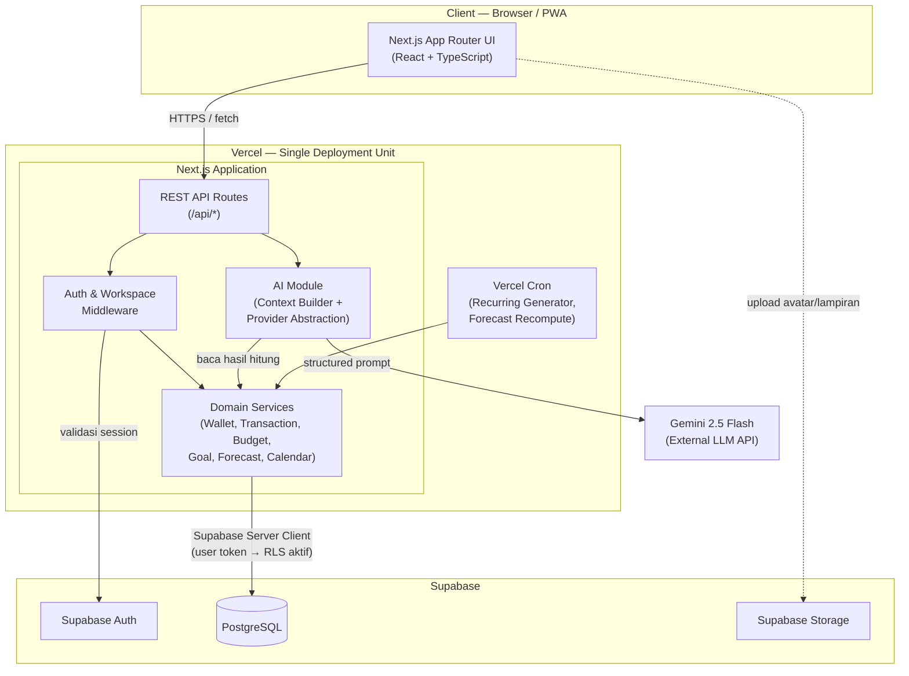
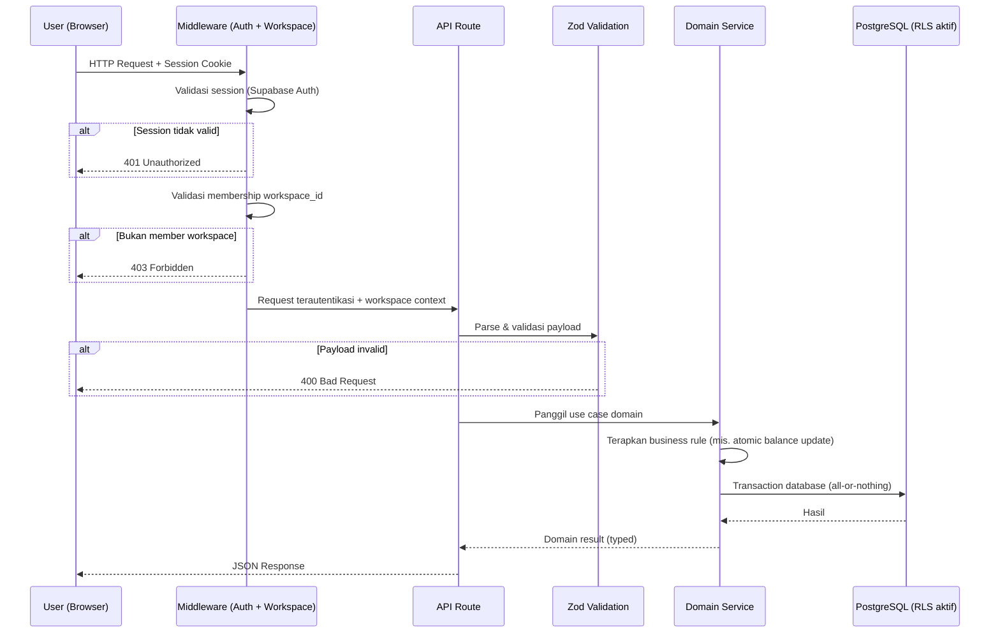
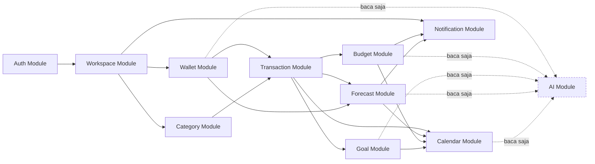
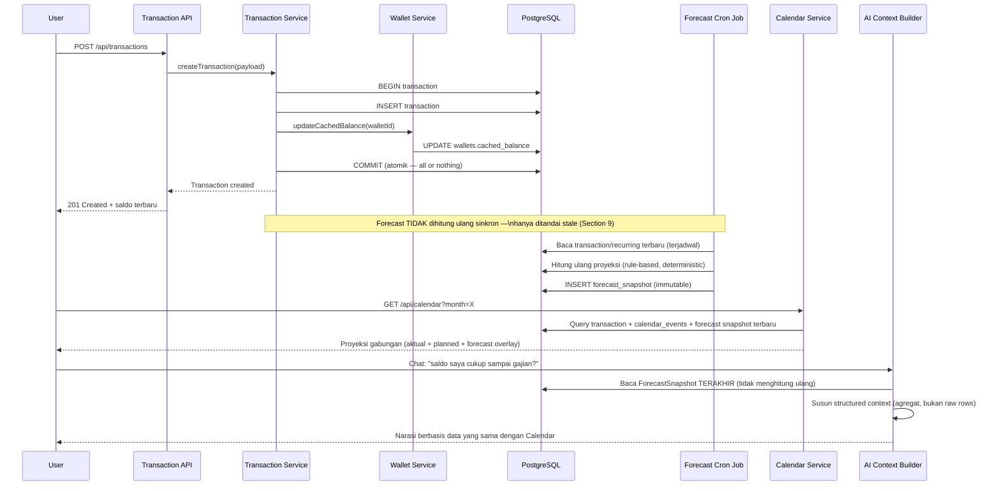
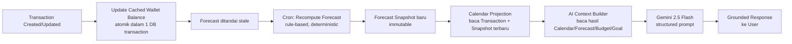
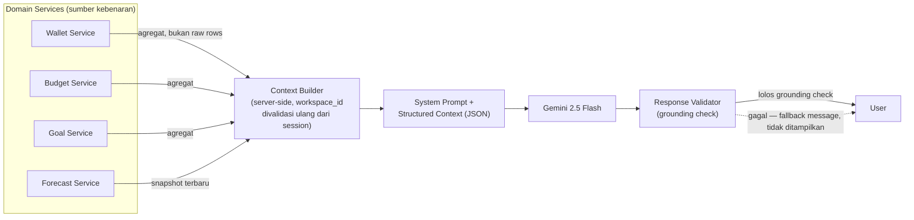

# 03. Architecture Decisions

**Document owner:** Engineering (Architecture)
**Status:** Approved baseline for MVP build
**Supersedes:** Bagian arsitektur/teknis yang bertentangan di `07. Database.md`, `13. AI.md`, `14. DevOps.md`, `15. Security.md` (dokumen-dokumen tersebut ditulis pada iterasi sebelum stack final ditetapkan — lihat catatan konflik di Section 5 dan 15)
**Rujukan utama:** `04. PRD.md`

---

# 1. Purpose

## Mengapa dokumen ini dibuat

Nuvio adalah aplikasi financial planning — kelas produk di mana kesalahan arsitektur tidak terlihat sebagai bug kosmetik, melainkan sebagai kepercayaan yang hancur ("kenapa saldo di Calendar beda dengan yang dikatakan AI?"). Keputusan arsitektur yang tidak didokumentasikan cenderung diulang-ulang perdebatannya, atau lebih buruk, diam-diam dilanggar oleh anggota tim baru yang tidak tahu konteksnya.

Dokumen ini adalah **Architecture Decision Record (ADR)** resmi Nuvio. Ia menjawab pertanyaan "apa yang kita pilih, kenapa, dan apa yang kita korbankan" — bukan "bagaimana cara menulis kodenya". Detail implementasi (skema kolom, endpoint API, komponen React) didokumentasikan terpisah di `07. Database.md`, `09. Backend.md`, `10. API.md`, `11. Frontend.md`.

## Peran terhadap proyek

* **Single source of truth** untuk keputusan teknologi dan arsitektur — dirujuk sebelum keputusan baru diambil, bukan ditulis setelah faktanya.
* **Onboarding cepat** untuk engineer baru: memahami *kenapa* sebelum membaca *bagaimana*.
* **Pagar terhadap scope creep arsitektur** — setiap usulan perubahan besar (mis. "pindah ke microservices", "ganti ke MongoDB") harus diuji terhadap trade-off yang sudah didokumentasikan di sini, bukan diputuskan ad-hoc di tengah sprint.
* **Referensi saat terjadi konflik** — jika dokumen teknis lain (Database, Backend, DevOps) tampak bertentangan dengan dokumen ini, dokumen ini yang menang, karena ia mengunci keputusan tingkat produk (Section 5 PRD) ke keputusan teknis.

---

# 2. Architecture Overview

## High Level Architecture

Nuvio adalah **modular monolith** tunggal yang berjalan sebagai satu proses Next.js di Vercel, dengan PostgreSQL (dihosting Supabase) sebagai satu-satunya sumber kebenaran data, dan Gemini 2.5 Flash sebagai layanan eksternal read-only yang dipanggil lewat lapisan abstraksi.



**Bacaan diagram:** hanya ada satu unit deploy (kotak Vercel). AI Module tidak pernah menyentuh PostgreSQL secara langsung — ia selalu lewat Domain Services yang sama dengan yang dipakai UI. Ini adalah representasi visual dari Product Principle #3 (AI bukan sumber kebenaran finansial).

## Request Flow

Alur permintaan generik dari browser hingga response, menunjukkan lapisan yang wajib dilalui setiap request finansial.



## Module Relationship



**Aturan dependency:** panah solid = dependency tulis/baca normal antar domain module. Panah putus-putus dari domain module ke AI Module selalu satu arah — AI *membaca* hasil domain, domain module **tidak pernah** memanggil balik AI Module. Ini mencegah AI menjadi bagian dari critical path perhitungan finansial.

---

# 3. Architecture Principles

Prinsip berikut diwarisi langsung dari Product Principles (`04. PRD.md` Section 5) dan diterjemahkan menjadi batasan teknis konkret.

| Prinsip | Kenapa Dipakai | Trade-off yang Diterima |
|---|---|---|
| **Simplicity over unnecessary complexity** | Tim 3 engineer, 32 hari kerja (TG-01). Setiap lapisan abstraksi tambahan adalah biaya yang harus dibayar tim kecil setiap hari. | Beberapa pola "enterprise-grade" (message queue, service mesh, event sourcing) sengaja tidak dipakai di MVP meski *mungkin* relevan di skala besar. |
| **Financial correctness over AI intelligence** | Salah menghitung saldo merusak kepercayaan lebih parah daripada AI yang kurang pintar. Financial correctness tidak bisa di-rollback secara reputasi. | AI Copilot dibatasi ketat (read-only, grounded) — tidak bisa "sepintar" produk AI generik yang punya kebebasan lebih besar. |
| **Modular before Microservices** | Modularisasi di level kode memberi hampir semua manfaat microservices (batas domain jelas, independent testing) tanpa biaya operasional deployment terdistribusi. | Semua modul deploy bersama — satu modul yang bermasalah (mis. bug di Forecast) berisiko memengaruhi deployment keseluruhan sampai di-rollback. Dimitigasi lewat CI/CD dan staging wajib (Section 14). |
| **Convention over Configuration** | Next.js App Router, Supabase, dan Zod semuanya punya konvensi kuat (file-based routing, RLS policy per tabel, schema-first) yang mengurangi keputusan berulang tim kecil. | Fleksibilitas struktur berkurang — tim harus mengikuti konvensi framework/platform, bukan pola bebas custom. |
| **API First** | REST API routes menjadi kontrak eksplisit antara frontend dan domain logic, bahkan meski keduanya di proses yang sama. Ini menyiapkan jalan migrasi ke client terpisah (mobile app) pasca-MVP tanpa menulis ulang backend. | Overhead serialisasi request/response dibanding pemanggilan fungsi langsung (mis. Server Actions) — diterima demi kejelasan kontrak dan testability. |
| **Security by Default** | Data finansial adalah data sensitif; kebocoran lintas-workspace adalah risiko tertinggi di seluruh sistem (Section 21 PRD). Setiap endpoint diasumsikan butuh otorisasi sampai terbukti sebaliknya. | Setiap route baru punya boilerplate wajib (auth check, membership check) — sedikit lebih verbose, tapi konsisten dan dapat diaudit. |
| **Performance by Design** | Target p95 di Section 17 PRD (Calendar < 1.5 detik, dsb) tidak tercapai kalau performa jadi renungan belakangan. | Beberapa keputusan (cached balance, forecast snapshot) menambah kompleksitas konsistensi data demi kecepatan baca. |
| **Readability over cleverness** | Tim kecil, timeline ketat — kode yang butuh waktu lama dipahami adalah risiko delivery, bukan kebanggaan teknis. | Beberapa optimisasi mikro sengaja tidak dilakukan kalau mengorbankan kejelasan. |
| **Strong Type Safety** | TypeScript end-to-end + Zod + tipe database yang di-generate (`supabase gen types`) memastikan kontrak data konsisten dari database sampai UI, krusial untuk domain finansial di mana tipe data yang salah (mis. float vs integer) adalah kelas bug paling mahal. | Waktu setup awal tipe/schema lebih lama dibanding kode dinamis tanpa tipe. |
| **Production Ready** | MVP tetap harus dapat dipakai user nyata (BG-01) — bukan prototype yang dibuang. | Beberapa keputusan "boring tapi solid" (Vercel, Supabase managed) dipilih atas opsi yang lebih trendi tapi lebih rapuh operasionalnya untuk tim kecil. |
| **MVP First** | 140 FR sudah menjadi batas scope yang disepakati (Section 20 PRD) — penambahan kompleksitas arsitektur di luar itu adalah bentuk lain dari scope creep. | Beberapa kebutuhan yang jelas akan datang (multi-currency, bank sync) sengaja tidak dirancang detail sekarang — hanya dijaga agar tidak menutup jalan (Section 17). |
| **Avoid Vendor Lock-in whenever reasonable** | Dependency ke satu vendor secara membabi buta menaikkan risiko bisnis (harga naik, layanan berhenti). | Diterapkan *proporsional*, bukan absolut — lihat Section 4 tentang kenapa Supabase tetap dipakai meski ada API-nya sendiri di luar PostgreSQL standar. |

---

# 4. Architecture Style

## Keputusan: Modular Monolith + Clean Architecture (DDD-lite)

**Context.** Tim terdiri dari 3 engineer, dengan target 32 hari kerja untuk mencapai MVP yang mencakup 16 fitur dan 140 Functional Requirement (Section 3, 6, 7 PRD). Domain finansial (Wallet, Transaction, Budget, Goal, Forecast) harus independen secara logis dari AI, karena AI harus bisa dihapus tanpa merusak fungsi inti (TG-02).

**Decision.** Nuvio dibangun sebagai **satu aplikasi Next.js (modular monolith)**, dengan kode diorganisasi per domain module mengikuti prinsip **Clean Architecture yang disederhanakan (DDD-lite)**: setiap modul punya lapisan domain (business rule murni), lapisan use case/service (orkestrasi), dan lapisan infrastruktur (Supabase client/data access, HTTP handler) — tanpa mengadopsi seluruh formalitas DDD (aggregate root murni, repository interface generik, event sourcing).

### Perbandingan dengan alternatif

| Aspek | **Modular Monolith + Clean-lite (dipilih)** | Layered Architecture (murni) | Microservices | Hexagonal (penuh) | MVC klasik |
|---|---|---|---|---|---|
| Cocok untuk tim 3 orang / 32 hari | Ya — satu repo, satu deploy, batas domain jelas tanpa overhead infra | Ya secara kompleksitas, tapi domain rules mudah bocor ke controller/DB layer | Tidak — overhead orkestrasi (network, service discovery, distributed transaction) tidak sepadan | Sebagian — port/adapter penuh menambah boilerplate yang tidak dibutuhkan skala MVP | Ya, tapi domain finansial rawan tercampur ke Controller |
| Isolasi domain (AI dapat dihapus tanpa merusak core) | Ya — AI Module terpisah, hanya membaca lewat interface domain | Lemah — layering biasanya per teknis (controller/service/repo), bukan per domain | Ya, tapi dengan biaya operasional besar untuk manfaat yang sama | Ya, secara desain paling eksplisit soal ini | Lemah |
| Biaya operasional (deploy, monitoring, koordinasi) | Rendah — satu unit deploy | Rendah | Tinggi — banyak service, butuh service mesh/API gateway, observability terdistribusi | Rendah (tetap monolith secara deployment) | Rendah |
| Jalan migrasi ke skala lebih besar pasca-MVP | Terbuka — modul dengan batas jelas bisa diekstrak jadi service terpisah kalau perlu (Section 22 PRD) | Sulit — refactor besar dibutuhkan karena batas domain tidak eksplisit | N/A (sudah microservices, tapi mahal sejak hari 1) | Terbuka, tapi biaya awal build sudah tinggi | Sulit |
| Risiko over-engineering untuk MVP | Rendah | Rendah | **Tinggi — inilah alasan utama ditolak** | Sedang — boilerplate port/adapter untuk kasus yang belum butuh | Rendah, tapi risiko domain leak tinggi |

### Kenapa alternatif ditolak

* **Layered Architecture murni** ditolak karena cenderung mengorganisasi kode berdasarkan *jenis teknis* (controllers/services/repositories) alih-alih *domain* (Wallet/Budget/Forecast). Ini membuat business rule finansial mudah bocor ke lapisan HTTP atau lapisan database — bertentangan langsung dengan Product Principle #1 (financial correctness) dan TG-02 (domain independen dari AI).
* **Microservices** ditolak eksplisit — bukan karena tidak "canggih", tapi karena biayanya (deployment terdistribusi, service discovery, distributed transaction untuk operasi atomik seperti Transfer) jauh melebihi manfaatnya untuk tim 3 orang dan basis user awal yang kecil. Section 22 PRD sudah mencatat titik pemicu migrasi ini secara eksplisit sebagai keputusan masa depan, bukan keputusan hari ini.
* **Hexagonal Architecture (penuh)** — dengan port/adapter generik untuk setiap dependency eksternal — ditolak sebagai *default* karena menambah lapisan abstraksi (interface untuk setiap repository, setiap external service) yang belum terbukti dibutuhkan. Namun, prinsip intinya **diterapkan secara selektif**: AI Provider Abstraction (Section 8) pada dasarnya adalah pola port/adapter, dipakai *khusus* di titik yang benar-benar butuh penggantian implementasi di masa depan (ganti provider LLM). Ini adalah aplikasi pragmatis, bukan penolakan total terhadap ide hexagonal.
* **MVC klasik** ditolak karena terlalu terikat ke paradigma request-response sederhana tanpa batas domain eksplisit — cocok untuk CRUD app sederhana, tidak cocok untuk sistem dengan business rule finansial kompleks (atomic balance, forecast determinism) yang harus terisolasi dan teruji sendiri.

**Pros (dipilih).**
- Batas domain jelas di level kode → AI dapat dihapus tanpa merusak fungsi inti (TG-02) secara langsung terwujud.
- Satu unit deploy → cocok dengan kapasitas tim dan filosofi DevOps MVP (`14. DevOps.md` 14.1).
- Jalan evolusi ke layanan terpisah tetap terbuka tanpa migrasi big-bang (Section 13).

**Cons (diterima sebagai trade-off).**
- Semua modul berbagi runtime dan resource yang sama — modul yang boros resource (mis. Forecast recompute besar) bisa memengaruhi latency modul lain dalam proses yang sama. Dimitigasi lewat background job asinkron (Section 9).
- Tidak ada isolasi kegagalan sekuat microservices — kegagalan tak terduga di satu modul berpotensi memengaruhi proses keseluruhan. Dimitigasi lewat error boundary per domain service dan validasi ketat di setiap lapisan.

**Consequences.**
- Struktur folder wajib per-domain (`wallet/`, `transaction/`, `budget/`, `goal/`, `forecast/`, `calendar/`, `ai/`, dst), bukan per-jenis-teknis.
- Setiap domain service mengekspos interface yang dipanggil AI Module — AI tidak pernah query database langsung (Section 8).
- Review kode wajib menolak PR yang menaruh business rule finansial di API route handler atau di komponen React.

---

# 5. Technology Decisions

> **Catatan penyelarasan stack.** Dokumen `07. Database.md`, `13. AI.md`, `14. DevOps.md`, dan `15. Security.md` ditulis pada iterasi draft yang menyebut NextAuth.js, bcrypt credentials provider, dan Claude API sebagai stack auth/AI. Baseline final produk (bagian **TECH STACK** dari brief ini, konsisten dengan `04. PRD.md` Section 6.1, 6.13, dan 16) menetapkan **Supabase Auth**, **Gemini 2.5 Flash**, dan **Supabase Client + RLS tanpa ORM** (keputusan Data Access di bawah, menggantikan keputusan Prisma awal). Dokumen ini mengikat keputusan final tersebut sebagai satu-satunya sumber kebenaran; dokumen teknis lain wajib direvisi mengikuti ADR ini, bukan sebaliknya.

## Next.js (App Router)

- **Why:** Satu framework untuk frontend (React Server/Client Components) dan backend (API Routes) sekaligus, konsisten dengan keputusan modular monolith (Section 4). Zero-config deployment ke Vercel dari vendor yang sama menyederhanakan pipeline untuk tim kecil.
- **Alternatives considered:** Remix (App Router setara secara filosofi tapi ekosistem lebih kecil di titik ini), Express/Fastify + SPA React terpisah (memisahkan frontend/backend menjadi dua deployment unit — bertentangan dengan Section 4).
- **Trade-offs:** App Router masih relatif baru dibanding Pages Router — sebagian pola (streaming, server actions) punya kurva belajar. React Server Components menambah kompleksitas mental model client vs server boundary.
- **Consequences:** Seluruh routing UI dan API mengikuti konvensi file-based Next.js; tim wajib disiplin memisahkan Server Component (data-heavy) dari Client Component (interaktif) agar performa (Section 12) tercapai.

## TypeScript

- **Why:** Strong Type Safety adalah prinsip eksplisit (Section 3). Untuk domain finansial, tipe yang salah (mis. `number` yang menerima float untuk uang) adalah kelas bug paling mahal untuk diperbaiki setelah data production terlanjur masuk (`07. Database.md` 7.4 poin 3).
- **Alternatives considered:** JavaScript murni + JSDoc (type-checking lebih lemah, gagal mencegah kesalahan tipe integer minor unit secara statis).
- **Trade-offs:** Overhead penulisan tipe eksplisit, waktu compile tambahan.
- **Consequences:** Tipe uang direpresentasikan sebagai `bigint`/`number` integer minor unit dengan branded type (mis. `type MinorUnitAmount = number & { __brand: 'MinorUnit' }`) untuk mencegah pencampuran tidak sengaja dengan angka non-uang di level compiler — bukan sekadar konvensi penamaan.

## PostgreSQL

- **Why:** Data Nuvio sangat relasional (Workspace → Wallet → Transaction → Budget/Goal/Forecast, dengan banyak foreign key dan constraint unik lintas tabel). Integritas referensial dan transaksi ACID adalah kebutuhan keras untuk operasi atomik (Transfer, Goal contribution) yang tidak boleh menghasilkan state antara yang tidak konsisten (Product Principle #5).
- **Alternatives considered:** MongoDB (dokumen — lemah pada constraint relasional dan transaksi multi-collection yang kompleks untuk kasus seperti Transfer atomik), Firebase/Firestore (model data non-relasional, kesulitan query agregasi kompleks untuk Forecast dan Budget realization).
- **Trade-offs:** Skema kaku (schema-on-write) berarti perubahan struktur data butuh migrasi eksplisit — lebih lambat untuk iterasi awal dibanding skema fleksibel NoSQL, tapi ini justru diinginkan untuk domain finansial (lihat `07. Database.md` 7.4).
- **Consequences:** Semua entitas finansial disimpan sebagai baris relasional dengan foreign key eksplisit; query kompleks (agregasi Forecast, Budget realization) memakai kemampuan SQL native (window function, aggregate) alih-alih logic aplikasi yang menarik seluruh baris ke memori.

## Data Access: Supabase Client + RLS (Tanpa ORM)

- **Why:** Akses data finansial dijalankan lewat **Supabase Client / Server Client** yang membawa session token user, sehingga `auth.uid()` di dalam policy **Row Level Security (RLS)** terisi otomatis dan RLS menjadi kontrol akses baris yang aktif di setiap query (FR-014a, Product Principle #11). RLS adalah lapisan isolasi data yang *tidak bisa dilupakan* oleh query — jaring pengaman yang lebih kuat daripada disiplin filter manual. Skema dikelola dengan **SQL migration via Supabase CLI** (`supabase migration new` / `db diff` / `db push`), dan tipe TypeScript di-generate dari skema database (`supabase gen types`) sehingga Strong Type Safety (Section 3) tetap terjaga tanpa lapisan ORM. Operasi finansial atomik multi-entitas (Transaction + cached balance, Transfer dua sisi) dijalankan sebagai **Postgres function** yang dipanggil via **RPC** — Supabase client tidak mendukung multi-statement transaction, sehingga atomisitas dijamin di dalam database itu sendiri (Product Principle #5).
- **Alternatives considered:** Prisma ORM (keputusan lama — ditolak sebagai primary data access karena koneksi via service role di jalur user mematikan RLS dan mereduksi keamanan ke satu lapisan; pemakaian service role menjadi kebiasaan yang sulit dicegah), Drizzle ORM / Kysely (alternatif ringan, tapi sama-sama membawa masalah RLS di jalur user dan menambah lapisan yang tidak diperlukan), raw SQL query builder tanpa RLS (kehilangan isolasi baris otomatis).
- **Trade-offs:** Query di level service layer menjadi sedikit lebih verbose (chain Supabase client) dan sebagian logika bisnis berpindah ke database (Postgres function untuk operasi atomik) — diterima karena keamanan multi-tenant dan atomisitas lebih penting daripada keringkasan kode untuk aplikasi finansial.
- **Consequences:** Setiap perubahan skema wajib lewat file migrasi SQL Supabase CLI yang menyertakan DDL + enable RLS + policy dalam migrasi yang sama (`07. Database.md` 7.8); service role **hanya** dipakai background job/admin dengan scoping `workspace_id` manual (Section 11); tidak ada ORM di codebase; AI Module tidak pernah menyentuh client database dalam bentuk apa pun (Section 8).

## Supabase Auth

- **Why:** Registrasi/login (email-password) adalah kebutuhan komoditas, bukan pembeda produk (Section 6.1 PRD). Membangun sistem auth kustom (hashing password, session management, reset password flow) menambah permukaan kerentanan keamanan yang tidak sepadan untuk tim kecil, mengingat data yang dilindungi adalah data finansial (Section 21 Risk PRD). Supabase Auth terintegrasi langsung dengan PostgreSQL yang sama (Supabase mengelola database di belakangnya), menghindari sinkronisasi user store terpisah.
- **Alternatives considered:** NextAuth.js/Auth.js dengan Credentials provider kustom (didokumentasikan sebagai draft awal di `15. Security.md` — ditolak di keputusan final karena berarti tim tetap bertanggung jawab penuh atas password hashing, session store, dan seluruh alur reset password sendiri), Clerk (fitur auth lebih kaya tapi vendor terpisah dari database — menambah titik integrasi dan biaya berlangganan tanpa manfaat proporsional untuk MVP; lihat Section 15).
- **Trade-offs:** Ketergantungan pada satu vendor untuk identity — mitigasi lewat prinsip "avoid vendor lock-in whenever reasonable" diterapkan proporsional: session tetap divalidasi lewat interface internal (`requireAuth()`-style helper) sehingga penggantian provider auth di masa depan tidak menyebar ke seluruh codebase.
- **Consequences:** Aplikasi tidak pernah menyimpan password dalam bentuk apa pun (Section 16 PRD) — seluruh siklus hidup kredensial didelegasikan ke Supabase Auth; hanya session token (JWT) yang divalidasi di setiap request API.

## Supabase Storage

- **Why:** Kebutuhan penyimpanan file (mis. avatar profil) minor dan tidak butuh CDN/infrastruktur kustom. Menggunakan penyedia yang sama dengan Auth dan Database mengurangi jumlah vendor yang harus dikelola dan dikonfigurasi kredensialnya (selaras dengan Simplicity over unnecessary complexity).
- **Alternatives considered:** AWS S3 langsung (kontrol lebih granular, tapi menambah satu vendor dan satu set kredensial terpisah untuk kebutuhan yang sangat minor di MVP), Vercel Blob (terikat vendor deployment, mengurangi manfaat multi-provider tapi menambah satu ketergantungan lagi ke Vercel).
- **Trade-offs:** Fitur storage Supabase lebih sederhana dibanding S3 penuh (versioning, lifecycle policy terbatas) — diterima karena kebutuhan MVP memang minor.
- **Consequences:** Akses file storage tunduk pada Row Level Security policy Supabase yang selaras dengan workspace isolation (Section 11).

## Vercel

- **Why:** Zero-config deployment untuk Next.js dari vendor yang membuat frameworknya sendiri — preview deployment otomatis per PR, built-in Cron untuk background job MVP (Section 9), tanpa perlu mengelola container/orchestration sendiri untuk tim tanpa dedicated DevOps (`14. DevOps.md` 14.3).
- **Alternatives considered:** Self-hosted (Docker + VPS/Kubernetes) — kontrol penuh tapi menambah beban operasional signifikan (patching, scaling, monitoring infrastruktur) yang tidak proporsional untuk tim 3 orang; Railway/Render — alternatif managed platform yang viable, tapi integrasi Next.js-native (ISR, Edge Middleware, preview URL) tidak sekuat Vercel.
- **Trade-offs:** Vercel Cron memiliki batas eksekusi durasi dan jumlah job di tier tertentu — cukup untuk 2 job MVP (Section 9), tapi menjadi kandidat migrasi ke job queue penuh saat skala bertambah (Section 13, Section 22 PRD).
- **Consequences:** Build command tidak menjalankan migrasi otomatis (Supabase CLI migration di-apply dari CI ke staging dulu, diverifikasi, baru production — `14. DevOps.md` 14.6); tidak ada perubahan skema manual di database manapun.

## Zod

- **Why:** Validasi skema runtime yang type-safe, dipakai sebagai gerbang wajib untuk seluruh payload API sebelum masuk domain service (Section 13 PRD) — tidak ada endpoint yang percaya buta pada payload client (`08. System Design.md` 8.1).
- **Alternatives considered:** Yup (API lebih tua, inferensi tipe TypeScript lebih lemah), class-validator dengan decorator (cocok untuk pola OOP/NestJS, kurang idiomatis untuk pola functional Next.js API routes yang dipakai Nuvio), validasi manual custom (rawan human error, tidak reusable, tidak menghasilkan tipe otomatis).
- **Trade-offs:** Skema validasi harus dijaga sinkron dengan tipe database (di-generate via `supabase gen types`) secara manual — diterima sebagai biaya kecil demi kontrol eksplisit atas apa yang diterima dari client (mass assignment protection, `15. Security.md` 15.4).
- **Consequences:** Setiap field yang diizinkan dari client didefinisikan eksplisit di schema Zod; field tak terduga dalam payload otomatis ditolak, bukan diteruskan mentah ke database.

## Pino

- **Why:** Structured logging berperforma tinggi (JSON log by default) yang esensial untuk debugging aplikasi finansial di production tanpa overhead APM penuh (selaras dengan filosofi MVP DevOps — "cukup logging dasar", `08. System Design.md` 8.4). Format JSON memudahkan query/filter log berdasarkan `workspaceId`, `event`, `userId` saat investigasi insiden.
- **Alternatives considered:** `console.log` polos (tidak terstruktur, sulit di-query, rawan menaruh data sensitif tanpa disadari), Winston (lebih berat, fitur transport tambahan yang tidak dibutuhkan MVP di atas platform serverless Vercel).
- **Trade-offs:** Pino sendiri hanya menangani logging, bukan error tracking/alerting — untuk itu tetap dibutuhkan layanan terpisah (lihat catatan di Section 12 Performance dan Section 17 DevOps existing yang menyebut Sentry sebagai pelengkap, bukan pengganti).
- **Consequences:** Setiap log wajib redaksi field sensitif (password hash, token, PII yang tidak perlu) sebelum ditulis — kebijakan redaksi didefinisikan sebagai middleware logging global, bukan diserahkan ke tiap developer untuk diingat manual.

## Gemini 2.5 Flash

- **Why:** Dibahas mendalam di Section 8. Ringkas: model cepat dan murah yang cukup untuk tugas AI Copilot Nuvio (narasi atas data yang sudah dihitung, bukan reasoning finansial kompleks), dengan dukungan structured output (JSON mode) yang krusial untuk grounding (Section 8).
- **Alternatives considered:** Lihat Section 8 dan Section 15 (Rejected Alternatives — OpenAI sebagai provider utama).
- **Trade-offs:** Ekosistem tooling Gemini untuk Node.js/TypeScript sedikit kurang matang dibanding OpenAI SDK — dimitigasi lewat AI Provider Abstraction (Section 8) yang mengisolasi detail SDK dari domain logic.
- **Consequences:** Seluruh pemanggilan Gemini melalui satu interface internal (`AIProvider`), tidak pernah dipanggil langsung dari route handler atau domain service manapun.

---

# 6. Module Architecture

## Pembagian Modul

| Modul | Tanggung Jawab | Bergantung pada |
|---|---|---|
| **Auth** | Autentikasi (Supabase Auth), validasi session di setiap request | — (modul paling dasar) |
| **Workspace** | Root entity isolasi data; membership; role admin/member | Auth |
| **Wallet** | Sumber dana, cached balance, rekonsiliasi ledger | Workspace |
| **Category** | Label pengelompokan Transaction/Budget | Workspace |
| **Transaction** | Ledger transaksi (planned/completed), Transfer, Recurring occurrence | Wallet, Category |
| **Budget** | Batas pengeluaran bulanan per kategori, realisasi | Category, Transaction |
| **Goal** | Target finansial, kontribusi terhubung Transaction | Workspace, Transaction |
| **Forecast** | Proyeksi saldo deterministik, snapshot | Wallet, Transaction |
| **Calendar** | Proyeksi read-only seluruh aktivitas finansial dalam satu timeline | Transaction, Budget, Goal, Forecast |
| **AI** | Context Builder + Provider Abstraction untuk AI Copilot (read-only) | Wallet, Budget, Goal, Forecast, Calendar (baca saja) |
| **Notification** | Deteksi trigger (threshold Budget, sinyal Forecast negatif, jatuh tempo) | Budget, Forecast, Transaction |

## Dependency antar Modul

Diagram dependency lengkap ada di Section 2 (Module Relationship). Aturan tambahan yang mengikat:

1. **Dependency selalu satu arah, tidak ada siklus.** Wallet tidak pernah bergantung ke Budget; Forecast tidak pernah bergantung ke Calendar (arahnya kebalikannya).
2. **Calendar tidak pernah menjadi sumber data baru** (Business Rule Section 6.8 PRD) — secara arsitektural ini berarti Calendar Module hanya boleh melakukan *read* dan *compose* dari modul lain, tidak pernah menyimpan state finansial orisinal miliknya sendiri (kecuali entri hasil pre-generate seperti `calendar_events` yang statusnya adalah proyeksi tersimpan, bukan sumber kebenaran baru).
3. **AI Module adalah daun (leaf) di graf dependency** — tidak ada modul lain yang bergantung padanya. Ini adalah realisasi arsitektural langsung dari TG-02 (AI dapat dihapus tanpa merusak fungsi inti): menghapus folder `ai/` secara teori tidak akan menyebabkan modul lain gagal compile atau berjalan.
4. **Notification adalah observer, bukan aktor.** Ia mendeteksi kondisi dari modul lain tapi tidak pernah memicu balik aksi domain (Business Rule Section 6.12 — "tidak pernah memicu aksi otomatis").

---

# 7. Data Flow

## Alur Utama: Create Transaction → Calendar → AI Context



**Poin kritis alur ini** (selaras `08. System Design.md` 8.3): saldo Wallet dan Transaction selalu atomik dalam satu database transaction (langkah 3-4). Forecast **sengaja tidak** dihitung ulang secara sinkron pada create Transaction — ini keputusan performa eksplisit (Section 9). AI Context Builder membaca `ForecastSnapshot` yang sama dengan yang dipakai Calendar, bukan menghitung ulang sendiri — inilah yang mencegah dua sumber angka yang saling kontradiksi.

## Alur Data Level Modul



---

# 8. AI Architecture Decisions

## Mengapa Gemini 2.5 Flash

**Context.** AI Copilot Nuvio bertugas *menarasikan* data yang sudah final (Product Principle #3), bukan melakukan reasoning finansial kompleks atau multi-step agentic planning. Volume request rendah-menengah (1-10 per user per hari, Section 17 PRD) dengan sensitivitas biaya tinggi karena AI bukan fitur inti berbayar di MVP (Plan Gating masih skeleton, Section 6.16).

**Decision.** Gemini 2.5 Flash dipilih sebagai model utama.

**Alternatives considered:** GPT-4o-mini/GPT-4.1-mini (kualitas setara, harga kompetitif, tapi menambah dependency ke ekosistem OpenAI tanpa keunggulan berarti untuk kasus penggunaan narasi terstruktur ini), Claude Haiku (opsi valid lain di kelas biaya rendah — draft awal proyek bahkan sempat memakai Claude, lihat catatan penyelarasan di Section 5; ditolak di keputusan final demi konsolidasi biaya dan tooling di sekitar Gemini), model open-source self-hosted (Llama, Mistral — menambah beban operasional hosting inference yang tidak proporsional untuk tim 3 orang, bertentangan dengan Simplicity principle).

**Pros:** Latency rendah cocok untuk UX chat (target < 4 detik p95, Section 17 PRD); harga per-token rendah cocok untuk volume rendah-menengah dengan rate limit ketat (20 pesan/jam/user); mendukung structured output (JSON mode) native yang krusial untuk grounding (lihat di bawah).

**Cons:** Kapabilitas reasoning lebih rendah dibanding model flagship — diterima karena AI Copilot memang sengaja dibatasi tugasnya (narasi, bukan kalkulasi/reasoning kompleks).

**Consequences:** Prompt harus lebih eksplisit dan terstruktur (system prompt ketat, lihat pola di `13. AI.md` 13.4) untuk mengompensasi kapabilitas reasoning yang lebih ringan dibanding model flagship.

## Mengapa AI Provider Abstraction

**Context.** Ketergantungan langsung pada satu SDK vendor LLM menyebar ke seluruh codebase menyulitkan penggantian provider di masa depan (evaluasi biaya, kebutuhan fallback keandalan — Section 22 PRD).

**Decision.** Seluruh pemanggilan LLM melewati satu interface internal:

```typescript
interface AIProvider {
  generateStructuredResponse(params: {
    systemPrompt: string;
    context: FinancialContext;
    userMessage: string;
    history: ChatTurn[];
  }): Promise<{ narrative: string; sourceReferences: SourceRef[] }>;
}
```

Implementasi konkret (`GeminiProvider`) adalah satu-satunya tempat yang mengetahui detail SDK Gemini.

**Alternatives considered:** Memanggil SDK Gemini langsung dari route handler (lebih sedikit kode di awal, tapi mengunci seluruh sistem ke satu vendor secara implisit di banyak tempat — bertentangan dengan Avoid Vendor Lock-in whenever reasonable).

**Trade-offs:** Satu lapisan indirection tambahan yang harus dipahami tim — diterima karena biayanya kecil (satu interface, satu implementasi) dibanding manfaat opsionalitas masa depan.

**Consequences:** Penggantian atau penambahan provider (mis. fallback ke provider lain saat outage) hanya butuh implementasi baru dari interface ini, tanpa menyentuh Context Builder, prompt template, atau UI Chat.

## Mengapa Context Builder

**Context.** Mengirim raw transaction rows ke LLM setiap request menyebabkan tiga masalah nyata: biaya token naik linear seiring data bertambah (bisa 10-50x lebih mahal setelah beberapa bulan data), latency tinggi merusak UX chat, dan risiko halusinasi meningkat karena model kebanjiran noise data yang tidak relevan (`13. AI.md` 13.3).

**Decision.** Context Builder adalah komponen **server-side murni** yang mengagregasi data dari Wallet/Budget/Goal/Forecast/Calendar Service menjadi ringkasan terstruktur (JSON) sebelum dikirim sebagai bagian dari prompt.



**Alternatives considered:** Mengirim raw data lengkap dan mengandalkan model untuk mengagregasi sendiri (ditolak — mahal, lambat, rawan halusinasi seperti dijelaskan di atas), agregasi di client sebelum dikirim (ditolak keras — `workspace_id` dan data agregat dari client tidak bisa dipercaya tanpa validasi ulang server-side, membuka celah kebocoran data lintas-Workspace).

**Consequences:** Context Builder wajib memvalidasi ulang `workspace_id` dari session server-side, tidak pernah mempercayai `workspace_id` yang ikut terkirim dalam payload chat dari client (selaras FR-123).

## Mengapa AI Read Only

**Context.** Product Principle #8 (AI hanya membaca data) adalah batasan yang tidak bisa dikompromikan — bukan keputusan teknis biasa, tapi keputusan kepercayaan produk.

**Decision.** AI Module secara arsitektural **tidak memiliki jalur** untuk memanggil operasi tulis (create/update/delete) di modul manapun. Tidak ada tool-calling yang diberikan ke model yang dapat memperluas akses ini (`13. AI.md` prompt injection protection).

**Trade-offs:** User tidak bisa "cukup bilang ke AI" untuk membuat transaksi/budget — harus tetap lewat UI form. Ini secara sadar diterima demi mencegah kelas risiko yang jauh lebih mahal: AI salah mengeksekusi write action finansial berdasarkan kesalahpahaman natural language.

**Consequences:** Review kode menolak PR apa pun yang memberi AI Module akses ke client database (Supabase) langsung, atau ke domain service method yang bersifat mutasi (`create*`, `update*`, `delete*`).

## Mengapa Structured Output

**Context.** Narasi bebas tanpa struktur sulit diverifikasi secara otomatis — tidak ada cara memastikan setiap angka yang disebut benar-benar berasal dari data yang valid.

**Decision.** Respons LLM diminta dalam format JSON terstruktur berisi `narrative` (teks untuk user) dan `sourceReferences` (daftar entitas/ID yang menjadi dasar klaim — mis. `budget_id`, `forecast_snapshot_id`).

**Consequences:** Memungkinkan validasi grounding otomatis (lihat di bawah) sebelum respons ditampilkan — tanpa structured output, validasi ini harus dilakukan lewat parsing teks bebas yang jauh lebih rapuh.

## Mengapa Grounding

**Context.** Product Principle #3 dan FR-124 mensyaratkan setiap angka finansial dalam respons AI dapat ditelusuri ke domain service yang sama dengan UI biasa.

**Decision.** Setiap respons AI melewati validasi server-side sebelum dikirim ke client: ekstrak seluruh angka yang disebut dalam narasi, bandingkan dengan angka yang benar-benar ada di `FinancialContext` yang dikirim ke model. Jika ditemukan angka yang tidak cocok (`hasHallucinatedNumbers = true`), respons **tidak dikirim** ke user — diganti fallback message dan dicatat untuk review manual (`13. AI.md` 13.7).

**Trade-offs:** Menambah satu langkah pemrosesan (dan latency kecil) sebelum respons sampai ke user. Diterima karena biaya kepercayaan user yang rusak jauh lebih besar daripada biaya latency tambahan.

## Mengapa AI Tidak Mengakses Database Secara Langsung

**Context.** Jika AI Module diberi akses langsung ke database (PostgreSQL via Supabase client), dua risiko muncul: (1) AI berpotensi menghitung sendiri angka yang seharusnya berasal dari domain service (melanggar Product Principle #3), dan (2) permukaan serangan bertambah — bug di query yang dipanggil AI Module bisa membuka celah kebocoran data lintas-Workspace tanpa melewati lapisan otorisasi domain yang sudah teruji.

**Decision.** AI Module **hanya** boleh memanggil method publik dari domain service (Wallet, Budget, Goal, Forecast, Calendar Service) — service yang sama yang dipanggil API route biasa. Tidak ada client database (Supabase) yang diimpor di folder `ai/`.

**Consequences:** Setiap kemampuan baru yang dibutuhkan AI Copilot (mis. data tambahan untuk kapabilitas baru) harus diekspos lewat method domain service baru yang juga bisa dipakai UI biasa — bukan query ad-hoc khusus AI. Ini menjamin AI dan UI selalu melihat data yang identik.

---

# 9. Forecast Decisions

## Snapshot

**Context.** Forecast adalah proyeksi ke depan yang mahal dihitung (agregasi banyak sumber: saldo, recurring bill, histori rata-rata) dan tidak perlu akurat hingga milidetik terakhir — user melihatnya sebagai sinyal arah, bukan angka real-time detik-per-detik.

**Decision.** Forecast dihitung oleh background job dan disimpan sebagai **snapshot immutable** (`forecast_snapshots` + `forecast_entries`), bukan dihitung ulang setiap kali di-render.

**Alternatives considered:** Hitung on-the-fly setiap request Calendar dibuka (ditolak — biaya komputasi berulang untuk data yang jarang berubah drastis dalam hitungan menit, dan berisiko melebihi target performa Calendar load < 1.5 detik p95 saat Workspace punya data padat).

**Trade-offs:** Snapshot bisa "sedikit basi" antara satu recompute dan recompute berikutnya (mis. user menambah transaksi besar tapi forecast belum ter-update sampai cron berikutnya berjalan). Dimitigasi dengan opsi recompute manual yang dibatasi rate limit (Section 6.11 PRD).

**Consequences:** UI harus menampilkan indikasi kapan snapshot terakhir dihitung, agar user tidak salah kira forecast selalu real-time.

## Background Recompute

**Context.** Menghitung ulang forecast secara sinkron pada setiap create/update Transaction akan memperlambat operasi yang seharusnya cepat (target Transaction create < 800ms p95) dan tidak proporsional — forecast tidak butuh presisi real-time-critical (Section 6.11 PRD, `08. System Design.md` 8.3 poin 4).

**Decision.** Transaction hanya menandai Forecast sebagai *stale*; recompute penuh terjadi lewat cron job terjadwal harian, dijalankan setelah recurring generator (Job 1) selesai agar occurrence terbaru sudah tersedia sebagai input (`14. DevOps.md` 14.7).

**Trade-offs:** Ada jeda antara transaksi besar dicatat dan forecast mencerminkannya sepenuhnya (hingga siklus cron berikutnya). Diterima karena forecast secara desain adalah sinyal arah 30-60 hari, bukan indikator real-time.

**Consequences:** Kandidat migrasi ke job queue (BullMQ+Redis) dengan trigger event-driven adalah titik evolusi eksplisit pasca-MVP saat skala user bertambah signifikan (Section 13, Section 22 PRD) — dicatat di sini supaya keputusan cron bukan dianggap kelalaian di kemudian hari.

## Deterministic Engine

**Context.** Product Principle #7: diberi input yang sama, Forecast harus menghasilkan output yang sama — ini yang membedakan Forecast MVP dari model machine learning probabilistik.

**Decision.** Forecast dihitung dengan formula rule-based murni:

```
forecastBalance(date) =
  currentBalance
  + Σ scheduledIncome(date)      // fakta + asumsi terjadwal
  - Σ scheduledBills(date)       // asumsi dari recurring
  - avgDailyNonRecurringExpense × daysFromNow(date)   // estimasi historis
```

Setiap entry membedakan tiga jenis data secara eksplisit: **fakta** (Transaction completed), **asumsi** (Transaction planned/recurring occurrence terjadwal), **estimasi** (rata-rata historis ~30 hari, Section 6.11 PRD).

**Alternatives considered:** Model machine learning time-series (LSTM, Prophet, dst) — ditolak eksplisit karena sifat probabilistiknya bertentangan langsung dengan Product Principle #7, dan karena membangun/melatih model ML yang andal untuk data finansial personal dengan volume rendah per user tidak realistis dalam 32 hari (over-engineering untuk MVP).

**Pros:** Dapat dijelaskan sepenuhnya ke user ("kenapa forecast bilang begini") — krusial untuk grounding AI (Section 8) yang menarasikan hasilnya. Mudah diuji dengan unit test deterministik (input tetap → output tetap).

**Cons:** Akurasi lebih rendah dibanding model prediktif canggih untuk pola pengeluaran yang kompleks/musiman — diterima karena MVP memprioritaskan *explainability* dan *trust* di atas akurasi statistik maksimal.

**Consequences:** Cold-start user (belum ada histori) menghasilkan `avgDailyNonRecurringExpense = 0`, bukan error — UI wajib menampilkan disclaimer eksplisit "proyeksi terbatas" (Section 6.11 PRD Edge Case).

---

# 10. Calendar Decisions

## Calendar sebagai Projection, Bukan Source of Truth

**Context.** Product Principle #2: Calendar adalah pusat aplikasi secara *pengalaman user*, tapi ini tidak boleh disalahartikan sebagai Calendar menjadi tempat data finansial disimpan orisinal.

**Decision.** Calendar Module hanya melakukan *read* dan *compose* dari Transaction, Recurring occurrence, Goal milestone, dan Forecast snapshot. Tidak ada mutasi finansial yang ditulis langsung ke tabel `calendar_events` sebagai sumber kebenaran baru.

**Trade-offs:** Setiap render Calendar butuh join/agregasi dari beberapa modul — sedikit lebih kompleks dibanding satu tabel datar, tapi mencegah duplikasi sumber kebenaran yang jauh lebih berbahaya (dua tempat yang bisa saling kontradiksi soal "apakah transaksi ini benar-benar terjadi").

**Consequences:** Bug pada data finansial selalu diperbaiki di modul aslinya (Transaction, Recurring, Goal) — Calendar otomatis benar begitu sumbernya benar, tanpa perlu sinkronisasi manual.

## Pregenerated Recurring

**Context.** Menghitung occurrence recurring bill on-the-fly setiap render Calendar (mis. "hitung semua tanggal jatuh tempo bulan ini dari rule") menambah biaya komputasi berulang untuk data yang sebenarnya statis begitu rule ditetapkan.

**Decision.** Occurrence dari Recurring Rule di-*pre-generate* oleh background job harian untuk 60 hari ke depan, disimpan sebagai baris `planned` Transaction dan entri `calendar_events` — bukan dihitung ulang setiap request.

**Trade-offs:** Perubahan Recurring Rule tidak langsung terlihat di Calendar — butuh regenerasi (dipicu langsung saat rule diubah, bukan menunggu cron harian berikutnya, sesuai Section 6.7 PRD Alternative Flow).

**Consequences:** Job generator wajib idempotent (unique constraint `(recurringRuleId, dueDate)`) untuk mencegah duplikasi occurrence akibat retry (Risk table Section 21 PRD) — ini bukan best-effort, tapi jaminan di level database constraint, bukan hanya logic aplikasi.

---

# 11. Security Decisions

## Workspace Isolation

**Context.** Ini adalah kontrol keamanan paling kritis di seluruh sistem (Section 21 Risk PRD, `15. Security.md` 15.3) — kebocoran data lintas-Workspace punya probabilitas medium dan impact "sangat tinggi".

**Decision.** Setiap query database yang menyentuh data finansial wajib menyertakan filter `workspace_id` yang divalidasi lewat membership check server-side — tidak ada pengecualian "hanya baca", tidak ada asumsi implisit bahwa user hanya akan mengakses data miliknya sendiri. Pola wajib: `authenticated user → requested workspace → membership validation → role validation (jika relevan) → domain action`.

**Consequences:** Larangan eksplisit terhadap query entity-by-ID tanpa filter Workspace, terhadap mengandalkan visibility frontend sebagai satu-satunya lapisan otorisasi, dan terhadap pesan error yang mengonfirmasi keberadaan entity di Workspace lain (mencegah IDOR).

## JWT Session melalui Supabase Auth

**Context.** Dijelaskan di Section 5 (kenapa Supabase Auth dipilih). Dari sisi keamanan spesifik: session harus tervalidasi di setiap request tanpa membangun infrastruktur session store kustom.

**Decision.** Session token dari Supabase Auth (JWT) divalidasi di setiap request API yang memerlukan autentikasi, disimpan di HttpOnly cookie (bukan localStorage) untuk mengurangi risiko pencurian token lewat XSS.

**Consequences:** Sesi kedaluwarsa memicu redirect otomatis ke login (FR-008) tanpa mengungkap detail teknis ke user.

## Rate Limiting

**Context.** Dua permukaan risiko berbeda: brute-force login, dan biaya AI Copilot yang bisa membengkak tanpa batas (Section 21 Risk PRD).

**Decision.** Rate limit diberlakukan per endpoint dengan window dan identifier berbeda: endpoint auth dibatasi per IP, endpoint AI Copilot dibatasi per `userId` (20 pesan/jam), endpoint mutasi data finansial dibatasi per `workspaceId` untuk mencegah abuse skala kecil.

**Trade-offs:** Implementasi in-memory rate limiter cukup untuk MVP single-instance, tapi tidak akurat lintas multiple serverless instance secara bersamaan — dicatat sebagai keterbatasan yang diterima untuk MVP, kandidat upgrade ke store terpusat (Vercel KV/Redis) jika traffic bertambah.

## Soft Delete

**Context.** Product Principle terkait audit trail: data finansial yang "dihapus" user tetap harus bisa direkonstruksi untuk investigasi/rekonsiliasi, dan penghapusan permanen entitas yang sudah punya relasi (mis. Wallet dengan histori transaksi) berisiko merusak integritas historis.

**Decision.** Wallet, Category, dan Transaction menggunakan soft delete (`archived`/soft-delete flag), bukan `DELETE` fisik.

**Trade-offs:** Query harus selalu menyertakan filter status aktif (menambah satu kondisi WHERE di hampir semua query) — diterima sebagai biaya kecil dan konsisten, dengan indexing yang disesuaikan (`07. Database.md` 7.3).

**Consequences:** Tidak ada mekanisme "hapus permanen" data finansial yang sudah punya histori di MVP — kebijakan retensi/purge data lama didefinisikan terpisah pasca-MVP jika dibutuhkan kepatuhan tertentu.

## Input Validation

**Context.** Dijelaskan di Section 5 (Zod). Dari sisi keamanan: mass assignment dan injection adalah dua risiko konkret untuk API yang menerima payload JSON bebas.

**Decision.** Empat lapisan validasi berjenjang (Section 13 PRD): frontend (UX cepat, bukan batas keamanan) → Zod schema (bentuk/tipe payload) → domain validation (business rule) → database constraint (jaring pengaman terakhir).

**Consequences:** Field yang tidak didefinisikan eksplisit di schema Zod otomatis ditolak — mencegah mass assignment ke kolom yang tidak seharusnya bisa diubah client (mis. `workspace_id`, `cached_balance`).

## Secret Management

**Context.** Kredensial (Supabase service key, Gemini API key, secret cron) adalah target serangan bernilai tinggi jika ter-commit ke repository.

**Decision.** Seluruh secret disimpan sebagai Environment Variable terenkripsi di Vercel per environment (development/staging/production terpisah), tidak pernah hardcoded di source code (Section 16 PRD).

**Consequences:** `.env*` masuk `.gitignore` sejak commit pertama; rotasi secret terjadwal untuk kredensial berisiko tinggi (Section 5 Roadmap operasional — didetailkan di dokumen DevOps terpisah).

---

# 12. Performance Decisions

## Caching

**Context.** Saldo Wallet adalah nilai yang dibaca jauh lebih sering daripada diubah (setiap buka Calendar/Wallet page vs setiap transaksi baru).

**Decision.** `cached_balance` disimpan sebagai kolom terhitung (derived data) di tabel Wallet, di-update dalam transaksi database atomik bersamaan dengan mutasi Transaction — bukan diagregasi dari seluruh ledger setiap kali dibaca.

**Trade-offs:** Menambah tanggung jawab konsistensi (cached value bisa drift dari ledger jika ada bug) — dimitigasi dengan mekanisme rekonsiliasi eksplisit (FR-027) yang dapat mendeteksi dan melaporkan selisih.

## Snapshot

Dijelaskan mendalam di Section 9 — Forecast Snapshot adalah bentuk caching hasil komputasi berat yang jarang berubah drastis dalam hitungan menit.

## Lazy Loading

**Context.** Calendar bisa menampilkan ratusan entitas per bulan pada Workspace dengan data padat (Data Volume Assumption Section 17 PRD).

**Decision.** Data dimuat per-bulan sesuai navigasi user (bukan memuat seluruh histori sekaligus); komponen non-kritis (mis. Chat AI, detail panel) di-lazy-load saat dibutuhkan, bukan pada initial page load.

**Consequences:** Target performa Calendar month load < 1.5 detik p95 (Section 17 PRD) menjadi acceptance criteria yang dapat diuji langsung terhadap pola loading ini.

## Query Optimization

**Context.** Query paling sering (transaksi dalam rentang tanggal per Wallet, event Calendar per bulan) harus cepat bahkan pada Workspace dengan ratusan entitas.

**Decision.** Query agregasi kompleks (Forecast computation, Budget realization) memakai kemampuan SQL native (Postgres function/view yang dipanggil via RPC, parameter binding wajib) alih-alih menarik seluruh baris ke aplikasi lalu mengagregasi di memori (`07. Database.md` 7.7).

## Pagination

**Context.** Daftar Transaction dan riwayat Notification berpotensi tumbuh tanpa batas seiring waktu.

**Decision.** Endpoint listing yang berpotensi besar (Transaction history, Notification history) menggunakan cursor-based/offset pagination — tidak pernah mengembalikan seluruh dataset dalam satu response.

## Indexing Strategy (Konseptual)

**Context.** Pola akses data sudah dipetakan eksplisit di `07. Database.md` 7.3 berdasarkan query paling sering dijalankan setiap modul.

**Decision.** Index composite dipasang mengikuti pola akses nyata, bukan setiap kolom secara membabi buta: `(workspace_id, user_id)` untuk membership check (paling sering dipanggil — setiap request terautentikasi), `(wallet_id, transaction_date)` untuk query Transaction per rentang tanggal, `(workspace_id, event_date)` untuk Calendar per bulan.

**Trade-offs:** Index menambah biaya write (setiap INSERT/UPDATE memperbarui index) — diterima karena beban baca (Calendar, Forecast, membership check) jauh lebih sering daripada beban tulis di pola penggunaan produk ini (Data Volume Assumption Section 17 PRD).

---

# 13. Scalability Decisions

Modular Monolith (Section 4) sengaja dirancang agar evolusi ke skala lebih besar tidak butuh migrasi big-bang. Tiga jalur evolusi eksplisit, masing-masing dengan trigger yang jelas (bukan jadwal waktu tetap):

| Titik Evolusi | Trigger | Perubahan yang Dibutuhkan | Yang TIDAK Perlu Berubah |
|---|---|---|---|
| **Cron → Job Queue penuh (BullMQ+Redis)** | Total waktu eksekusi job harian mendekati batas jendela waktu yang tersedia, atau butuh retry granular per Workspace alih-alih per batch (Section 22 PRD) | Ganti trigger job dari cron schedule menjadi queue consumer; tambah infrastruktur Redis | Logic domain Forecast/Recurring generator itu sendiri — sudah terisolasi di Domain Service, tidak tercampur dengan mekanisme trigger |
| **Modular Monolith → Layanan Terpisah** | Satu modul (kemungkinan besar AI atau Forecast) butuh skala/siklus deploy yang jauh berbeda dari modul lain (Section 22 PRD) | Ekstrak modul menjadi service terpisah di belakang network boundary; modul lain memanggil lewat HTTP/RPC alih-alih pemanggilan fungsi langsung | Batas domain dan interface publik modul — karena sudah didesain sebagai batas eksplisit sejak awal (Section 4, 6), bukan digali belakangan dari kode yang tercampur |
| **Read Replica / Connection Pooling lanjutan** | Query load database mendekati batas kapasitas single instance pada skala user yang jauh lebih besar dari asumsi MVP | Tambah read replica untuk query berat (Forecast aggregation, Calendar); arahkan query read-heavy ke replica | Skema database dan query pattern — sudah dirancang relasional sejak awal, tidak butuh redesain data model |
| **AI Provider Abstraction diperluas** | Kebutuhan fallback keandalan ke provider lain, atau evaluasi biaya menunjukkan provider lain lebih efisien untuk kapabilitas tertentu (Section 22 PRD) | Tambah implementasi baru dari interface `AIProvider` | Context Builder, prompt template, UI Chat, dan seluruh domain service — karena AI Module sudah terisolasi (Section 4, Section 8) |

**Prinsip yang menjaga jalur ini tetap terbuka:** batas domain di level kode (Section 4, 6) dan `workspace_id` di semua tabel sejak migrasi pertama (`07. Database.md` 7.1) adalah dua keputusan yang paling mahal untuk diperbaiki *setelah* data production masuk — karena itu keduanya diperlakukan sebagai non-negotiable sejak hari pertama, sementara keputusan infrastruktur (cron vs queue, monolith vs services) sengaja ditunda sampai ada bukti nyata kebutuhannya.

---

# 14. Deployment Decisions

## Vercel

Dijelaskan di Section 5. Satu platform untuk hosting app, preview deployment per PR, dan Cron job — meminimalkan jumlah sistem operasional yang harus dipahami tim 3 orang.

## Environment

Tiga environment dengan project Supabase yang benar-benar terpisah (bukan sekadar env var berbeda di database yang sama):

```
main branch        → Production   → Supabase project terpisah
develop branch     → Staging      → Supabase project terpisah
feature/* branches → Preview URL  → Supabase project dev (shared)
```

**Kenapa terpisah penuh, bukan sekadar schema berbeda:** untuk aplikasi finansial, risiko test/development query tidak sengaja menyentuh data production adalah risiko yang tidak boleh mungkin terjadi secara arsitektural — bukan hanya dicegah lewat disiplin manual.

## Build Strategy

Build command tidak menjalankan migrasi database (migrasi SQL via Supabase CLI di-apply dari CI ke staging, diverifikasi, baru ke production — tidak pernah otomatis dalam `next build`), memastikan skema database sinkron dengan kode yang di-deploy lewat pipeline yang terverifikasi, bukan side-effect build.

**Aturan migrasi yang mengikat deployment:** migrasi wajib reversible dan diuji di staging sebelum diterapkan ke production (`07. Database.md` 7.4); tidak ada migrasi yang menghapus kolom secara langsung dalam satu langkah — kolom ditandai deprecated dulu, dihapus di migrasi terpisah setelah dipastikan tidak ada kode yang bergantung.

## Environment Variables

Seluruh kredensial dan konfigurasi environment-specific disimpan di Vercel Environment Variables per environment, tidak pernah di-commit ke repository (Section 11).

## Release Flow

```mermaid
flowchart LR
    DEV["Local Development"] -->|git push, buka PR| CI["CI: Lint + TypeScript\n+ Unit Test + Build"]
    CI -->|passing| PREVIEW["Preview Deployment\n(per PR, Supabase dev)"]
    PREVIEW -->|merge ke develop| STAGE["Staging\n(Supabase staging)"]
    STAGE -->|QA manual + migration diverifikasi| APPROVE["Manual Approve\n(1 reviewer)"]
    APPROVE -->|merge ke main| PROD["Production\n(Supabase production)"]
    PROD --> HEALTH["Health check +\nmonitoring 15 menit pertama"]
```



**Keputusan kunci:** deployment ke production selalu lewat manual approve setelah QA di staging — tidak ada auto-deploy langsung ke production dari CI, mengingat konsekuensi bug finansial di production jauh lebih mahal daripada kecepatan rilis marjinal yang didapat dari full automation.

---

# 15. Rejected Alternatives

| Keputusan | Alternatif | Alasan Ditolak |
|---|---|---|
| Modular Monolith | Microservices | Overhead orkestrasi (network call, distributed transaction untuk operasi atomik seperti Transfer, service discovery) tidak sepadan untuk tim 3 orang dan basis user awal yang kecil. Lihat Section 4 dan 13 untuk jalur migrasi jika dibutuhkan nanti. |
| PostgreSQL | Firebase/Firestore | Model data non-relasional menyulitkan integritas referensial dan query agregasi kompleks (Forecast, Budget realization) yang dibutuhkan domain finansial yang sangat relasional. |
| PostgreSQL | MongoDB | Lemah pada constraint relasional dan transaksi multi-collection yang kompleks — berisiko terhadap Product Principle #5 (semua operasi finansial harus atomik). |
| REST API | GraphQL | Kompleksitas resolver/schema tambahan tidak sepadan untuk kebutuhan MVP yang query shape-nya relatif stabil dan sudah dipetakan jelas di `10. API.md`; REST lebih sederhana untuk dicache dan diaudit otorisasinya per endpoint. |
| REST API | tRPC | Mengunci client ke TypeScript monorepo yang sama secara ketat — mengurangi opsionalitas migrasi ke client terpisah (mis. mobile app) pasca-MVP dibanding kontrak REST eksplisit (bertentangan dengan API First principle dan rencana evolusi Section 22 PRD). |
| Supabase Auth | Clerk | Fitur auth lebih kaya, tapi vendor terpisah dari database menambah satu titik integrasi dan biaya berlangganan tanpa manfaat proporsional untuk MVP; Supabase Auth sudah cukup untuk kebutuhan email/password sederhana (Section 6.1 PRD). |
| Gemini 2.5 Flash sebagai provider utama | OpenAI (GPT-4o-mini/4.1-mini) sebagai provider utama | Kualitas dan harga setara untuk kasus penggunaan narasi terstruktur ini; tidak ada keunggulan berarti yang sepadan dengan menambah ekosistem vendor kedua di titik ini. AI Provider Abstraction (Section 8) tetap membuka jalan menambah OpenAI sebagai provider tambahan/fallback di masa depan. |
| Single currency per Workspace (MVP) | Multi Currency pada MVP | Menambah kompleksitas signifikan pada representasi uang, konversi kurs, dan Forecast (yang saat ini mengasumsikan satu currency) — eksplisit Non-Goal MVP (Section 3 PRD), ditunda ke Future Roadmap (Section 22 PRD). |
| AI Read Only | AI Write Access (AI dapat membuat/mengubah Transaction, Budget, Goal) | Bertentangan langsung dengan Product Principle #8; risiko AI salah eksekusi write action finansial akibat kesalahpahaman natural language dinilai tidak dapat diterima untuk kelas aplikasi ini. |
| Cron sederhana (Vercel Cron) untuk MVP | Message Queue penuh (BullMQ+Redis) sejak hari 1 | Overhead operasional infrastruktur queue (Redis, worker process terpisah) tidak sepadan untuk skala MVP; dicatat eksplisit sebagai kandidat migrasi pertama pasca-MVP (Section 13), bukan diabaikan begitu saja. |
| Zod untuk validasi | class-validator / decorator-based validation | Kurang idiomatis untuk pola functional Next.js API routes yang dipakai Nuvio; Zod memberi inferensi tipe TypeScript langsung tanpa decorator/reflection metadata tambahan. |

---

# 16. Risks & Mitigation

Risiko berikut adalah risiko **arsitektural** — pelengkap Section 21 PRD (yang mencakup risiko produk/timeline lebih luas), difokuskan pada keputusan teknis di dokumen ini.

| Risiko Arsitektural | Kategori | Mitigasi |
|---|---|---|
| Modular monolith mendegradasi menjadi "big ball of mud" jika batas domain tidak dijaga disiplin | Technical/Maintainability | Review kode wajib menolak PR yang menaruh business rule lintas-domain di lokasi yang salah (mis. Budget logic di dalam Transaction service); struktur folder per-domain adalah konvensi yang di-enforce, bukan saran. |
| Satu modul yang boros resource (mis. Forecast recompute besar) memengaruhi latency modul lain karena berbagi proses yang sama | Technical/Performance | Background job (Forecast, Recurring generator) berjalan asinkron lewat Cron terpisah dari request path interaktif user — tidak pernah dijalankan sinkron dalam request HTTP biasa (Section 9). |
| Ketergantungan tunggal pada Supabase untuk Auth + Database + Storage menciptakan single point of failure vendor | Technical/Vendor Risk | Session divalidasi lewat interface internal (bukan pemanggilan SDK Supabase tersebar di seluruh codebase), membatasi radius perubahan jika migrasi provider dibutuhkan di masa depan (Section 5). |
| Ketergantungan tunggal pada Gemini 2.5 Flash untuk AI Copilot | AI/Reliability | AI Provider Abstraction (Section 8) mengisolasi detail SDK; kegagalan provider tidak memengaruhi fitur finansial inti (Product Principle #3) — fallback UI eksplisit, bukan silent failure. |
| In-memory rate limiter tidak akurat lintas multiple serverless instance Vercel | Technical/Security | Diterima sebagai keterbatasan MVP dengan volume traffic rendah; dicatat sebagai kandidat upgrade ke store terpusat (Vercel KV/Redis) sebagai bagian dari evolusi Section 13 jika traffic bertambah signifikan. |
| Snapshot Forecast basi antara siklus recompute menyesatkan user yang butuh info terbaru | Product/Technical | Opsi recompute manual dengan rate limit (Section 6.11 PRD); UI menampilkan timestamp snapshot terakhir secara eksplisit, bukan menyamarkan usia data. |
| Migrasi skema database yang salah pada kolom bertipe uang merusak integritas data finansial | Technical | Setiap migrasi yang mengubah kolom uang wajib direview dua orang sebelum di-apply ke staging (`07. Database.md` 7.4 poin 3); tidak ada migrasi destruktif langsung tanpa tahap deprecated. |
| Batas eksekusi/jumlah job Vercel Cron terlampaui seiring pertumbuhan jumlah Workspace | Technical/Scalability | Trigger migrasi eksplisit ke job queue penuh sudah didefinisikan di Section 13 — dipantau lewat durasi eksekusi job sebagai sinyal dini, bukan ditunggu sampai job benar-benar gagal di production. |

---

# 17. Future Evolution

Fondasi arsitektur di dokumen ini (Modular Monolith + Clean-lite, batas domain eksplisit, `workspace_id` di semua tabel, AI Module sebagai leaf dependency) dirancang agar lima arah pengembangan berikut **tidak membutuhkan migrasi arsitektur fundamental** — hanya perluasan di titik yang sudah disediakan.

## CSV Import

Ditambahkan sebagai *sumber input baru* ke Transaction Module (lapisan use case baru: `importFromCsv`) yang tetap melewati validasi domain yang sama dengan input manual (amount integer minor unit, workspace scoping, dsb). Tidak mengubah skema Transaction — hanya menambah jalur masuk data yang tunduk pada aturan yang sama.

## Bank Sync

Ditambahkan sebagai *provider integrasi eksternal baru*, mengikuti pola yang sama dengan AI Provider Abstraction (Section 8): interface internal (`BankSyncProvider`) yang mengisolasi detail masing-masing agregator bank, dengan hasil sinkronisasi tetap masuk sebagai `Transaction` biasa lewat Transaction Service — bukan jalur tulis terpisah yang melewati validasi domain.

## Multi Currency

Titik yang paling menyentuh fondasi, karena representasi uang saat ini mengasumsikan satu currency per Workspace di level domain (Product Principle #6 tetap berlaku — integer minor unit tidak berubah). Evolusi yang dibutuhkan: menambah field currency di level Transaction/Wallet individual (bukan hanya Workspace), dan modul konversi kurs baru sebagai domain service tambahan. Forecast dan Budget realization perlu diperbarui untuk mengagregasi lintas-currency — didesain sebagai skema v2 eksplisit (`07. Database.md` 7.5), bukan tambal sulam di skema MVP.

## Mobile App

Karena Nuvio API-First (REST API sebagai kontrak eksplisit, Section 3) dan bukan Server Actions yang terikat erat ke Next.js client, client baru (React Native/native app) dapat mengonsumsi REST API yang sama tanpa mengubah domain service atau backend sama sekali — hanya menambah client baru di sisi lain kontrak API yang sudah ada.

## Team Collaboration

Fondasi sudah ada sebagian lewat `WorkspaceMember` dan role admin/member (Section 6.2 PRD) untuk Business Workspace. Evolusi menuju kolaborasi lebih granular (permission per-fitur, activity log siapa-mengubah-apa) adalah perluasan dari model membership yang sudah ada — bukan model otorisasi baru. Audit log (`07. Database.md` 7.5 — sengaja tidak ada di MVP) menjadi tabel tambahan yang mengonsumsi event yang sudah dicatat di structured logging (Pino, Section 5), bukan sistem tracking terpisah yang dibangun dari nol.
