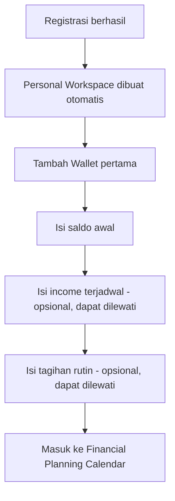
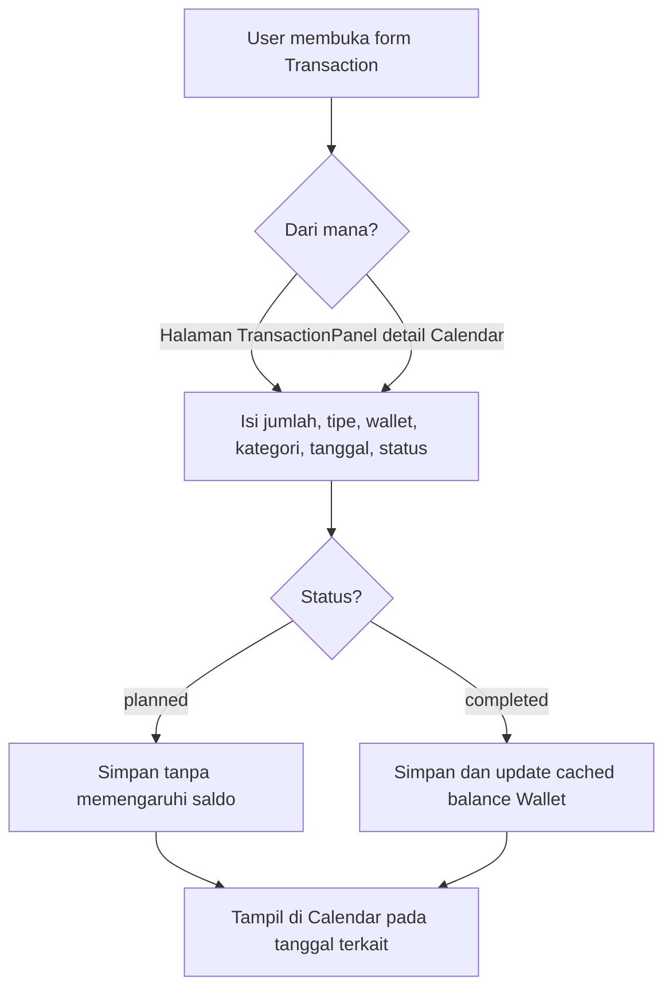
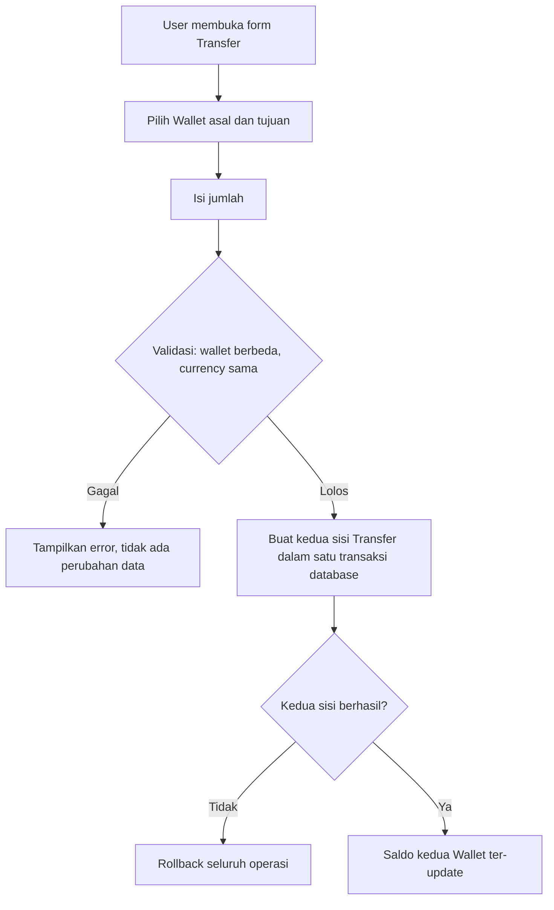
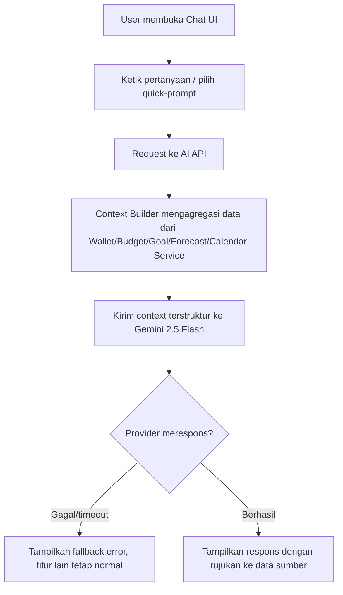

# 04. PRD — Product Requirements Document

**Document owner:** Product & Engineering Team
**Status:** Draft for MVP build
**Scope:** Single source of truth untuk engineering, design, QA, dan AI implementation

---

# 1. Executive Summary

## Product Overview

Nuvio adalah AI-powered Financial Planning Workspace berbasis web dan PWA. Produk ini membantu personal user dan pemilik small business (1–3 anggota) merencanakan kondisi keuangan masa depan — bukan sekadar mencatat transaksi yang sudah terjadi. Interaksi utama terjadi di dalam **Financial Planning Calendar**: satu tampilan yang menyatukan transaksi aktual, transaksi terjadwal, tagihan rutin, budget, goal, dan sinyal forecast dalam satu garis waktu.

AI di Nuvio berperan sebagai **Financial Copilot** — lapisan yang menjelaskan dan menarasikan angka yang sudah dihitung oleh domain service (Wallet, Budget, Goal, Forecast), bukan mesin hitung finansial itu sendiri. Prinsip ini menentukan hampir seluruh keputusan arsitektur dalam dokumen ini.

## Vision

Menjadi cara paling natural bagi orang biasa dan pemilik usaha kecil untuk melihat masa depan keuangan mereka — sejelas mereka melihat jadwal di kalender.

## Mission

Menghilangkan jarak antara "mencatat apa yang sudah terjadi" dan "merencanakan apa yang akan terjadi" dengan menyatukan keduanya dalam satu permukaan kerja: Calendar.

## Value Proposition

| Untuk | Masalah | Nuvio memberikan |
|---|---|---|
| Personal user | Tidak tahu apakah saldo cukup sampai gajian berikutnya | Proyeksi saldo yang terlihat langsung di kalender, bukan di laporan terpisah |
| Personal user | Budget tracker terasa seperti pekerjaan tambahan yang membosankan | Budget sebagai layer ringan di atas aktivitas yang sudah direncanakan, bukan halaman laporan baru |
| Small business owner (1–3 anggota) | Kebutuhan visibilitas cashflow sederhana, tapi accounting software terlalu berat | Alat perencanaan cashflow tanpa beban akuntansi formal |
| Semua user | Angka finansial sulit diinterpretasi tanpa latar belakang keuangan | AI Copilot yang menjelaskan angka dalam bahasa natural, dengan sumber yang bisa ditelusuri |

---

# 2. Problem Statement

## Masalah utama

Kebanyakan aplikasi keuangan personal (expense tracker, budget app konvensional) bersifat **retrospektif**: mereka baik dalam mencatat apa yang sudah dibelanjakan, tapi lemah dalam menjawab pertanyaan yang sebenarnya paling sering muncul di kepala user — *"Apakah uang saya cukup sampai akhir bulan?"*, *"Kalau saya tambah pengeluaran ini, budget saya masih aman tidak?"*, *"Apakah goal saya realistis dengan pemasukan saya sekarang?"*

Pertanyaan-pertanyaan ini bersifat **prospektif** — butuh proyeksi ke depan, bukan rekap ke belakang. Sebagian besar aplikasi yang ada menaruh proyeksi ini (jika ada) di halaman analitik/grafik terpisah yang jarang dibuka, terputus dari tempat user benar-benar merencanakan waktu dan uang mereka sehari-hari.

## Kenapa solusi yang ada kurang baik

| Kategori solusi existing | Kelemahan utama |
|---|---|
| Expense tracker manual (mis. pencatatan spreadsheet, aplikasi pencatatan sederhana) | Murni retrospektif, tidak ada proyeksi masa depan sama sekali |
| Budget app berbasis dashboard/grafik | Proyeksi terpisah dari alur kerja harian user; butuh effort ekstra untuk membuka dan menginterpretasi grafik |
| Accounting software untuk small business | Terlalu berat untuk usaha kecil 1–3 orang yang tidak butuh pembukuan formal (chart of accounts, invoicing, pajak) |
| Aplikasi finansial berbasis AI generik | AI sering dipakai sebagai mesin hitung, bukan penjelas — berisiko memberi angka yang tidak bisa ditelusuri sumbernya (halusinasi) |

Nuvio secara spesifik menempatkan proyeksi masa depan (Forecast) sebagai bagian dari pengalaman kalender sehari-hari, dan menempatkan AI sebagai lapisan penjelas di atas perhitungan domain yang deterministik — bukan pengganti perhitungan itu sendiri.

---

# 3. Goals

## Business Goals

| ID | Goal | Rationale |
|---|---|---|
| BG-01 | Validasi hipotesis calendar-centric financial planning dengan MVP yang dapat digunakan user nyata | Menentukan apakah paradigma ini layak dikembangkan lebih lanjut sebelum investasi lebih besar |
| BG-02 | Membangun fondasi teknis yang dapat menampung monetisasi (plan gating) tanpa membangun payment system penuh di MVP | Menghindari kompleksitas billing sebelum product-market fit tervalidasi |
| BG-03 | Menjangkau dua segmen (personal dan small business) dengan satu basis kode yang sama | Efisiensi tim kecil (3 engineer) tanpa membangun dua produk terpisah |

## User Goals

| ID | Goal |
|---|---|
| UG-01 | Melihat kondisi keuangan hari ini, minggu depan, dan bulan depan dalam satu tampilan |
| UG-02 | Mengetahui lebih awal jika saldo diperkirakan akan negatif sebelum benar-benar terjadi |
| UG-03 | Menetapkan dan memantau budget tanpa harus membuka laporan terpisah |
| UG-04 | Menetapkan goal finansial dan melihat progresnya terhubung ke aktivitas nyata |
| UG-05 | Mendapat penjelasan finansial dalam bahasa natural tanpa harus menginterpretasi grafik sendiri |
| UG-06 | (Small business) Memisahkan cashflow usaha dari keuangan pribadi tanpa harus belajar software akuntansi |

## Technical Goals

| ID | Goal |
|---|---|
| TG-01 | Modular monolith yang dapat dibangun dan dikelola tim 3 engineer dalam ±32 hari kerja |
| TG-02 | Domain finansial (Wallet, Transaction, Budget, Goal, Forecast) sepenuhnya independen dari layer AI — AI dapat dihapus tanpa merusak fungsi inti |
| TG-03 | Seluruh operasi finansial atomik dan konsisten (tidak ada floating-point, tidak ada double counting) |
| TG-04 | Workspace isolation diberlakukan di setiap query, bukan hanya di UI |
| TG-05 | Forecast dan AI Copilot dapat dijelaskan sumber datanya — tidak ada angka finansial yang muncul tanpa jejak |

## Success Metrics

| Metrik | Target indikatif | Catatan |
|---|---|---|
| Onboarding completion rate | ≥ 60% | Baseline realistis mengingat onboarding memerlukan beberapa input sebelum masuk Calendar |
| Weekly active workspace (dari yang selesai onboarding) | ≥ 35% | Indikator validasi hipotesis calendar-centric |
| Rata-rata entitas terjadwal per user/minggu (transaksi + bill + goal) | ≥ 3 | Indikator Calendar dipakai sebagai tempat kerja, bukan sekadar dilihat |
| % sesi AI Copilot yang berlanjut ≥ 2 pertanyaan | ≥ 25% | Indikator AI benar-benar dipakai untuk eksplorasi |
| Forecast job success rate | ≥ 99% | Kegagalan job forecast langsung berdampak ke kepercayaan user terhadap proyeksi |

Semua target ini adalah baseline untuk diuji pasca-launch, bukan komitmen kontraktual — data user riil pasca-MVP akan mengkalibrasi ulang angka ini.

## Non-Goals (untuk MVP ini)

* Menjadi pengganti accounting software (tidak ada chart of accounts, invoicing, atau pelaporan pajak)
* Mendukung multi-currency dalam satu Workspace
* Menyediakan native mobile application
* Menyediakan integrasi bank otomatis atau OCR receipt
* Menjadikan AI sebagai penentu keputusan finansial otomatis
* Mendukung granular role-based access control untuk Business Workspace

---

# 4. Target Users

## Persona 1 — Personal User ("Dinda", pekerja kantoran, 26–35 tahun)

**Needs**
* Tahu apakah gaji bulan ini cukup sampai gajian berikutnya setelah tagihan rutin dan cicilan
* Ingin menabung untuk goal tertentu (dana darurat, liburan, DP rumah) tanpa proses rumit
* Ingin peringatan dini kalau pengeluaran sudah mendekati batas budget kategori tertentu

**Pain Points**
* Aplikasi budget yang ada terasa seperti "PR tambahan" — harus dibuka dan dianalisis secara manual
* Tidak yakin kapan aman untuk melakukan pembelian besar karena tidak tahu proyeksi saldo ke depan
* Kesulitan menghubungkan "tagihan yang akan datang" dengan "uang yang sudah ada di tangan"

**Behaviors**
* Terbiasa memakai kalender digital untuk jadwal harian — pola pikir "temporal" sudah terbentuk
* Membuka aplikasi finansial secara sporadis, biasanya setelah gajian atau saat merasa cemas soal uang

**Jobs To Be Done**
* "Ketika gajian masuk, saya ingin tahu berapa yang benar-benar bisa saya pakai bebas setelah semua kewajiban terjadwal."
* "Ketika saya mempertimbangkan pembelian besar, saya ingin tahu dampaknya ke saldo saya minggu-minggu ke depan."

## Persona 2 — Small Business Owner ("Pak Rian", pemilik usaha kecil, 1–3 karyawan)

**Needs**
* Visibilitas cashflow usaha yang terpisah dari rekening pribadi
* Melihat kapan pemasukan dan pengeluaran usaha akan jatuh tempo dalam satu tampilan sederhana
* Berbagi visibilitas keuangan dasar dengan 1–2 anggota tim tanpa proses admin yang rumit

**Pain Points**
* Software akuntansi penuh terlalu berat dan butuh pengetahuan pembukuan yang tidak dimiliki
* Spreadsheet manual rawan salah dan tidak memberi peringatan proaktif
* Sulit memisahkan mental "uang usaha" dari "uang pribadi" tanpa alat yang memaksakan pemisahan itu

**Behaviors**
* Mengecek kondisi keuangan usaha di waktu-waktu tertentu (akhir minggu, sebelum bayar supplier/gaji karyawan)
* Tidak familiar dengan istilah akuntansi formal (debit/kredit, chart of accounts)

**Jobs To Be Done**
* "Ketika mendekati tanggal gajian karyawan, saya ingin tahu apakah kas usaha cukup."
* "Ketika partner usaha bertanya soal kondisi kas, saya ingin bisa menunjukkan dengan cepat tanpa membuka laporan rumit."

---

# 5. Product Principles

Sepuluh prinsip berikut mengikat seluruh keputusan produk dan teknis dalam dokumen ini. Setiap fitur, requirement, dan business rule di bagian selanjutnya harus konsisten dengan prinsip-prinsip ini.

1. **Financial correctness lebih penting daripada AI.** Kalau ada konflik antara membuat fitur AI lebih pintar dan menjaga akurasi angka finansial, akurasi finansial selalu menang. AI tidak pernah diberi keleluasaan yang mengorbankan ini.

2. **Calendar adalah pusat aplikasi.** Semua modul lain (Wallet, Budget, Goal, Forecast) adalah *sumber data* yang diproyeksikan ke Calendar — bukan halaman yang berdiri sendiri dan terpisah dari alur utama.

3. **AI tidak pernah menjadi sumber kebenaran finansial.** Setiap angka yang ditampilkan AI harus berasal dari domain service yang sama dengan yang dipakai UI biasa. AI hanya menyusun narasi di atas angka yang sudah final.

4. **Semua data berada di Workspace.** Tidak ada entitas finansial yang berdiri tanpa `workspace_id`. Ini bukan detail implementasi — ini adalah batas keamanan dan batas domain sekaligus.

5. **Semua operasi finansial harus atomik.** Mutasi saldo, transfer antar-wallet, dan kontribusi goal tidak boleh menghasilkan state antara yang tidak konsisten, bahkan saat terjadi kegagalan di tengah proses.

6. **Money disimpan sebagai integer minor unit.** Tidak ada representasi uang dalam floating-point di lapisan manapun — database, domain service, maupun API response.

7. **Forecast bersifat deterministic.** Diberi input yang sama, Forecast harus menghasilkan output yang sama. Ini yang membedakan Forecast MVP (rule-based) dari model machine learning yang probabilistik.

8. **AI hanya membaca data.** Tidak ada write action yang dipicu oleh AI — tidak membuat, mengubah, atau menghapus Transaction, Budget, atau Goal.

9. **Workspace isolation wajib di setiap layer.** Bukan hanya di UI, tapi di query database, di API authorization, dan di context yang dikirim ke AI.

10. **Jangan over-engineering untuk MVP.** Setiap keputusan arsitektur di dokumen ini dipilih agar realistis dikerjakan oleh 3 engineer tanpa dedicated DevOps/SRE dalam waktu terbatas — kompleksitas yang tidak dibutuhkan MVP secara eksplisit ditunda (lihat Section 22).

11. **Isolasi data berlapis (defense in depth).** Workspace isolation ditegakkan di dua lapisan yang saling independen: lapisan aplikasi (membership check server-side di setiap query) dan lapisan database (Row Level Security / RLS di Supabase/PostgreSQL). Satu lapisan tidak boleh menjadi satu-satunya penjaga — jika lapisan aplikasi punya bug, RLS tetap mencegah kebocoran data lintas-Workspace, dan sebaliknya. Untuk aplikasi finansial, satu lapisan keamanan tidak cukup.


---

# 6. Functional Scope

Bagian ini menjelaskan seluruh fitur MVP secara mendalam. Business rules yang disebutkan di sini diringkas; detail lengkap ada di Section 11. Functional Requirement dengan ID resmi ada di Section 7.

## 6.1 Authentication

**Overview:** Registrasi dan login menggunakan Supabase Auth (email/password). Sesi dikelola melalui Supabase session token yang divalidasi di setiap request API.

**Objectives:** Memberi akses aman ke Workspace user tanpa membangun sistem auth kustom dari nol.

**User Story:** Sebagai user baru, saya ingin mendaftar dengan email dan password, agar saya bisa mulai menggunakan Nuvio.

**Preconditions:** Tidak ada — dapat diakses oleh visitor.

**Main Flow:** Visitor membuka halaman Register → isi email & password → verifikasi (jika diaktifkan di Supabase project) → sesi dibuat → diarahkan ke Onboarding.

**Alternative Flow:** Login dengan akun yang sudah ada → diarahkan langsung ke Calendar Workspace terakhir yang aktif.

**Edge Cases:** Email sudah terdaftar; password tidak memenuhi kriteria minimum; sesi kedaluwarsa saat user sedang aktif menggunakan aplikasi (harus redirect ke login tanpa kehilangan data yang belum tersimpan bila memungkinkan).

**Validation Rules:** Email format valid; password minimum 8 karakter dengan kombinasi huruf dan angka.

**Business Rules:** Satu email terhubung ke satu akun Supabase Auth; satu akun dapat memiliki banyak Workspace (lihat 6.2).

**Error Handling:** Email sudah terdaftar → pesan spesifik dengan opsi login; password lemah → indikator kekuatan password real-time; sesi invalid → redirect ke login dengan pesan netral (tidak mengungkap detail teknis).

**Empty State:** Tidak relevan (halaman auth selalu punya form).

**Loading State:** Tombol submit menampilkan spinner dan disabled selama request berlangsung.

**Success State:** Redirect otomatis ke Onboarding (user baru) atau Calendar (user lama).

**Acceptance Criteria:** User dapat register, login, dan logout; sesi bertahan across page refresh; sesi invalid memicu redirect otomatis ke login.

## 6.2 Workspace

**Overview:** Root entity yang mengisolasi seluruh data finansial. Setiap user memiliki tepat satu Personal Workspace dan dapat memiliki banyak Business Workspace.

**Objectives:** Menjamin isolasi data antar konteks (personal vs bisnis, atau antar bisnis) dan menjadi scope untuk seluruh query.

**User Story:** Sebagai user, saya ingin membuat Workspace bisnis terpisah dari Workspace personal saya, agar keduanya tidak tercampur.

**Preconditions:** User sudah login.

**Main Flow:** User membuka Workspace switcher → pilih "Buat Workspace baru" → pilih tipe (business — personal hanya dibuat otomatis sekali saat registrasi) → isi nama → Workspace dibuat dan menjadi Workspace aktif.

**Alternative Flow:** User berpindah antar Workspace yang sudah ada melalui switcher tanpa membuat baru.

**Edge Cases:** User mencoba membuat Personal Workspace kedua (ditolak — hanya satu per user); user dihapus dari satu-satunya Business Workspace tempat ia jadi admin (perlu aturan suksesi, lihat Section 11).

**Validation Rules:** Nama Workspace 3–50 karakter; tipe wajib dipilih saat pembuatan dan tidak dapat diubah setelahnya.

**Business Rules:** 1 Personal Workspace per user (dibuat otomatis saat registrasi); banyak Business Workspace diperbolehkan; tipe Workspace immutable.

**Error Handling:** Nama kosong/terlalu pendek → validation error inline; gagal membuat Workspace di server → pesan error umum dengan opsi retry.

**Empty State:** User baru langsung memiliki Personal Workspace terisi kosong (Wallet, Transaction, dll kosong) — bukan Workspace list kosong.

**Loading State:** Skeleton loader saat memuat daftar Workspace di switcher.

**Success State:** Workspace baru langsung muncul di switcher dan menjadi aktif.

**Acceptance Criteria:** User dapat membuat Business Workspace baru; user dapat berpindah Workspace; data antar Workspace tidak pernah bocor meski diakses lewat manipulasi URL/request.

## 6.3 Wallet

**Overview:** Merepresentasikan sumber dana (cash, bank, e-wallet) di dalam satu Workspace. Saldo di-cache dan direkonsiliasi terhadap ledger transaksi.

**Objectives:** Memberi user gambaran saldo riil per sumber dana secara real-time.

**User Story:** Sebagai user, saya ingin mencatat beberapa sumber dana saya secara terpisah, agar saya tahu saldo di masing-masing.

**Preconditions:** User memiliki Workspace aktif.

**Main Flow:** User membuka halaman Wallet → tap "Tambah Wallet" → isi nama, saldo awal → Wallet tersimpan dan langsung tampil dengan saldo tersebut.

**Alternative Flow:** Edit nama Wallet; arsipkan Wallet yang tidak lagi dipakai.

**Edge Cases:** Wallet diarsipkan padahal masih punya recurring rule aktif yang menunjuk ke sana (harus diperingatkan eksplisit); saldo Wallet menjadi negatif akibat transaksi (diperbolehkan, ditampilkan dengan indikator visual, bukan diblokir).

**Validation Rules:** Nama Wallet 1–50 karakter; saldo awal adalah integer minor unit valid untuk currency Workspace.

**Business Rules:** Wallet tidak dapat di-hard-delete setelah memiliki transaksi (hanya diarsipkan); Wallet yang diarsipkan tidak menerima transaksi baru; cached balance harus dapat direkonsiliasi terhadap ledger kapan saja.

**Error Handling:** Saldo awal tidak valid (bukan angka/desimal salah) → validation error; gagal simpan → retry dengan pesan jelas.

**Empty State:** Halaman Wallet kosong menampilkan CTA "Tambah Wallet pertama" dengan penjelasan singkat kenapa Wallet dibutuhkan.

**Loading State:** Skeleton card saat memuat daftar Wallet.

**Success State:** Wallet baru muncul di daftar dengan saldo yang benar, dan langsung tersedia sebagai opsi di form Transaction.

**Acceptance Criteria:** User dapat menambah, mengedit, dan mengarsipkan Wallet; saldo selalu konsisten dengan ledger transaksi; Wallet yang diarsipkan tidak muncul sebagai opsi di form Transaction baru.

## 6.4 Category

**Overview:** Label pengelompokan Transaction, digunakan untuk Budget dan Spending Analysis. Set kategori default berbeda untuk Workspace personal vs business.

**Objectives:** Memberi struktur pengelompokan yang cukup untuk Budget dan analisis AI tanpa kompleksitas chart of accounts.

**User Story:** Sebagai user, saya ingin mengelompokkan transaksi saya ke dalam kategori, agar saya bisa memantau pengeluaran per jenis.

**Preconditions:** Workspace aktif tersedia dengan kategori default sudah ter-seed.

**Main Flow:** Saat membuat Transaction, user memilih kategori dari daftar; user dapat menambah kategori custom dari halaman Category.

**Alternative Flow:** Edit nama/warna kategori custom; kategori default tidak dapat dihapus, hanya disembunyikan dari pilihan aktif.

**Edge Cases:** Kategori custom dihapus padahal sudah dipakai di transaksi lama (transaksi lama tetap menyimpan label historis, tidak cascade delete).

**Validation Rules:** Nama kategori 1–30 karakter, unik per Workspace.

**Business Rules:** Kategori scoped ke Workspace; kategori default berbeda set untuk tipe personal vs business.

**Error Handling:** Nama duplikat → validation error dengan pesan spesifik.

**Empty State:** Tidak relevan — kategori default selalu tersedia sejak Workspace dibuat.

**Loading State:** Skeleton list saat memuat kategori.

**Success State:** Kategori baru langsung tersedia di form Transaction.

**Acceptance Criteria:** User dapat menambah kategori custom; kategori default tidak dapat dihapus permanen; transaksi lama tidak rusak saat kategori custom dihapus.

## 6.5 Transaction

**Overview:** Unit data mentah terkecil yang menggerakkan Wallet balance, Budget usage, Calendar, dan Forecast. Mendukung status `planned` dan `completed`.

**Objectives:** Mencatat aktivitas finansial baik yang sudah terjadi maupun yang direncanakan ke depan.

**User Story:** Sebagai user, saya ingin mencatat transaksi dengan cepat dari Calendar atau halaman Transaction, agar pencatatan tidak menghambat alur perencanaan saya.

**Preconditions:** Minimal satu Wallet aktif tersedia di Workspace.

**Main Flow:** User membuka form tambah transaksi (dari Calendar atau halaman Transaction) → isi jumlah, tipe (income/expense), wallet, kategori, tanggal, status → simpan → saldo Wallet dan indikator Calendar diperbarui.

**Alternative Flow:** Edit transaksi existing memicu rekalkulasi saldo; ubah status dari `planned` ke `completed` saat transaksi benar-benar terjadi.

**Edge Cases:** Transaksi dengan tanggal di masa depan berstatus `completed` (tidak logis — divalidasi agar `completed` hanya untuk tanggal ≤ hari ini); penghapusan transaksi yang sudah mempengaruhi Budget/Goal (harus memicu rekalkulasi kedua entitas tersebut).

**Validation Rules:** Amount > 0 (arah ditentukan oleh field type, bukan tanda negatif); currency harus sama dengan currency Workspace; tanggal wajib diisi.

**Business Rules:** Transaction selalu scoped ke Wallet dan Workspace yang sama; penghapusan menggunakan soft delete; status `completed` memengaruhi saldo cached, status `planned` tidak.

**Error Handling:** Amount tidak valid → validation error inline; wallet diarsipkan dipilih sebagai target → error dengan pesan jelas; gagal simpan di server → retry dengan data form tidak hilang.

**Empty State:** Halaman Transaction kosong menampilkan CTA "Catat transaksi pertama" dan tombol quick-add.

**Loading State:** Optimistic UI dihindari untuk mutasi finansial (lihat Section 16/17) — tampilkan loading indicator eksplisit saat submit.

**Success State:** Transaksi baru muncul di list dan di Calendar pada tanggal yang sesuai; saldo Wallet ter-update.

**Acceptance Criteria:** User dapat membuat, mengedit, menghapus (soft delete) transaksi; status planned/completed dibedakan secara visual; saldo Wallet selalu konsisten dengan seluruh transaksi `completed`.

## 6.6 Transfer

**Overview:** Perpindahan dana antar-Wallet dalam Workspace yang sama. Tidak dihitung sebagai income/expense Workspace.

**Objectives:** Memungkinkan user memindahkan dana antar sumber (mis. dari Bank ke Cash) tanpa mendistorsi laporan income/expense.

**User Story:** Sebagai user, saya ingin memindahkan dana dari satu Wallet ke Wallet lain, agar catatan saldo saya tetap akurat tanpa dihitung sebagai pengeluaran.

**Preconditions:** Minimal dua Wallet aktif tersedia dengan currency yang sama.

**Main Flow:** User membuka form Transfer → pilih Wallet asal dan tujuan → isi jumlah → konfirmasi → kedua sisi transfer tercatat atomik dalam satu operasi database.

**Alternative Flow:** Tidak ada — Transfer adalah operasi tunggal tanpa draft/planned state di MVP.

**Edge Cases:** Wallet asal dan tujuan sama (ditolak di validasi); salah satu sisi transfer gagal tersimpan (seluruh operasi di-rollback, tidak ada transfer sebagian).

**Validation Rules:** Wallet asal ≠ Wallet tujuan; amount > 0; kedua Wallet harus currency yang sama (multi-currency transfer di luar scope MVP).

**Business Rules:** Transfer tidak masuk perhitungan income/expense Workspace maupun Budget usage; kedua sisi dibuat dalam satu database transaction (all-or-nothing).

**Error Handling:** Wallet sama dipilih → validation error; saldo asal tidak mencukupi (jika diberlakukan sebagai warning, bukan blokir, karena negative balance diperbolehkan) → konfirmasi tambahan sebelum lanjut.

**Empty State:** Tidak relevan.

**Loading State:** Tombol konfirmasi disabled selama proses atomik berlangsung.

**Success State:** Saldo kedua Wallet ter-update secara bersamaan; muncul sebagai satu entri "Transfer" di histori masing-masing Wallet (bukan dua entri Transaction terpisah yang terlihat seperti income/expense).

**Acceptance Criteria:** Transfer tidak pernah muncul di laporan income/expense; kegagalan sebagian tidak pernah terjadi (all-or-nothing terverifikasi via test); saldo kedua wallet selalu konsisten setelah transfer.

## 6.7 Recurring Transaction

**Overview:** Template aturan (Recurring Rule) yang menghasilkan occurrence terjadwal (tagihan rutin, income berkala) secara otomatis lewat background job.

**Objectives:** Mengurangi input manual berulang dan memberi visibilitas jadwal finansial ke depan di Calendar.

**User Story:** Sebagai user, saya ingin menetapkan tagihan yang berulang setiap bulan, agar saya tidak perlu mencatatnya manual setiap kali dan bisa melihatnya di kalender sebelum jatuh tempo.

**Preconditions:** Minimal satu Wallet aktif tersedia.

**Main Flow:** User membuat Recurring Rule (jumlah, kategori, wallet, frekuensi, tanggal mulai) → background job menghasilkan occurrence sebagai planned Transaction untuk periode mendatang → occurrence muncul di Calendar.

**Alternative Flow:** User mengubah Recurring Rule (jumlah/tanggal) — occurrence masa depan yang belum jadi `completed` diperbarui, occurrence masa lalu yang sudah `completed` tidak berubah.

**Edge Cases:** Tanggal jatuh tempo di luar rentang bulan target (mis. tanggal 31 di bulan Februari) → fallback ke hari terakhir bulan tersebut; job dijalankan dua kali karena retry → tidak boleh menghasilkan occurrence duplikat (idempotency key wajib).

**Validation Rules:** Frekuensi harus salah satu dari nilai yang didukung (bulanan di MVP); jumlah > 0; wallet dan kategori valid.

**Business Rules:** Recurring Rule bukan Transaction — occurrence adalah planned Transaction yang dihasilkan dari rule; penghapusan rule tidak menghapus occurrence yang sudah `completed`.

**Error Handling:** Job gagal generate occurrence → dicatat di execution history, di-retry sesuai kebijakan retry (lihat Section 9), tidak silent-fail.

**Empty State:** Halaman Recurring kosong menampilkan CTA "Tambah tagihan rutin" dengan contoh use case.

**Loading State:** Indikator saat occurrence sedang di-generate ulang setelah rule diubah.

**Success State:** Occurrence baru langsung terlihat di Calendar pada tanggal-tanggal jatuh tempo ke depan.

**Acceptance Criteria:** Occurrence tergenerate otomatis tanpa duplikat; perubahan rule tidak mengubah histori occurrence yang sudah completed; tanggal edge case (28-31) ditangani benar oleh unit test eksplisit.

## 6.8 Calendar

**Overview:** Halaman utama aplikasi (juga berfungsi sebagai "Dashboard"). Menampilkan transaksi aktual, planned, recurring occurrence, goal milestone, dan sinyal forecast dalam tampilan bulanan. Calendar adalah **projection**, bukan sumber data independen.

**Objectives:** Menjadi satu tempat di mana user melihat dan berinteraksi dengan seluruh aktivitas finansial mereka, masa lalu maupun masa depan.

**User Story:** Sebagai user, saya ingin melihat semua aktivitas finansial saya dalam satu tampilan kalender, agar saya bisa merencanakan, bukan hanya mencatat.

**Preconditions:** Workspace aktif tersedia (boleh kosong pada user baru).

**Main Flow:** User membuka Calendar (halaman default setelah login) → melihat bulan berjalan dengan indikator per tanggal → klik tanggal untuk melihat detail dan menambah entri baru.

**Alternative Flow:** Navigasi ke bulan sebelum/sesudah; toggle overlay Forecast untuk melihat proyeksi saldo di atas tanggal-tanggal mendatang.

**Edge Cases:** Tanggal dengan banyak entri (>10) → digabung menjadi indikator ringkas ("+N lainnya") agar layout tidak rusak; performa render saat Workspace memiliki ratusan entri per bulan (lihat Section 17 untuk target performa).

**Validation Rules:** Tidak ada input langsung di level Calendar — validasi berada di masing-masing form entitas (Transaction, Goal, dst).

**Business Rules:** Calendar tidak pernah menjadi sumber data baru — setiap entitas yang tampil selalu berasal dari modul aslinya (Transaction, Recurring, Goal, Forecast).

**Error Handling:** Gagal memuat data bulan tertentu → tampilkan pesan error dengan opsi retry, bukan Calendar kosong tanpa penjelasan.

**Empty State:** Bulan tanpa aktivitas menampilkan Calendar kosong dengan CTA halus mengarahkan ke penambahan Wallet/Transaction pertama.

**Loading State:** Skeleton grid kalender saat memuat bulan baru.

**Success State:** Semua indikator (transaksi, bill, goal, forecast) tampil konsisten dan dapat diklik untuk detail.

**Acceptance Criteria:** Semua entitas finansial yang relevan tampil di tanggal yang benar; navigasi antar bulan responsif; performa render tetap baik pada Workspace dengan data padat (lihat NFR terkait di Section 17).

## 6.9 Budget

**Overview:** Batas rencana pengeluaran bulanan per kategori, ditampilkan sebagai indikator ringan di Calendar dan detail lengkap di halaman Budget.

**Objectives:** Membantu user memantau realisasi pengeluaran terhadap rencana tanpa harus membuka laporan terpisah.

**User Story:** Sebagai user, saya ingin menetapkan batas pengeluaran per kategori setiap bulan, agar saya tahu kapan saya mendekati atau melewati batas tersebut.

**Preconditions:** Minimal satu kategori tersedia.

**Main Flow:** User membuat Budget (kategori, jumlah, bulan) → sistem menghitung realisasi dari Transaction `completed` berkategori sama sejak awal bulan → progress ditampilkan di halaman Budget dan indikator ringan di Calendar.

**Alternative Flow:** Edit jumlah Budget di tengah bulan berjalan — realisasi tetap dihitung dari tanggal 1 bulan itu, bukan dari tanggal Budget diubah.

**Edge Cases:** Kategori tanpa Budget yang ditetapkan (tidak muncul indikator progress, bukan error); Transaction yang termasuk Transfer tidak dihitung sebagai realisasi Budget.

**Validation Rules:** Amount > 0; satu Budget aktif per kombinasi kategori dan bulan (tidak boleh duplikat).

**Business Rules:** Threshold peringatan pada 80% dan 100% dari batas; realisasi hanya dari Transaction `completed` bertipe expense.

**Error Handling:** Mencoba membuat Budget duplikat untuk kategori/bulan yang sama → error dengan opsi edit yang sudah ada.

**Empty State:** Halaman Budget kosong menampilkan CTA "Buat budget pertama" dengan contoh kategori umum.

**Loading State:** Skeleton progress bar saat memuat data realisasi.

**Success State:** Progress bar terisi sesuai realisasi real-time, dengan warna berubah saat mendekati/melewati threshold.

**Acceptance Criteria:** Realisasi selalu akurat terhadap Transaction completed; peringatan muncul tepat di threshold 80% dan 100%; Budget tengah bulan menghitung sejak tanggal 1.

## 6.10 Goal

**Overview:** Target finansial jangka menengah/panjang dengan progress yang terhubung ke kontribusi nyata dari Transaction.

**Objectives:** Memberi user cara menetapkan dan memantau tujuan finansial yang terhubung ke aktivitas nyata, bukan angka aspirasional yang berdiri sendiri.

**User Story:** Sebagai user, saya ingin menetapkan target finansial dengan deadline, agar saya bisa melihat progres nyata menuju target itu.

**Preconditions:** Minimal satu Wallet aktif tersedia sebagai sumber kontribusi.

**Main Flow:** User membuat Goal (nama, target amount, target date) → mencatat kontribusi dari waktu ke waktu (terhubung ke Transaction/Wallet sumber) → progress dihitung dari total kontribusi terhadap target.

**Alternative Flow:** Edit target amount/date; tandai Goal sebagai selesai lebih awal jika tercapai.

**Edge Cases:** Target date terlewati tapi progress belum 100% (status "terlambat" ditampilkan, Goal tidak hilang dari daftar); kontribusi menyebabkan saldo Wallet sumber jadi negatif (diperbolehkan dengan warning, konsisten dengan aturan Wallet).

**Validation Rules:** Target amount > 0; target date harus di masa depan saat Goal dibuat.

**Business Rules:** Kontribusi Goal harus terhubung ke Transaction/ledger movement — tidak boleh double counting terhadap saldo Wallet.

**Error Handling:** Kontribusi melebihi saldo Wallet sumber → warning, bukan blokir keras (konsisten dengan negative balance policy).

**Empty State:** Halaman Goal kosong menampilkan CTA "Buat goal pertama" dengan contoh (dana darurat, liburan).

**Loading State:** Skeleton progress ring saat memuat data Goal.

**Success State:** Progress ring/bar ter-update setelah kontribusi baru dicatat; milestone muncul di Calendar pada target date.

**Acceptance Criteria:** Progress selalu konsisten dengan total kontribusi tercatat; tidak ada double counting terhadap saldo Wallet; Goal lewat deadline tetap terlihat dengan status jelas.

## 6.11 Forecast

**Overview:** Proyeksi saldo 30–60 hari ke depan berbasis rule deterministik (bukan machine learning), dihitung oleh background job dan disimpan sebagai snapshot.

**Objectives:** Memberi user sinyal dini soal kondisi saldo masa depan, termasuk potensi saldo negatif sebelum benar-benar terjadi.

**User Story:** Sebagai user, saya ingin melihat proyeksi saldo saya untuk beberapa minggu ke depan, agar saya tahu lebih awal jika akan kehabisan dana.

**Preconditions:** Minimal satu Wallet dengan saldo tersedia.

**Main Flow:** Background job menghitung proyeksi (saldo saat ini + income terjadwal − recurring bill terjadwal − estimasi pengeluaran non-recurring dari histori ~30 hari) → hasil disimpan sebagai Forecast Snapshot → ditampilkan sebagai overlay di Calendar.

**Alternative Flow:** User memicu recompute manual (mis. setelah menambah transaksi besar) — dibatasi rate limit agar tidak membebani job scheduler.

**Edge Cases:** User baru tanpa histori transaksi (cold start) — Forecast tetap berjalan hanya dari income dan recurring bill terjadwal, dengan indikasi eksplisit "proyeksi akan makin akurat setelah beberapa minggu pencatatan"; Recurring Rule berubah setelah snapshot dibuat — snapshot lama tetap immutable, snapshot baru dibuat dengan data terbaru.

**Validation Rules:** Tidak ada input user langsung — Forecast murni hasil kalkulasi dari data lain.

**Business Rules:** Snapshot immutable setelah dibuat; Forecast tidak pernah mengubah data Transaction/ledger; setiap entry proyeksi membedakan fakta (transaksi completed), asumsi (recurring terjadwal), dan estimasi (rata-rata historis).

**Error Handling:** Job forecast gagal → dicatat di execution history, ditampilkan sebagai "Forecast belum tersedia" bukan data usang tanpa penjelasan.

**Empty State:** User cold-start melihat proyeksi terbatas dengan penjelasan eksplisit keterbatasannya.

**Loading State:** Overlay Forecast menampilkan skeleton line saat snapshot sedang dihitung ulang.

**Success State:** Garis proyeksi tampil di Calendar dengan penanda eksplisit jika ada tanggal proyeksi saldo negatif.

**Acceptance Criteria:** Forecast tidak pernah mengubah data aktual; cold start ditangani dengan pesan eksplisit, bukan angka presisi palsu; snapshot dapat ditelusuri ke input yang menghasilkannya.

## 6.12 Notification

**Overview:** Notifikasi in-app untuk hal-hal kritikal (mendekati/melewati budget, proyeksi saldo negatif, tagihan jatuh tempo). Tidak ada email/push notification di MVP.

**Objectives:** Memberi sinyal proaktif tanpa membangun sistem notifikasi multi-channel yang kompleks.

**User Story:** Sebagai user, saya ingin mendapat peringatan saat budget saya hampir habis atau saldo saya diperkirakan minus, agar saya bisa bertindak lebih awal.

**Preconditions:** Trigger kondisi terpenuhi (threshold Budget, sinyal Forecast negatif, occurrence jatuh tempo dalam N hari).

**Main Flow:** Sistem mendeteksi kondisi trigger (dari job Budget aggregation atau Forecast recompute) → notifikasi in-app muncul di badge/lonceng → user membuka dan melihat detail.

**Alternative Flow:** User menandai notifikasi sebagai sudah dibaca; user mengabaikan notifikasi (tetap tersimpan di riwayat).

**Edge Cases:** Kondisi trigger sama terjadi berulang kali dalam waktu singkat (harus di-dedupe, tidak spam notifikasi identik).

**Validation Rules:** Tidak ada input user langsung.

**Business Rules:** Notifikasi bersifat informatif, tidak pernah memicu aksi otomatis (mis. tidak otomatis menahan transaksi).

**Error Handling:** Job yang men-generate notifikasi gagal → tidak boleh membuat notifikasi palsu atau ganda saat retry.

**Empty State:** Badge notifikasi kosong menampilkan "Tidak ada notifikasi baru".

**Loading State:** Skeleton list saat memuat riwayat notifikasi.

**Success State:** Notifikasi baru muncul dengan indikator visual jelas (badge count) dan hilang dari "unread" setelah dibuka.

**Acceptance Criteria:** Notifikasi trigger sesuai kondisi yang benar; tidak ada duplikasi notifikasi identik dalam window waktu singkat; AI failure tidak pernah memicu notifikasi palsu.

## 6.13 AI Copilot

**Overview:** Antarmuka chat yang menjelaskan data finansial user menggunakan Gemini 2.5 Flash, dengan context yang dibangun server-side dari data yang sudah dihitung domain service. AI hanya membaca, tidak pernah menulis.

**Objectives:** Menurunkan friksi interpretasi data finansial lewat percakapan natural, tanpa mengambil alih perhitungan atau keputusan.

**User Story:** Sebagai user, saya ingin bertanya ke AI tentang kondisi keuangan saya dalam bahasa natural, agar saya tidak perlu menginterpretasi angka sendiri.

**Preconditions:** Workspace aktif tersedia (idealnya dengan data minimal untuk hasil yang bermakna).

**Main Flow:** User membuka Chat UI → mengetik pertanyaan → Context Builder mengumpulkan data agregat dari Wallet/Budget/Goal/Forecast/Calendar service → dikirim ke Gemini 2.5 Flash → respons ditampilkan dengan referensi ke data sumber.

**Alternative Flow:** User memilih quick-prompt yang sudah disediakan (mis. "Ringkas pengeluaran bulan ini") alih-alih mengetik bebas.

**Edge Cases:** User baru tanpa data cukup (cold start) — AI secara eksplisit mengakui keterbatasan, tidak memaksakan jawaban generik; AI provider (Gemini) gagal merespons — fallback ke pesan error yang jelas, fitur lain tetap berfungsi normal.

**Validation Rules:** Panjang pesan dibatasi (mis. maksimum karakter tertentu) untuk kontrol biaya token.

**Business Rules:** AI tidak boleh membuat/mengubah Transaction, Budget, atau Goal; AI tidak boleh mengakses data Workspace lain; setiap angka dalam respons harus dapat ditelusuri ke Forecast/Budget/Goal/Wallet service yang sama dengan yang dipakai UI.

**Error Handling:** Provider timeout/error → pesan fallback yang jelas dengan opsi coba lagi; rate limit tercapai → pesan yang menjelaskan batas, bukan error generik.

**Empty State:** Chat kosong menampilkan quick-prompt starter dan penjelasan singkat kemampuan AI Copilot.

**Loading State:** Indikator "sedang mengetik" saat menunggu respons AI.

**Success State:** Respons AI tampil dengan format yang jelas, termasuk rujukan ke data spesifik (mis. nama kategori, jumlah, tanggal) yang bisa diverifikasi user.

**Acceptance Criteria:** AI tidak pernah memicu write action; respons dapat ditelusuri ke data domain yang sama dengan UI; kegagalan AI tidak memengaruhi fitur finansial inti lainnya.

## 6.14 Settings

**Overview:** Pengaturan tingkat Workspace (nama, tipe [read-only], currency [read-only pasca-pembuatan], timezone) dan preferensi aplikasi dasar.

**Objectives:** Memberi kontrol dasar atas konfigurasi Workspace tanpa kompleksitas pengaturan enterprise.

**User Story:** Sebagai user, saya ingin melihat dan mengubah pengaturan dasar Workspace saya, agar aplikasi sesuai kebutuhan saya.

**Preconditions:** Workspace aktif tersedia; hanya admin yang dapat mengubah pengaturan Business Workspace.

**Main Flow:** User membuka Settings → melihat/mengubah nama Workspace → simpan.

**Alternative Flow:** Admin Business Workspace membuka daftar member (lihat 6.2) dari Settings.

**Edge Cases:** Member non-admin mencoba mengakses Settings yang dibatasi admin → ditolak dengan pesan otorisasi yang jelas.

**Validation Rules:** Nama Workspace 3–50 karakter.

**Business Rules:** Currency dan tipe Workspace tidak dapat diubah pasca-pembuatan.

**Error Handling:** Percobaan ubah field read-only lewat manipulasi request → ditolak di layer domain, bukan hanya disembunyikan di UI.

**Empty State:** Tidak relevan.

**Loading State:** Form menampilkan skeleton saat memuat data Workspace.

**Success State:** Perubahan tersimpan dengan konfirmasi visual singkat.

**Acceptance Criteria:** Hanya field yang diizinkan yang dapat diubah; otorisasi role diberlakukan di server, bukan hanya UI.

## 6.15 Profile

**Overview:** Pengaturan akun tingkat user (nama tampilan, email — read-only karena terikat Supabase Auth, ganti password).

**Objectives:** Memberi kontrol dasar atas identitas akun.

**User Story:** Sebagai user, saya ingin mengubah nama tampilan saya, agar profil saya sesuai identitas saya.

**Preconditions:** User sudah login.

**Main Flow:** User membuka Profile → ubah nama tampilan → simpan.

**Alternative Flow:** User memicu reset password melalui alur Supabase Auth standar.

**Edge Cases:** Nama tampilan kosong (ditolak, minimal 1 karakter).

**Validation Rules:** Nama tampilan 1–50 karakter.

**Business Rules:** Email tidak dapat diubah langsung dari Profile di MVP (mengikuti alur akun Supabase Auth).

**Error Handling:** Gagal simpan → pesan error dengan opsi retry.

**Empty State:** Tidak relevan.

**Loading State:** Form skeleton saat memuat data profil.

**Success State:** Nama tampilan ter-update di seluruh UI (header, member list Business Workspace).

**Acceptance Criteria:** Perubahan nama tampilan konsisten di seluruh bagian aplikasi yang menampilkannya.

## 6.16 Plan Gating (Skeleton)

**Overview:** Penanda tier plan (mis. Free/Pro) pada Workspace dengan UI upgrade placeholder. Tidak ada payment gateway aktif di MVP.

**Objectives:** Menyiapkan fondasi monetisasi tanpa membangun kompleksitas billing sebelum validasi produk selesai.

**User Story:** Sebagai user, saya ingin tahu batasan plan saya saat ini dan opsi upgrade, agar saya paham nilai tambah plan berbayar meski belum bisa membayar langsung di MVP.

**Preconditions:** Workspace aktif tersedia dengan flag plan (default: free).

**Main Flow:** User mencapai batasan tertentu terkait plan (mis. jumlah Business Workspace) → melihat UI "Upgrade ke Pro" → tap menampilkan halaman placeholder (belum ada pembayaran aktif).

**Alternative Flow:** Tidak ada — ini murni skeleton di MVP.

**Edge Cases:** Tidak ada batasan keras yang memblokir fungsi inti MVP — plan gating murni UI penanda, bukan pemblokir fitur yang divalidasi di Section 3 (Goals).

**Validation Rules:** Tidak ada input user langsung.

**Business Rules:** Tidak ada perubahan data finansial berdasarkan plan di MVP.

**Error Handling:** Tidak relevan — tidak ada transaksi pembayaran nyata.

**Empty State:** Tidak relevan.

**Loading State:** Tidak relevan.

**Success State:** Halaman placeholder upgrade tampil dengan jelas menyatakan "Segera hadir".

**Acceptance Criteria:** Flag plan tersimpan di Workspace; UI upgrade tampil di titik yang masuk akal tanpa memblokir fungsi inti MVP.

---

# 7. Functional Requirements

Total 140 Functional Requirement. Jumlah ini natural dari cakupan fitur di Section 6 — tidak ditambah filler untuk mengejar angka tertentu. Prioritas mengikuti skala Must/Should/Could dari MoSCoW.

## 7.1 Authentication (FR-001–FR-008)

| ID | Description | Priority | Dependencies | Acceptance Criteria |
|---|---|---|---|---|
| FR-001 | User dapat mendaftar dengan email dan password melalui Supabase Auth | Must | — | Akun tersimpan, sesi aktif setelah signup |
| FR-002 | User dapat login dengan email dan password yang terdaftar | Must | FR-001 | Sesi terbentuk, redirect ke Calendar/Onboarding |
| FR-003 | User dapat logout dan sesi dihentikan di server | Must | FR-002 | Request berikutnya dengan token lama ditolak |
| FR-004 | Sistem memvalidasi format email saat registrasi | Must | — | Email invalid ditolak dengan pesan jelas |
| FR-005 | Sistem memvalidasi kekuatan password minimum (8 karakter, kombinasi huruf & angka) | Must | — | Password lemah ditolak sebelum submit |
| FR-006 | Sistem menampilkan pesan spesifik saat email sudah terdaftar | Should | FR-001 | Pesan menyertakan CTA login, berbeda dari error generik |
| FR-007 | Sesi user divalidasi di setiap request API yang butuh autentikasi | Must | FR-002 | Request tanpa sesi valid ditolak 401 |
| FR-008 | User dengan sesi kedaluwarsa diarahkan otomatis ke halaman login | Must | FR-007 | Redirect terjadi tanpa kehilangan data form tanpa peringatan |

## 7.2 Workspace (FR-009–FR-020)

| ID | Description | Priority | Dependencies | Acceptance Criteria |
|---|---|---|---|---|
| FR-009 | Sistem otomatis membuat satu Personal Workspace saat user registrasi | Must | FR-001 | Personal Workspace tersedia setelah signup |
| FR-010 | User dapat membuat Business Workspace baru | Must | FR-009 | Workspace baru tersimpan dengan workspace_id unik |
| FR-011 | User tidak dapat membuat Personal Workspace kedua | Must | FR-009 | Percobaan kedua ditolak dengan pesan jelas |
| FR-012 | Tipe Workspace tidak dapat diubah setelah dibuat | Must | FR-010 | Request update tipe ditolak di layer domain |
| FR-013 | User dapat berpindah antar Workspace melalui switcher | Must | FR-009 | Konteks aktif berubah sesuai Workspace terpilih |
| FR-014 | Query data finansial di-scope ke workspace_id aktif dan terautorisasi | Must | FR-007 | Request dengan workspace_id lain tanpa membership ditolak 403 |
| FR-014a | RLS aktif di seluruh tabel data finansial; policy menolak baris milik Workspace yang bukan membership user | Must | FR-007 | Test: query tanpa filter aplikasi via koneksi user tetap tidak mengembalikan baris Workspace lain |
| FR-014b | Background job & operasi service-role men-scope workspace_id secara eksplisit (RLS di-bypass secara sadar, bukan tidak sengaja) | Must | FR-062, FR-099 | Test: job hanya menyentuh baris Workspace yang menjadi target iterasinya |
| FR-015 | Business Workspace dapat mengundang member baru | Should | FR-010 | Member baru muncul di daftar setelah menerima undangan |
| FR-016 | Business Workspace member memiliki role admin atau member | Must | FR-015 | Role tersimpan dan memengaruhi akses Settings |
| FR-017 | Hanya admin yang dapat mengubah pengaturan Business Workspace | Must | FR-016 | Member non-admin ditolak saat mencoba ubah Settings |
| FR-018 | Personal Workspace tidak menampilkan opsi invite member | Must | FR-009 | UI invite tidak muncul untuk tipe personal |
| FR-019 | Workspace memiliki satu base currency ditetapkan saat dibuat | Must | FR-010 | Currency tidak dapat diubah pasca-pembuatan |
| FR-020 | Workspace memiliki satu timezone untuk seluruh financial date di dalamnya | Must | FR-010 | Financial date konsisten dengan timezone Workspace |

## 7.3 Wallet (FR-021–FR-030)

| ID | Description | Priority | Dependencies | Acceptance Criteria |
|---|---|---|---|---|
| FR-021 | User dapat menambah Wallet baru dengan nama dan saldo awal | Must | FR-013 | Wallet tersimpan dengan saldo awal benar |
| FR-022 | User dapat mengedit nama Wallet | Must | FR-021 | Perubahan tercermin di seluruh UI terkait |
| FR-023 | User dapat mengarsipkan Wallet | Must | FR-021 | Wallet archived tidak muncul sebagai opsi transaksi baru |
| FR-024 | Wallet tidak dapat di-hard-delete setelah memiliki transaksi | Must | FR-021 | Request delete pada Wallet dengan histori ditolak |
| FR-025 | Saldo Wallet dihitung dari saldo awal + seluruh Transaction completed terkait | Must | FR-021 | Saldo cocok dengan rekalkulasi manual dari ledger |
| FR-026 | Saldo Wallet dapat bernilai negatif | Must | FR-025 | Sistem tidak memblokir transaksi yang membuat saldo negatif |
| FR-027 | Sistem menyediakan mekanisme rekonsiliasi cached balance terhadap ledger | Must | FR-025 | Job rekonsiliasi mendeteksi dan melaporkan selisih |
| FR-028 | Peringatan muncul sebelum mengarsipkan Wallet yang masih dipakai Recurring Rule aktif | Should | FR-023, FR-061 | Konfirmasi eksplisit diminta sebelum arsip |
| FR-029 | Wallet dapat ditandai sebagai tipe operasional/bisnis pada Business Workspace | Could | FR-021 | Label tampil di UI, tidak memengaruhi kalkulasi saldo |
| FR-030 | Daftar Wallet menampilkan saldo real-time saat dibuka | Must | FR-025 | Saldo sesuai kalkulasi terbaru, bukan cache basi |

## 7.4 Category (FR-031–FR-036)

| ID | Description | Priority | Dependencies | Acceptance Criteria |
|---|---|---|---|---|
| FR-031 | Sistem menyediakan kategori default sesuai tipe Workspace saat dibuat | Must | FR-010 | Kategori default tersedia tanpa input manual |
| FR-032 | User dapat menambah kategori custom | Must | FR-031 | Kategori baru tersimpan dan muncul di form Transaction |
| FR-033 | Nama kategori harus unik dalam satu Workspace | Must | FR-032 | Nama duplikat ditolak dengan pesan jelas |
| FR-034 | Kategori default tidak dapat dihapus permanen | Must | FR-031 | Percobaan hapus kategori default ditolak |
| FR-035 | Penghapusan kategori custom tidak menghapus label historis transaksi lama | Must | FR-032 | Transaksi lama tetap menampilkan nama kategori |
| FR-036 | User dapat mengedit warna/nama kategori custom | Should | FR-032 | Perubahan tercermin di seluruh UI terkait |

## 7.5 Transaction (FR-037–FR-052)

| ID | Description | Priority | Dependencies | Acceptance Criteria |
|---|---|---|---|---|
| FR-037 | User dapat membuat Transaction bertipe income atau expense | Must | FR-021, FR-031 | Transaksi tersimpan dan memengaruhi saldo sesuai tipe |
| FR-038 | Transaction menyimpan amount sebagai integer minor unit | Must | — | Tipe kolom database integer, bukan decimal/float |
| FR-039 | Transaction memiliki status planned atau completed | Must | FR-037 | Status tersimpan dan memengaruhi update saldo |
| FR-040 | Hanya Transaction completed yang memengaruhi cached balance | Must | FR-039 | Transaction planned tidak mengubah saldo |
| FR-041 | User dapat mengubah status Transaction dari planned ke completed | Must | FR-039 | Perubahan status memicu rekalkulasi saldo |
| FR-042 | User dapat membuat Transaction dengan tanggal di masa depan | Must | FR-037 | Transaksi muncul di Calendar pada tanggal tersebut |
| FR-043 | Transaction completed tidak dapat memiliki tanggal di masa depan | Must | FR-039 | Validasi menolak kombinasi ini saat submit |
| FR-044 | User dapat mengedit Transaction existing | Must | FR-037 | Perubahan memicu rekalkulasi saldo Wallet |
| FR-045 | User dapat menghapus Transaction melalui soft delete | Must | FR-037 | Transaction tidak muncul di UI, tetap ada dengan flag deleted |
| FR-046 | Penghapusan Transaction memicu rekalkulasi saldo Wallet | Must | FR-045 | Saldo setelah penghapusan sesuai tanpa Transaction tersebut |
| FR-047 | Transaction wajib memiliki Wallet dan Workspace yang sama | Must | FR-037 | Percobaan lintas-Workspace ditolak |
| FR-048 | Transaction wajib memiliki currency sama dengan currency Workspace | Must | FR-019 | Currency berbeda ditolak di validasi |
| FR-049 | Transaction dapat memiliki kategori opsional | Should | FR-032 | Transaction tanpa kategori tetap valid tersimpan |
| FR-050 | Transaction dapat ditambahkan langsung dari panel detail Calendar | Must | FR-037 | Entry point Calendar dan halaman Transaction konsisten |
| FR-051 | Transaction yang dihapus tidak dihitung dalam realisasi Budget | Must | FR-045 | Budget usage berkurang setelah Transaction dihapus |
| FR-052 | Transaction yang dihapus tidak dihitung dalam progress Goal terkait | Must | FR-045 | Progress Goal berkurang setelah kontribusi dihapus |

## 7.6 Transfer (FR-053–FR-060)

| ID | Description | Priority | Dependencies | Acceptance Criteria |
|---|---|---|---|---|
| FR-053 | User dapat membuat Transfer antar dua Wallet berbeda dalam Workspace yang sama | Must | FR-021 | Kedua sisi Wallet ter-update setelah Transfer berhasil |
| FR-054 | Transfer tidak dihitung sebagai income atau expense Workspace | Must | FR-053 | Laporan income/expense tidak berubah akibat Transfer |
| FR-055 | Wallet asal dan tujuan Transfer harus berbeda | Must | FR-053 | Percobaan Transfer ke Wallet sama ditolak |
| FR-056 | Kedua sisi Transfer dibuat dalam satu operasi database atomik | Must | FR-053 | Test kegagalan tengah proses menunjukkan tidak ada Transfer sebagian |
| FR-057 | Transfer lintas-currency tidak didukung di MVP | Must | FR-053 | Percobaan Transfer lintas-currency ditolak |
| FR-058 | Transfer tidak masuk perhitungan realisasi Budget | Must | FR-053 | Budget usage tidak berubah akibat Transfer |
| FR-059 | Transfer tampil sebagai entri terpisah di histori masing-masing Wallet | Should | FR-053 | UI menampilkan label "Transfer", bukan income/expense |
| FR-060 | Kegagalan salah satu sisi Transfer membatalkan seluruh operasi | Must | FR-056 | Tidak ada perubahan saldo pada kedua Wallet jika gagal |

## 7.7 Recurring Transaction (FR-061–FR-070)

| ID | Description | Priority | Dependencies | Acceptance Criteria |
|---|---|---|---|---|
| FR-061 | User dapat membuat Recurring Rule dengan jumlah, kategori, wallet, frekuensi | Must | FR-021, FR-031 | Rule tersimpan dan menghasilkan occurrence sesuai jadwal |
| FR-062 | Background job menghasilkan occurrence sebagai planned Transaction | Must | FR-061 | Occurrence muncul di Calendar untuk periode mendatang |
| FR-063 | Job generate occurrence bersifat idempotent | Must | FR-062 | Menjalankan job dua kali tidak menghasilkan duplikat |
| FR-064 | Occurrence dengan tanggal di luar rentang bulan fallback ke hari terakhir bulan | Must | FR-062 | Unit test edge case tanggal 28-31 lulus |
| FR-065 | Perubahan Recurring Rule memperbarui occurrence masa depan yang belum completed | Must | FR-061 | Occurrence completed lama tidak berubah |
| FR-066 | Penghapusan Recurring Rule tidak menghapus occurrence yang sudah completed | Must | FR-061 | Histori occurrence completed tetap utuh |
| FR-067 | Sistem mencegah duplicate occurrence via unique constraint/idempotency key | Must | FR-063 | Constraint database mencegah insert duplikat |
| FR-068 | Job Recurring memiliki execution history yang dapat ditelusuri | Must | FR-062 | Setiap eksekusi tercatat dengan status |
| FR-069 | User dapat menonaktifkan Recurring Rule tanpa menghapusnya | Should | FR-061 | Rule nonaktif berhenti generate occurrence baru |
| FR-070 | Peringatan muncul saat mengarsipkan Wallet dengan Recurring Rule aktif | Should | FR-023, FR-061 | Peringatan muncul sebelum konfirmasi arsip |

## 7.8 Calendar (FR-071–FR-078)

| ID | Description | Priority | Dependencies | Acceptance Criteria |
|---|---|---|---|---|
| FR-071 | Calendar menampilkan bulan berjalan sebagai default setelah login | Must | FR-013 | Halaman Calendar terbuka otomatis dengan bulan saat ini |
| FR-072 | Calendar menampilkan indikator untuk Transaction, occurrence, Goal milestone, Forecast signal | Must | FR-037, FR-062, FR-089, FR-100 | Setiap jenis entitas memiliki indikator berbeda |
| FR-073 | User dapat menavigasi ke bulan sebelumnya/berikutnya | Must | FR-071 | Data yang tampil sesuai bulan yang dipilih |
| FR-074 | Klik tanggal membuka panel detail berisi seluruh entri hari itu | Must | FR-072 | Panel menampilkan seluruh entitas relevan |
| FR-075 | Calendar tidak menyimpan data independen — seluruh data dari modul asli | Must | FR-072 | Tidak ada tabel Calendar sebagai source of truth kedua |
| FR-076 | Tanggal dengan >10 entri menampilkan indikator ringkas | Should | FR-072 | Layout tidak rusak pada tanggal dengan entri padat |
| FR-077 | User dapat menambah Transaction dari panel detail Calendar | Must | FR-050 | Transaksi konsisten dengan yang dibuat dari halaman Transaction |
| FR-078 | Performa render Calendar tetap responsif pada data historis signifikan | Must | FR-071 | Waktu render memenuhi target NFR-PERF terkait |

## 7.9 Budget (FR-079–FR-088)

| ID | Description | Priority | Dependencies | Acceptance Criteria |
|---|---|---|---|---|
| FR-079 | User dapat membuat Budget bulanan untuk kategori tertentu | Must | FR-031 | Budget tersimpan dengan jumlah dan periode benar |
| FR-080 | Hanya satu Budget aktif per kombinasi kategori dan bulan | Must | FR-079 | Percobaan Budget duplikat ditolak |
| FR-081 | Realisasi Budget dihitung dari Transaction completed bertipe expense | Must | FR-079, FR-040 | Realisasi berubah real-time saat Transaction baru dicatat |
| FR-082 | Transfer tidak dihitung dalam realisasi Budget | Must | FR-058 | Realisasi tidak berubah akibat Transfer |
| FR-083 | Peringatan visual muncul saat realisasi mencapai 80% batas Budget | Must | FR-081 | Indikator berubah tepat di ambang 80% |
| FR-084 | Peringatan visual muncul saat realisasi mencapai/melewati 100% batas Budget | Must | FR-081 | Indikator berubah tepat di ambang 100% |
| FR-085 | Budget di tengah bulan tetap menghitung realisasi sejak tanggal 1 | Must | FR-079 | Realisasi mencakup transaksi sebelum Budget dibuat |
| FR-086 | User dapat mengedit jumlah Budget | Must | FR-079 | Perubahan tersimpan, realisasi tetap dari tanggal 1 |
| FR-087 | User dapat menghapus Budget | Should | FR-079 | Penghapusan tidak memengaruhi Transaction historis |
| FR-088 | Progress Budget tampil sebagai indikator ringan di Calendar | Should | FR-081, FR-072 | Indikator muncul tanpa membuka halaman Budget |

## 7.10 Goal (FR-089–FR-098)

| ID | Description | Priority | Dependencies | Acceptance Criteria |
|---|---|---|---|---|
| FR-089 | User dapat membuat Goal dengan target amount dan target date | Must | FR-013 | Goal tersimpan dengan progress awal 0% |
| FR-090 | User dapat mencatat kontribusi ke Goal terhubung Wallet sumber | Must | FR-089, FR-021 | Kontribusi tersimpan, progress ter-update |
| FR-091 | Kontribusi Goal tidak boleh menggandakan pengurangan saldo Wallet | Must | FR-090 | Saldo Wallet berkurang tepat satu kali per kontribusi |
| FR-092 | Progress Goal dihitung dari total kontribusi terhadap target amount | Must | FR-090 | Persentase sesuai perhitungan manual dari kontribusi |
| FR-093 | Goal yang melewati target date tetap tampil dengan status terlambat | Must | FR-089 | Goal tidak hilang dari daftar setelah deadline lewat |
| FR-094 | User dapat menandai Goal sebagai selesai | Should | FR-089 | Status berubah dan tetap tersimpan di histori |
| FR-095 | Milestone Goal tampil di Calendar | Should | FR-089, FR-072 | Tanggal target Goal muncul sebagai indikator |
| FR-096 | Kontribusi yang menyebabkan saldo negatif tetap diperbolehkan dengan peringatan | Must | FR-090, FR-026 | Peringatan muncul, transaksi tidak diblokir |
| FR-097 | Penghapusan kontribusi Goal memicu rekalkulasi progress | Must | FR-090 | Progress berkurang sesuai kontribusi dihapus |
| FR-098 | User dapat mengedit target amount atau target date Goal | Should | FR-089 | Perubahan tersimpan tanpa mengubah histori kontribusi |

## 7.11 Forecast (FR-099–FR-108)

| ID | Description | Priority | Dependencies | Acceptance Criteria |
|---|---|---|---|---|
| FR-099 | Background job menghitung proyeksi saldo 30-60 hari per Wallet | Must | FR-025, FR-062 | Forecast Snapshot tersimpan dengan entry sesuai rentang |
| FR-100 | Forecast menggunakan formula rule-based (saldo + income - expense - bill - estimasi historis) | Must | FR-099 | Hasil dapat diverifikasi manual dari input yang sama |
| FR-101 | Forecast Snapshot bersifat immutable setelah dibuat | Must | FR-099 | Tidak ada operasi update pada snapshot yang ada |
| FR-102 | Forecast menangani cold start dengan proyeksi terbatas dari data terjadwal | Must | FR-099 | User tanpa histori tetap dapat proyeksi dasar dengan disclaimer |
| FR-103 | Forecast entry membedakan fakta, asumsi terjadwal, estimasi historis | Must | FR-100 | Setiap entry memiliki basis data yang dapat ditelusuri |
| FR-104 | Forecast tidak pernah mengubah data Transaction atau ledger | Must | FR-099 | Test integrasi memastikan tidak ada write ke Transaction |
| FR-105 | Forecast menandai eksplisit tanggal pertama proyeksi saldo negatif | Must | FR-100 | Indikator khusus muncul di Calendar pada tanggal tersebut |
| FR-106 | Forecast dapat direcompute setelah perubahan data signifikan | Should | FR-099 | Snapshot baru menggantikan tampilan snapshot lama |
| FR-107 | Recompute Forecast manual dibatasi rate limit | Should | FR-106 | Percobaan berlebihan ditolak dengan pesan jelas |
| FR-108 | Forecast job memiliki execution history yang dapat ditelusuri | Must | FR-099 | Setiap eksekusi tercatat dengan status dan durasi |

## 7.12 Notification (FR-109–FR-114)

| ID | Description | Priority | Dependencies | Acceptance Criteria |
|---|---|---|---|---|
| FR-109 | Sistem membuat notifikasi saat Budget mencapai threshold 80%/100% | Must | FR-083, FR-084 | Notifikasi muncul tepat saat threshold terlampaui |
| FR-110 | Sistem membuat notifikasi saat Forecast menandai proyeksi saldo negatif | Must | FR-105 | Notifikasi muncul dengan tanggal proyeksi terkait |
| FR-111 | Notifikasi identik tidak dibuat berulang dalam window waktu singkat | Must | FR-109 | Test menunjukkan deduplikasi bekerja |
| FR-112 | User dapat menandai notifikasi sebagai sudah dibaca | Must | FR-109 | Badge unread count berkurang setelah dibuka |
| FR-113 | Riwayat notifikasi dapat dilihat kembali oleh user | Should | FR-109 | Notifikasi lama tetap dapat diakses |
| FR-114 | Kegagalan job notifikasi tidak menghasilkan notifikasi palsu | Must | FR-109 | Test retry tidak menghasilkan duplikat/salah |

## 7.13 AI Copilot (FR-115–FR-126)

| ID | Description | Priority | Dependencies | Acceptance Criteria |
|---|---|---|---|---|
| FR-115 | User dapat mengirim pertanyaan bebas ke AI Copilot | Must | FR-013 | Pesan terkirim, respons diterima dari Gemini 2.5 Flash |
| FR-116 | Context Builder mengirim data agregat terstruktur, bukan raw database | Must | FR-115 | Payload ke provider berisi ringkasan, bukan query mentah |
| FR-117 | AI mendukung Spending Analysis dari data Transaction Workspace aktif | Must | FR-116, FR-081 | Respons mencerminkan data spending riil Workspace |
| FR-118 | AI mendukung Forecast Explanation berbasis Forecast Snapshot | Must | FR-116, FR-099 | AI tidak menghitung ulang, hanya menarasikan snapshot |
| FR-119 | AI mendukung Budget Recommendation berbasis rata-rata historis kategori | Must | FR-116, FR-081 | Saran nominal dapat ditelusuri ke data historis |
| FR-120 | AI mendukung Goal Recommendation berbasis cashflow dan target Goal | Should | FR-116, FR-089 | Saran mempertimbangkan progress Goal dan Forecast |
| FR-121 | AI mendukung Financial Summary ringkasan kondisi Workspace | Should | FR-116 | Ringkasan mencakup saldo, budget, dan goal aktif |
| FR-122 | AI tidak dapat membuat/mengubah/menghapus Transaction, Budget, Goal | Must | FR-115 | Tidak ada endpoint write yang dapat dipicu dari AI |
| FR-123 | AI hanya mengakses data Workspace aktif dan terautorisasi | Must | FR-014 | Test memastikan context builder tidak ambil data Workspace lain |
| FR-124 | Setiap angka dalam respons AI dapat ditelusuri ke domain service sumber | Must | FR-116 | QA dapat verifikasi angka AI cocok data domain service |
| FR-125 | Kegagalan AI provider tidak memengaruhi fungsi finansial inti lainnya | Must | FR-115 | Wallet, Transaction, Budget, Calendar tetap normal saat AI down |
| FR-126 | Sistem membatasi panjang pesan dan frekuensi request AI | Must | FR-115 | Request melebihi batas ditolak dengan pesan jelas |

## 7.14 Settings (FR-127–FR-131)

| ID | Description | Priority | Dependencies | Acceptance Criteria |
|---|---|---|---|---|
| FR-127 | User dapat melihat dan mengubah nama Workspace di Settings | Must | FR-013 | Perubahan tersimpan dan tercermin di switcher |
| FR-128 | Tipe dan currency Workspace tampil read-only di Settings | Must | FR-012, FR-019 | Field tidak dapat diedit dari UI/request langsung |
| FR-129 | Hanya admin Business Workspace yang mengakses pengaturan member | Must | FR-017 | Member non-admin tidak melihat opsi manajemen member |
| FR-130 | Admin dapat melihat daftar member beserta role | Must | FR-016 | Daftar menampilkan role akurat sesuai data |
| FR-131 | Percobaan mengubah field read-only ditolak di layer domain | Must | FR-128 | Test API menunjukkan request ditolak meski lewati validasi frontend |

## 7.15 Profile (FR-132–FR-135)

| ID | Description | Priority | Dependencies | Acceptance Criteria |
|---|---|---|---|---|
| FR-132 | User dapat mengubah nama tampilan di Profile | Must | FR-002 | Perubahan tercermin di seluruh UI terkait |
| FR-133 | Email tampil read-only di Profile (terikat Supabase Auth) | Must | FR-002 | Field email tidak dapat diedit langsung |
| FR-134 | User dapat memicu alur reset password via Supabase Auth standar | Should | FR-002 | Email reset terkirim, tautan berfungsi |
| FR-135 | Nama tampilan kosong ditolak saat disimpan | Must | FR-132 | Validasi inline mencegah submit nama kosong |

## 7.16 Plan Gating (FR-136–FR-140)

| ID | Description | Priority | Dependencies | Acceptance Criteria |
|---|---|---|---|---|
| FR-136 | Workspace memiliki flag plan (default free) tersimpan di database | Must | FR-010 | Flag dapat dibaca dan ditampilkan di UI |
| FR-137 | UI upgrade placeholder tampil saat mendekati batasan plan | Should | FR-136 | UI muncul tanpa memblokir fungsi inti MVP |
| FR-138 | Tidak ada payment gateway aktif yang memproses pembayaran nyata | Must | — | Tidak ada integrasi payment provider live di MVP |
| FR-139 | Perubahan flag plan tidak memengaruhi kalkulasi finansial | Must | FR-136 | Flag plan bukan input kalkulasi domain finansial |
| FR-140 | Halaman upgrade placeholder menyatakan status "Segera hadir" eksplisit | Must | FR-137 | Tidak ada kesan menyesatkan bahwa pembayaran dapat diproses |

---

# 8. User Stories

100 user stories, dikelompokkan per modul agar mudah ditelusuri silang dengan Functional Requirements di Section 7.

## 8.1 Authentication

| ID | As a | I want | So that |
|---|---|---|---|
| US-001 | user baru | mendaftar dengan email dan password | saya bisa mulai menggunakan Nuvio |
| US-002 | user terdaftar | login ke akun saya | saya bisa mengakses Workspace saya |
| US-003 | user yang sedang login | logout dari aplikasi | akun saya aman saat memakai perangkat bersama |
| US-004 | user baru | melihat indikator kekuatan password saat mendaftar | saya tahu password saya cukup aman |
| US-005 | user yang mencoba daftar dengan email terpakai | mendapat pesan jelas dan opsi login | saya tidak bingung harus berbuat apa |
| US-006 | user yang sesinya kedaluwarsa | diarahkan otomatis ke login | saya tahu harus login ulang tanpa kebingungan |

## 8.2 Workspace

| ID | As a | I want | So that |
|---|---|---|---|
| US-007 | user baru | otomatis memiliki Personal Workspace setelah daftar | saya tidak perlu setup manual di awal |
| US-008 | pemilik usaha kecil | membuat Business Workspace terpisah | keuangan usaha tidak tercampur dengan pribadi |
| US-009 | user | berpindah antar Workspace dengan cepat | saya bisa mengelola beberapa konteks keuangan |
| US-010 | user | mengetahui tipe Workspace tidak bisa diubah | saya memilih tipe dengan hati-hati sejak awal |
| US-011 | admin Business Workspace | mengundang anggota tim | kami bisa melihat kondisi keuangan usaha bersama |
| US-012 | member Business Workspace | mengetahui role saya (admin/member) | saya paham batasan akses saya |
| US-013 | user Personal Workspace | tidak melihat opsi invite member | antarmuka saya tetap sederhana sesuai kebutuhan personal |
| US-014 | user | Workspace saya memiliki timezone yang konsisten | tanggal transaksi tidak bergeser karena perangkat berbeda |

## 8.3 Wallet

| ID | As a | I want | So that |
|---|---|---|---|
| US-015 | user | menambahkan Wallet dengan saldo awal | saya bisa mulai mencatat dari sumber dana riil |
| US-016 | user | mengedit nama Wallet | catatan saya tetap rapi seiring waktu |
| US-017 | user | mengarsipkan Wallet yang tidak dipakai lagi | daftar Wallet saya tetap relevan |
| US-018 | user | Wallet dengan histori tidak bisa dihapus permanen | data finansial saya tidak hilang tanpa sengaja |
| US-019 | user | melihat saldo Wallet secara real-time | saya tahu kondisi dana saya saat ini |
| US-020 | user | tetap bisa mencatat meski saldo jadi negatif | saya tetap punya gambaran akurat meski defisit sementara |
| US-021 | user | mendapat peringatan sebelum mengarsipkan Wallet yang masih dipakai tagihan rutin | saya tidak kehilangan pencatatan tagihan tanpa sadar |

## 8.4 Category

| ID | As a | I want | So that |
|---|---|---|---|
| US-022 | user baru | melihat kategori default sudah tersedia | saya bisa langsung mencatat transaksi tanpa setup |
| US-023 | user | menambahkan kategori custom | pengelompokan pengeluaran saya sesuai kebutuhan spesifik saya |
| US-024 | user | kategori lama tetap tampil di transaksi historis meski dihapus | riwayat saya tidak rusak |
| US-025 | user | mengubah nama/warna kategori custom | tampilan kategori tetap sesuai preferensi saya |

## 8.5 Transaction

| ID | As a | I want | So that |
|---|---|---|---|
| US-026 | user | mencatat transaksi pemasukan/pengeluaran | riwayat keuangan saya akurat |
| US-027 | user | mencatat transaksi dengan tanggal di masa depan | saya bisa merencanakan, bukan hanya mencatat masa lalu |
| US-028 | user | mengubah status transaksi dari rencana ke aktual | catatan saya mencerminkan kondisi riil saat terjadi |
| US-029 | user | mengedit transaksi yang salah catat | data saya tetap akurat |
| US-030 | user | menghapus transaksi yang salah masuk | saldo saya tidak terdistorsi |
| US-031 | user | menambahkan transaksi langsung dari Calendar | saya tidak perlu berpindah halaman saat merencanakan |
| US-032 | user | transaksi saya selalu tersimpan sebagai integer minor unit | tidak ada kesalahan pembulatan pada angka uang saya |
| US-033 | user | kategori pada transaksi bersifat opsional | saya tetap bisa mencatat cepat tanpa harus memilih kategori dulu |
| US-034 | user | transaksi yang dihapus otomatis mengurangi realisasi budget | laporan budget saya tetap akurat |
| US-035 | user | transaksi yang dihapus otomatis mengurangi progress goal terkait | progress goal saya tidak menyesatkan |

## 8.6 Transfer

| ID | As a | I want | So that |
|---|---|---|---|
| US-036 | user | memindahkan dana antar Wallet saya | saldo di masing-masing sumber dana tetap akurat |
| US-037 | user | Transfer tidak dihitung sebagai pengeluaran | laporan belanja saya tidak terdistorsi oleh perpindahan dana |
| US-038 | user | ditolak saat mencoba Transfer ke Wallet yang sama | saya sadar sebelum melakukan kesalahan input |
| US-039 | user | yakin kedua sisi Transfer selalu tercatat bersamaan | saya tidak pernah mengalami saldo yang tidak konsisten |
| US-040 | user | Transfer antar-currency ditolak dengan jelas di MVP ini | saya paham batasan fitur tanpa kebingungan |
| US-041 | user | melihat Transfer sebagai entri terpisah dari income/expense | riwayat Wallet saya mudah dibaca |

## 8.7 Recurring Transaction

| ID | As a | I want | So that |
|---|---|---|---|
| US-042 | user | menetapkan tagihan rutin bulanan | saya tidak perlu mencatatnya manual setiap bulan |
| US-043 | user | melihat tagihan rutin muncul otomatis di Calendar | saya tahu jadwal kewajiban saya ke depan |
| US-044 | user | tagihan tanggal 31 tetap tercatat wajar di bulan pendek | saya tidak bingung dengan tanggal yang hilang |
| US-045 | user | perubahan tagihan rutin tidak mengubah histori yang sudah terjadi | catatan masa lalu saya tetap akurat |
| US-046 | user | menghapus tagihan rutin tanpa kehilangan histori yang sudah completed | saya tetap punya jejak pembayaran lama |
| US-047 | user | yakin tagihan rutin tidak pernah tercatat dobel | saldo saya tidak salah akibat duplikasi |
| US-048 | user | menonaktifkan tagihan rutin sementara tanpa menghapusnya | saya bisa mengaktifkannya lagi nanti tanpa setup ulang |

## 8.8 Calendar

| ID | As a | I want | So that |
|---|---|---|---|
| US-049 | user | melihat seluruh aktivitas finansial saya di satu kalender | saya bisa merencanakan dengan cara yang sudah familiar |
| US-050 | user | menavigasi ke bulan sebelumnya/berikutnya | saya bisa melihat pola masa lalu dan rencana ke depan |
| US-051 | user | mengklik tanggal untuk melihat detail lengkap | saya tidak perlu berpindah ke banyak halaman |
| US-052 | user | Calendar tetap ringan meski datanya banyak | pengalaman saya tetap lancar seiring waktu |
| US-053 | user | menambah transaksi langsung dari tanggal di kalender | alur perencanaan saya tidak terputus |
| US-054 | user | melihat indikator ringkas saat satu tanggal sangat padat | tampilan kalender tidak berantakan |

## 8.9 Budget

| ID | As a | I want | So that |
|---|---|---|---|
| US-055 | user | menetapkan batas pengeluaran bulanan per kategori | saya punya rencana belanja yang jelas |
| US-056 | user | melihat realisasi budget saya secara real-time | saya tahu kapan harus lebih hati-hati |
| US-057 | user | mendapat peringatan saat budget mendekati batas | saya bisa menyesuaikan sebelum kelewatan |
| US-058 | user | mendapat peringatan saat budget terlampaui | saya sadar dan bisa mengevaluasi pengeluaran saya |
| US-059 | user | budget yang dibuat di tengah bulan tetap dihitung dari awal bulan | angka realisasi saya tetap adil dan akurat |
| US-060 | user | mengedit jumlah budget kapan saja | rencana saya tetap fleksibel |
| US-061 | user | melihat progress budget langsung dari Calendar | saya tidak perlu membuka halaman terpisah untuk cek cepat |

## 8.10 Goal

| ID | As a | I want | So that |
|---|---|---|---|
| US-062 | user | menetapkan target finansial dengan deadline | saya punya arah yang jelas untuk menabung |
| US-063 | user | mencatat kontribusi ke goal saya | progress saya terhubung ke aktivitas nyata |
| US-064 | user | melihat progress goal saya secara visual | saya termotivasi untuk terus mencapainya |
| US-065 | user | goal yang lewat deadline tetap terlihat | saya tidak kehilangan jejak target yang tertunda |
| US-066 | user | menandai goal sebagai selesai | saya bisa merayakan pencapaian saya |
| US-067 | user | melihat milestone goal saya di Calendar | saya diingatkan tentang target saya di alur kerja harian |
| US-068 | user | yakin kontribusi goal tidak pernah mengurangi saldo dua kali | data keuangan saya tetap akurat |

## 8.11 Forecast

| ID | As a | I want | So that |
|---|---|---|---|
| US-069 | user | melihat proyeksi saldo saya untuk beberapa minggu ke depan | saya bisa merencanakan pengeluaran besar dengan aman |
| US-070 | user | diberi tahu lebih awal jika saldo saya diperkirakan minus | saya bisa bertindak sebelum benar-benar kehabisan dana |
| US-071 | user baru (cold start) | tetap mendapat proyeksi dasar meski belum punya banyak histori | saya tetap dapat gambaran awal yang jujur |
| US-072 | user | proyeksi saya tidak pernah mengubah data transaksi asli | saya percaya proyeksi tidak merusak catatan saya |
| US-073 | user | tahu mana bagian proyeksi yang fakta dan mana yang estimasi | saya bisa menilai seberapa yakin saya terhadap angka itu |
| US-074 | user | bisa memicu perhitungan ulang proyeksi setelah transaksi besar | proyeksi saya tetap relevan dengan kondisi terbaru |
| US-075 | user | tahu proyeksi saya dihitung ulang secara berkala oleh sistem | saya tidak perlu memantau manual setiap saat |

## 8.12 Notification

| ID | As a | I want | So that |
|---|---|---|---|
| US-076 | user | mendapat notifikasi saat budget mendekati batas | saya bisa menyesuaikan pengeluaran tepat waktu |
| US-077 | user | mendapat notifikasi saat proyeksi saldo saya negatif | saya bisa mengantisipasi sebelum benar-benar terjadi |
| US-078 | user | tidak dibanjiri notifikasi yang sama berulang kali | pengalaman saya tetap nyaman |
| US-079 | user | menandai notifikasi sebagai sudah dibaca | daftar notifikasi saya tetap rapi |
| US-080 | user | melihat kembali riwayat notifikasi lama | saya bisa mengecek sesuatu yang mungkin terlewat |

## 8.13 AI Copilot

| ID | As a | I want | So that |
|---|---|---|---|
| US-081 | user | bertanya ke AI tentang kondisi keuangan saya | saya tidak perlu menginterpretasi data sendiri |
| US-082 | user | AI menjelaskan pola pengeluaran saya | saya lebih paham kebiasaan belanja saya |
| US-083 | user | AI menjelaskan hasil proyeksi saldo saya dalam bahasa natural | saya lebih mudah memahami implikasinya |
| US-084 | user | AI memberi saran nominal budget berdasarkan histori saya | saya punya titik awal yang masuk akal untuk menetapkan budget |
| US-085 | user | AI memberi saran terkait goal saya | saya tahu apakah target saya realistis |
| US-086 | user | AI memberi ringkasan kondisi keuangan saya | saya dapat gambaran cepat tanpa membuka banyak halaman |
| US-087 | user | yakin AI tidak pernah mengubah data transaksi/budget/goal saya tanpa izin saya | saya tetap memegang kendali penuh atas data saya |
| US-088 | user | AI mengakui keterbatasannya saat data saya masih sedikit | saya tidak diberi jawaban yang terlihat meyakinkan tapi kosong |
| US-089 | user | fitur inti aplikasi tetap berfungsi walau AI sedang bermasalah | saya tidak terganggu aktivitas utama saya |

## 8.14 Settings

| ID | As a | I want | So that |
|---|---|---|---|
| US-090 | user | mengubah nama Workspace saya | identitas Workspace saya sesuai kebutuhan |
| US-091 | user | melihat currency dan tipe Workspace saya bersifat tetap | saya paham batasan ini sejak awal |
| US-092 | admin Business Workspace | melihat daftar member dan role mereka | saya bisa mengelola tim dengan jelas |
| US-093 | member non-admin | tidak bisa mengubah pengaturan Workspace | struktur akses tetap aman dan jelas |

## 8.15 Profile

| ID | As a | I want | So that |
|---|---|---|---|
| US-094 | user | mengubah nama tampilan saya | identitas saya di aplikasi sesuai preferensi saya |
| US-095 | user | melihat email saya bersifat tetap di Profile | saya paham itu terhubung ke akun autentikasi saya |
| US-096 | user | memicu reset password saya sendiri | saya tetap bisa mengakses akun jika lupa password |

## 8.16 Plan Gating

| ID | As a | I want | So that |
|---|---|---|---|
| US-097 | user | tahu plan saya saat ini (free) | saya paham batasan yang berlaku |
| US-098 | user | melihat opsi upgrade meski belum bisa membayar di MVP | saya paham nilai tambah yang akan datang |
| US-099 | user | yakin fitur inti saya tidak terganggu oleh status plan | saya tetap bisa memakai Nuvio secara penuh selama MVP |
| US-100 | user | melihat label "segera hadir" yang jujur pada fitur berbayar | saya tidak merasa tertipu oleh janji yang belum bisa dipenuhi |

---

# 9. User Flows

## 9.1 Onboarding

Alur ini terjadi tepat satu kali per user, segera setelah registrasi berhasil.



Langkah income terjadwal dan tagihan rutin bersifat skippable dengan CTA "lengkapi nanti dari Calendar" — mengurangi risiko drop-off di funnel onboarding tanpa menghilangkan langkah tersebut dari alur.

## 9.2 Create Workspace (Business)

User membuka Workspace switcher → pilih "Buat Workspace baru" → isi nama dan pilih tipe business → Workspace baru langsung menjadi Workspace aktif → user diarahkan untuk menambah Wallet pertama di Workspace tersebut (mengikuti mini-onboarding yang sama seperti 9.1, tanpa langkah registrasi).

## 9.3 Create Wallet

Dari halaman Wallet atau saat onboarding: tap "Tambah Wallet" → isi nama dan saldo awal → simpan → Wallet langsung tersedia sebagai opsi di form Transaction dan Transfer.

## 9.4 Create Transaction



## 9.5 Transfer



## 9.6 Recurring Transaction

User membuat Recurring Rule (jumlah, kategori, wallet, frekuensi) → tersimpan → background job berjalan terjadwal → job menghasilkan occurrence sebagai planned Transaction untuk periode mendatang (idempotent, dicegah duplikasi via idempotency key) → occurrence muncul di Calendar. Saat rule diubah, hanya occurrence masa depan yang belum completed yang diperbarui.

## 9.7 Budget

User membuka halaman Budget → pilih kategori dan bulan → isi jumlah batas → simpan → sistem menghitung realisasi dari Transaction completed sejak tanggal 1 bulan tersebut → indikator progress muncul di halaman Budget dan sebagai overlay ringan di Calendar → peringatan muncul otomatis di 80% dan 100%.

## 9.8 Goal

User membuat Goal (nama, target amount, target date) → dari waktu ke waktu mencatat kontribusi terhubung ke Wallet sumber → progress ter-update setiap kontribusi baru → milestone target date muncul di Calendar.

## 9.9 Forecast

Berjalan otomatis via background job (tidak ada input user langsung untuk trigger awal) → job mengagregasi saldo saat ini, income/expense terjadwal, recurring bill, dan estimasi historis → menghasilkan Forecast Snapshot immutable → ditampilkan sebagai overlay di Calendar dengan penanda eksplisit jika ada proyeksi saldo negatif. User dapat memicu recompute manual (dibatasi rate limit) setelah perubahan data signifikan.

## 9.10 AI Chat



## 9.11 Workspace Switching

User tap Workspace switcher di navigasi → melihat daftar Workspace miliknya (Personal + seluruh Business) → pilih salah satu → seluruh konteks aplikasi (Calendar, Wallet, Budget, dst) berpindah ke Workspace terpilih tanpa reload penuh halaman.

## 9.12 Settings

User membuka Settings dari menu Workspace → melihat nama, tipe (read-only), currency (read-only), timezone → mengubah nama jika perlu → simpan. Untuk Business Workspace, admin melihat opsi tambahan: daftar member dan role masing-masing.

---

# 10. Screen Specifications

## 10.1 Landing

**Purpose:** Halaman publik yang menjelaskan value proposition Nuvio dan mengarahkan visitor ke Register/Login.

**Components:** Hero section dengan value proposition, ringkasan fitur utama (Calendar, Forecast, AI Copilot), CTA "Mulai gratis" dan "Masuk".

**Interactions:** Tap CTA mengarahkan ke Register atau Login.

**Validation:** Tidak ada form di halaman ini.

**Loading:** Static content, tidak memerlukan loading state signifikan.

**Error:** Tidak relevan.

**Permission:** Dapat diakses tanpa login.

**API Dependencies:** Tidak ada — konten statis.

**Responsive Behaviour:** Layout satu kolom di mobile, hero dua kolom di desktop.

**Accessibility:** Kontras teks memenuhi WCAG AA; seluruh CTA dapat diakses via keyboard.

## 10.2 Login

**Purpose:** Autentikasi user terdaftar melalui Supabase Auth.

**Components:** Form email/password, tombol submit, tautan ke Register dan reset password.

**Interactions:** Submit form memicu request login; tautan reset password membuka alur Supabase Auth standar.

**Validation:** Email format valid; password tidak kosong.

**Loading:** Tombol submit menampilkan spinner dan disabled selama request.

**Error:** Kredensial salah → pesan netral tanpa mengungkap apakah email atau password yang salah.

**Permission:** Dapat diakses tanpa login; user yang sudah login diarahkan otomatis ke Calendar.

**API Dependencies:** Supabase Auth sign-in endpoint.

**Responsive Behaviour:** Form terpusat, lebar penuh di mobile, lebar terbatas (max-width card) di desktop.

**Accessibility:** Label form terhubung ke input; error message diumumkan ke screen reader.

## 10.3 Register

**Purpose:** Pendaftaran akun baru melalui Supabase Auth.

**Components:** Form email/password, indikator kekuatan password, tombol submit, tautan ke Login.

**Interactions:** Submit form memicu pembuatan akun dan Personal Workspace otomatis (FR-009).

**Validation:** Email format valid; password minimum 8 karakter kombinasi huruf & angka (FR-005).

**Loading:** Tombol submit disabled dengan spinner selama request.

**Error:** Email sudah terdaftar → pesan spesifik dengan CTA ke Login (FR-006).

**Permission:** Dapat diakses tanpa login.

**API Dependencies:** Supabase Auth sign-up endpoint; Workspace creation service.

**Responsive Behaviour:** Sama seperti Login.

**Accessibility:** Indikator kekuatan password memiliki teks alternatif, tidak hanya warna.

## 10.4 Onboarding

**Purpose:** Memandu user baru mengisi data awal (Wallet, saldo, income, tagihan rutin) sebelum masuk ke Calendar.

**Components:** Stepper multi-langkah, form per langkah, tombol "Lewati" pada langkah opsional.

**Interactions:** Navigasi maju/mundur antar langkah; submit tiap langkah menyimpan data secara progresif (tidak menunggu langkah terakhir).

**Validation:** Sesuai validasi masing-masing entitas (Wallet, Transaction/income, Recurring Rule).

**Loading:** Indikator saat setiap langkah menyimpan data ke server.

**Error:** Kegagalan simpan di satu langkah tidak menghilangkan progres langkah sebelumnya.

**Permission:** Hanya dapat diakses user yang baru login dan belum menyelesaikan onboarding.

**API Dependencies:** Wallet service, Transaction service, Recurring Rule service.

**Responsive Behaviour:** Stepper vertikal di mobile, horizontal di desktop.

**Accessibility:** Progress stepper diumumkan ke screen reader (langkah keberapa dari berapa).

## 10.5 Dashboard (Calendar)

**Purpose:** Halaman utama aplikasi — tampilan bulanan yang menyatukan seluruh aktivitas finansial.

**Components:** Grid kalender bulanan, indikator per tanggal, navigasi bulan, panel detail tanggal, toggle overlay Forecast, tombol tambah cepat.

**Interactions:** Klik tanggal membuka panel detail; navigasi bulan; toggle Forecast overlay; tambah Transaction langsung dari panel.

**Validation:** Mengikuti validasi entitas yang ditambahkan dari panel (Transaction, dll).

**Loading:** Skeleton grid saat memuat bulan; skeleton line saat memuat overlay Forecast.

**Error:** Gagal memuat data bulan → pesan error dengan opsi retry, bukan Calendar kosong tanpa penjelasan.

**Permission:** Memerlukan login dan Workspace aktif.

**API Dependencies:** Transaction service, Recurring/Calendar projection service, Goal service, Forecast service, Budget service (untuk indikator ringan).

**Responsive Behaviour:** Grid kalender menyesuaikan menjadi tampilan agenda/list di layar sempit, tetap grid penuh di tablet/desktop.

**Accessibility:** Setiap sel tanggal dapat diakses via keyboard; indikator finansial tidak hanya mengandalkan warna (disertai ikon/label).

## 10.6 Wallet

**Purpose:** Mengelola daftar sumber dana (Wallet) beserta saldo masing-masing.

**Components:** List card Wallet dengan saldo, tombol tambah, form tambah/edit, opsi arsipkan.

**Interactions:** Tambah, edit, arsipkan Wallet; tap card membuka detail histori transaksi Wallet tersebut.

**Validation:** Nama 1-50 karakter; saldo awal integer minor unit valid.

**Loading:** Skeleton card saat memuat daftar.

**Error:** Gagal simpan → pesan error dengan opsi retry, data form tidak hilang.

**Permission:** Memerlukan login dan Workspace aktif.

**API Dependencies:** Wallet service.

**Responsive Behaviour:** Card list satu kolom di mobile, grid dua-tiga kolom di desktop.

**Accessibility:** Saldo negatif ditandai dengan ikon selain warna merah untuk pengguna dengan buta warna.

## 10.7 Transaction

**Purpose:** Mengelola seluruh riwayat transaksi (income, expense) dengan filter dan pencarian dasar.

**Components:** List transaksi dengan filter (Wallet, kategori, status, rentang tanggal), tombol tambah, form tambah/edit.

**Interactions:** Tambah, edit, hapus (soft delete) transaksi; filter dan urutkan list.

**Validation:** Sesuai FR-037 hingga FR-052.

**Loading:** Skeleton list saat memuat/memfilter data.

**Error:** Gagal simpan → pesan error dengan opsi retry.

**Permission:** Memerlukan login dan Workspace aktif.

**API Dependencies:** Transaction service, Wallet service (untuk update saldo), Category service.

**Responsive Behaviour:** Filter menjadi bottom sheet di mobile, sidebar filter di desktop.

**Accessibility:** Status planned/completed dibedakan dengan label teks, bukan hanya warna badge.

## 10.8 Budget

**Purpose:** Menetapkan dan memantau batas pengeluaran bulanan per kategori.

**Components:** List Budget per kategori dengan progress bar, tombol tambah/edit.

**Interactions:** Tambah/edit Budget; lihat detail realisasi per kategori.

**Validation:** Amount > 0; satu Budget aktif per kategori/bulan (FR-080).

**Loading:** Skeleton progress bar saat memuat realisasi.

**Error:** Percobaan Budget duplikat → pesan error dengan opsi edit yang sudah ada.

**Permission:** Memerlukan login dan Workspace aktif.

**API Dependencies:** Budget service, Transaction aggregation service.

**Responsive Behaviour:** List satu kolom di mobile, grid dua kolom di desktop.

**Accessibility:** Threshold 80%/100% ditandai dengan teks eksplisit ("mendekati batas", "melewati batas"), bukan hanya perubahan warna.

## 10.9 Goal

**Purpose:** Menetapkan target finansial dan memantau progres kontribusi.

**Components:** List Goal dengan progress ring/bar, tombol tambah/edit, form catat kontribusi.

**Interactions:** Tambah/edit Goal; catat kontribusi baru; tandai Goal selesai.

**Validation:** Target amount > 0; target date di masa depan saat dibuat.

**Loading:** Skeleton progress ring saat memuat data.

**Error:** Kontribusi melebihi saldo Wallet sumber → warning dengan konfirmasi tambahan, bukan blokir keras.

**Permission:** Memerlukan login dan Workspace aktif.

**API Dependencies:** Goal service, Wallet service.

**Responsive Behaviour:** Progress ring menyesuaikan ukuran di mobile vs desktop, list tetap satu kolom scrollable di mobile.

**Accessibility:** Progress dinyatakan dalam teks persentase, tidak hanya visual ring.

## 10.10 Forecast

**Purpose:** Menampilkan proyeksi saldo 30-60 hari ke depan, umumnya diakses sebagai overlay dari Calendar, dengan halaman ringkas pendukung.

**Components:** Grafik/garis proyeksi sederhana, penanda tanggal proyeksi saldo negatif (jika ada), penjelasan basis data (fakta/asumsi/estimasi).

**Interactions:** Toggle rentang proyeksi (30/60 hari); trigger recompute manual (dengan rate limit).

**Validation:** Tidak ada input user langsung untuk kalkulasi.

**Loading:** Skeleton line chart saat snapshot sedang dihitung ulang.

**Error:** Job forecast gagal → pesan "Forecast belum tersedia" dengan penjelasan, bukan data usang tanpa keterangan.

**Permission:** Memerlukan login dan Workspace aktif.

**API Dependencies:** Forecast service (read snapshot), tidak pernah menulis ke Transaction service.

**Responsive Behaviour:** Grafik menyesuaikan lebar layar, label tanggal disederhanakan di layar sempit.

**Accessibility:** Data proyeksi tersedia dalam bentuk tabel alternatif untuk pengguna screen reader, tidak hanya grafik visual.

## 10.11 AI (Chat)

**Purpose:** Antarmuka percakapan dengan AI Copilot untuk menjelaskan kondisi finansial user.

**Components:** Chat window, input teks, quick-prompt starter, indikator "sedang mengetik".

**Interactions:** Kirim pesan bebas atau pilih quick-prompt; scroll riwayat percakapan.

**Validation:** Panjang pesan dibatasi (FR-126).

**Loading:** Indikator mengetik saat menunggu respons AI.

**Error:** Provider gagal/timeout → pesan fallback jelas dengan opsi coba lagi (FR-125).

**Permission:** Memerlukan login dan Workspace aktif.

**API Dependencies:** AI Chat API, Context Builder (yang menghubungi Forecast/Budget/Goal/Wallet/Calendar service).

**Responsive Behaviour:** Chat full-screen di mobile, panel samping atau modal di desktop.

**Accessibility:** Setiap pesan AI dan user diberi label pengirim yang jelas untuk screen reader.

## 10.12 Settings

**Purpose:** Pengaturan tingkat Workspace.

**Components:** Form nama Workspace, field read-only (tipe, currency, timezone), daftar member (khusus Business, khusus admin).

**Interactions:** Ubah nama Workspace; admin membuka/mengelola daftar member.

**Validation:** Nama Workspace 3-50 karakter (FR-127).

**Loading:** Skeleton form saat memuat data Workspace.

**Error:** Percobaan ubah field read-only → ditolak di server dengan pesan jelas (FR-131).

**Permission:** Memerlukan login; sebagian bagian (member management) memerlukan role admin.

**API Dependencies:** Workspace service, Membership service.

**Responsive Behaviour:** Form satu kolom di seluruh breakpoint dengan section yang dapat di-collapse di mobile.

**Accessibility:** Field read-only ditandai jelas secara visual dan via atribut ARIA agar tidak disangka bisa diedit.

## 10.13 Workspace (Switcher/List)

**Purpose:** Melihat dan berpindah antar seluruh Workspace milik user.

**Components:** List Workspace (Personal + Business), tombol "Buat Workspace baru", indikator Workspace aktif.

**Interactions:** Tap Workspace untuk switch; tap "Buat Workspace baru" membuka form pembuatan.

**Validation:** Nama Workspace baru 3-50 karakter; tipe wajib dipilih (FR-010, FR-012).

**Loading:** Skeleton list saat memuat daftar Workspace.

**Error:** Gagal membuat Workspace baru → pesan error dengan opsi retry.

**Permission:** Memerlukan login.

**API Dependencies:** Workspace service.

**Responsive Behaviour:** Dropdown/panel di header pada desktop, full-screen sheet di mobile.

**Accessibility:** Workspace aktif diumumkan secara jelas ke screen reader saat switcher dibuka.

## 10.14 Profile

**Purpose:** Pengaturan identitas akun tingkat user.

**Components:** Form nama tampilan, field email read-only, tautan reset password.

**Interactions:** Ubah nama tampilan; trigger alur reset password Supabase Auth.

**Validation:** Nama tampilan 1-50 karakter (FR-135).

**Loading:** Skeleton form saat memuat data profil.

**Error:** Gagal simpan → pesan error dengan opsi retry.

**Permission:** Memerlukan login.

**API Dependencies:** User profile service, Supabase Auth (untuk reset password).

**Responsive Behaviour:** Form satu kolom di seluruh breakpoint.

**Accessibility:** Field read-only (email) ditandai jelas agar tidak disangka dapat diedit.

---

# 11. Business Rules

Bagian ini mengonsolidasikan invariant lintas-modul. Detail per fitur ada di Section 6; requirement terukur ada di Section 7.

## Workspace

* Setiap entitas finansial wajib memiliki `workspace_id` — tidak ada data finansial yang berdiri sendiri di luar Workspace (FR-014).
* Satu user memiliki tepat satu Personal Workspace, dibuat otomatis saat registrasi (FR-009, FR-011).
* User dapat memiliki banyak Business Workspace (FR-010).
* Tipe dan currency Workspace immutable setelah dibuat (FR-012, FR-019, FR-128).
* Workspace memiliki satu timezone yang menjadi acuan seluruh financial date di dalamnya (FR-020) — lihat penjelasan timestamp vs financial date di Section 12 (Forecast) dan Section 17.
* Business Workspace memiliki role admin dan member; hanya admin yang dapat mengubah Settings dan mengelola member (FR-016, FR-017, FR-129).
* Personal Workspace tidak menampilkan UI invite member (FR-018).

## Wallet

* Wallet tidak dapat di-hard-delete setelah memiliki transaksi — hanya diarsipkan (FR-024).
* Wallet yang diarsipkan tidak menerima transaksi baru (FR-023).
* Saldo Wallet boleh negatif; sistem tidak memblokir transaksi yang menyebabkan hal ini (FR-026).
* Cached balance bukan satu-satunya sumber kebenaran — harus dapat direkonsiliasi terhadap ledger Transaction completed kapan saja (FR-027).
* Saldo awal Wallet dihitung tepat satu kali dan tidak boleh terhitung ulang setiap kali ledger direkonsiliasi.

## Transaction

* Amount disimpan sebagai integer minor unit; arah (income/expense) ditentukan oleh field `type`, bukan tanda positif/negatif pada amount (FR-038).
* Transaction memiliki dua status: `planned` dan `completed`. Hanya `completed` yang memengaruhi cached balance (FR-039, FR-040).
* Transaction `completed` tidak boleh memiliki tanggal di masa depan (FR-043) — mencegah state yang secara logis kontradiktif (sesuatu "sudah terjadi" di masa depan).
* Transaction `planned` dengan tanggal di masa depan valid dan menjadi bagian dari Forecast sebagai "asumsi terjadwal" (lihat Section 6.11).
* Penghapusan Transaction menggunakan soft delete, bukan hard delete — data tetap ada untuk audit namun tidak tampil di UI dan tidak dihitung di saldo/Budget/Goal (FR-045, FR-046, FR-051, FR-052).
* Transaction wajib scoped ke Wallet dan Workspace yang sama (FR-047); currency Transaction wajib sama dengan currency Workspace (FR-048).

## Transfer

* Transfer adalah entitas konseptual terpisah dari Transaction — tidak dihitung sebagai income/expense Workspace maupun realisasi Budget (FR-054, FR-058, FR-082).
* Kedua sisi Transfer (pengurangan Wallet asal, penambahan Wallet tujuan) dibuat dalam satu operasi database atomik — kegagalan salah satu sisi membatalkan seluruhnya (FR-056, FR-060).
* Transfer lintas-currency tidak didukung di MVP; kedua Wallet harus memiliki currency yang sama dengan Workspace (FR-057).

## Recurring

* Recurring Rule adalah template/aturan, bukan Transaction aktual. Occurrence yang dihasilkan tersimpan sebagai planned Transaction (FR-061, FR-062).
* Job generator occurrence bersifat idempotent — dijalankan berkali-kali tidak menghasilkan duplikat, dijamin melalui unique constraint/idempotency key di level database (FR-063, FR-067).
* Tanggal jatuh tempo yang tidak tersedia di bulan target (mis. tanggal 31 di bulan dengan 30 hari) fallback ke hari terakhir bulan tersebut (FR-064).
* Perubahan Recurring Rule hanya memengaruhi occurrence masa depan yang belum `completed`; occurrence yang sudah `completed` adalah fakta historis yang tidak berubah (FR-065).
* Penghapusan Recurring Rule tidak menghapus occurrence historis yang sudah `completed` (FR-066).

## Budget

* Realisasi Budget dihitung hanya dari Transaction `completed` bertipe expense pada kategori terkait; Transfer tidak pernah masuk hitungan ini (FR-081, FR-082).
* Hanya satu Budget aktif diperbolehkan per kombinasi kategori dan bulan (FR-080).
* Budget yang dibuat di tengah bulan tetap menghitung realisasi sejak tanggal 1 bulan tersebut, bukan sejak Budget dibuat (FR-085) — ini memastikan realisasi yang ditampilkan konsisten dengan makna "budget bulanan", bukan angka yang menyesatkan karena hanya menghitung sebagian bulan.
* Threshold peringatan tetap di 80% dan 100%, tidak dapat dikustomisasi di MVP (FR-083, FR-084).

## Goal

* Kontribusi Goal harus terhubung ke Transaction/ledger movement nyata — tidak boleh menjadi angka yang berdiri sendiri tanpa jejak transaksi (FR-090, FR-091).
* Progress Goal = total kontribusi tercatat ÷ target amount; tidak ada perhitungan lain yang memengaruhi angka ini (FR-092).
* Goal yang melewati target date tidak dihapus otomatis dan tidak disembunyikan — tetap tampil dengan status "terlambat" (FR-093).

## Forecast

* Forecast Snapshot immutable setelah dibuat — perubahan kondisi memicu pembuatan snapshot baru, bukan mutasi snapshot lama (FR-101).
* Forecast tidak pernah menulis ke tabel Transaction atau memengaruhi ledger dengan cara apa pun (FR-104).
* Setiap entry Forecast membedakan tiga jenis data: fakta (Transaction completed), asumsi (Transaction planned/recurring occurrence terjadwal), dan estimasi (rata-rata historis non-recurring ~30 hari) (FR-103).
* Cold start (user tanpa histori signifikan) tidak boleh menghasilkan angka presisi palsu — sistem wajib menyatakan keterbatasan data secara eksplisit (FR-102).

## AI

* AI tidak pernah melakukan write action terhadap Transaction, Budget, atau Goal (FR-122).
* AI hanya mengakses data Workspace yang sedang aktif dan sudah divalidasi otorisasinya di server — bukan berdasarkan klaim dari client (FR-123).
* Setiap angka finansial dalam respons AI harus dapat ditelusuri ke domain service yang sama dengan yang menghasilkan angka di UI biasa (FR-124) — lihat detail grounding di Section 12.
* Kegagalan AI provider tidak boleh berdampak ke fungsi finansial inti lainnya (FR-125).

---

# 12. AI Requirements

## AI Scope

AI Copilot mendukung lima kapabilitas (lihat 6.13, FR-117–FR-121): Spending Analysis, Forecast Explanation, Budget Recommendation, Goal Recommendation, Financial Summary. Kelimanya bersifat read-only dan generatif-naratif — tidak satu pun yang menghasilkan angka finansial baru yang tidak berasal dari domain service.

## Prompt Strategy

* System prompt AI secara eksplisit menyatakan batasan: AI tidak dapat membuat/mengubah data, dan hanya boleh menjawab menggunakan data yang disediakan Context Builder — tidak boleh menggunakan pengetahuan umum untuk mengklaim fakta finansial spesifik tentang Workspace user.
* Prompt versi disimpan dan diberi nomor versi (mis. `spending-analysis-v1`) agar perubahan perilaku AI dapat ditelusuri dan dievaluasi terhadap versi sebelumnya.
* Setiap kapabilitas (Spending Analysis, Forecast Explanation, dst) memiliki prompt template terpisah, bukan satu prompt generik untuk semua — ini memudahkan evaluasi dan pembatasan scope per kapabilitas.

## Context Builder

* Context Builder adalah komponen server-side yang mengagregasi data dari Wallet, Budget, Goal, Forecast, dan Calendar service menjadi ringkasan terstruktur (JSON) sebelum dikirim ke Gemini 2.5 Flash (FR-116).
* Context Builder tidak pernah mengirim raw row Transaction individual dalam jumlah besar — data yang dikirim adalah hasil agregasi (total per kategori, saldo per Wallet, snapshot Forecast) sesuai kebutuhan kapabilitas yang diminta.
* Context Builder memvalidasi ulang `workspace_id` dari session server-side sebelum mengambil data — tidak pernah mempercayai `workspace_id` yang mungkin ikut terkirim dari client dalam payload chat (selaras dengan FR-123 dan Section 16).

## Structured Output

Respons dari Gemini 2.5 Flash diminta dalam format terstruktur (mis. JSON dengan field `narrative` dan `sourceReferences`) sebelum dirender sebagai teks di Chat UI. `sourceReferences` mencantumkan entitas/angka spesifik (mis. `budget_id`, `forecast_snapshot_id`) yang menjadi dasar klaim dalam narasi — ini yang memungkinkan verifikasi grounding secara otomatis maupun manual saat QA.

## Grounding

* Setiap angka yang muncul dalam narasi AI wajib memiliki `sourceReference` yang menunjuk ke record domain service yang benar-benar ada.
* QA test grounding: ambil sample respons AI, verifikasi setiap angka yang disebutkan cocok dengan hasil query langsung ke domain service yang sama (lihat FR-124 dan Section 18 Testing Standards yang relevan — cross-reference dokumen arsitektur jika Nuvio kelak memiliki dokumen ADR terpisah).

## Hallucination Prevention

* AI diinstruksikan secara eksplisit untuk menyatakan "saya tidak memiliki cukup data untuk menjawab ini" ketika Context Builder tidak dapat menyediakan data yang relevan, alih-alih mengarang angka.
* Respons yang mengandung angka tanpa `sourceReference` yang valid ditolak sebelum ditampilkan ke user (safety check di layer aplikasi, bukan hanya mengandalkan prompt).

## Rate Limit

* Request AI Copilot dibatasi per user per periode waktu (mis. jumlah pesan per menit dan per hari) untuk mencegah penyalahgunaan dan mengontrol biaya (FR-126).
* Panjang pesan input dibatasi karakter maksimum untuk mengontrol token usage per request.

## Fallback

* Jika Gemini 2.5 Flash tidak merespons dalam batas waktu (timeout) atau mengembalikan error, Chat UI menampilkan pesan fallback yang jelas dan mengizinkan user mencoba lagi — fitur finansial inti (Wallet, Transaction, Budget, Calendar) tidak terpengaruh sama sekali oleh kegagalan ini (FR-125).
* AI Provider Abstraction menyediakan satu interface internal yang tidak terikat langsung ke SDK Gemini — memudahkan penggantian/penambahan provider di masa depan tanpa mengubah domain service lain (lihat Section 22).

## Cost Control

* Token usage per request dicatat untuk monitoring biaya (lihat Section 17 Observability).
* Context Builder membatasi ukuran payload yang dikirim (mis. jumlah kategori teratas yang disertakan dalam Spending Analysis, bukan seluruh histori kategori) untuk menjaga token cost tetap terkendali seiring data Workspace bertambah.

## Prompt Injection Protection

* Data yang dikirim sebagai bagian dari context (mis. nama kategori custom yang dibuat user) diperlakukan sebagai data, bukan instruksi — Context Builder tidak menyisipkan input user mentah langsung ke posisi yang dapat diinterpretasikan sebagai instruksi sistem oleh model.
* AI tidak pernah diberi kemampuan tool-call yang dapat memperluas akses (mis. tidak ada tool "jalankan query database") — permukaan serangan prompt injection dibatasi karena AI secara arsitektural memang tidak memiliki jalur untuk melakukan aksi apa pun selain menghasilkan teks.

---

# 13. Validation Rules

| Entity | Field | Rule |
|---|---|---|
| User (Auth) | email | Format email valid, unik per akun Supabase Auth |
| User (Auth) | password | Minimum 8 karakter, kombinasi huruf dan angka |
| Workspace | name | 3-50 karakter |
| Workspace | type | Wajib salah satu dari `personal`/`business`, tidak dapat diubah setelah dibuat |
| Workspace | currency | Wajib diisi saat pembuatan, tidak dapat diubah setelahnya |
| Wallet | name | 1-50 karakter |
| Wallet | initialBalance | Integer minor unit valid sesuai currency Workspace |
| Category | name | 1-30 karakter, unik per Workspace |
| Transaction | amount | Integer minor unit, harus > 0 |
| Transaction | type | Wajib salah satu dari `income`/`expense` |
| Transaction | status | Wajib salah satu dari `planned`/`completed` |
| Transaction | financialDate | Wajib diisi; jika status `completed`, tidak boleh di masa depan relatif terhadap timezone Workspace |
| Transaction | currency | Wajib sama dengan currency Workspace |
| Transfer | sourceWalletId / destinationWalletId | Wajib berbeda satu sama lain |
| Transfer | amount | Integer minor unit, harus > 0 |
| RecurringRule | frequency | Wajib salah satu nilai yang didukung (bulanan di MVP) |
| RecurringRule | amount | Integer minor unit, harus > 0 |
| Budget | amount | Integer minor unit, harus > 0 |
| Budget | category + month | Kombinasi harus unik (tidak ada Budget aktif duplikat) |
| Goal | targetAmount | Integer minor unit, harus > 0 |
| Goal | targetDate | Harus di masa depan relatif terhadap tanggal pembuatan Goal |
| GoalContribution | amount | Integer minor unit, harus > 0, tidak boleh melebihi jumlah yang secara logis tersedia tanpa peringatan eksplisit |
| AI Message | content | Panjang karakter dibatasi maksimum sesuai kontrol token (Section 12) |
| Profile | displayName | 1-50 karakter |

Pembagian tanggung jawab validasi:

* **Frontend validation** memberi umpan balik cepat ke user (format, panjang karakter) — bukan batas keamanan.
* **API schema validation** (Zod) memvalidasi bentuk dan tipe payload sebelum masuk ke domain service.
* **Domain validation** memberlakukan business rule (mis. status completed tidak boleh masa depan, satu Budget per kategori/bulan) — ini lapisan yang benar-benar menentukan apakah operasi diperbolehkan.
* **Database constraint** menjadi jaring pengaman terakhir (unique constraint, foreign key, check constraint) — mencegah data invalid tersimpan bahkan jika ada bug di layer atas.

---

# 14. Error Handling

| Error Type | Contoh Kasus | HTTP Status | User-Facing Message | Retryable |
|---|---|---|---|---|
| ValidationError | Amount transaksi ≤ 0 | 400 | Pesan spesifik field yang salah | Ya, setelah perbaikan input |
| AuthenticationError | Sesi tidak valid/kedaluwarsa | 401 | "Sesi Anda berakhir, silakan login kembali" | Ya, setelah login ulang |
| AuthorizationError | Akses Workspace tanpa membership | 403 | Pesan netral tanpa mengonfirmasi keberadaan Workspace tersebut | Tidak |
| NotFoundError | Wallet/Transaction dengan ID tidak ditemukan dalam Workspace aktif | 404 | "Data tidak ditemukan" | Tidak |
| ConflictError | Budget duplikat untuk kategori/bulan yang sama | 409 | Pesan spesifik dengan opsi edit yang sudah ada | Ya, dengan data berbeda |
| DomainRuleError | Transaction completed dengan tanggal masa depan | 422 | Pesan yang menjelaskan aturan yang dilanggar | Ya, setelah perbaikan |
| RateLimitError | Request AI Copilot melebihi batas | 429 | Pesan yang menjelaskan batas dan kapan bisa mencoba lagi | Ya, setelah jeda waktu |
| ExternalProviderError | Gemini 2.5 Flash timeout/error | 502/504 | "AI Copilot sedang tidak dapat diakses" dengan opsi coba lagi | Ya |
| InfrastructureError | Database tidak dapat diakses | 500 | Pesan generik tanpa detail teknis | Ya, setelah beberapa saat |
| UnexpectedError | Error tidak terduga lainnya | 500 | Pesan generik, error dicatat penuh di server log | Tergantung kasus |

Prinsip umum: pesan yang ditampilkan ke user tidak pernah membocorkan detail teknis (query, stack trace) atau mengonfirmasi keberadaan data di Workspace lain. Detail teknis lengkap hanya masuk ke log server (lihat Section 16 untuk kebijakan redaksi log).

---

# 15. Notifications

| Jenis Notifikasi | Trigger | Priority |
|---|---|---|
| Budget mendekati batas | Realisasi Budget mencapai 80% dari batas (FR-083, FR-109) | Medium |
| Budget melewati batas | Realisasi Budget mencapai/melewati 100% dari batas (FR-084, FR-109) | High |
| Proyeksi saldo negatif | Forecast Snapshot menandai tanggal proyeksi saldo negatif (FR-105, FR-110) | High |
| Tagihan rutin akan jatuh tempo | Occurrence Recurring Rule jatuh tempo dalam N hari ke depan (nilai N ditentukan saat implementasi, default indikatif 3 hari) | Medium |
| Goal mendekati deadline tanpa tercapai | Target date Goal dalam N hari ke depan dengan progress < 100% | Low |

Seluruh notifikasi bersifat in-app (badge + daftar riwayat) di MVP — tidak ada channel email atau push notification (eksplisit di luar scope, lihat Section 22). Deduplikasi memastikan kondisi trigger yang sama tidak menghasilkan notifikasi berulang dalam window waktu singkat (FR-111).

---

# 16. Security Requirements

## Workspace Isolation

Workspace isolation ditegakkan di **dua lapisan independen** (Product Principle #11 — defense in depth):

**Lapisan 1 — Aplikasi (membership check).** Seluruh query data finansial di-scope ke `workspace_id` yang divalidasi melalui membership check server-side — `workspace_id` yang dikirim dari client tidak pernah dipercaya tanpa verifikasi ini (FR-014, konsisten dengan Product Principle #9). Ini adalah lapisan utama dan tetap wajib.

**Lapisan 2 — Database (Row Level Security / RLS).** Setiap tabel yang menyimpan data finansial (`wallets`, `transactions`, `categories`, `recurring_rules`, `calendar_events`, `budgets`, `goals`, `goal_contributions`, `forecast_snapshots`, `notifications`, `workspace_members`) mengaktifkan RLS di Supabase/PostgreSQL. Policy RLS memastikan sebuah baris hanya dapat dibaca/ditulis jika `workspace_id` baris tersebut termasuk dalam daftar Workspace tempat user (dari `auth.uid()` Supabase) menjadi member. Ini adalah jaring pengaman terakhir: bahkan jika sebuah query di lapisan aplikasi lupa menyertakan filter `workspace_id`, database menolak mengembalikan baris milik Workspace lain.

## Strategi Akses Database (RLS Enforcement)

Agar RLS benar-benar efektif, akses database dari aplikasi **wajib membawa identitas user** sehingga `auth.uid()` di dalam policy RLS terisi. Keputusan arsitektur MVP:

* **Akses data finansial rutin (CRUD Wallet, Transaction, Budget, Goal, Calendar read) menggunakan Supabase client yang membawa session token user.** Dengan ini `auth.uid()` terisi otomatis dan RLS aktif tanpa konfigurasi tambahan per query. Inilah jalur default untuk seluruh request yang dipicu oleh aksi user.

* **Operasi privileged tertentu menggunakan service role (bypass RLS) secara sadar dan terbatas.** Hanya untuk: (a) background job (recurring occurrence generator, forecast recompute) yang berjalan tanpa konteks user dan sudah men-scope sendiri per Workspace; (b) operasi administratif sistem. Setiap penggunaan service role wajib men-scope query secara eksplisit ke `workspace_id` yang benar, karena RLS tidak melindunginya. Service role key tidak pernah terekspos ke client (Section Secret Management).

* **Larangan eksplisit:** menggunakan service role key untuk melayani request user biasa. Melakukan itu mematikan RLS untuk seluruh jalur request user dan mereduksi keamanan kembali ke satu lapisan — melanggar Product Principle #11.

> Catatan konsistensi: referensi "Prisma parameterized query" di bagian Injection di bawah berlaku bila tim memilih menambahkan query builder untuk agregasi kompleks (mis. Forecast). Jika query builder tersebut mengakses DB via service role, ia berada di kategori "operasi privileged" di atas dan **wajib** men-scope `workspace_id` secara manual. Untuk jalur request user, Supabase client + RLS adalah default. Detail lengkap ada di `ARCHITECTURE.md`.

## Authentication

Ditangani sepenuhnya oleh Supabase Auth. Aplikasi tidak menyimpan password dalam bentuk apa pun — hanya berinteraksi dengan Supabase Auth melalui session token.

## Authorization

Pola wajib untuk setiap use case finansial:

```text
authenticated user → requested workspace → membership validation → role validation (jika relevan) → domain action
```

Larangan eksplisit: query entity by ID tanpa filter Workspace; menggunakan visibility frontend sebagai satu-satunya lapisan otorisasi; mengembalikan pesan error yang mengonfirmasi keberadaan entity di Workspace lain (IDOR).

## Session

Session token dari Supabase Auth divalidasi di setiap request API yang memerlukan autentikasi (FR-007). Token disimpan di HttpOnly cookie, bukan localStorage, untuk mengurangi risiko XSS terhadap token sesi.

## CSRF

Endpoint yang mengubah state (POST/PUT/PATCH/DELETE) memverifikasi origin request dan/atau menggunakan token CSRF standar Next.js untuk mencegah cross-site request forgery.

## XSS

Seluruh output yang berasal dari input user (nama kategori custom, catatan transaksi, nama Wallet) di-escape saat dirender — tidak ada `dangerouslySetInnerHTML` untuk konten yang berasal dari user tanpa sanitasi eksplisit.

## Rate Limiting

Diberlakukan pada endpoint autentikasi (mencegah brute-force login) dan endpoint AI Copilot (kontrol biaya, FR-126).

## Secret Management

Kredensial (Supabase service key, Gemini API key) disimpan sebagai environment variable di Vercel, tidak pernah hardcoded di source code atau ter-commit ke repository.

## AI Privacy

Context Builder mengirim data agregat minimum yang diperlukan ke Gemini 2.5 Flash — tidak ada data pribadi yang tidak relevan (mis. nama lengkap user, email) yang disertakan dalam context finansial kecuali benar-benar diperlukan untuk personalisasi respons.

## Perlindungan Tambahan

* **IDOR:** Seluruh akses entity by ID melalui validasi membership Workspace, bukan hanya keberadaan ID di database.
* **Injection:** Akses data melalui Supabase client (jalur default request user) dan/atau query builder parameterized (bila ditambahkan untuk agregasi kompleks) mencegah SQL injection; raw SQL — bila digunakan untuk agregasi kompleks seperti Forecast — tetap menggunakan parameter binding, tidak pernah string concatenation. Query builder yang mengakses DB via service role wajib mengikuti aturan scoping `workspace_id` di bagian Strategi Akses Database.
* **Mass assignment:** API menerima payload melalui schema Zod yang eksplisit mendefinisikan field yang diizinkan — field tak terduga dalam payload ditolak, bukan diteruskan mentah ke database.
* **Error response aman:** Lihat Section 14 — pesan error tidak pernah membocorkan detail internal.

---

# 17. Performance Requirements

Target berikut adalah baseline MVP yang realistis untuk arsitektur modular monolith di atas Vercel + PostgreSQL, bukan target enterprise. Semua target diberi label sebagai indikatif dan akan dikalibrasi ulang dengan data produksi pasca-launch.

| Area | Target Indikatif |
|---|---|
| Initial authenticated page load | < 2.5 detik (p95) |
| Calendar month load (data normal, <100 entitas/bulan) | < 1.5 detik (p95) |
| Transaction create (submit hingga konfirmasi UI) | < 800 ms (p95) |
| Wallet balance refresh | < 500 ms (p95) |
| Budget summary load | < 1 detik (p95) |
| Forecast snapshot read (dari cache/snapshot, bukan recompute) | < 500 ms (p95) |
| AI Copilot first response latency | < 4 detik (p95), tergantung latensi Gemini 2.5 Flash |
| API p95 response time (endpoint non-AI, non-agregat berat) | < 400 ms |
| Background job duration (generate occurrence bulanan per Workspace) | < 5 detik per Workspace |
| Background job duration (Forecast recompute per Workspace) | < 10 detik per Workspace |

## Data Volume Assumptions (Planning Assumption, Bukan Fakta Produksi)

| Asumsi | Nilai indikatif |
|---|---|
| Wallet per Workspace | 2-5 |
| Transaction per Workspace per bulan | 50-300 |
| Calendar event per bulan (gabungan transaksi + occurrence + milestone) | 60-350 |
| Recurring Rule aktif per Workspace | 3-10 |
| AI request per user per hari | 1-10 |
| Member per Business Workspace | 1-3 |

Angka-angka ini digunakan untuk desain indeks database dan strategi pagination — bukan komitmen kapasitas produksi.

# 18. Accessibility

Target realistis untuk MVP: **WCAG 2.1 Level AA** pada elemen interaktif inti (form, navigasi, Calendar), tanpa audit penuh terhadap seluruh permukaan aplikasi di siklus pertama.

* **Keyboard:** Seluruh elemen interaktif (tombol, form, sel Calendar, item chat) dapat diakses dan dioperasikan tanpa mouse.
* **Focus states:** Indikator fokus terlihat jelas pada seluruh elemen interaktif, tidak dihilangkan demi estetika.
* **Color contrast:** Rasio kontras teks memenuhi AA (minimum 4.5:1 untuk teks normal).
* **Screen reader label:** Seluruh input form memiliki label yang terhubung secara semantik; ikon-only button memiliki `aria-label`.
* **Calendar accessibility:** Navigasi bulan dan sel tanggal dapat dioperasikan via keyboard; ringkasan aktivitas per tanggal tersedia sebagai teks yang dapat dibaca screen reader, bukan hanya indikator visual.
* **Non-color-only financial indicators:** Status Budget (80%/100%), saldo negatif, dan status Goal (terlambat) selalu disertai teks/ikon, tidak hanya perbedaan warna.
* **Responsive behaviour:** Seluruh layar tetap fungsional dan dapat dibaca pada lebar viewport mobile (≥360px) hingga desktop.

# 19. Analytics

## Event Tracking

Event minimum yang perlu dilacak untuk mengukur Success Metrics di Section 3:

| Event | Deskripsi |
|---|---|
| `onboarding_step_completed` | Setiap langkah onboarding yang selesai, dengan nomor langkah |
| `onboarding_completed` | Onboarding selesai sepenuhnya |
| `workspace_created` | Workspace baru dibuat, dengan tipe |
| `transaction_created` | Transaksi baru dicatat, dengan status (planned/completed) |
| `calendar_month_viewed` | Bulan tertentu di Calendar dibuka |
| `budget_created` | Budget baru dibuat |
| `goal_created` | Goal baru dibuat |
| `ai_message_sent` | Pesan dikirim ke AI Copilot |
| `ai_session_continued` | Sesi AI berlanjut ke pertanyaan kedua atau lebih dalam satu sesi |
| `forecast_negative_signal_viewed` | User membuka/melihat indikator proyeksi saldo negatif |

## Feature Usage

Dilacak melalui agregasi event di atas per Workspace per minggu — dipakai untuk mengevaluasi metrik "rata-rata entitas terjadwal per user/minggu" di Section 3.

## Conversion Funnel

Funnel utama: Register → Onboarding step 1-5 → Onboarding completed → Transaction pertama tercatat → Workspace aktif mingguan. Setiap tahap funnel diukur drop-off-nya untuk mengevaluasi Success Metric onboarding completion rate.

## Retention

Diukur sebagai weekly active workspace (Workspace dengan minimal satu aktivitas tercatat dalam 7 hari) — selaras dengan Success Metric di Section 3.

# 20. Release Criteria

## Definition of Ready (untuk memulai pengerjaan satu item backlog)

* User story/FR terkait sudah memiliki acceptance criteria yang jelas (lihat Section 7/8).
* Dependency FR lain (jika ada) sudah selesai atau sedang berjalan paralel dengan kontrak data yang disepakati.
* Screen spec terkait (jika item ini punya UI) sudah tersedia di Section 10.

## Definition of Done (untuk satu item backlog)

* Acceptance criteria FR terkait terpenuhi dan diverifikasi.
* Validasi frontend, API schema, domain, dan database constraint sudah diterapkan sesuai Section 13.
* Error handling mengikuti taxonomy Section 14.
* Unit/integration test mencakup edge case yang disebutkan di Section 6 untuk fitur terkait.
* Tidak ada floating-point yang dipakai untuk representasi uang di kode yang ditambahkan.

## MVP Checklist

* [ ] Seluruh 16 fitur di Section 6 berfungsi end-to-end.
* [ ] 140 Functional Requirement di Section 7 terverifikasi.
* [ ] Workspace isolation teruji eksplisit di **dua lapisan** (aplikasi + RLS): membership check menolak akses lintas-Workspace, DAN RLS menolak baris lintas-Workspace bahkan tanpa filter aplikasi.
* [ ] RLS aktif dan berpolicy di seluruh tabel data finansial; diverifikasi dengan test yang sengaja menghilangkan filter aplikasi dan memastikan database tetap tidak membocorkan data.
* [ ] Forecast dan AI Copilot tidak pernah mengubah data Transaction/Budget/Goal.
* [ ] Seluruh operasi finansial kritikal (Transaction, Transfer, Goal contribution) atomik dan teruji.
* [ ] Recurring occurrence generation idempotent dan teruji terhadap edge case tanggal 28-31.

## Launch Checklist

* [ ] Environment production terpisah dari staging dengan environment variable yang benar.
* [ ] Health check endpoint aktif dan dipantau.
* [ ] Structured logging aktif dengan redaksi field sensitif.
* [ ] Backup database terjadwal dan sudah diverifikasi dapat direstore.
* [ ] Rollback strategy migration terdokumentasi dan pernah diuji minimal sekali di staging.

# 21. Risks

| Risk | Category | Probability | Impact | Mitigation |
|---|---|---|---|---|
| Kebocoran data lintas-Workspace akibat query tanpa scope | Technical/Security | Medium | Sangat tinggi | Defense in depth: membership check di aplikasi (lapisan 1) + RLS di database (lapisan 2, Product Principle #11); test otorisasi eksplisit di setiap endpoint finansial |
| Service role key dipakai untuk request user biasa → RLS ter-bypass diam-diam, keamanan turun ke satu lapisan | Technical/Security | Medium | Sangat tinggi | Request user memakai Supabase client dengan session token user; service role hanya untuk background job & operasi admin yang men-scope workspace_id manual; larangan eksplisit di Section 16 + review kode |
| Cached balance Wallet tidak konsisten dengan ledger | Technical | Medium | Tinggi | Mutasi saldo dan Transaction dalam satu database transaction; job rekonsiliasi berkala |
| Duplicate recurring occurrence akibat retry job | Technical | Medium | Tinggi | Idempotency key dan unique constraint di level database, bukan hanya logic aplikasi |
| Forecast memberi angka presisi palsu untuk user cold-start | Product/AI | Tinggi | Sedang | Disclaimer eksplisit dan pembatasan komponen historis saat data belum cukup |
| AI menghasilkan angka yang tidak dapat ditelusuri (halusinasi) | AI | Sedang | Tinggi | Grounding check wajib sebelum tampil ke user; safety check menolak angka tanpa sourceReference |
| Prompt injection melalui data user (nama kategori/catatan custom) | AI/Security | Rendah | Sedang | Data user diperlakukan sebagai data, bukan instruksi, dalam context yang dikirim ke model |
| Gemini 2.5 Flash mengalami outage | AI/Reliability | Rendah-sedang | Sedang | Fallback UI jelas; fitur finansial inti tidak bergantung pada AI (Product Principle #3) |
| Kegagalan migrasi database di production | Technical | Rendah | Sangat tinggi | Migration review checklist, staging test wajib sebelum production, rollback strategy terdokumentasi |
| Performa Calendar menurun pada Workspace dengan data padat | Technical/UX | Sedang | Sedang | Pagination dan indexing sesuai data volume assumption Section 17; monitoring latency |
| Kompleksitas dual-segmen (personal + business) melebihi kapasitas tim 3 engineer/32 hari | Product/Timeline | Tinggi | Tinggi | Fitur Business Workspace dibatasi ketat ke role sederhana (admin/member) tanpa granular permission; lihat Section 22 untuk evolusi lanjutan |
| Kapasitas engineering terbatas menyebabkan scope creep di tengah build | Timeline | Sedang | Tinggi | Section 7 (140 FR) menjadi batas scope yang disepakati; penambahan FR baru di tengah jalan wajib melalui evaluasi dampak eksplisit, bukan keputusan ad-hoc |

# 22. Future Roadmap

Fitur berikut eksplisit di luar scope MVP dan akan dievaluasi setelah hipotesis produk (Section 3) tervalidasi:

* **CSV Import** — memungkinkan migrasi data dari aplikasi lain; ditunda karena menambah kompleksitas parsing dan mapping kategori yang tidak esensial untuk validasi hipotesis inti.
* **Bank Sync** — integrasi otomatis dengan rekening bank; ditunda karena kompleksitas kepatuhan, keamanan, dan ketergantungan pihak ketiga yang signifikan.
* **Multi Currency** — dukungan lebih dari satu currency per Workspace; ditunda karena menambah kompleksitas signifikan pada representasi uang, konversi, dan Forecast (yang saat ini mengasumsikan satu currency per Workspace).
* **Mobile App** — aplikasi native iOS/Android; MVP berfokus pada web responsive + PWA terlebih dahulu untuk memvalidasi produk dengan investasi platform minimum.

Trigger evaluasi arsitektur pasca-MVP (bukan daftar teknologi semata):

* **Cron → job queue:** dipertimbangkan saat volume Workspace membuat waktu total eksekusi job harian mendekati batas jendela waktu yang tersedia, atau saat dibutuhkan retry granular per Workspace alih-alih per batch.
* **Modular monolith → layanan terpisah:** dipertimbangkan saat satu modul (kemungkinan besar AI atau Forecast) membutuhkan skala/siklus deploy yang jauh berbeda dari modul lain.
* **Payment gateway aktif:** dipertimbangkan setelah hipotesis monetisasi tervalidasi melalui minat upgrade pada Plan Gating skeleton (Section 6.16).
* **AI Provider Abstraction diperluas:** dipertimbangkan jika dibutuhkan fallback ke provider lain untuk keandalan, atau evaluasi biaya menunjukkan provider lain lebih efisien untuk kapabilitas tertentu.
