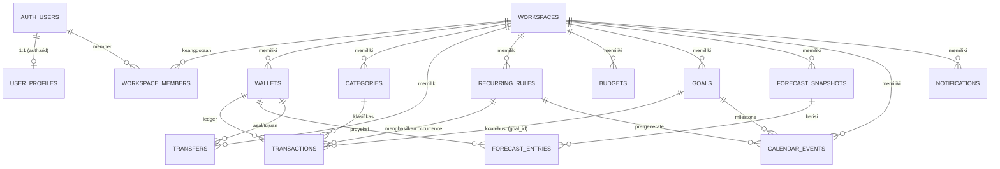
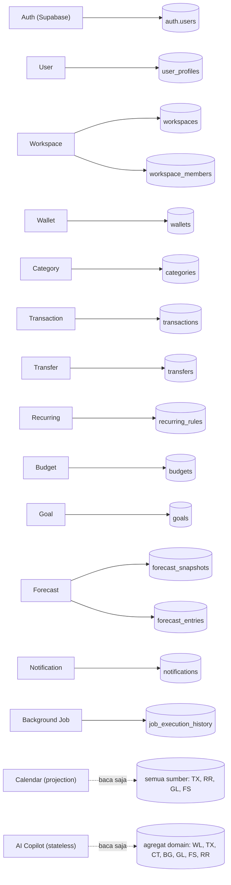
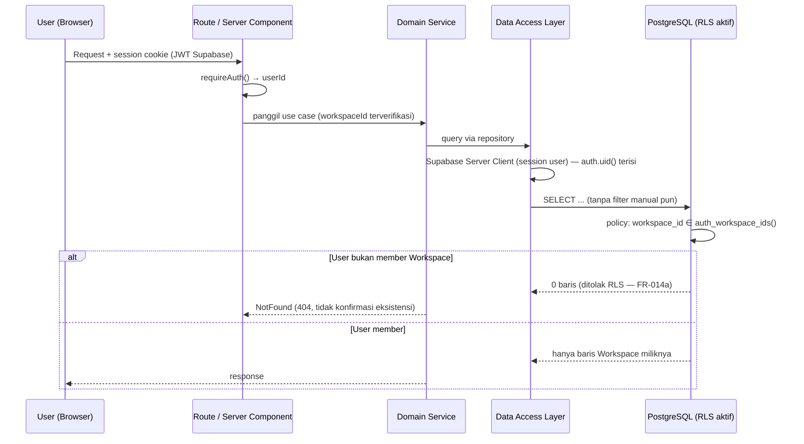
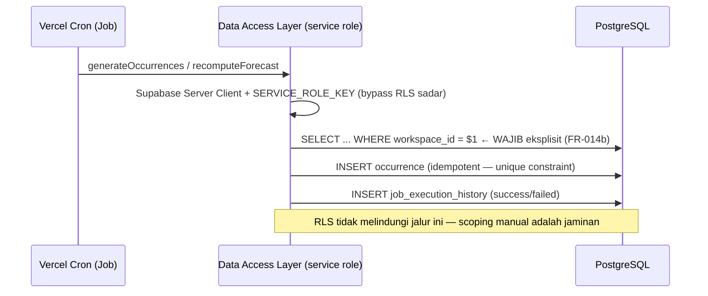

# 07. Database

**Status dokumen:** Melengkapi `05 Architecture.md` (diagram arsitektur & pola RLS) dan `08. System Design.md` (ERD ringkas). Dokumen ini adalah **referensi utama struktur database Nuxio**: definisi kolom lengkap, tipe data, constraint, enum, strategi indexing, model keamanan Row Level Security (RLS), pola akses data, dan aturan migrasi berbasis Supabase CLI.

**Penyelarasan stack:** dokumen ini mengikuti strategi akses database final di `04. PRD.md` Section 16 dan `05 Architecture.md` Section 5 — **PostgreSQL yang dihosting Supabase**, **SQL Migration via Supabase CLI**, **Supabase Client / Server Client** sebagai jalur akses, dan **RLS sebagai security layer utama di level database** (FR-014a, Product Principle #11). Dokumen ini **tidak memakai ORM** (Prisma atau lainnya) dan tidak mereferensikan model/migrasi ORM dalam bentuk apa pun.

---

## 7.1 Prinsip Skema

1. **`workspace_id` di hampir semua tabel sejak migrasi pertama** — bukan ditambahkan belakangan (ADR Section 13: keputusan paling mahal untuk diperbaiki setelah data production masuk). Pengecualian yang disengaja: `auth.users` (dikelola Supabase Auth), `user_profiles` (milik satu user), `transactions` dan `forecast_entries` (terisolasi lewat parent-nya — lihat 7.5).
2. **UUID sebagai primary key di semua tabel** (`gen_random_uuid()`) — ID tidak bisa ditebak lintas Workspace (mendukung NFR isolasi data, `04. PRD.md`).
3. **Money disimpan sebagai `bigint` integer minor unit** — bukan `numeric`/`float`/`decimal` (FR-038, Product Principle #6). `amount` selalu positif (`CHECK (amount > 0)`); arah income/expense ditentukan kolom `type`, bukan tanda negatif (FR-037). Satu-satunya nilai yang boleh negatif adalah nilai _derived_ (`cached_balance`, `projected_balance`).
4. **Soft delete via kolom `archived`**, bukan hard delete, untuk entitas yang mungkin sudah punya histori relasi: `wallets`, `categories`, `transactions`, `goals`, `recurring_rules` (FR-023/024/045). Di level database, tabel soft-delete **tidak diberi policy DELETE** — RLS menolak hard delete secara struktural (lihat 7.5).
5. **Kolom `cached_balance` dan sejenisnya adalah derived data** — wajib di-update dalam operasi atomik (Postgres function via RPC, lihat 7.7), tidak boleh diagregasi ulang per read (FR-025, FR-027, ADR Section 12).
6. **RLS aktif di seluruh tabel data finansial sejak migrasi pertama** — policy RLS adalah bagian dari migrasi yang sama dengan pembuatan tabel, bukan tambahan belakangan (FR-014a, `05 Architecture.md` 9.3). Tabel baru tanpa policy = lubang isolasi.
7. **Timestamp vs financial date dibedakan secara tegas:** `created_at`/`updated_at` bertipe `timestamptz` (momen teknis), sedangkan `financial_date`/`event_date`/`month` bertipe `date` (FR-020 — konsisten terhadap timezone Workspace, bukan timezone server). `updated_at` dikelola trigger `set_updated_at()` (lihat 7.8).
8. **Enum memakai PostgreSQL ENUM type** — definisi terpusat di 7.3; evolusi nilai via `ALTER TYPE ... ADD VALUE` dalam migrasi terpisah.
9. **Constraint database adalah jaring pengaman terakhir** (Section 13 PRD): unique constraint, foreign key, dan check constraint mencegah data invalid tersimpan meski ada bug di lapisan atas — mis. idempotency occurrence recurring dijamin oleh unique constraint, bukan hanya logic aplikasi (FR-063, FR-067).

---

## 7.2 Definisi Tabel Lengkap

Setiap tabel berikut dilengkapi: **kepemilikan modul** (dari `01 Module Specifications.md`), **tujuan**, **kolom**, **constraint**, dan **ringkasan policy RLS** (pola lengkap di 7.5). Konvensi: `id uuid PRIMARY KEY DEFAULT gen_random_uuid()`, `created_at timestamptz NOT NULL DEFAULT now()`, `updated_at timestamptz NOT NULL DEFAULT now()` (diisi trigger).

### 7.2.1 `auth.users` — dikelola Supabase Auth

**Kepemilikan:** Auth (eksternal, Supabase). **Tujuan:** identitas tunggal (user id) yang dirujuk seluruh modul.

Tabel ini dikelola sepenuhnya oleh Supabase Auth (kredensial, email, sesi). Aplikasi **tidak pernah menulis** ke tabel ini dan tidak menyimpan password dalam bentuk apa pun (Section 16 PRD). Aplikasi mereferensikan `auth.users.id` melalui `user_profiles.id` dan `workspace_members.user_id`, dan membacanya di policy RLS lewat fungsi `auth.uid()`.

**Auto-provisioning:** trigger `handle_new_user` (migrasi 7.8) membuat baris `user_profiles`, Personal Workspace, member admin, dan seed kategori default saat user pertama kali terdaftar (FR-009, FR-031).

### 7.2.2 `user_profiles`

**Kepemilikan:** User. **Tujuan:** profil tingkat akun di luar konteks Workspace (displayName, avatar).

| Kolom          | Tipe        | Constraint                                  | Catatan                                                                                       |
| -------------- | ----------- | ------------------------------------------- | --------------------------------------------------------------------------------------------- |
| `id`           | uuid        | PK, FK → `auth.users(id)` ON DELETE CASCADE | Satu baris per user Auth                                                                      |
| `display_name` | varchar(50) | NOT NULL, CHECK (char_length ≥ 1)           | Aturan 1–50 karakter (FR-135)                                                                 |
| `avatar_url`   | text        | NULL                                        | Path objek Supabase Storage, scoped per user (`user/<userId>/avatar`), diakses via signed URL |
| `created_at`   | timestamptz | default `now()`                             |                                                                                               |
| `updated_at`   | timestamptz | default `now()`                             |                                                                                               |

**Constraint tambahan:** — (satu baris per user dijamin oleh PK).

**RLS:** owner-only — `auth.uid() = id` untuk SELECT/INSERT/UPDATE. Tidak ada akses lintas user dalam bentuk apa pun.

### 7.2.3 `workspaces`

**Kepemilikan:** Workspace. **Tujuan:** root multi-tenancy; semua data finansial hidup di dalam Workspace.

| Kolom        | Tipe             | Constraint                                     | Catatan                                                                                                       |
| ------------ | ---------------- | ---------------------------------------------- | ------------------------------------------------------------------------------------------------------------- |
| `id`         | uuid             | PK                                             |                                                                                                               |
| `name`       | varchar(50)      | NOT NULL, CHECK (char_length BETWEEN 3 AND 50) | Aturan 3–50 karakter (FR-127)                                                                                 |
| `type`       | `workspace_type` | NOT NULL                                       | `personal` \| `business` — **immutable** pasca-pembuatan (FR-012)                                             |
| `currency`   | char(3)          | NOT NULL, default `IDR`                        | **Immutable** pasca-pembuatan (FR-019); semua wallet & transaksi di dalamnya wajib ber-currency sama (FR-048) |
| `timezone`   | text             | NOT NULL, default `Asia/Jakarta`               | Satu timezone untuk seluruh financial date Workspace (FR-020)                                                 |
| `plan`       | `plan_tier`      | NOT NULL, default `free`                       | Flag plan skeleton, tidak memengaruhi kalkulasi finansial (FR-136, FR-139)                                    |
| `created_at` | timestamptz      | default `now()`                                |                                                                                                               |
| `updated_at` | timestamptz      | default `now()`                                |                                                                                                               |

**RLS:** SELECT — `id ∈ auth_workspace_ids()`; INSERT — `auth.role() = 'authenticated'` (Personal dibuat trigger signup via service role; Business melalui RPC `create_business_workspace`); UPDATE — hanya member ber-role `admin`; DELETE — **tidak ada policy** (penghapusan Workspace di luar scope MVP).

**Catatan:** FR-011 (satu Personal Workspace per user) tidak bisa diekspresikan sebagai unique constraint sederhana tanpa denormalisasi `owner_id` — di-enforce di RPC/domain layer `create_workspace` (cek Workspace personal existing sebelum insert).

### 7.2.4 `workspace_members`

**Kepemilikan:** Workspace. **Tujuan:** keanggotaan user ↔ Workspace dengan role admin/member; dasar isolasi RLS.

| Kolom          | Tipe             | Constraint                                        | Catatan                                                  |
| -------------- | ---------------- | ------------------------------------------------- | -------------------------------------------------------- |
| `id`           | uuid             | PK                                                |                                                          |
| `workspace_id` | uuid             | FK → `workspaces(id)` ON DELETE CASCADE, NOT NULL |                                                          |
| `user_id`      | uuid             | FK → `auth.users(id)` ON DELETE CASCADE, NOT NULL |                                                          |
| `role`         | `workspace_role` | NOT NULL, default `member`                        | `admin` \| `member` — tanpa granular permission (FR-016) |
| `invited_at`   | timestamptz      | NOT NULL, default `now()`                         |                                                          |

**Constraint tambahan:** UNIQUE (`workspace_id`, `user_id`) — satu user tidak boleh terdaftar dua kali di Workspace yang sama. Index (`user_id`) — dipakai `auth_workspace_ids()` di setiap policy RLS.

**RLS:** SELECT — `workspace_id ∈ auth_workspace_ids()` (seluruh member dapat melihat daftar member); INSERT/UPDATE/DELETE — hanya admin Workspace terkait (`exists(... role = 'admin' ...)`, lihat contoh SQL 7.5). Insert Personal Workspace saat signup dilakukan trigger (service role).

### 7.2.5 `wallets`

**Kepemilikan:** Wallet. **Tujuan:** sumber dana (Cash/Bank/E-Wallet) dengan `cached_balance` sebagai derived data yang dijamin konsisten dengan ledger.

| Kolom            | Tipe          | Constraint                                         | Catatan                                                                                                               |
| ---------------- | ------------- | -------------------------------------------------- | --------------------------------------------------------------------------------------------------------------------- |
| `id`             | uuid          | PK                                                 |                                                                                                                       |
| `workspace_id`   | uuid          | FK → `workspaces(id)` ON DELETE RESTRICT, NOT NULL |                                                                                                                       |
| `name`           | varchar(50)   | NOT NULL                                           | 1–50 karakter                                                                                                         |
| `wallet_type`    | `wallet_type` | NULL                                               | Label opsional `personal`/`business`, hanya relevan di Business Workspace (FR-029), tidak memengaruhi kalkulasi saldo |
| `cached_balance` | bigint        | NOT NULL, default 0                                | **Derived data** — hanya berubah lewat operasi atomik Transaction/Transfer (7.4); boleh negatif (FR-026)              |
| `currency`       | char(3)       | NOT NULL, default `IDR`                            | Wajib sama dengan currency Workspace (FR-048)                                                                         |
| `archived`       | boolean       | NOT NULL, default false                            | Soft delete (FR-023/024)                                                                                              |
| `created_at`     | timestamptz   | default `now()`                                    |                                                                                                                       |
| `updated_at`     | timestamptz   | default `now()`                                    |                                                                                                                       |

**Constraint tambahan:** UNIQUE (`id`, `workspace_id`) — dibutuhkan composite FK dari `transfers` (7.2.8).

**RLS:** pola standar 4 policy (SELECT/INSERT/UPDATE; DELETE tidak ada — hard delete ditolak RLS, hanya arsip via UPDATE).

**Catatan:** Wallet archived menolak transaksi baru — divalidasi di RPC `create_transaction`/`create_transfer` (FR-023).

### 7.2.6 `categories`

**Kepemilikan:** Category. **Tujuan:** klasifikasi income/expense; set default berbeda per tipe Workspace (FR-031).

| Kolom          | Tipe                 | Constraint                                         | Catatan                                               |
| -------------- | -------------------- | -------------------------------------------------- | ----------------------------------------------------- |
| `id`           | uuid                 | PK                                                 |                                                       |
| `workspace_id` | uuid                 | FK → `workspaces(id)` ON DELETE RESTRICT, NOT NULL |                                                       |
| `name`         | varchar(30)          | NOT NULL                                           | 1–30 karakter (FR-032/033)                            |
| `direction`    | `category_direction` | NOT NULL                                           | `income` \| `expense`                                 |
| `is_default`   | boolean              | NOT NULL, default false                            | Membedakan kategori sistem vs custom (FR-031, FR-034) |
| `archived`     | boolean              | NOT NULL, default false                            | Soft delete — histori transaksi tetap utuh (FR-035)   |
| `created_at`   | timestamptz          | default `now()`                                    |                                                       |
| `updated_at`   | timestamptz          | default `now()`                                    |                                                       |

**Constraint tambahan:** UNIQUE partial (`workspace_id`, `name`, `direction`) WHERE NOT `archived` — satu kategori aktif per kombinasi nama+tipe dalam satu Workspace (FR-033 + `01 Module Specifications.md` §5).

**RLS:** pola standar; DELETE tidak ada (soft delete via UPDATE).

**Catatan:** kategori default di-seed saat Workspace dibuat (personal via trigger signup, business via RPC) — seeding idempotent di 7.8.

### 7.2.7 `transactions`

**Kepemilikan:** Transaction (occurrence ditulis oleh Recurring atas nama Transaction). **Tujuan:** unit ledger terkecil; menggerakkan saldo Wallet, realisasi Budget, Calendar, dan Forecast.

| Kolom               | Tipe                 | Constraint                                          | Catatan                                                                                                        |
| ------------------- | -------------------- | --------------------------------------------------- | -------------------------------------------------------------------------------------------------------------- |
| `id`                | uuid                 | PK                                                  |                                                                                                                |
| `wallet_id`         | uuid                 | FK → `wallets(id)` ON DELETE RESTRICT, NOT NULL     | **Tidak ada `workspace_id` langsung** — terisolasi lewat Wallet (08 System Design 8.2); RLS via subquery (7.5) |
| `category_id`       | uuid                 | FK → `categories(id)` ON DELETE RESTRICT, NULL      | Nullable — kategori opsional (FR-049); kategori hanya soft-delete sehingga referensi historis tetap valid      |
| `goal_id`           | uuid                 | FK → `goals(id)` ON DELETE RESTRICT, NULL           | Diisi hanya jika transaksi adalah kontribusi Goal — inilah satu-satunya representasi kontribusi (FR-090/091)   |
| `recurring_rule_id` | uuid                 | FK → `recurring_rules(id)` ON DELETE RESTRICT, NULL | Tautan occurrence → rule; dasar idempotency (FR-063, FR-067) dan traceability                                  |
| `type`              | `transaction_type`   | NOT NULL                                            | `income` \| `expense` — arah, bukan tanda amount (FR-037)                                                      |
| `status`            | `transaction_status` | NOT NULL, default `planned`                         | `planned` \| `completed` (FR-039)                                                                              |
| `amount`            | bigint               | NOT NULL, CHECK (amount > 0)                        | Integer minor unit (FR-038)                                                                                    |
| `financial_date`    | date                 | NOT NULL                                            | Boleh tanggal masa depan untuk `planned` (FR-042)                                                              |
| `note`              | text                 | NULL                                                |                                                                                                                |
| `archived`          | boolean              | NOT NULL, default false                             | Soft delete (FR-045)                                                                                           |
| `created_at`        | timestamptz          | default `now()`                                     |                                                                                                                |
| `updated_at`        | timestamptz          | default `now()`                                     |                                                                                                                |

**Constraint tambahan:**

- UNIQUE partial (`recurring_rule_id`, `financial_date`) WHERE `recurring_rule_id IS NOT NULL` — **idempotency key occurrence**: retry job tidak pernah menghasilkan occurrence duplikat (FR-063, FR-067, ADR Section 10).

**Index:** lihat 7.6.

**RLS:** via subquery `wallets` → `workspace_id ∈ auth_workspace_ids()` (SELECT/INSERT/UPDATE); tidak ada policy DELETE — soft delete via UPDATE (FR-045).

**Catatan (validasi domain, di-enforce di RPC `create_transaction`/`update_transaction`):**

- `completed` hanya boleh untuk `financial_date ≤ hari ini` (timezone Workspace) (FR-043).
- Wallet target harus aktif (tidak archived) (FR-023).
- Mutasi Transaction + update `cached_balance` dalam **satu operasi atomik** (Product Principle #5, ADR Section 7).

### 7.2.8 `transfers`

**Kepemilikan:** Transfer. **Tujuan:** perpindahan dana antar dua Wallet dalam Workspace yang sama — satu entitas, bukan dua Transaction yang tampak income/expense (FR-053, FR-059).

| Kolom            | Tipe        | Constraint                                                                              | Catatan                                          |
| ---------------- | ----------- | --------------------------------------------------------------------------------------- | ------------------------------------------------ |
| `id`             | uuid        | PK                                                                                      |                                                  |
| `workspace_id`   | uuid        | FK → `workspaces(id)` ON DELETE RESTRICT, NOT NULL                                      | Denormalisasi untuk RLS sederhana + composite FK |
| `wallet_from_id` | uuid        | NOT NULL, FK composite (`workspace_id`, `wallet_from_id`) → `wallets(workspace_id, id)` | Menjamin wallet asal milik Workspace yang sama   |
| `wallet_to_id`   | uuid        | NOT NULL, FK composite (`workspace_id`, `wallet_to_id`) → `wallets(workspace_id, id)`   | Menjamin wallet tujuan milik Workspace yang sama |
| `amount`         | bigint      | NOT NULL, CHECK (amount > 0)                                                            | Integer minor unit                               |
| `financial_date` | date        | NOT NULL                                                                                |                                                  |
| `note`           | text        | NULL                                                                                    |                                                  |
| `created_at`     | timestamptz | default `now()`                                                                         |                                                  |

**Constraint tambahan:** CHECK (`wallet_from_id <> wallet_to_id`) — FR-055. Aturan "kedua wallet satu Workspace" dijamin composite FK + divalidasi RPC `create_transfer`.

**RLS:** pola standar (memiliki `workspace_id` langsung). DELETE tidak ada (tidak ada penghapusan Transfer di MVP).

**Catatan:** kedua sisi dibuat **dalam satu Postgres function atomik** (`create_transfer` — BEGIN/COMMIT) (FR-056, FR-060). Secara struktural Transfer **tidak mungkin** masuk realisasi Budget/income-expense karena bukan baris `transactions` (FR-054, FR-058, FR-082).

### 7.2.9 `recurring_rules`

**Kepemilikan:** Recurring. **Tujuan:** template aturan yang menghasilkan occurrence sebagai Transaction `planned` via background job (FR-061/062).

| Kolom          | Tipe                   | Constraint                                         | Catatan                                                                                                 |
| -------------- | ---------------------- | -------------------------------------------------- | ------------------------------------------------------------------------------------------------------- |
| `id`           | uuid                   | PK                                                 |                                                                                                         |
| `workspace_id` | uuid                   | FK → `workspaces(id)` ON DELETE RESTRICT, NOT NULL |                                                                                                         |
| `wallet_id`    | uuid                   | FK → `wallets(id)` NOT NULL                        | Target occurrence; harus aktif saat job berjalan (divalidasi RPC)                                       |
| `category_id`  | uuid                   | FK → `categories(id)` NOT NULL                     | Arah income/expense occurrence **mengikuti** `categories.direction` — tidak disimpan duplikat           |
| `amount`       | bigint                 | NOT NULL, CHECK (amount > 0)                       |                                                                                                         |
| `frequency`    | `recurrence_frequency` | NOT NULL, default `monthly`                        | Hanya bulanan di MVP (FR-061)                                                                           |
| `start_date`   | date                   | NOT NULL                                           | Day-of-month diambil dari `start_date`; bulan tanpa tanggal itu → fallback hari terakhir bulan (FR-064) |
| `is_active`    | boolean                | NOT NULL, default true                             | Pause tanpa hapus (FR-069)                                                                              |
| `archived`     | boolean                | NOT NULL, default false                            | Soft delete — occurrence `completed` tetap utuh (FR-066)                                                |
| `created_at`   | timestamptz            | default `now()`                                    |                                                                                                         |
| `updated_at`   | timestamptz            | default `now()`                                    |                                                                                                         |

**RLS:** pola standar; DELETE tidak ada (soft delete via UPDATE).

**Catatan:** job generator hanya memproses rule dengan `is_active = true` AND NOT `archived`. Perubahan rule hanya menyentuh occurrence masa depan yang belum `completed` (FR-065) — di-enforce di job & update RPC.

### 7.2.10 `budgets`

**Kepemilikan:** Budget. **Tujuan:** batas pengeluaran bulanan per kategori; realisasi dihitung derived dari Transaction (tidak disimpan) (FR-079–FR-085).

| Kolom          | Tipe        | Constraint                                                     | Catatan                                  |
| -------------- | ----------- | -------------------------------------------------------------- | ---------------------------------------- |
| `id`           | uuid        | PK                                                             |                                          |
| `workspace_id` | uuid        | FK → `workspaces(id)` ON DELETE RESTRICT, NOT NULL             |                                          |
| `category_id`  | uuid        | FK → `categories(id)` ON DELETE RESTRICT, NOT NULL             |                                          |
| `amount`       | bigint      | NOT NULL, CHECK (amount > 0)                                   | Batas bulanan (FR-079)                   |
| `month`        | date        | NOT NULL, CHECK (`month` = date_trunc('month', `month`)::date) | Hari-1 bulan berjalan, mis. `2026-08-01` |
| `created_at`   | timestamptz | default `now()`                                                |                                          |
| `updated_at`   | timestamptz | default `now()`                                                |                                          |

**Constraint tambahan:** UNIQUE (`workspace_id`, `category_id`, `month`) — satu Budget aktif per kombinasi kategori+bulan (FR-080).

**RLS:** pola standar; DELETE diizinkan untuk member (FR-087 — penghapusan Budget tidak menyentuh histori transaksi).

**Catatan:** realisasi = SUM `transactions.amount` WHERE `type='expense'` AND `status='completed'` AND NOT `archived` AND `financial_date ≥ month` AND `financial_date < month+1` — dihitung di query agregasi (bukan kolom), konsisten dengan aturan "sejak tanggal 1 bulan" (FR-085).

### 7.2.11 `goals`

**Kepemilikan:** Goal. **Tujuan:** target finansial jangka menengah/panjang; progress terhubung kontribusi nyata lewat Transaction (FR-089–FR-098).

| Kolom           | Tipe         | Constraint                                         | Catatan                                  |
| --------------- | ------------ | -------------------------------------------------- | ---------------------------------------- |
| `id`            | uuid         | PK                                                 |                                          |
| `workspace_id`  | uuid         | FK → `workspaces(id)` ON DELETE RESTRICT, NOT NULL |                                          |
| `name`          | varchar(100) | NOT NULL                                           |                                          |
| `target_amount` | bigint       | NOT NULL, CHECK (> 0)                              | FR-089                                   |
| `target_date`   | date         | NOT NULL                                           | Harus di masa depan saat dibuat (FR-089) |
| `archived`      | boolean      | NOT NULL, default false                            | Soft delete (`archiveGoal`)              |
| `created_at`    | timestamptz  | default `now()`                                    |                                          |
| `updated_at`    | timestamptz  | default `now()`                                    |                                          |

**RLS:** pola standar; DELETE tidak ada (soft delete via UPDATE).

**Catatan:**

- Progress & status (`on-track`/`terlambat`/`achieved`) adalah **derived value** — dihitung saat response, tidak disimpan sebagai kolom yang bisa stale (09 Backend 9.3, FR-092/093).
- Kontribusi = Transaction dengan `goal_id` terisi; **tidak ada tabel `goal_contributions`** — struktur ini mencegah double counting saldo Wallet (FR-091, `08. System Design.md` 8.2).

### 7.2.12 `forecast_snapshots`

**Kepemilikan:** Forecast. **Tujuan:** proyeksi saldo immutable per Workspace, dihasilkan background job (FR-099, FR-101).

| Kolom          | Tipe        | Constraint                                         | Catatan                                                    |
| -------------- | ----------- | -------------------------------------------------- | ---------------------------------------------------------- |
| `id`           | uuid        | PK                                                 |                                                            |
| `workspace_id` | uuid        | FK → `workspaces(id)` ON DELETE RESTRICT, NOT NULL |                                                            |
| `generated_at` | timestamptz | NOT NULL, default `now()`                          | UI menampilkan timestamp ini (bukan menyamarkan usia data) |
| `horizon_days` | smallint    | NOT NULL, CHECK (IN (30, 60))                      | Rentang proyeksi MVP (FR-099)                              |

**RLS:** SELECT — member (`workspace_id ∈ auth_workspace_ids()`); INSERT/UPDATE/DELETE — **tidak ada policy user** (hanya service role job yang menulis) → snapshot **immutable** di-enforce dua lapis (FR-101).

### 7.2.13 `forecast_entries`

**Kepemilikan:** Forecast. **Tujuan:** baris proyeksi harian per Wallet dengan komponen yang membedakan fakta/asumsi/estimasi (FR-103) dan dapat ditelusuri ke input (FR-108).

| Kolom                  | Tipe   | Constraint                                                | Catatan                                                                                        |
| ---------------------- | ------ | --------------------------------------------------------- | ---------------------------------------------------------------------------------------------- |
| `id`                   | uuid   | PK                                                        |                                                                                                |
| `forecast_snapshot_id` | uuid   | FK → `forecast_snapshots(id)` ON DELETE CASCADE, NOT NULL |                                                                                                |
| `wallet_id`            | uuid   | FK → `wallets(id)` ON DELETE RESTRICT, NOT NULL           | Forecast dihitung per Wallet (FR-099)                                                          |
| `date`                 | date   | NOT NULL                                                  |                                                                                                |
| `fact_balance`         | bigint | NOT NULL                                                  | Saldo dari fakta (Transaction `completed`)                                                     |
| `assumed_income`       | bigint | NOT NULL, default 0                                       | Asumsi terjadwal (income `planned`/recurring)                                                  |
| `assumed_expense`      | bigint | NOT NULL, default 0                                       | Asumsi terjadwal (bill recurring)                                                              |
| `estimated_expense`    | bigint | NOT NULL, default 0                                       | Estimasi historis non-recurring (rata-rata ~30 hari)                                           |
| `projected_balance`    | bigint | NOT NULL                                                  | `fact_balance + assumed_income − assumed_expense − estimated_expense` (boleh negatif — sinyal) |

**Constraint tambahan:** UNIQUE (`forecast_snapshot_id`, `wallet_id`, `date`) — satu entry per kombinasi.

**RLS:** SELECT — member via subquery `forecast_snapshots` → `workspace_id ∈ auth_workspace_ids()`; write hanya service role.

**Catatan:** rumus deterministik mengikuti ADR Section 9; `estimated_expense = 0` pada cold start (bukan error — indikasi "proyeksi terbatas" ditangani di UI, FR-102).

### 7.2.14 `calendar_events`

**Kepemilikan:** — (Calendar adalah projection murni; entri di sini adalah hasil pre-generate, **bukan sumber kebenaran baru** — ADR Section 10, FR-075). **Tujuan:** tampilan bulanan Calendar tanpa kalkulasi on-the-fly.

| Kolom          | Tipe                   | Constraint                                         | Catatan                                                                                      |
| -------------- | ---------------------- | -------------------------------------------------- | -------------------------------------------------------------------------------------------- |
| `id`           | uuid                   | PK                                                 |                                                                                              |
| `workspace_id` | uuid                   | FK → `workspaces(id)` ON DELETE RESTRICT, NOT NULL |                                                                                              |
| `source_type`  | `calendar_source_type` | NOT NULL                                           | `recurring_bill` \| `goal_milestone`                                                         |
| `source_id`    | uuid                   | NULL                                               | Referensi polimorfik ke `recurring_rules.id` atau `goals.id` (tanpa FK — dua sumber berbeda) |
| `event_date`   | date                   | NOT NULL                                           | Hasil pre-generate (FR-062)                                                                  |
| `amount`       | bigint                 | NULL                                               | Nilai nominal event; nullable untuk milestone tanpa nominal                                  |
| `created_at`   | timestamptz            | default `now()`                                    |                                                                                              |

**Constraint tambahan:** UNIQUE (`source_type`, `source_id`, `event_date`) — mencegah duplikasi event saat retry job (FR-067).

**RLS:** pola standar; write hanya service role job (user read-only).

**Catatan:** event **regenerable** — bug pada data finansial selalu diperbaiki di modul asalnya; entri ini boleh di-rebuild tanpa kehilangan sumber kebenaran (ADR Section 10).

### 7.2.15 `notifications`

**Kepemilikan:** Notification. **Tujuan:** notifikasi in-app hasil trigger Budget/Forecast/Recurring/Goal (FR-109–FR-114).

| Kolom          | Tipe                | Constraint                                         | Catatan                                                                          |
| -------------- | ------------------- | -------------------------------------------------- | -------------------------------------------------------------------------------- |
| `id`           | uuid                | PK                                                 |                                                                                  |
| `workspace_id` | uuid                | FK → `workspaces(id)` ON DELETE RESTRICT, NOT NULL |                                                                                  |
| `type`         | `notification_type` | NOT NULL                                           | 5 jenis trigger (7.3)                                                            |
| `payload`      | jsonb               | NOT NULL                                           | Referensi entitas pemicu (`budget_id`, `forecast_snapshot_id`, tanggal, nominal) |
| `read`         | boolean             | NOT NULL, default false                            | Badge unread (FR-112)                                                            |
| `created_at`   | timestamptz         | NOT NULL, default `now()`                          |                                                                                  |

**Constraint tambahan:** UNIQUE partial (`workspace_id`, `type`, `payload`) WHERE NOT `read` — **dedupe level database**: kondisi sama yang belum dibaca tidak pernah dibuat dua kali (FR-111); window waktu dedupe di layer aplikasi.

**RLS:** SELECT/UPDATE (mark read) — member; INSERT — service role (job trigger).

**Catatan:** notifikasi murni informatif — tidak pernah memicu aksi otomatis (FR — Business Rule §6.12).

### 7.2.16 `job_execution_history`

**Kepemilikan:** — (operasional, ditulis background job). **Tujuan:** execution history dua job MVP yang dapat ditelusuri (FR-068, FR-108; NFR `02 Non-Functional Requirements.md` §4 Background Job Reliability).

| Kolom          | Tipe         | Constraint | Catatan                                                                     |
| -------------- | ------------ | ---------- | --------------------------------------------------------------------------- |
| `id`           | uuid         | PK         |                                                                             |
| `job_type`     | `job_type`   | NOT NULL   | `recurring_generator` \| `forecast_recompute`                               |
| `workspace_id` | uuid         | NOT NULL   | Scoping per Workspace — kegagalan satu Workspace tidak menyentuh batch lain |
| `status`       | `job_status` | NOT NULL   | `success` \| `failed`                                                       |
| `started_at`   | timestamptz  | NOT NULL   |                                                                             |
| `finished_at`  | timestamptz  | NULL       | Durasi = `finished_at − started_at`                                         |
| `detail`       | jsonb        | NULL       | Jumlah diproses, pesan error (tanpa PII)                                    |

**RLS:** RLS enabled, **tanpa policy untuk user** — hanya service role yang membaca/menulis. Ini data operasional, bukan data finansial user.

### 7.2.17 AI Context — bukan tabel

**Kepemilikan:** — (stateless). AI Copilot **tidak memiliki tabel apa pun** di MVP (`01 Module Specifications.md` §14 — chat stateless, konteks dibangun on-demand). Implikasi database:

- `FinancialContext` dibangun server-side oleh Context Builder **dari domain service yang sama dengan UI** — hasil query via Supabase Server Client dengan session user, sehingga RLS berlaku normal dan isolasi Workspace tetap terjaga (FR-123).
- AI **read-only** — tidak ada jalur tulis ke tabel mana pun (FR-122, Product Principle #8); data mentah transaksi tidak pernah dikirim ke LLM (FR-116).
- Tidak ada tabel chat history / prompt log di MVP.

---

## 7.3 Enum Types (PostgreSQL)

| Type                   | Nilai                                                                                                                    | Dipakai di                       | Catatan                                                                 |
| ---------------------- | ------------------------------------------------------------------------------------------------------------------------ | -------------------------------- | ----------------------------------------------------------------------- |
| `workspace_type`       | `personal`, `business`                                                                                                   | `workspaces.type`                | Immutable (FR-012)                                                      |
| `workspace_role`       | `admin`, `member`                                                                                                        | `workspace_members.role`         | Tanpa granular permission (FR-016)                                      |
| `wallet_type`          | `personal`, `business`                                                                                                   | `wallets.wallet_type`            | Label opsional, hanya Business Workspace (FR-029)                       |
| `category_direction`   | `income`, `expense`                                                                                                      | `categories.direction`           |                                                                         |
| `transaction_type`     | `income`, `expense`                                                                                                      | `transactions.type`              | Arah ditentukan di sini, bukan tanda amount (FR-037)                    |
| `transaction_status`   | `planned`, `completed`                                                                                                   | `transactions.status`            | Hanya `completed` memengaruhi saldo (FR-039/040)                        |
| `recurrence_frequency` | `monthly`                                                                                                                | `recurring_rules.frequency`      | Hanya bulanan di MVP (FR-061)                                           |
| `calendar_source_type` | `recurring_bill`, `goal_milestone`                                                                                       | `calendar_events.source_type`    |                                                                         |
| `notification_type`    | `budget_near_limit`, `budget_over_limit`, `forecast_negative_balance`, `recurring_due_soon`, `goal_deadline_approaching` | `notifications.type`             | Satu-ke-satu dengan tabel trigger PRD Section 15                        |
| `plan_tier`            | `free`                                                                                                                   | `workspaces.plan`                | Skeleton monetisasi (FR-136); nilai baru via `ALTER TYPE ... ADD VALUE` |
| `job_type`             | `recurring_generator`, `forecast_recompute`                                                                              | `job_execution_history.job_type` |                                                                         |
| `job_status`           | `success`, `failed`                                                                                                      | `job_execution_history.status`   |                                                                         |

**Aturan evolusi enum:** nilai baru ditambah lewat `ALTER TYPE ... ADD VALUE` dalam migrasi terpisah; nilai yang sudah dipakai data **tidak pernah dihapus** dari definisi type.

---

## 7.4 Financial Data Rules — Enforced di Database & RPC

Seluruh aturan di bawah berasal dari `04. PRD.md` Section 11 (Business Rules) dan `01 Module Specifications.md`. Kolom/constraint berikut **menjaga invariant di level database**, bukan hanya konvensi kode:

| #   | Aturan                                                                                                                                                                                                                                                                                                                                                                                         | Enforced by                                                                                     |
| --- | ---------------------------------------------------------------------------------------------------------------------------------------------------------------------------------------------------------------------------------------------------------------------------------------------------------------------------------------------------------------------------------------------- | ----------------------------------------------------------------------------------------------- |
| 1   | **Money = `bigint` integer minor unit.** Tidak ada `numeric`/`float`/`decimal` di tabel mana pun (FR-038, Product Principle #6). Konversi format tampilan hanya di lapisan presentasi.                                                                                                                                                                                                         | Definisi kolom (seluruh kolom uang `bigint`)                                                    |
| 2   | **`amount` selalu positif; arah dari `type`.** Income/expense ditentukan `transactions.type` / `categories.direction`, bukan tanda negatif (FR-037, FR-038).                                                                                                                                                                                                                                   | `CHECK (amount > 0)` + kolom `type`                                                             |
| 3   | **Planned vs Completed.** `planned` adalah asumsi terjadwal; **hanya `completed` yang memengaruhi `cached_balance`** dan realisasi Budget (FR-040). `completed` tidak boleh memiliki `financial_date` di masa depan relatif timezone Workspace (FR-043) — divalidasi di RPC `create_transaction`/`update_transaction`.                                                                         | Kolom `status` + validasi RPC (tidak bisa jadi static CHECK karena bergantung tanggal berjalan) |
| 4   | **Transfer bukan income/expense.** Transfer tersimpan di tabel terpisah; tidak pernah masuk laporan income/expense, realisasi Budget, atau agregat lain selain saldo (FR-054, FR-058, FR-082). Kedua sisi atomik dalam satu function (FR-056, FR-060).                                                                                                                                         | Struktur tabel terpisah + RPC atomik `create_transfer`                                          |
| 5   | **Cached balance.** `wallets.cached_balance` adalah derived data yang di-update **dalam operasi atomik yang sama** dengan mutasi ledger (ADR Section 12, Product Principle #5) — tidak pernah dihitung ulang dari agregat per read. Harus dapat direkonsiliasi terhadap seluruh Transaction `completed` kapan saja (FR-025, FR-027). Nilai negatif diizinkan (FR-026) — tanpa `CHECK` positif. | RPC atomik + tidak ada UPDATE path lain                                                         |
| 6   | **Monthly budget.** Satu Budget aktif per kombinasi (kategori, bulan) (FR-080). Realisasi = SUM Transaction `expense` + `completed` + tidak archived pada kategori terkait **sejak tanggal 1 bulan tersebut** (FR-081, FR-085); Transfer tidak pernah masuk (FR-082).                                                                                                                          | UNIQUE (`workspace_id`, `category_id`, `month`) + query agregasi                                |
| 7   | **Goal tracking.** Kontribusi = Transaction dengan `goal_id` — tidak ada tabel kontribusi terpisah (FR-090, FR-091 → anti double counting). Progress = SUM kontribusi ÷ `target_amount` (FR-092); status (`on-track`/`terlambat`/`achieved`) derived (FR-093).                                                                                                                                 | FK `transactions.goal_id` + query agregasi                                                      |
| 8   | **Forecast snapshot.** Snapshot **immutable** (FR-101) — tidak ada policy UPDATE user; snapshot baru dibuat dengan data terbaru. Entry membedakan fakta/asumsi/estimasi (FR-103) dan dapat ditelusuri ke input (FR-108). Forecast **tidak pernah menulis** ke `transactions`/ledger (FR-104).                                                                                                  | RLS (tanpa policy tulis user) + struktur kolom komponen                                         |
| 9   | **Soft delete.** Wallet, Category, Transaction, Goal, Recurring Rule di-archive, bukan dihapus fisik (FR-023/024/034/035/045/066). Transaction yang di-archive tidak dihitung di saldo/Budget/progress Goal (FR-046, FR-051, FR-052).                                                                                                                                                          | Kolom `archived` + **tidak ada policy DELETE** di RLS (hard delete ditolak database)            |

---

## 7.5 Security Model — Row Level Security (RLS)

### 7.5.1 Posisi RLS: security layer utama di level database

**RLS adalah security layer utama di level database.** Seluruh akses data user berjalan melalui Supabase Client/Server Client yang membawa session token user — PostgreSQL tahu siapa user yang bertanya (`auth.uid()`), dan policy RLS menolak baris milik Workspace yang bukan keanggotaan user (FR-014a, Product Principle #11).

**Backend validation bukan pengganti RLS.** Membership check di lapisan aplikasi (`verifyWorkspaceMembership`) **wajib tetap ada** sebagai kontrol pertama (memberikan semantik error 404 vs 403, validasi role admin, dan pesan yang tidak membocorkan keberadaan resource lintas-Workspace — `10. API.md` 10.2), tetapi:

- RLS tetap aktif dan menolak baris lintas-Workspace **bahkan jika query aplikasi lupa filter `workspace_id`** (bug, regresi, atau jalur baru yang tidak sadar).
- Kehilangan salah satu lapisan **tidak boleh** membuka kebocoran — dua lapisan independen (defense in depth).

Verifikasi keamanan di `16. Testing.md` (Skenario C) dan MVP Checklist `04. PRD.md` Section 20: test yang **sengaja menghilangkan filter aplikasi** harus tetap menghasilkan 0 baris lintas-Workspace karena RLS.

### 7.5.2 Helper policy

```sql
-- Fungsi bantu: daftar workspace_id tempat user saat ini menjadi member.
-- security definer + search_path tetap: dipanggil dari dalam policy RLS.
create or replace function public.auth_workspace_ids()
returns setof uuid
language sql
security definer
stable
set search_path = public
as $$
  select workspace_id
  from workspace_members
  where user_id = auth.uid();
$$;
```

### 7.5.3 Policy concept

Setiap tabel data finansial di-enable RLS dan diberi policy per operasi:

| Operasi | Policy                 | Semantik                                                                |
| ------- | ---------------------- | ----------------------------------------------------------------------- |
| SELECT  | `USING (...)`          | Baris yang boleh dibaca user                                            |
| INSERT  | `WITH CHECK (...)`     | Baris yang boleh dibuat user                                            |
| UPDATE  | `USING` + `WITH CHECK` | Baris yang boleh diubah, dan hasil ubah tetap di dalam scope            |
| DELETE  | `USING`                | Baris yang boleh dihapus — **sengaja tidak ada** pada tabel soft-delete |

### 7.5.4 Matriks policy per tabel

Pola standar = `workspace_id IN (SELECT auth_workspace_ids())`.

| Tabel                   | SELECT                 | INSERT                                                       | UPDATE                         | DELETE           | Catatan                                        |
| ----------------------- | ---------------------- | ------------------------------------------------------------ | ------------------------------ | ---------------- | ---------------------------------------------- |
| `user_profiles`         | `auth.uid() = id`      | `auth.uid() = id`                                            | `auth.uid() = id`              | —                | Owner-only                                     |
| `workspaces`            | member                 | authenticated (via RPC/trigger)                              | **admin member**               | —                | Role di-enforce di DB                          |
| `workspace_members`     | member                 | **admin member**                                             | **admin member** (role change) | **admin member** | Insert personal saat signup via service role   |
| `wallets`               | member                 | member                                                       | member                         | —                | Soft delete                                    |
| `categories`            | member                 | member                                                       | member                         | —                | Soft delete                                    |
| `transactions`          | member (via `wallets`) | member (via `wallets`, + cek `goal`/`category` se-Workspace) | member (via `wallets`)         | —                | Soft delete; tidak ada `workspace_id` langsung |
| `transfers`             | member                 | member                                                       | —                              | —                | Tidak ada update/delete di MVP                 |
| `recurring_rules`       | member                 | member                                                       | member                         | —                | Soft delete                                    |
| `budgets`               | member                 | member                                                       | member                         | member           | Hard delete diperbolehkan (FR-087)             |
| `goals`                 | member                 | member                                                       | member                         | —                | Soft delete                                    |
| `forecast_snapshots`    | member                 | — (service role)                                             | —                              | —                | Immutable (FR-101)                             |
| `forecast_entries`      | member (via snapshot)  | — (service role)                                             | —                              | —                | Ikut snapshot                                  |
| `calendar_events`       | member                 | — (service role)                                             | —                              | —                | Pre-generate job                               |
| `notifications`         | member                 | — (service role)                                             | member (mark read)             | —                |                                                |
| `job_execution_history` | —                      | — (service role)                                             | —                              | —                | Data operasional, tanpa akses user             |

### 7.5.5 Contoh policy — `transactions` (tabel tanpa `workspace_id`)

```sql
alter table transactions enable row level security;

create policy "txn_select" on transactions for select
using (
  exists (
    select 1 from wallets w
    where w.id = transactions.wallet_id
      and w.workspace_id in (select auth_workspace_ids())
  )
);

create policy "txn_insert" on transactions for insert
with check (
  exists (
    select 1 from wallets w
    where w.id = transactions.wallet_id
      and w.workspace_id in (select auth_workspace_ids())
  )
  and (
    transactions.goal_id is null
    or exists (
      select 1 from goals g
      where g.id = transactions.goal_id
        and g.workspace_id in (select auth_workspace_ids())
    )
  )
  and (
    transactions.category_id is null
    or exists (
      select 1 from categories c
      where c.id = transactions.category_id
        and c.workspace_id in (select auth_workspace_ids())
    )
  )
  and transactions.recurring_rule_id is null  -- occurrence hanya via service role
);

create policy "txn_update" on transactions for update
using (
  exists (
    select 1 from wallets w
    where w.id = transactions.wallet_id
      and w.workspace_id in (select auth_workspace_ids())
  )
)
with check (
  -- sama dengan kondisi txn_insert
);

-- Soft delete (FR-045): TIDAK ADA policy DELETE → hard delete ditolak RLS.
```

### 7.5.6 Contoh policy — `workspace_members` (role boundary)

```sql
alter table workspace_members enable row level security;

-- Baca: seluruh member Workspace dapat melihat daftar member (FR-130).
create policy "wm_select" on workspace_members for select
using (workspace_id in (select auth_workspace_ids()));

-- Tulis (invite/remove/change role): hanya admin Workspace tersebut (FR-016/017).
create policy "wm_insert" on workspace_members for insert
with check (
  exists (
    select 1 from workspace_members a
    where a.workspace_id = workspace_members.workspace_id
      and a.user_id = auth.uid()
      and a.role = 'admin'
  )
);

create policy "wm_update" on workspace_members for update
using (
  exists (
    select 1 from workspace_members a
    where a.workspace_id = workspace_members.workspace_id
      and a.user_id = auth.uid()
      and a.role = 'admin'
  )
);

create policy "wm_delete" on workspace_members for delete
using (
  exists (
    select 1 from workspace_members a
    where a.workspace_id = workspace_members.workspace_id
      and a.user_id = auth.uid()
      and a.role = 'admin'
  )
);
```

### 7.5.7 Grants & roles

| Role PostgreSQL            | Hak                                                 | Catatan                                            |
| -------------------------- | --------------------------------------------------- | -------------------------------------------------- |
| `authenticated` (JWT user) | SELECT/INSERT/UPDATE/DELETE sesuai policy per tabel | Jalur default seluruh request user                 |
| `service_role`             | Bypass RLS (tanpa policy)                           | Hanya server-side: background job & operasi sistem |
| `anon`                     | Tidak ada akses ke tabel finansial                  | Deny by default                                    |

### 7.5.8 Service role — bypass yang disadari (FR-014b)

Hanya dua kategori operasi yang memakai service role:

1. **Background job** (recurring generator, forecast recompute) — berjalan tanpa konteks user; **wajib men-scope `workspace_id` secara eksplisit per query** karena RLS tidak melindungi jalur ini. Kegagalan memproses satu Workspace tidak boleh menggagalkan batch lain (NFR §4).
2. **Operasi sistem** — trigger signup (`handle_new_user`), seeding, migrasi.

**Aturan wajib:**

- Service role key **tidak pernah** sampai ke client (hanya env var server, `05 Architecture.md` 9.2).
- Service role **dilarang** untuk melayani request user biasa — memakainya untuk jalur user mematikan RLS dan mereduksi keamanan ke satu lapisan, melanggar Product Principle #11.
- Setiap query service role wajib menyertakan filter `workspace_id` eksplisit.

### 7.5.9 Permission boundary (ringkasan)

| Area                                                                                                     | Member (baca)                | Member (tulis)                 | Admin saja                                 | Catatan                                                 |
| -------------------------------------------------------------------------------------------------------- | ---------------------------- | ------------------------------ | ------------------------------------------ | ------------------------------------------------------- |
| Data finansial (Wallet, Category, Transaction, Transfer, Budget, Goal, Calendar, Forecast, Notification) | Seluruh data Workspace aktif | CRUD sesuai aturan soft delete | —                                          | Resource Workspace lain → ditolak RLS + 404 di aplikasi |
| Pengaturan Workspace & member management                                                                 | Daftar member                | —                              | Update settings, invite/remove/change role | FR-017, FR-129                                          |
| Profil                                                                                                   | Milik sendiri                | Milik sendiri                  | —                                          | Owner-only                                              |
| Snapshot Forecast & Calendar events                                                                      | Baca                         | —                              | —                                          | Immutable / pre-generate                                |
| Execution history job                                                                                    | —                            | —                              | —                                          | Service role only                                       |

---

## 7.6 Strategi Indexing

Index dipasang mengikuti pola akses nyata (ADR Section 12), bukan setiap kolom:

| Tabel                   | Index                                                                                        | Alasan                                                                            |
| ----------------------- | -------------------------------------------------------------------------------------------- | --------------------------------------------------------------------------------- |
| `workspace_members`     | UNIQUE (`workspace_id`, `user_id`)                                                           | Membership check — query paling sering dijalankan (setiap request terautentikasi) |
| `workspace_members`     | (`user_id`)                                                                                  | Dipakai `auth_workspace_ids()` di **setiap** policy RLS                           |
| `wallets`               | (`workspace_id`)                                                                             | Listing Wallet per Workspace                                                      |
| `wallets`               | UNIQUE (`id`, `workspace_id`)                                                                | Composite FK dari `transfers`                                                     |
| `categories`            | UNIQUE partial (`workspace_id`, `name`, `direction`) WHERE NOT archived                      | Aturan unik kategori aktif (FR-033)                                               |
| `categories`            | (`workspace_id`, `archived`)                                                                 | Picker kategori aktif per Workspace                                               |
| `transactions`          | (`wallet_id`, `financial_date`)                                                              | Query per Wallet dalam rentang tanggal — Calendar, Forecast, histori Wallet       |
| `transactions`          | (`financial_date`)                                                                           | Month view Calendar lintas Wallet dalam satu Workspace                            |
| `transactions`          | UNIQUE partial (`recurring_rule_id`, `financial_date`) WHERE `recurring_rule_id IS NOT NULL` | Idempotency occurrence (FR-063, FR-067)                                           |
| `transactions`          | (`category_id`, `financial_date`) WHERE `status='completed'` AND NOT `archived`              | Realisasi Budget per kategori (FR-081)                                            |
| `transactions`          | (`goal_id`) WHERE `goal_id IS NOT NULL`                                                      | Agregasi progress Goal (FR-092)                                                   |
| `transfers`             | (`wallet_from_id`), (`wallet_to_id`)                                                         | Histori per Wallet (FR-059)                                                       |
| `recurring_rules`       | (`workspace_id`, `is_active`)                                                                | Job generator iterasi per Workspace (FR-014b)                                     |
| `budgets`               | UNIQUE (`workspace_id`, `category_id`, `month`)                                              | Aturan satu Budget per kategori+bulan (FR-080) + lookup realisasi                 |
| `budgets`               | (`workspace_id`, `month`)                                                                    | Listing Budget satu bulan (FR-088)                                                |
| `goals`                 | (`workspace_id`, `archived`)                                                                 | Listing Goal + status derived                                                     |
| `forecast_entries`      | UNIQUE (`forecast_snapshot_id`, `wallet_id`, `date`)                                         | Baca snapshot + jaminan satu entry per kombinasi                                  |
| `calendar_events`       | (`workspace_id`, `event_date`)                                                               | Query inti Calendar per bulan (target < 1.5 dtk p95)                              |
| `calendar_events`       | UNIQUE (`source_type`, `source_id`, `event_date`)                                            | Idempotency pre-generate (FR-067)                                                 |
| `notifications`         | (`workspace_id`, `created_at`)                                                               | Riwayat + pagination                                                              |
| `notifications`         | (`workspace_id`, `read`)                                                                     | Unread badge count (FR-112)                                                       |
| `notifications`         | UNIQUE partial (`workspace_id`, `type`, `payload`) WHERE NOT `read`                          | Dedupe (FR-111)                                                                   |
| `job_execution_history` | (`workspace_id`, `started_at`)                                                               | Investigasi kegagalan job per Workspace                                           |

**Trade-off yang diterima:** index menambah biaya write (setiap INSERT/UPDATE memperbarui index) — diterima karena beban baca (Calendar, Forecast, membership check) jauh lebih sering daripada beban tulis pada pola pemakaian produk (Data Volume Assumption, PRD Section 17).

---

## 7.7 Data Access Pattern

### 7.7.1 Prinsip

**UI dan route handler tidak pernah mengakses database secara langsung.** Seluruh query database melalui lapisan data access yang dipanggil domain service. Ada dua jalur akses, dibedakan oleh konteks eksekusi:

| Jalur                                          | Client yang dipakai                                                  | RLS aktif?                           | Cara isolasi                                            |
| ---------------------------------------------- | -------------------------------------------------------------------- | ------------------------------------ | ------------------------------------------------------- |
| Request user (CRUD normal, read Calendar, dsb) | **Supabase Server Client** (createServerClient, session cookie user) | ✅ Ya — `auth.uid()` terisi dari JWT | App membership check + **RLS**                          |
| Background job & operasi sistem                | **Supabase Server Client + service role**                            | ❌ Bypass sadar                      | Scoping `workspace_id` manual di setiap query (FR-014b) |

### 7.7.2 Lapisan akses

```
Browser (UI)
   │  hanya: Supabase Auth client (sign in/out/reset) + Storage upload avatar
   │  TIDAK PERNAH: query tabel finansial
   ▼
Route handler / Server Component (Next.js)
   │  requireAuth() → Zod validation → verifyWorkspaceMembership(workspaceId)
   │  → panggil domain service. Tidak ada .from() di lapisan ini.
   ▼
Domain Service (per modul, lib/server/<domain>)
   │  business rule + orkestrasi; multi-entity operation → RPC atomik
   ▼
Data Access Layer (repository)
   │  Satu-satunya lapisan yang menyentuh PostgreSQL (supabase.from() / SQL / RPC)
   ├─ Supabase Server Client (session user)  → RLS aktif  → request user
   └─ Supabase Server Client (service role)  → RLS bypass → background job / sistem
   ▼
PostgreSQL (Supabase) — RLS adalah security layer utama
```

### 7.7.3 Detail per lapisan

1. **Client (browser).** Hanya memakai **Supabase Client (Browser)** untuk operasi Auth (sign-up, sign-in, sign-out, reset password) dan upload avatar ke Supabase Storage. **Seluruh data finansial** dibaca/ditulis lewat API aplikasi (route handler) — client tidak pernah memegang akses query ke tabel finansial. Inilah yang membuat RLS di sisi database tetap bermakna: anon key di bundle client tidak pernah bisa membaca data finansial karena policy RLS menolak role `anon`.

2. **Route handler / Server Component.** Melakukan: validasi sesi (`requireAuth()` → 401), validasi payload (Zod), verifikasi keanggotaan Workspace (`verifyWorkspaceMembership` → 404 untuk resource lintas-Workspace, `10. API.md` 10.2), lalu memanggil method domain service. **Tidak pernah memanggil `supabase.from()` langsung** — akses database hanya lewat service/data access layer (menjaga business rule di satu tempat per domain, `09. Backend.md` 9.1).

3. **Domain service.** Menerapkan business rule (validasi status/tanggal, aturan immutable, threshold, dst). Untuk operasi yang mengubah beberapa entitas (Transaction + `cached_balance`, Transfer dua sisi), memanggil **Postgres function via RPC** — satu function menjalankan `BEGIN ... COMMIT` di sisi database sehingga **atomik** (Product Principle #5): kegagalan di tengah proses me-rollback seluruh operasi, tidak ada state antara (FR-056, FR-060). Supabase Client tidak mendukung multi-statement transaction lintas query — karena itu operasi atomik finansial **wajib** lewat RPC, bukan rangkaian query dari aplikasi.

4. **Data access layer (repository).** Lapisan tipis yang memuat seluruh query (`.from()`, raw SQL parameterized untuk agregasi kompleks — Forecast, realisasi Budget) dan RPC calls. Dua instantiasi:
   - **Supabase Server Client dengan session user** (dari cookie) — default untuk seluruh request user → `auth.uid()` terisi → RLS aktif. Raw SQL apa pun di jalur ini wajib parameter binding (anti SQL injection, `04. PRD.md` Section 16).
   - **Service role client** — hanya untuk background job & operasi sistem, dengan aturan 7.5.8.

5. **Background job (Vercel Cron).** Service role client; iterasi per Workspace dengan `workspace_id` eksplisit; idempotent via unique constraint (bukan hanya cek di kode — FR-063/067); setiap eksekusi dicatat ke `job_execution_history` (FR-068, FR-108).

6. **Koneksi.** Di production, server client memakai **connection pooler Supabase (pgBouncer)** via `SUPABASE_DB_URL` — menyesuaikan model serverless Vercel; health check `SELECT 1` memakai jalur yang sama.

**Konsekuensi yang di-enforce:** code review menolak PR yang (a) memanggil `.from()` di route handler/komponen React, (b) memakai service role untuk request user, atau (c) menulis operasi finansial multi-entitas tanpa RPC atomik.

---

## 7.8 Migration Strategy — Supabase CLI

### 7.8.1 Alur umum

1. **Lokal:** `supabase start` → develop → `supabase db diff` (atau `supabase migration new <nama>`) menghasilkan file SQL.
2. **Review:** file migrasi di-commit dalam PR — SQL version-controlled, **satu migrasi = satu file di `supabase/migrations/<timestamp>_<nama>.sql`**.
3. **Staging:** `supabase link --project-ref <staging>` → `supabase db push` di CI → verifikasi data & query & RLS test.
4. **Production:** setelah QA staging lolos → `supabase db push` pada project production (manual approve, `14. DevOps.md` 14.1).

| Perintah                            | Fungsi                                                                               |
| ----------------------------------- | ------------------------------------------------------------------------------------ |
| `supabase init`                     | Inisialisasi folder `supabase/`                                                      |
| `supabase start` / `supabase stop`  | Postgres lokal (stack Supabase penuh — termasuk Auth & Storage)                      |
| `supabase migration new <nama>`     | Buat file migrasi kosong                                                             |
| `supabase db diff`                  | Generate SQL migrasi dari perubahan skema lokal                                      |
| `supabase db push`                  | Terapkan migrasi yang belum dijalankan ke database target (local/staging/production) |
| `supabase db reset`                 | Reset lokal + jalankan seluruh migrasi dari nol                                      |
| `supabase db pull`                  | Tarik skema existing (untuk baseline awal)                                           |
| `supabase link --project-ref <ref>` | Kaitkan project Supabase (staging/production)                                        |

### 7.8.2 Aturan migrasi

1. **Setiap perubahan skema = satu file migrasi SQL dalam PR** — tidak ada perubahan skema manual di database mana pun (termasuk SQL ad-hoc di dashboard Supabase untuk tabel produksi).
2. **Policy RLS, grant, dan trigger adalah bagian dari migrasi yang sama** dengan pembuatan tabelnya — tabel baru tanpa policy RLS dianggap lubang isolasi dan ditolak review (`05 Architecture.md` 9.3).
3. **Migrasi kolom uang (`bigint` amount/balance) wajib direview dua orang** sebelum diterapkan ke staging — kesalahan tipe/aritmetika pada tabel finansial adalah kelas bug paling mahal setelah data production masuk (ADR Section 16).
4. **Reversible.** Setiap migrasi menyertakan bagian _rollback_ (down SQL) — mis. `drop table` berpasangan dengan `create table`. Rollback strategy diverifikasi **minimal sekali di staging** sebelum go-live (PRD Launch Checklist §20).
5. **Tidak ada migrasi destruktif langsung** — kolom/tabel dipensiunkan dengan cara _deprecated dulu_ (berhenti ditulis, tetap dibaca), baru di-drop di migrasi terpisah setelah dipastikan tidak ada kode yang bergantung (ADR Section 14).
6. **Tidak mengedit migrasi yang sudah di-apply** (di salah satu environment) — koreksi dilakukan dengan migrasi baru. Riwayat `schema_migrations` dikelola Supabase CLI; jangan dihapus manual.
7. **Seeding idempotent** — default category, seed data memakai `INSERT ... ON CONFLICT DO NOTHING` atau conditional check, aman dijalankan ulang.
8. **Kegagalan migrasi di production** → jangan force-apply; investigasi, dan bila perlu restore dari backup harian/PITR Supabase (NFR `02 Non-Functional Requirements.md` §14: RPO ≤ 24 jam, restore diverifikasi di staging).

### 7.8.3 Pola migrasi (sketch)

```sql
-- supabase/migrations/<timestamp>_create_transactions.sql
-- UP
create type transaction_type as enum ('income', 'expense');
create type transaction_status as enum ('planned', 'completed');

create table transactions (
  id               uuid primary key default gen_random_uuid(),
  wallet_id        uuid not null references wallets(id) on delete restrict,
  category_id      uuid references categories(id) on delete restrict,
  goal_id          uuid references goals(id) on delete restrict,
  recurring_rule_id uuid references recurring_rules(id) on delete restrict,
  type             transaction_type not null,
  status           transaction_status not null default 'planned',
  amount           bigint not null check (amount > 0),
  financial_date   date not null,
  note             text,
  archived         boolean not null default false,
  created_at       timestamptz not null default now(),
  updated_at       timestamptz not null default now()
);

create unique index transactions_recurring_idempotency
  on transactions (recurring_rule_id, financial_date)
  where recurring_rule_id is not null;

alter table transactions enable row level security;
-- ... policy txn_select / txn_insert / txn_update (7.5.5) ...

-- DOWN
drop table transactions;
drop type transaction_status;
drop type transaction_type;
```

### 7.8.4 Trigger `handle_new_user` (auto-provisioning registrasi)

Dipasang pada migrasi pertama (FR-009, FR-031):

```sql
create function public.handle_new_user()
returns trigger
language plpgsql
security definer
set search_path = public
as $$
declare
  ws_id uuid;
begin
  insert into user_profiles (id, display_name)
  values (new.id, coalesce(nullif(new.raw_user_meta_data->>'display_name', ''),
                           split_part(new.email, '@', 1)));

  insert into workspaces (name, type)
  values ('Keuangan Saya', 'personal') returning id into ws_id;

  insert into workspace_members (workspace_id, user_id, role)
  values (ws_id, new.id, 'admin');

  insert into categories (workspace_id, name, direction, is_default)
  select ws_id, name, direction, true
  from default_categories_personal;   -- seed table, idempotent

  return new;
end;
$$;

create trigger on_auth_user_created
after insert on auth.users
for each row execute function public.handle_new_user();
```

Set kategori default Business di-seed oleh RPC `create_business_workspace` dengan pola idempotent yang sama.

### 7.8.5 Trigger `set_updated_at`

```sql
create function public.set_updated_at()
returns trigger
language plpgsql
as $$
begin
  new.updated_at = now();
  return new;
end;
$$;

-- dipasang di setiap tabel ber-`updated_at`:
create trigger trg_wallets_updated_at before update on wallets
for each row execute function public.set_updated_at();
```

---

## 7.9 Diagram

### 7.9.1 ERD — Entity Relationship



Catatan pembacaan:

- `auth.users` dikelola Supabase Auth (kotak abu — di luar kendali migrasi aplikasi).
- `transactions` tidak memiliki `workspace_id` — terisolasi lewat `wallets` (08 System Design 8.2).
- `calendar_events` adalah **projection tersimpan** — setiap entri dapat di-rebuild dari sumber aslinya (ADR Section 10).
- Kontribusi Goal = `transactions.goal_id` — tidak ada tabel kontribusi terpisah (FR-091).

### 7.9.2 Data Ownership



Panah solid = modul penulis data (sesuai matriks `01 Module Specifications.md`); panah putus-putus = baca saja. `Calendar` dan `AI` tidak memiliki tabel sendiri.

### 7.9.3 Workspace Isolation Flow





---

## 7.10 Yang Sengaja Tidak Ada di Skema Ini

Konsisten dengan Scope Boundary (`04. PRD.md` Section 3, 22):

- **Tidak ada tabel chat AI / prompt log / AI context** — AI Copilot stateless di MVP; konteks dibangun on-demand (7.2.17).
- **Tidak ada tabel `goal_contributions`** — kontribusi Goal direpresentasikan oleh `transactions.goal_id` (keputusan domain di `08. System Design.md` 8.2, `09. Backend.md` 9.3, `10. API.md` 10.3; mencegah double counting, FR-091). Perhatikan: daftar tabel RLS di `04. PRD.md` Section 16 menyebut `goal_contributions` — dokumen ini mengikuti keputusan domain di atas; jika tabel terpisah tetap diinginkan pasca-MVP, itu migrasi skema v2.
- **Tidak ada tabel payment/billing nyata** — monetisasi MVP hanya flag `plan_tier` (FR-136, FR-138).
- **Tidak ada tabel audit log terpisah** — traceability MVP memakai structured logging (Pino, `03. Architecture Decisions.md` Section 5) + `job_execution_history`; audit log penuh masuk skema v2.
- **Tidak ada tabel invitation terpisah** — invite Business = insert `workspace_members` oleh admin (FR-015); alur email/accept penuh di luar scope MVP.
- **Tidak ada tabel multi-currency, bank sync, OCR/receipt** — eksplisit di luar scope (`04. PRD.md` Section 22); representasi uang `bigint` minor unit tetap berlaku jika multi-currency ditambahkan di masa depan (ADR Section 17).
- **Tidak ada tabel `calendar_events` sebagai sumber kebenaran baru** — tabelnya ada (untuk performa render, FR-062), tapi seluruh entri bersifat regenerable dari sumber aslinya (ADR Section 10).

---

## Dokumen Terkait

| Dokumen                             | Isi                                                                                        |
| ----------------------------------- | ------------------------------------------------------------------------------------------ |
| `01 Module Specifications.md`       | Kepemilikan data & dependensi per modul yang menjadi basis 7.2                             |
| `03. Architecture Decisions.md`     | Keputusan arsitektur (atomik, snapshot, workspace_id sejak migrasi pertama)                |
| `04. PRD.md`                        | Business Rules (Section 11), Security & Strategi Akses Database (Section 16), FR-014a/014b |
| `05 Architecture.md`                | Diagram arsitektur, pola RLS & helper `auth_workspace_ids()`, service role rules           |
| `08. System Design.md`              | ERD ringkas & request lifecycle yang memakai tabel-tabel ini                               |
| `09. Backend.md`                    | Service layer yang mengonsumsi pola akses 7.7                                              |
| `10. API.md`                        | Kontrak endpoint yang memakai tabel-tabel ini (404 vs 403, dst)                            |
| `02 Non-Functional Requirements.md` | Data volume (indexing), reliability job (execution history), backup/recovery               |
| `16. Testing.md`                    | Test isolasi Workspace & idempotency yang memverifikasi skema ini                          |
