# 08. System Design

**Asumsi kerja:** dokumen ini menggambarkan bagaimana seluruh komponen Nuxio bekerja sebagai satu sistem — komponen, interaksi, alur data, keamanan, AI, background process, dan deployment. Ia melengkapi `01 Module Specifications.md` (batas & tanggung jawab modul), `09. Backend.md` (service layer), `07. Database.md` (skema), `10. API.md` (kontrak endpoint), `13. AI.md` (AI Copilot), `14. DevOps.md` (infrastruktur), dan `15. Security.md` (kontrol keamanan).

**Penyelarasan stack (keputusan final):** stack data access Nuxio mengikuti keputusan final `03. Architecture Decisions.md` Section 5 dan `04. PRD.md` Section 16 — **Supabase PostgreSQL** sebagai satu-satunya sumber kebenaran, Supabase Auth untuk identitas, Supabase Storage untuk file, **Row Level Security (RLS) sebagai kontrol akses baris di jalur request user (Lapisan 2)**, Supabase Client (`supabase-js`) untuk browser, Supabase Server Client (`createServerClient`) untuk server, **tanpa ORM**, dan **Supabase CLI** untuk migrasi SQL. Keputusan lain di ADR (modular monolith, Next.js App Router, Gemini 2.5 Flash, Vercel + Vercel Cron, Zod, Pino, integer minor unit untuk uang) tetap berlaku.

---

## 1. High Level Architecture

Nuxio adalah **modular monolith**: satu proses Next.js di Vercel, satu database (Supabase PostgreSQL), satu layanan AI eksternal read-only (Gemini 2.5 Flash). Semua komponen saling terhubung lewat jalur yang sudah ditentukan — tidak ada komponen yang memanggil komponen lain di luar jalur yang digambar di bawah.

```mermaid
flowchart TB
    U[User — Browser / PWA]

    subgraph NEXT["Next.js (Vercel) — satu unit deploy"]
        UI["App Router UI\n(Server & Client Components)"]
        RH["Route Handler / Server Action\n(auth guard + membership check + Zod)"]
        DS["Service Layer\n(domain services per modul)"]
        AI["AI Module\n(Context Builder + Provider Abstraction)"]
        UI -->|request| RH
        RH --> DS
        AI -->|baca hasil domain, tidak pernah menulis| DS
    end

    subgraph SUP["Supabase"]
        AUTH["Supabase Auth\n(identitas, JWT session)"]
        DB[("PostgreSQL\n(satu sumber kebenaran)")]
        RLS2["RLS\n(policy per tabel finansial)"]
        STORAGE["Supabase Storage\n(avatar)"]
    end

    CRON["Vercel Cron\n(background job)"]
    GEM["Gemini 2.5 Flash\n(eksternal, read-only)"]
    MON["Sentry + Vercel Logs\n(observability)"]

    U -->|HTTPS + HttpOnly cookie session| UI
    RH -->|Server Client (supabase-js)\nsession token user → auth.uid()| SUP
    AUTH -->|JWT session| RH
    DB --> RLS2
    RH -->|query user-scoped, RLS aktif| DB
    CRON -->|service role, bypass RLS,\nscope workspace_id manual| DB
    DS -->|agregat terstruktur, bukan raw rows| AI
    AI -->|structured prompt| GEM
    GEM -->|structured output + sourceReferences| AI
    U -.->|upload avatar via signed URL| STORAGE
    NEXT -.->|log & error| MON
    CRON -.->|log & error| MON
```

**Bacaan diagram:**

- Hanya ada **satu unit deploy** (Next.js di Vercel). Modularisasi dijaga di level kode per domain (`01 Module Specifications.md`).
- **Dua jalur akses database**: (1) request user memakai Supabase Server Client dengan session token user → PostgreSQL tahu siapa user (`auth.uid()`) → **RLS aktif**; (2) background job memakai service role → RLS di-bypass secara sadar → **scoping `workspace_id` manual wajib**.
- **AI Module adalah daun (leaf)**: membaca hasil domain service, tidak pernah menyentuh database langsung, tidak pernah menulis.

---

## 2. Component Diagram

| Komponen                                   | Tanggung jawab                                                                                 | Catatan                                                         |
| ------------------------------------------ | ---------------------------------------------------------------------------------------------- | --------------------------------------------------------------- |
| **App Router UI** (`app/`)                 | Rendering, state management (TanStack Query), interaksi pengguna                               | Data financial di-fetch server-side; mutasi lewat route handler |
| **Route Handler / Server Action**          | Auth guard, membership check, validasi Zod, orkestrasi domain                                  | Tidak ada endpoint yang percaya buta pada payload client        |
| **Service Layer** (`lib/server/<domain>/`) | Seluruh business rule & kalkulasi uang (Wallet, Transaction, Budget, Goal, Forecast, Calendar) | AI tidak ada di lapisan ini                                     |
| **AI Module** (`lib/server/ai-copilot/`)   | Context Builder + provider abstraction + grounding check                                       | Read-only; satu-satunya tempat yang tahu SDK Gemini             |
| **Supabase Auth**                          | Registrasi, login, reset password, JWT session                                                 | Aplikasi tidak pernah menyimpan password                        |
| **Supabase PostgreSQL**                    | Satu sumber kebenaran data finansial                                                           | ACID untuk operasi atomik (Transfer, cached balance)            |
| **RLS**                                    | Kontrol akses baris berbasis `auth.uid()` dan membership                                       | Jaring pengaman terakhir di jalur user                          |
| **Supabase Storage**                       | Objek avatar (satu-satunya kebutuhan file di MVP)                                              | Path scoped per user, akses via signed URL                      |
| **Vercel Cron**                            | Recurring occurrence generator + Forecast recompute                                            | Bukan message queue — cukup untuk skala MVP                     |
| **Gemini 2.5 Flash**                       | Narasi atas angka yang sudah dihitung domain service                                           | Tidak pernah menghitung ulang, tidak pernah menulis             |
| **Sentry + Vercel Logs**                   | Error tracking, structured logging, monitoring job                                             | Logging JSON via Pino, redaksi field sensitif                   |

### Alur pemanggilan antar komponen

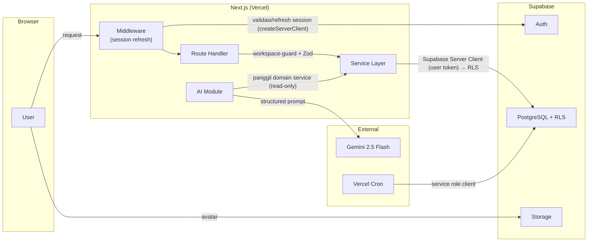

---

## 3. Request Flow

Alur generik setiap request finansial dari browser hingga response. Setiap request melewati lapisan berikut secara berurutan — tidak ada jalan pintas.

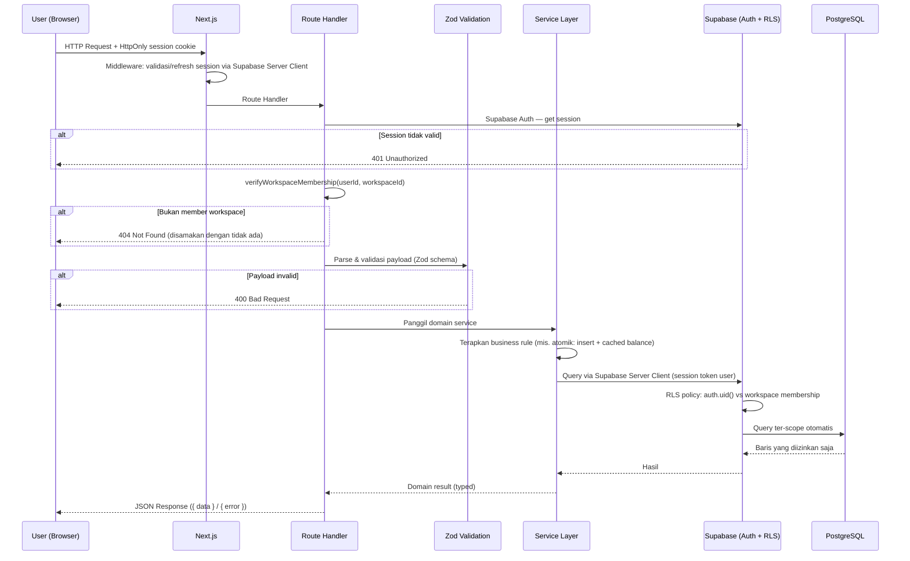

**Poin kunci:**

- **Dua validasi identitas berlapis**: middleware (session valid/refresh) + route handler (session dibaca ulang server-side). Middleware untuk UX/performa, validasi final di route handler adalah batas keamanan.
- **Membership check mendahului validasi payload** — jangan buang waktu memvalidasi input user yang tidak berhak mengakses Workspace.
- **RLS bekerja di level query**: bahkan jika service layer lupa menaruh filter `workspace_id`, PostgreSQL menolak baris milik Workspace lain (defense-in-depth).

---

## 4. Request Lifecycle — Alur Kritis

Dua alur berikut menyentuh titik integrasi paling rawan: konsistensi saldo, dan AI yang berhalusinasi angka. Dipilih sebagai representasi sistem karena keduanya adalah titik di mana sistem bisa "berbohong" ke user.

### A. Menambah Transaction baru (write path)

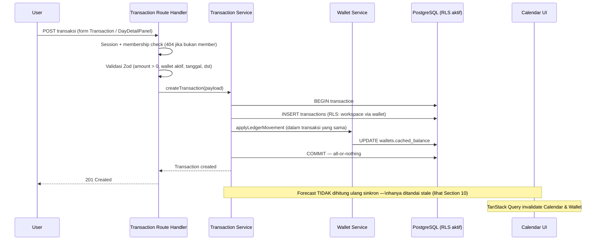

Aturan yang mengikat (dari `09. Backend.md` 9.3 dan `01 Module Specifications.md` modul 6):

1. Insert Transaction dan update `cached_balance` Wallet berada dalam **satu database transaction** — kalau salah satu gagal, keduanya rollback bersama.
2. Transaction `completed` hanya untuk tanggal ≤ hari ini (timezone Workspace); `planned` dengan tanggal masa depan valid dan menjadi asumsi Forecast.
3. Wallet yang di-archive menolak transaksi baru.
4. Forecast hanya ditandai stale — recompute penuh oleh cron, bukan on-demand (keputusan performa ADR Section 9).
5. Tidak ada optimistic UI untuk mutasi finansial — loading indicator eksplisit.

### B. AI Copilot menjawab pertanyaan (read-only path)

Urutan detail ada di Section 9 (AI Architecture). Ringkasnya:

1. User bertanya lewat Chat UI (membawa `workspace_id` + history maksimal 10 turn).
2. Route handler memvalidasi session + membership — `workspace_id` dari client **tidak pernah dipercaya** tanpa verifikasi.
3. **Context Builder (server-side)** mengagregasi data via domain service — saldo, ringkasan bulanan, top kategori, status budget, goal, upcoming bills (14 hari), dan **snapshot Forecast terbaru** — menjadi JSON terstruktur. Bukan raw transaction rows.
4. Konteks + pertanyaan dikirim ke Gemini 2.5 Flash (structured output).
5. Respons melewati **grounding check** server-side: setiap angka di narasi harus cocok dengan angka di konteks; angka halusinasi atau indikasi write action → respons ditolak, fallback message dikirim, kejadian dicatat.

**Kenapa alur ini penting:** AI **tidak pernah menghitung ulang** proyeksi — ia menarasikan snapshot yang sama dengan yang dipakai UI Calendar. Tidak boleh ada dua sumber angka yang bisa saling kontradiksi.

---

## 5. Authentication Flow

Identitas sepenuhnya dikelola Supabase Auth (email/password, reset password). Aplikasi tidak pernah menyimpan kredensial; yang disimpan hanyalah session JWT dalam **HttpOnly cookie**.

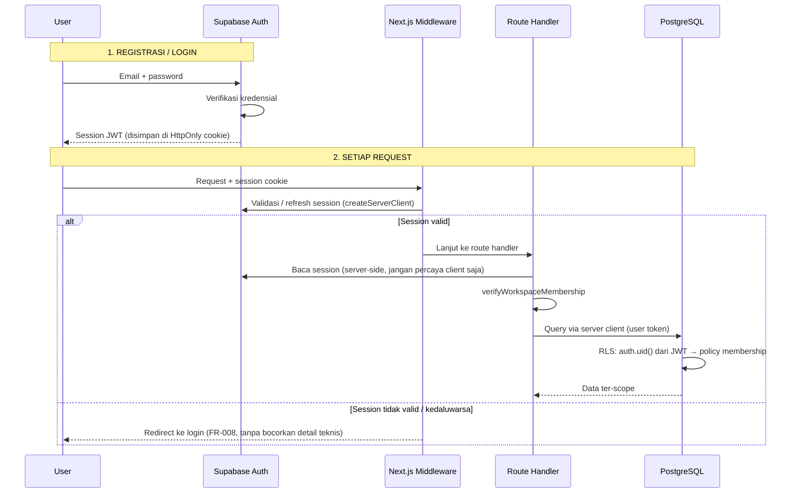

**Aturan yang mengikat:**

- Session token disimpan di **HttpOnly cookie**, bukan localStorage (mengurangi risiko XSS mencuri token).
- Token dibawa sebagai Bearer ke PostgREST — dari token inilah PostgreSQL menurunkan `auth.uid()` untuk policy RLS.
- Kedaluwarsa session memicu redirect otomatis ke login; refresh token ditangani middleware via Supabase Server Client.
- Endpoint auth (register/login) di-rate-limit per IP (lihat Section 6).

---

## 6. Data Security Flow (Authorization)

Isolasi data antar Workspace adalah kontrol keamanan paling kritis. Ditegakkan di **dua lapisan independen** (defense-in-depth, Product Principle #11).

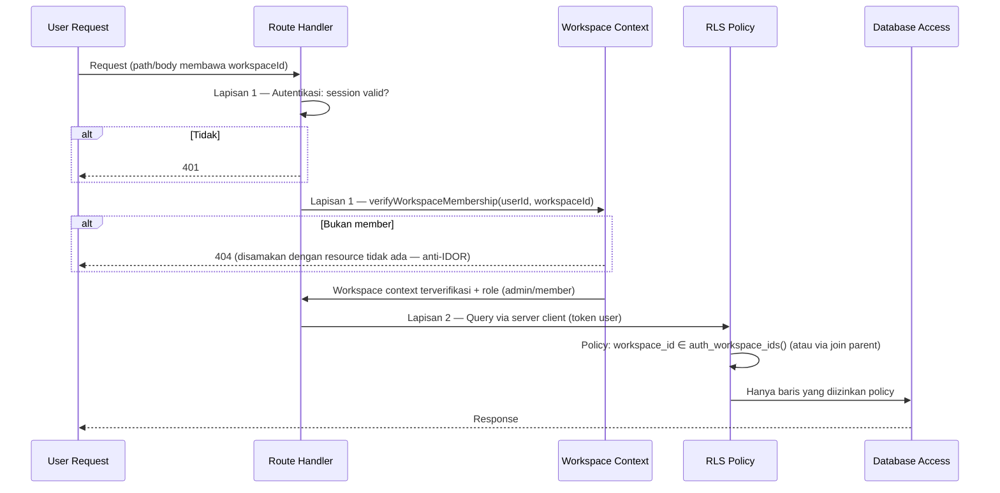

### Lapisan 1 — Aplikasi (membership check)

- Setiap route yang menerima `workspace_id` wajib melewati `workspace-guard`: verifikasi user adalah member (`workspace_members`) dari Workspace tersebut.
- Gagal verifikasi → **404, bukan 403** — membedakan keduanya membocorkan bahwa resource itu ada (IDOR).
- `workspace_id` yang di-parse dari body harus cocok dengan yang divalidasi guard — mencegah request lolos guard tapi menulis ke Workspace lain.

### Lapisan 2 — Database (RLS)

Karena request user memakai Supabase Server Client dengan token user, PostgreSQL tahu siapa yang bertanya (`auth.uid()`), dan policy mencocokkannya dengan keanggotaan Workspace lewat helper `auth_workspace_ids()` (fungsi database yang mengembalikan daftar `workspace_id` tempat `auth.uid()` menjadi member).

| Tabel                                                                                                 | Basis policy RLS                                                                                                                                    |
| ----------------------------------------------------------------------------------------------------- | --------------------------------------------------------------------------------------------------------------------------------------------------- |
| `workspaces`                                                                                          | `id ∈ auth_workspace_ids()`                                                                                                                         |
| `workspace_members`                                                                                   | `user_id = auth.uid()` (baris keanggotaan sendiri); operasi manajemen member hanya admin (ditegakkan di service layer)                              |
| `wallets`, `categories`, `budgets`, `goals`, `recurring_rules`, `notifications`, `forecast_snapshots` | `workspace_id ∈ auth_workspace_ids()`                                                                                                               |
| `transactions`                                                                                        | via join: `wallet_id` → `wallets.workspace_id ∈ auth_workspace_ids()` (tabel tidak menyimpan `workspace_id` langsung — lihat `07. Database.md` 7.2) |
| `forecast_entries`, `goal_contributions` (jika ada)                                                   | via parent: subquery ke `forecast_snapshots` / `goals` lalu `workspace_id ∈ auth_workspace_ids()`                                                   |

Setiap tabel baru **wajib** diaktifkan RLS-nya di migrasi yang sama dengan pembuatan tabelnya — tabel baru tanpa policy adalah lubang isolasi.

### Jalur akses database

| Jalur                            | Client                              | RLS aktif?      | Isolasi dilakukan oleh                                        |
| -------------------------------- | ----------------------------------- | --------------- | ------------------------------------------------------------- |
| Request user (CRUD normal)       | Supabase Server Client + token user | ✅ Ya           | membership check (L1) + RLS (L2)                              |
| Browser (langsung, jika dipakai) | Supabase Client (`supabase-js`)     | ✅ Ya           | RLS (L2) — anon key aman di client **hanya karena RLS aktif** |
| Background job                   | Service role client                 | ❌ Bypass sadar | scoping `workspace_id` manual di kode                         |
| Operasi admin/migrasi/seeding    | Service role client                 | ❌ Bypass sadar | scoping manual                                                |

**Aturan service role (mutlak):** service role key tidak pernah sampai ke client; setiap query wajib menyertakan `workspace_id` eksplisit; dilarang melayani request user biasa (itu mematikan RLS di jalur user).

### Rate limiting

| Endpoint/area    | Limit | Window       | Identifier      |
| ---------------- | ----- | ------------ | --------------- |
| Register         | 5     | per jam      | per IP          |
| Login            | 10    | per 15 menit | per IP          |
| AI Copilot chat  | 20    | per jam      | per userId      |
| Mutasi finansial | 100   | per jam      | per workspaceId |
| GET (umum)       | 200   | per menit    | per userId      |

MVP memakai rate limiter in-memory (cukup untuk single-instance); kandidat upgrade ke store terpusat (Vercel KV) saat traffic bertambah.

---

## 7. Database Interaction

### Dua pola client

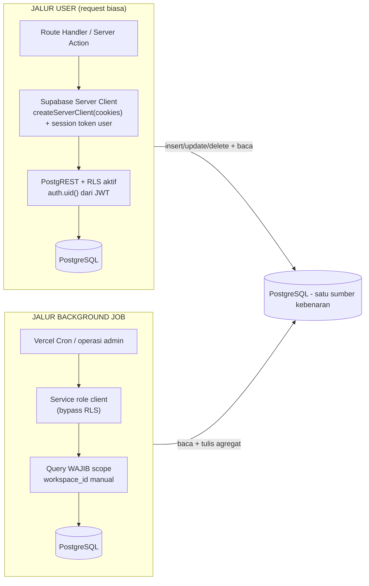

- **Jalur user:** mutasi finansial dan baca data selalu via server client ber-token user. RLS menjamin user hanya melihat/menulis baris Workspace-nya — bahkan jika service layer lupa filter.
- **Jalur job:** service role dipakai karena tidak ada konteks user (`auth.uid()` kosong). Semua scoping menjadi tanggung jawab kode — aturan wajib di Section 6.
- **Transaksi atomik:** operasi multi-entitas (Transaction + cached balance; Transfer dua sisi) dijalankan dalam satu database transaction PostgreSQL. Pada jalur user, transaksi dimulai dari service layer; RLS tetap berlaku per statement di dalamnya.

### Migrasi (Supabase CLI)

- Seluruh perubahan skema & policy RLS didorong lewat **file migrasi Supabase CLI** (`supabase migration new`, diverifikasi dengan `supabase db diff`, di-apply dengan `supabase db push` setelah project di-link) — tidak ada perubahan manual di database mana pun.
- Migrasi berisi: DDL tabel + constraint (termasuk unique `(recurring_rule_id, due_date)` untuk idempotency) + **enable RLS + policy** untuk tabel baru, + helper `auth_workspace_ids()`.
- Urutan apply: staging dulu (verifikasi data tidak rusak), baru production. Rollback terdokumentasi dan pernah diuji minimal sekali di staging.
- Migrasi bertipe uang (integer minor unit) wajib direview dua orang sebelum di-apply ke staging.
- Tiga environment = tiga project Supabase terpisah (`nuxio-dev`, `nuxio-staging`, `nuxio-prod`) — tidak pernah menguji di database berisi data asli.

---

## 8. Data Flow (Level Sistem)

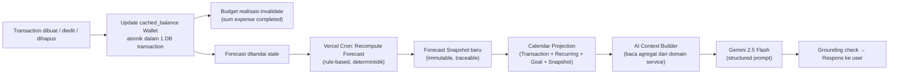

**Aturan alur data:**

- Data mengalir satu arah: ledger (Transaction) → derived (balance, realisasi, snapshot) → projection (Calendar) → narasi (AI). Tidak ada komponen yang menulis ke arah sebaliknya.
- Derived data (`cached_balance`, realisasi Budget, Forecast snapshot) **tidak pernah** dihitung ulang saat baca — dihitung/di-invalidate saat tulis, diread dengan cepat.
- Snapshot Forecast immutable: snapshot lama tetap utuh meski recompute berikutnya gagal — UI menampilkan "Forecast belum tersedia", bukan data usang tanpa penjelasan.
- AI hanya membaca hasil akhir domain service — tidak ada jalur AI ke database.

---

## 9. AI Architecture

### AI Flow

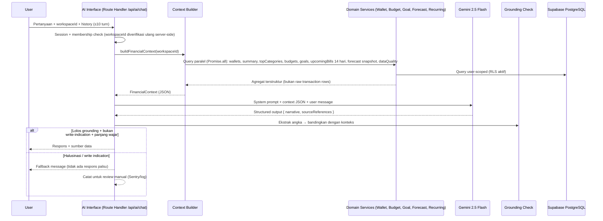

### Keputusan yang mengikat (dari ADR Section 8 dan `13. AI.md`)

1. **AI menarasikan, bukan menghitung ulang.** Angka dalam respons harus identik dengan angka domain service yang dipakai UI. Kasus paling ketat: Cashflow Prediction wajib membaca `forecast_snapshots` yang sudah ada — tidak diizinkan menghitung proyeksi sendiri.
2. **AI read-only.** Tidak ada tool-calling; tidak ada jalur ke operasi tulis; AI Module tidak pernah mengimpor client database. Satu-satunya output AI adalah teks + sourceReferences.
3. **Context Builder server-side murni.** `workspace_id` dari client divalidasi ulang; raw transaction rows tidak pernah dikirim (biaya token, latency, risiko halusinasi).
4. **Provider abstraction.** Gemini diakses lewat satu interface internal (`AIProvider`) — penggantian/fallback provider tidak menyentuh domain service, prompt, atau UI.
5. **Grounded response.** Structured output (`narrative` + `sourceReferences`) memungkinkan validasi otomatis: angka tanpa sumber ditolak.
6. **Failure isolation.** Provider timeout/error → satu retry dengan timeout lebih pendek, lalu fallback message. Fitur finansial inti tidak terpengaruh sama sekali (AI Module adalah leaf).
7. **Data privacy:** tidak ada PII (email, nama lengkap, UUID internal) dalam prompt; input user disanitasi dari pola prompt injection; rate limit 20 pesan/jam/user mengontrol biaya.

### Struktur FinancialContext

Agregat yang dikirim ke model (ringkasan, bukan raw data): info Workspace (nama, tipe, currency), daftar wallet + saldo, summary bulan berjalan (total balance, income, expense, net, saldo terendah proyeksi + tanggalnya), top 5 kategori pengeluaran, status budget (on_track/warning/exceeded), progress goal, upcoming bills 14 hari, dan `dataQuality` (ada tidaknya histori ≥ 14 hari → menentukan narasi cold-start).

---

## 10. Forecast Flow

### Forecast Flow

```mermaid
sequenceDiagram
    participant T as Transaction (domain processing)
    participant DB as PostgreSQL
    participant CRON as Vercel Cron (Job 2)
    participant FS as Forecast Service
    participant SNAP as forecast_snapshots + forecast_entries
    participant CAL as Calendar UI / AI Context

    T->>DB: Transaction completed/planned berubah
    Note over T,DB: cached_balance diupdate atomik;\nForecast hanya ditandai stale

    CRON->>FS: Recompute (harian, setelah recurring generator)
    FS->>DB: Baca saldo + Transaction completed + planned + occurrence recurring
    FS->>FS: Rule deterministik:\nsaldo + income terjadwal − bills terjadwal − avg 30 hari × hari
    FS->>SNAP: INSERT snapshot baru (immutable, horizon 30/60 hari)
    Note over FS,SNAP: Snapshot lama tidak dimutasi; recompute gagal → snapshot lama tetap valid
    CAL->>SNAP: Baca snapshot terbaru (< 500 ms p95 — tanpa recompute)
    AI->>SNAP: Baca snapshot yang sama untuk narasi
```

### Keputusan yang mengikat

- **Deterministik:** input sama → output sama persis (diuji unit test). Bukan machine learning — explainable ("kenapa forecast bilang begini").
- **Tiga kelas data eksplisit** dalam setiap entry: fakta (Transaction completed), asumsi (planned/recurring terjadwal), estimasi (rata-rata pengeluaran non-recurring ~30 hari). Cold-start → komponen estimasi = 0 dengan indikasi eksplisit, bukan presisi palsu.
- **Snapshot immutable & traceable:** setiap entry bisa ditelusuri ke inputnya; snapshot lama tidak diubah oleh recompute berikutnya.
- **Stale → recompute:** transaksi tidak memicu recompute sinkron; cron harian (10 menit setelah Job 1) menghasilkan snapshot baru. Recompute manual dibatasi rate limit.
- **Performa:** read snapshot < 500 ms p95; job per Workspace < 10 detik; success rate job ≥ 99% (dipantau).

---

## 11. Background Process (Cron Flow)

Dua background job berjalan di **Vercel Cron**. Keduanya memakai service role client (bypass RLS) dengan scoping `workspace_id` manual, dan memverifikasi `CRON_SECRET` pada request masuk.

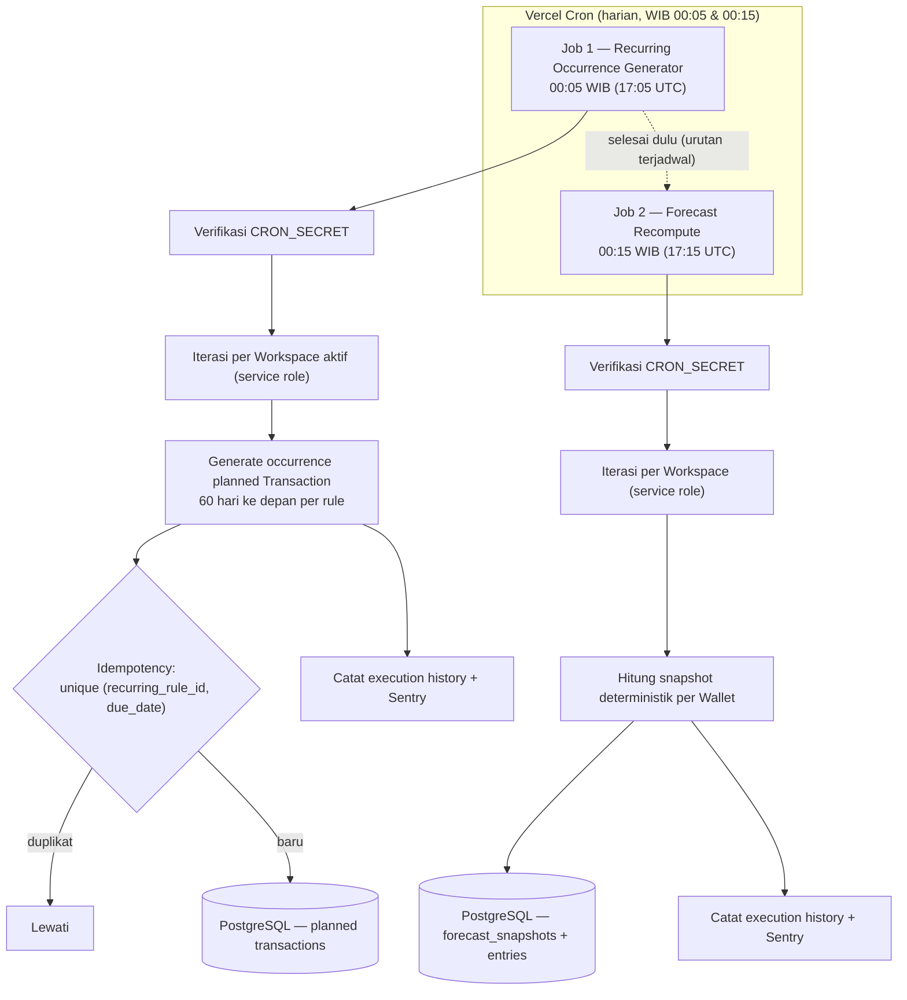

### Aturan job

| Aturan                    | Detail                                                                                                                                               |
| ------------------------- | ---------------------------------------------------------------------------------------------------------------------------------------------------- |
| **Idempotent**            | Retry platform aman: unique constraint `(recurring_rule_id, due_date)` di level database, bukan hanya cek di kode                                    |
| **Isolasi per Workspace** | Kegagalan satu Workspace tidak menggagalkan batch lainnya; error dicatat per Workspace                                                               |
| **Execution history**     | Setiap eksekusi (sukses/gagal, durasi, jumlah Workspace) dicatat untuk monitoring — tidak ada silent-fail                                            |
| **Edge case tanggal**     | Tanggal 29–31 di bulan pendek → mundur ke hari terakhir; 29 Februari non-kabisat → 28. Wajib unit test eksplisit                                     |
| **Urutan**                | Forecast recompute berjalan setelah recurring generator agar occurrence terbaru ikut terhitung                                                       |
| **Perubahan rule**        | Occurrence masa depan yang belum `completed` diperbarui langsung saat rule diubah (bukan menunggu cron); occurrence `completed` tidak pernah berubah |

Kandidat migrasi ke job queue penuh (BullMQ/Redis) saat total durasi job harian mendekati batas jendela cron atau saat scale membutuhkan trigger event-driven — titik ini dicatat eksplisit sebagai keputusan masa depan, bukan kelalaian.

---

## 12. Storage Flow

Supabase Storage dipakai untuk **avatar profil** (satu-satunya kebutuhan file di MVP, NFR Section 2/5).

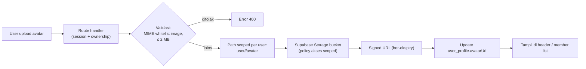

Aturan yang mengikat:

- Tipe file whitelist MIME image (bukan blacklist); batas 2 MB; nama file tidak memakai nama asli dari client (cegah path traversal/collision).
- Path objek di-scope per user — tidak dapat ditebak/diakses lintas user; bucket policy membatasi akses ke pemilik (storage RLS).
- Akses via signed URL ber-ekspiry, bukan URL publik permanen.
- Mengganti avatar menghapus objek lama.
- Backup file tidak kritikal (dapat diunggah ulang user) — mengandalkan durability bawaan platform.

---

## 13. Deployment Flow

### Environment & branch strategy

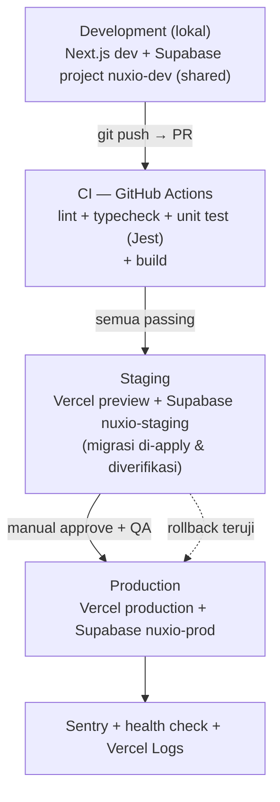

- **Tiga environment, tiga project Supabase terpisah** — tidak pernah menguji di database berisi data user asli.
- **CI**: PR tidak bisa di-merge kalau CI gagal (branch protection); target durasi < 3 menit.
- **Migrasi**: didorong via Supabase CLI (`supabase db push`) ke staging dulu, verifikasi, baru production; RLS policy ikut dalam migrasi yang sama dengan DDL tabel baru.
- **Secrets** (Vercel Environment Variables per environment): `SUPABASE_URL`, `SUPABASE_ANON_KEY` (aman di client hanya karena RLS aktif), `SUPABASE_SERVICE_ROLE_KEY` (server saja, tidak pernah ke client), `GEMINI_API_KEY` (server saja), `CRON_SECRET`. `.env*` di `.gitignore` sejak commit pertama.

### Deployment checklist (ringkas, dari `14. DevOps.md`)

**Pre-deploy:** CI hijau di staging · migrasi teruji di staging · env vars production terverifikasi · API key Gemini valid · Sentry DSN aktif. **Post-deploy:** `/api/health` ok · onboarding end-to-end jalan · cron tereksekusi (Vercel Cron logs) · tidak ada spike error 15 menit pertama.

---

## 14. Scaling Strategy

Batas desain MVP (dari `02 Non-Functional Requirements.md` Section 3) dan titik pemicu evolusi — diuji, bukan diblokir keras:

| Dimensi                 | Batas desain MVP                               |
| ----------------------- | ---------------------------------------------- |
| Workspace per user      | 1 Personal (keras) + hingga 10 Business (soft) |
| Wallet per Workspace    | 2–10 tipikal, diuji hingga 20                  |
| Kategori per Workspace  | hingga 50                                      |
| Transaksi per Workspace | diuji hingga 10.000 baris kumulatif            |
| Goal per Workspace      | hingga 20 aktif                                |
| Budget per Workspace    | hingga 50 aktif/bulan (natural dari kategori)  |

**Trigger migrasi arsitektur** (didefinisikan di ADR Section 13 / NFR Section 3, dipantau lewat metrik, bukan diputuskan dadakan):

1. **Cron → job queue** (BullMQ/Redis): saat total durasi job harian mendekati batas jendela cron, atau forecast butuh trigger event-driven.
2. **Modular monolith → service terpisah**: saat kebutuhan skala/deploy salah satu modul (kandidat: AI, Forecast) jauh berbeda dari yang lain. Batas domain sudah modular sejak hari 1, jadi tanpa migrasi big-bang.
3. **Read replica / connection pooler tuning**: saat query baca mendominasi dan p95 melanggar target; Supabase pooler bawaan (pgBouncer) sudah tersedia sejak awal.
4. **Rate limiter terpusat** (Vercel KV/Redis): saat traffic melintasi batas akurasi rate limiter in-memory.

**Yang sengaja tidak dirancang sekarang:** desain 10.000+ user, multi-region, payment gateway aktif, bank sync, OCR — keputusan menunda ini adalah pilihan sadar, bukan kelalaian (merancang skala yang belum tentu tercapai adalah bentuk scope creep).

---

## 15. Failure Handling

| Area                                  | Strategi                                                                                                                                           |
| ------------------------------------- | -------------------------------------------------------------------------------------------------------------------------------------------------- |
| **Error taksonomi**                   | ValidationError / AuthorizationError / DomainRuleError / InfrastructureError — menentukan retryable atau tidak dari sisi user                      |
| **Mutasi finansial gagal (client)**   | Tidak ada retry otomatis diam-diam — user diberi opsi retry eksplisit dengan data form tetap terisi (cegah duplikasi tanpa idempotency)            |
| **Background job gagal**              | Retry otomatis scheduler dengan backoff, tercatat di execution history, error → Sentry; kegagalan satu Workspace tidak menggagalkan batch          |
| **Forecast recompute gagal**          | Snapshot lama tetap valid & immutable; UI menampilkan "Forecast belum tersedia", bukan data usang tanpa penjelasan                                 |
| **Recurring job dijalankan dua kali** | Idempotency via unique constraint — retry aman, tanpa duplikasi                                                                                    |
| **AI provider timeout/error**         | Satu retry dengan timeout lebih pendek → fallback message jelas; **fitur finansial inti tidak terpengaruh** (AI Module adalah leaf)                |
| **AI grounding gagal**                | Respons ditolak, fallback message, dicatat untuk review manual — tidak pernah menampilkan angka yang tidak bisa ditelusuri                         |
| **Konsistensi data**                  | Operasi multi-entitas selalu satu database transaction (all-or-nothing); `cached_balance` dapat direkonsiliasi terhadap ledger kapan saja (FR-027) |

**Prinsip:** kegagalan pada satu modul tidak menyebar ke modul lain; AI bisa mati total tanpa menghentikan pencatatan transaksi user.

---

## 16. Target Performa (p95)

| Area                                               | Target (p95) |
| -------------------------------------------------- | ------------ |
| Initial Page Load (terautentikasi)                 | < 2,5 detik  |
| Time to Interactive                                | < 3,5 detik  |
| API response (CRUD non-agregat)                    | < 400 ms     |
| Calendar rendering (navigasi bulan, < 100 entitas) | < 1,5 detik  |
| Forecast snapshot read                             | < 500 ms     |
| Forecast generation (per Workspace, background)    | < 10 detik   |
| AI first response                                  | < 4 detik    |
| Upload avatar (≤ 2 MB)                             | < 3 detik    |

Target diukur pada kondisi data sesuai Data Volume Assumption (Section 14), bukan dataset kosong.

---

## 17. Yang Sengaja Tidak Dibahas di Dokumen Ini

- **Observability tingkat lanjut** — cukup logging terstruktur (Pino, redaksi field sensitif) + Sentry untuk MVP.
- **Skema payment** — monetisasi MVP hanya plan gating skeleton UI, belum ada transaksi pembayaran nyata.
- **Detail kontrak API & skema kolom** — di `10. API.md` dan `07. Database.md`.
- **Desain skala 10.000+ user** — trigger dan titik migrasi tercatat di Section 14; desain detail masuk System Design v2.

Kalau kebutuhan ini muncul nyata pasca-MVP, masuk dokumen System Design v2 — bukan revisi di tengah eksekusi.
